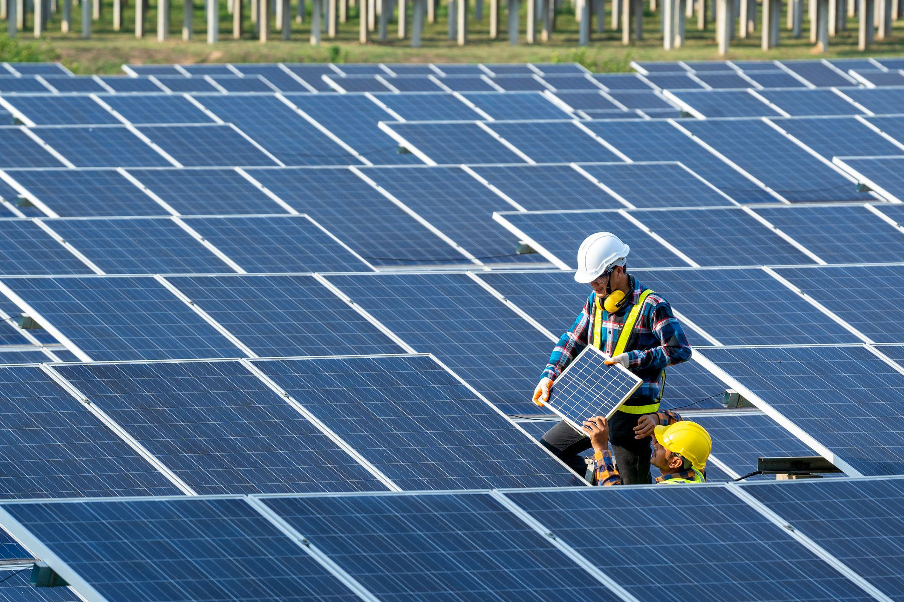

In a rapidly changing energy landscape, renewable energy has emerged as a pivotal component of global sustainability efforts. This shift is driven by the urgent need to address climate change, reduce greenhouse gas emissions, and ensure energy security. Among the various renewable sources, solar energy stands out as a leading force due to its abundant and inexhaustible nature. Technological advancements over the past few decades have significantly increased the efficiency and decreased the cost of solar panels, making solar energy an economically viable option.

Solar power's potential is immense; the sun delivers more energy to Earth in one hour than the entire world consumes in a year. This vast resource enables countries to harness solar energy to meet their growing electricity demands while transitioning to cleaner energy sources. As a result, nations are competing to establish themselves as leaders in solar energy production. China, the European Union, and the United States are at the forefront, continually expanding their photovoltaic (PV) infrastructure.

Furthermore, the landscape of solar energy is evolving with innovations in trading practices such as algorithmic trading. This approach leverages software algorithms to trade energy in markets more efficiently, addressing the volatility and complexity inherent in renewable energy resources. Algorithmic trading aids in integrating solar energy into traditional markets, optimizing resource distribution, and improving market efficiency.

This article explores the contributions of the top solar producers around the globe to the renewable energy sector. Additionally, it examines how algorithmic trading is shaping the solar energy market, enhancing its economic viability and positioning it as a critical component of a sustainable global energy future.

## Table of Contents

## Global Leaders in Solar Energy Production

In the rapidly advancing field of renewable energy, China stands out as the preeminent leader in solar energy production. Investing significantly in solar infrastructure and technology, China boasts the world's largest installed photovoltaic (PV) capacity. The country's commitment to solar energy is reflected in its robust manufacturing sector, which produces a substantial portion of the global supply of solar panels. China's extensive solar farms, particularly those located in the Gobi Desert, contribute significantly to their total capacity, making up a crucial part of their renewable energy strategy.

The European Union follows closely behind China in solar energy production, with notable contributions from Spain, Germany, and Poland. These countries are at the forefront of the EU’s ambitions to reduce carbon emissions and transition to renewable energy sources. Spain, with its favorable climate, capitalizes on solar power as a key component of its renewable energy mix. Germany, renowned for its early adoption and promotion of solar technology through feed-in tariffs, continues to play a vital role by investing in innovative solar technologies and infrastructure. Poland, despite its strong reliance on coal, is making strides in solar energy, driven by the EU's policies and support for sustainable energy transitions.

The United States ranks among the top nations advancing in solar power, energized by government incentives that promote residential and commercial PV installations. Federal tax credits, state-level incentives, and decreasing costs of solar technology have led to a steady increase in solar adoption across the country. Major solar projects, particularly in states such as California, Texas, and Florida, illustrate the expanding footprint of solar energy in the U.S. market.

Vietnam and Japan emerge as other prominent players in the solar energy sector. Vietnam has experienced rapid growth in solar installations, driven by attractive feed-in tariffs and international investments aimed at reducing the nation's carbon footprint. Japan’s solar energy strategy focuses on maximizing output despite limited land availability, evident in their innovative use of floating solar farms installed on reservoirs and lakes. Both countries highlight the adaptability required to overcome geographical and policy-related challenges in expanding solar capacity.

## The Role of Leading Solar Companies

The solar industry is bolstered by prominent companies that spearhead technological innovations while driving market expansion. Chief among these are NextEra Energy, First Solar, and Enphase Energy, renowned for their significant market capitalization and their pivotal roles in shaping the solar energy sector.

NextEra Energy is recognized as one of the foremost leaders in the renewable energy market. The company has strategically transitioned from a traditional utility model to a robust renewable portfolio, which includes significant investments in solar energy. This shift is exemplified by their substantial solar farm developments and commitment to expanding solar infrastructure. NextEra's approach integrates advanced technologies to enhance the efficiency of solar power generation, reducing costs while increasing output. Their strategic investments in battery storage and grid integration further position them to capitalize on the intermittency of solar energy, making their operations more resilient and adaptive to the evolving energy landscape.

First Solar stands out for its focus on photovoltaic (PV) technology, particularly thin-film solar modules. By leveraging its proprietary technology, First Solar has achieved lower manufacturing costs and higher efficiency rates compared to traditional silicon-based PV modules. The company's emphasis on R&D has led to significant technological advancements, making solar power more viable and attractive to a broader market. First Solar's ability to innovate within the production process has driven down installation costs, facilitating greater adoption of solar solutions.

Enphase Energy is instrumental in revolutionizing solar technology through its microinverter systems. Unlike traditional string inverters, microinverters optimize the energy output of individual solar panels, which enhances overall system efficiency and reliability, especially in shaded or complex installation environments. This technology enables detailed monitoring and control, allowing consumers to maximize their solar capabilities. Enphase’s strategic push into energy management software and battery storage solutions further consolidates its position as a leader, providing an integrated approach to energy production, management, and storage.

These companies' market strategies reflect a comprehensive approach to sustaining competitive advantage. They focus on technological innovation, strategic acquisitions, and geographic expansion to capture market share and diversify their revenue streams. Financial performance for these leaders is buoyed by their ability to scale operations efficiently, maintain competitive pricing, and deliver sustainable energy solutions that align with global decarbonization goals.

In navigating the competitive solar landscape, these companies exemplify the marriage of technology and strategy essential for thriving in an industry defined by rapid evolution and high demands for innovation. Their continued investments in cutting-edge technologies and strategic expansion highlight the critical role they play in making solar power a more prevalent and accessible source of energy worldwide.

## Algorithmic Trading in Solar Energy Markets

Algorithmic trading, a practice that utilizes computer algorithms to automate trading decisions, has increasingly become integral to solar energy markets. This method optimizes trading by rapidly analyzing market data to make informed buy and sell decisions. In the context of solar energy, [algorithmic trading](/wiki/algorithmic-trading) plays a crucial role in managing the [volatility](/wiki/volatility-trading-strategies) inherent in renewable energy sources.

As the solar energy market grows, its inherent complexity and fluctuations necessitate sophisticated trading mechanisms. Algorithmic trading systems help navigate these challenges by providing real-time data analysis and decision-making capabilities. This is particularly critical given the variability of solar energy production, which is influenced by factors such as weather conditions and time of day. Algorithms can swiftly adjust to these changes, ensuring that energy trading remains efficient and profitable.

The rise in battery storage and distributed energy resources further underscores the need for algorithmic trading. Battery storage allows surplus solar power to be stored and used when production is low, thereby smoothing the supply. Distributed energy resources, such as rooftop solar panels, contribute to the diversity and decentralization of the energy supply. Managing these resources using traditional trading methods is inefficient and risky due to their scattered nature and intermittent output. Automated trading systems can optimize the dispatch and pricing of energy from these sources, reducing operational risks and improving overall market efficiency.

This technological integration not only enhances market operations but also leads to broader adoption of solar energy. By reducing market volatility and maximizing financial returns, algorithmic trading makes solar investments more attractive to stakeholders. It facilitates quicker response times to market shifts, allowing for better resource allocation and energy pricing strategies. Ultimately, this promotes the stability necessary for scaling up renewable energy solutions.

In summary, algorithmic trading is a transformative force in the solar energy sector. Its application helps overcome the challenges of volatility and complexity in renewable energy transactions. As the sector continues to expand, the role of algorithmic trading in optimizing solar market operations is expected to grow, driving both profitability and the wider adoption of solar energy solutions.

## Impact of Solar Power on Global Energy Policies

Solar energy has become a significant driver in shaping global energy policies and achieving sustainability goals. Its influence extends beyond merely generating electricity to transforming how countries approach environmental regulations and international agreements. Governments around the world are increasingly recognizing the need to expand solar capacity and are implementing various regulations and financial incentives to facilitate this growth. These measures aim to reduce carbon emissions, improve energy security, and foster economic development.

One of the key international commitments that underscore the importance of solar energy is the Paris Agreement, an accord that seeks to limit global warming to well below 2 degrees Celsius above pre-industrial levels. Solar power's strategic deployment plays an integral role in enabling countries to meet their nationally determined contributions (NDCs) under this agreement. For example, the deployment of solar photovoltaic (PV) systems can significantly cut down on greenhouse gas emissions, contributing to the overall reduction targets set by participating countries. 

The interplay between solar energy development and policy is characterized by the necessity for international cooperation and innovation. Governments are increasingly collaborating on research and development initiatives, sharing technological advancements, and establishing joint ventures to enhance solar energy adoption. Policies such as feed-in tariffs, tax credits, and specific renewable energy mandates incentivize the private sector to invest in solar infrastructure, pushing technological boundaries and driving down costs.

In addition, several countries are implementing measures to integrate solar energy into their national grids, understanding the challenges posed by intermittency and storage. Innovations in energy storage systems, smart grids, and demand-response solutions are receiving policy support to ensure a stable energy supply while maximizing solar utilization.

Furthermore, the policy focus on solar energy often includes considerations for local manufacturing and job creation. Supporting domestic solar industries through incentives can lead to economic growth and create employment opportunities within the renewable energy sector.

Overall, as countries strive to balance economic needs with environmental responsibilities, solar energy stands out as a key component of energy policies worldwide. The continued focus on strategic and cooperative policy development will play a critical role in harnessing the full potential of solar energy, facilitating the transition to a sustainable global energy system.

## Future Outlook: Solar Energy and Algorithmic Trading

Looking ahead, the integration of solar energy with algorithmic trading is set to play a transformative role in the energy sector, promising increased accessibility and cost-effectiveness. As technology continues to evolve, solar power harnessing is becoming increasingly efficient. Advances in photovoltaic (PV) technologies, energy storage systems, and grid integration are reducing costs and expanding the deployment of solar systems globally. Emerging solar panel technologies such as bifacial solar panels, which capture sunlight on both sides, and perovskite solar cells, known for their high efficiency and low production costs, are at the forefront of making solar energy more feasible and widespread.

Algorithmic trading, leveraging sophisticated algorithms and [artificial intelligence](/wiki/ai-artificial-intelligence), enhances the efficiency and stability of solar energy markets by effectively managing the inherent volatility and complexity of renewable energy sources. These automated systems can analyze extensive datasets in real-time to optimize electricity trading, forecasting, and load balancing, ensuring that solar energy is effectively integrated into traditional energy grids. For example, [machine learning](/wiki/machine-learning) models can predict solar energy production and demand patterns, adjusting bids and offers in real-time to maximize financial returns and improve market reliability.

The potential growth opportunities in this sector are thus substantial. As countries push to meet their renewable energy targets, investments in infrastructure that accommodates algorithmic trading and solar technology will likely increase. This will drive further innovation and improvements in both the scalability of solar energy systems and the refinement of trading algorithms. The convergence of these technologies offers stakeholders the opportunity to develop future-proof energy solutions that contribute to sustainability goals.

However, several challenges lie ahead. These include regulatory hurdles, cybersecurity risks associated with the increasing digitalization of energy markets, and the need for harmonization of international standards to facilitate cross-border trading. Addressing these challenges will require concerted efforts from governments, industry leaders, and technological innovators to not only implement supportive policies and robust cybersecurity measures but also to foster collaboration across national and organizational boundaries.

In summary, the future outlook for solar energy, supported by algorithmic trading, is bright. Stakeholders are encouraged to invest early in these technologies to leverage their full potential and secure a sustainable, efficient, and economically viable energy future.

## Conclusion

Renewable energy, particularly solar power, plays a crucial role in combating climate change and propelling sustainable development. The ascendance of top solar-producing countries, like China and members of the European Union, alongside leading solar companies, underscores the importance of this sustainable technology in reducing carbon footprints and promoting energy independence. These entities have been pivotal in increasing solar capacity, thanks to strategic investments and technological advancements that have made solar energy more efficient and accessible.

Algorithmic trading is transforming how solar energy is traded, boosting market efficiency and dynamism. By employing automated systems, the inherent volatility and complexity of solar energy transactions are managed more effectively, thus optimizing operations and enhancing profitability. This technological intervention is crucial for integrating renewable energy sources into traditional markets, ensuring reliable energy supply and equitable distribution across regions.

In the pursuit of a sustainable energy future, continued innovation and cooperation among stakeholders are indispensable. Ongoing advancements in solar technology and trading practices can unlock further potential, mitigating the impacts of climate change and fostering economic growth. By fostering international collaboration and investing in innovative solutions, the global community can fully harness the promise of solar energy and ensure a secure, sustainable energy landscape for future generations.

## References & Further Reading

[1]: International Energy Agency (IEA). (2020). ["Renewables 2020: Analysis and forecast to 2025."](https://www.iea.org/reports/renewables-2020) 

[2]: Timilsina, G. R., Kurdgelashvili, L., & Narbel, P. A. (2012). ["Solar energy: Markets, economics and policies."](https://www.sciencedirect.com/science/article/abs/pii/S1364032111004199) Renewable and Sustainable Energy Reviews, 16(7), 449-465.

[3]: REN21. (2021). ["Renewables 2021 Global Status Report."](https://www.ren21.net/gsr-2021/)

[4]: Solar Energy Industries Association (SEIA). (2021). ["Solar Market Insight Report."](https://www.seia.org/research-resources/solar-market-insight-report-2021-year-review/)

[5]: Luo, X., Wang, J., Dooner, M., & Clarke, J. (2015). ["Overview of current development in electrical energy storage technologies and the application potential in power system operation."](https://www.sciencedirect.com/science/article/pii/S0306261914010290) Applied Energy, 137, 511-536.

[6]: Global Solar Council. (2021). ["Innovation in Solar Products and Business Models."](https://www.globalsolarcouncil.org/) 

[7]: Benth, F. E., & Koekebakker, S. (2016). ["Stochastic Modeling of Electricity and Related Markets."](https://www.researchgate.net/profile/Fred-Benth/publication/228290692_%27Preface_to%27_Stochastic_Modeling_of_Electricity_and_Related_Markets/links/0a85e53ada3afb88ce000000/Preface-to-Stochastic-Modeling-of-Electricity-and-Related-Markets.pdf) Springer Series in Operations Research and Financial Engineering. 

[8]: NextEra Energy, Inc. (2021). ["2020 Sustainability Report."](https://www.nexteraenergy.com/sustainability.html)