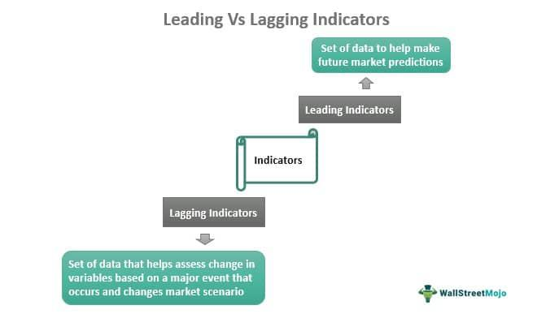

Algorithmic trading, widely known as algo trading, is a fundamental component of today's financial markets. By utilizing complex algorithms and electronic platforms, traders can execute orders at speeds and volumes unimaginable with manual trading. The primary advantage of algo trading lies in its ability to process massive datasets swiftly, executing trades on the basis of sophisticated models that incorporate numerous variables. This efficiency translates into opportunities for enhanced returns, as traders can capitalize on fleeting market opportunities.

However, with great power comes significant challenges. The precision and swiftness of algorithmic trades mean that they are highly dependent on the quality and timing of economic information. Leads and lags play a pivotal role in this context, influencing the market behavior before and after the release of economic data or anticipated events. Leads are associated with the effect of economic announcements before their occurrence, while lags pertain to the delayed impact after these events. Inaccurate predictions or misinterpretations of these timing elements can lead to substantial financial risks.



Understanding the impact of leads and lags is essential for successful algo trading. Traders need detailed insights into how these temporal dynamics can affect asset prices and market volatility. The challenges are further compounded by unexpected economic shocks or policy changes that can introduce rapid and unforeseen market fluctuations. Algorithms must be designed to adjust to these variables to maintain their effectiveness and avert potential losses.

This article will analyze the economic risks that arise from these leads and lags and highlight the crucial role of risk management. We will cover key concepts, risk types, and strategies that ensure algo trading remains a viable and profitable venture. The focus will be on employing robust algorithms, real-time data integration, and adaptive strategies to navigate the complex landscape of modern trading environments.

## Table of Contents

## Understanding Leads and Lags in Algo Trading

Leads and lags are critical concepts in algorithmic trading, impacting how traders interpret and act on economic data releases. A lead signifies the anticipation of market movements prior to the public dissemination of economic information. This anticipation allows algorithmic traders to position themselves advantageously in the market by predicting positive outcomes before they are commonly known. On the other hand, a lag denotes the delayed reaction in market movements following the release of new economic data, providing traders with strategic opportunities after events have unfolded.

Algorithmic trading employs sophisticated strategies leveraging both historical and real-time data to accurately predict and react to these leads and lags. The main objective is to harness the temporal dynamics of financial markets to enhance portfolio performance. For instance, algorithms can analyze patterns in historical data to identify potential leads, utilizing statistical models and machine learning techniques to anticipate future market directions. These strategies often involve the use of complex models, such as time series analysis or regression models, to analyze past data patterns and predict potential future developments.

Conversely, when dealing with lags, algorithms might be programmed to react to specific economic data releases, adjusting trading strategies based on the newly available information. This may involve recalibrating portfolios to account for shifts in market sentiment or adapting risk management tactics to mitigate potential downturns prompted by unexpected data points.

Maximizing returns and minimizing risks requires traders to not only predict leads accurately but also to respond effectively to lags. For example, a Python-based algorithm might be constructed to monitor economic indicators and execute trades when certain thresholds are met. This could involve creating a script to automatically enter or [exit](/wiki/exit-strategy) positions based on predefined criteria set for economic data changes.

```python
# Example of a basic Python strategy for reacting to economic data releases
def trading_strategy(data_release, market_threshold):
    # Simulate data analysis
    market_impact = analyze_data_release(data_release)

    # Decision making based on market impact
    if market_impact > market_threshold:
        execute_trade('buy')
    elif market_impact < -market_threshold:
        execute_trade('sell')
    else:
        hold_position()

def analyze_data_release(data_release):
    # Placeholder for complex data analysis logic
    # Returns a simulated market impact value
    return random.uniform(-1, 1)

def execute_trade(action):
    # Placeholder for trading logic
    print(f"Executing {action} trade")

trading_strategy(current_data_release, 0.5)
```

Understanding and capitalizing on the timing nuances of leads and lags enables traders to better anticipate market fluctuations and optimize their [algorithmic trading](/wiki/algorithmic-trading) strategies. By systematically analyzing these factors, traders can enhance their ability to navigate the complexities of modern financial markets and achieve favorable trading outcomes.

## Economic Risks in Algo Trading

Algorithmic trading, or algo trading, presents unique economic risks primarily arising from unpredictable market movements influenced by economic leads and lags. These risks are compounded by unexpected economic announcements or changes in monetary policy, which can lead to rapid and significant market reactions. Algorithms that are not adequately prepared for such sudden events can suffer substantial losses. For instance, an unexpected [interest rate](/wiki/interest-rate-trading-strategies) hike by a central bank might prompt a sudden sell-off in stock markets, adversely impacting algorithms that are long on equities.

Algo traders often rely on predictions about market movements, which can be flawed due to faulty or misinterpreted data. Algorithms using inaccurate historical data or poor-quality real-time data may lead to incorrect market predictions. An example could be an algorithm that bases its trading decisions on economic indicators from unreliable sources, leading to trades that misalign with actual market conditions.

Systemic risk is another critical aspect of economic risks in algo trading, particularly in high-frequency trading ([HFT](/wiki/high-frequency-trading-strategies)). HFT algorithms contribute to increased market [volatility](/wiki/volatility-trading-strategies) due to their rapid execution of large volumes of trades. During periods of market stress, these algorithms can exacerbate price swings, potentially leading to market destabilization.

Effective management of these risks requires robust algorithms equipped with real-time data assessment capabilities. One approach is using [machine learning](/wiki/machine-learning) models that adapt to changing economic conditions and are trained to recognize the characteristics of leads and lags. For example, a predictive model might include features such as historical price movements, macroeconomic indicators, and volatility indices to enhance its predictive performance.

Risk mitigation strategies also play a crucial role. Implementing automated controls, such as stop-loss orders, can prevent excessive losses during high volatility periods. Moreover, algorithms should be routinely back-tested against historical data to ensure they can handle various economic scenarios. In Python, this could involve using libraries like pandas for data manipulation and [backtrader](/wiki/backtrader) for simulating trading strategies:

```python
import pandas as pd
import backtrader as bt

# Define a simple moving average strategy
class SmaCross(bt.SignalStrategy):
    def __init__(self):
        self.signal_add(bt.SIGNAL_LONG, bt.ind.SMA(self.data, period=50) - bt.ind.SMA(self.data, period=200))

# Instantiate cerebro
cerebro = bt.Cerebro()
cerebro.addstrategy(SmaCross)

# Fetch historical data
data = bt.feeds.PandasData(dataname=pd.read_csv('historical_data.csv'))
cerebro.adddata(data)

# Run the strategy
cerebro.run()
```

Finally, ongoing monitoring and evaluation of algorithmic performance with respect to economic events are critical. By doing so, traders can adjust their algorithms to better align with current economic conditions, thereby reducing exposure to economic risks.

## Risk Management Strategies

Effective risk management is paramount in minimizing the potential losses that can arise from incorrect assessments of leads and lags in algorithmic trading. One fundamental strategy involves implementing automated stop-loss orders and trailing stops. These mechanisms automatically sell a security when its price reaches a predetermined level, thereby limiting potential losses. Trailing stops, specifically, adjust the stop value as the market price moves in favor of the trader, locking in profits while protecting against downside risk.

Diversification is another pivotal strategy in risk management. By spreading investments across various asset classes and geographic regions, traders can reduce the impact of volatility associated with specific economic indicators or market conditions. For instance, while equities might be sensitive to interest rate changes, commodities could be influenced by supply and demand dynamics, thus offering a balanced risk exposure.

Hedging strategies such as using options and futures are also essential. Options provide the right, but not the obligation, to buy or sell a security at a predetermined price. This characteristic can help offset potential losses from adverse market movements. Futures contracts, which obligate the buyer to purchase an asset, or the seller to sell an asset at a predetermined future date and price, can similarly be used to hedge against expected price fluctuations in the underlying asset.

Continuous monitoring and evaluation of trading algorithms is crucial for adapting to dynamic market conditions. Algorithms should be reviewed regularly to ensure they align with current market trends and economic data releases. This can be facilitated by [backtesting](/wiki/backtesting), a method where trading strategies are tested against historical data to assess their potential effectiveness. Additionally, implementing machine learning techniques can enhance the predictive power of algorithms. For example, using Python, traders can employ libraries such as scikit-learn or TensorFlow to develop models that adapt to changing market dynamics:

```python
from sklearn.model_selection import train_test_split
from sklearn.ensemble import RandomForestRegressor

# Example of using a RandomForestRegressor for financial market prediction
# Assume X is the feature set and y is the target variable (price)
X_train, X_test, y_train, y_test = train_test_split(X, y, test_size=0.2, random_state=42)

model = RandomForestRegressor(n_estimators=100, random_state=42)
model.fit(X_train, y_train)

predictions = model.predict(X_test)
```

By leveraging such sophisticated techniques, traders can maintain a competitive edge, optimizing their strategies to mitigate risks effectively. Overall, the integration of these varied risk management strategies is essential for navigating the complexities of leads and lags in algorithmic trading.

## Case Studies and Examples

The Brexit decision in 2016 stands as a significant example of how unexpected economic events can affect market dynamics. Prior to the vote, many traders attempted to forecast the outcomes using algorithmic models, integrating various economic indicators and sentiment analysis. Despite these efforts, predicting the precise implications was challenging due to the complexity and uncertainty surrounding the political decision. The unforeseen result led to immediate market volatility, with the pound sterling dropping to its lowest level in decades. This event underscored the importance of incorporating adaptive risk management strategies to account for unexpected political and economic shifts in trading algorithms.

In a similar vein, the COVID-19 pandemic showcased the impact of global economic shutdowns and recovery processes on market volatility. The sudden onset of the pandemic in early 2020 led to an unparalleled global economic contraction, triggering extreme fluctuations in financial markets. Algorithmic traders faced difficulties in adjusting to the rapid market changes, as traditional economic indicators became less reliable amidst unprecedented global conditions. The pandemic highlighted the critical need for algos to integrate real-time data and continuously adapt to changing macroeconomic environments.

These examples emphasize the necessity for adaptability in trading strategies, particularly when confronted with unforeseen economic events. By studying such case studies, traders can glean insights into the limitations of current models and the importance of incorporating flexible algorithms capable of responding to a wide array of potential scenarios. This learning process is essential for refining trading approaches and enhancing resilience against future economic disruptions.

## Conclusion

Economic leads and lags significantly influence the effectiveness and risk level of algorithmic trading strategies. These temporal dynamics, which capture the timing of economic data releases and market reactions, can create opportunities or challenges for traders. To navigate these risks, traders must leverage sophisticated algorithms alongside comprehensive risk management frameworks. 

Sophisticated algorithms are critical in processing vast amounts of real-time data to detect patterns and predict market movements. Utilizing machine learning techniques, these algorithms can be designed to identify economic leads by anticipating market trends and exploiting opportunities before the broader market reacts. For example, a trader could employ a [neural network](/wiki/neural-network) model that analyzes historical economic indicators and social media sentiment to forecast market shifts. Python libraries such as TensorFlow and scikit-learn offer tools to develop such models, giving traders a competitive edge in harnessing data leads.

Risk management is equally essential in mitigating the adverse effects of economic lags. Automated systems, including stop-loss orders and algorithm-monitored triggers, are effective in limiting potential financial losses. Additionally, by diversifying portfolios across various asset classes, traders can reduce exposure to unexpected market swings linked to specific indicators. Hedging strategies, employing derivatives like options and futures, can further protect against unfavorable movements. For instance, a trader might use a put option to hedge against potential losses in a volatile stock, thereby containing risk while remaining positioned for gains.

As markets continue to evolve, it is crucial for traders to stay informed about current economic trends and data releases. This involves continuous monitoring of economic indicators, geopolitical events, and central bank policies to adjust strategies promptly. Automated newsfeeds and economic calendars can assist traders in remaining up-to-date, enabling them to align their algorithmic strategies with shifting market conditions.

Ultimately, successful algorithmic trading requires a delicate balance between leveraging real-time data and employing sound risk management practices. By understanding and mitigating the risks associated with economic leads and lags, traders can better optimize their trading strategies. This approach not only enhances the potential for maximizing returns but also fortifies resilience against market volatility, resulting in a more robust and dynamic trading operation.

## References & Further Reading

[1]: Bergstra, J., Bardenet, R., Bengio, Y., & Kégl, B. (2011). ["Algorithms for Hyper-Parameter Optimization."](https://dl.acm.org/doi/10.5555/2986459.2986743) Advances in Neural Information Processing Systems 24.

[2]: ["Advances in Financial Machine Learning"](https://www.amazon.com/Advances-Financial-Machine-Learning-Marcos/dp/1119482089) by Marcos Lopez de Prado

[3]: ["Evidence-Based Technical Analysis: Applying the Scientific Method and Statistical Inference to Trading Signals"](https://books.google.com/books/about/Evidence_Based_Technical_Analysis.html?id=jbD47VkOHAEC) by David Aronson

[4]: ["Machine Learning for Algorithmic Trading"](https://github.com/stefan-jansen/machine-learning-for-trading) by Stefan Jansen

[5]: ["Quantitative Trading: How to Build Your Own Algorithmic Trading Business"](https://github.com/LucindaYa/quant-resources/blob/master/Quantitative%20Trading%20How%20to%20Build%20Your%20Own%20Algorithmic%20Trading%20Business.pdf) by Ernest P. Chan