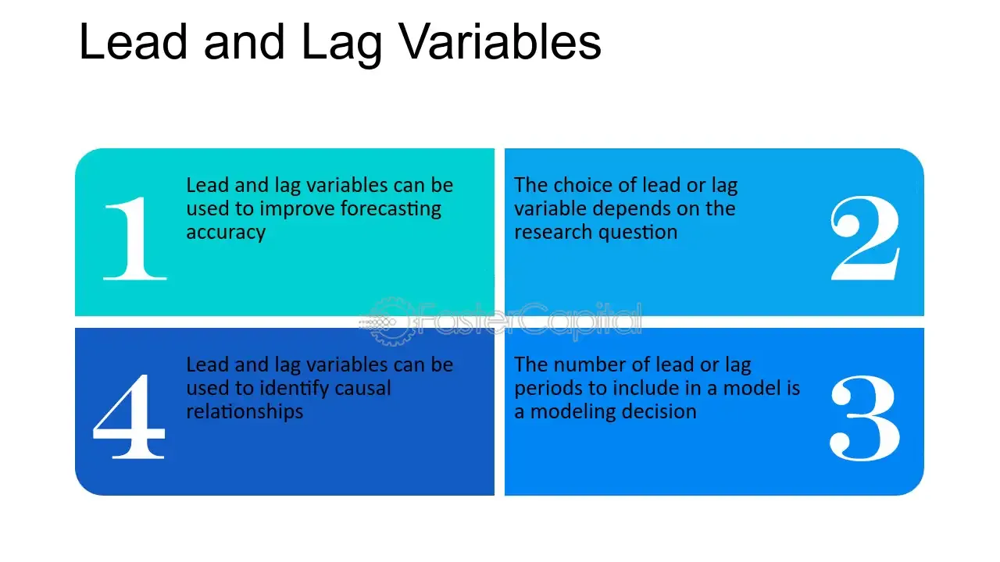

## Table of Contents

## What are leads and lags in the context of economics?

Leads and lags in economics refer to the timing differences between related economic indicators or events. A lead indicator is something that changes before the economy as a whole changes, helping to predict future economic conditions. For example, stock market performance can be a lead indicator because it often changes before the broader economy does. On the other hand, a lag indicator changes after the economy has already started to shift. Unemployment rates are often considered lag indicators because they tend to rise or fall after the economy has already begun to improve or worsen.

Understanding leads and lags is important for economists and policymakers because it helps them make better predictions and decisions. If they know that certain indicators lead or lag, they can use this information to anticipate economic trends and implement timely policies. For instance, if a lead indicator like consumer confidence starts to drop, policymakers might take action to stimulate the economy before a recession hits. Conversely, if a lag indicator like employment data shows improvement, it might confirm that the economy is recovering from a downturn.

## How do leads and lags affect economic forecasting?

Leads and lags play a big role in economic forecasting. They help economists predict what will happen to the economy in the future. A lead indicator, like stock market performance or consumer confidence, can give early signs that the economy might be changing. For example, if the stock market starts going down, it might mean that a recession is coming. Economists can use this information to make forecasts and warn people about what might happen.

Lag indicators, on the other hand, show what has already happened to the economy. Things like unemployment rates or inflation are lag indicators. They can confirm if the economy is getting better or worse after the fact. For example, if unemployment starts to go down, it might mean the economy has already started to recover. By looking at both lead and lag indicators, economists can make better guesses about the future and help people and businesses plan accordingly.

## Can you provide examples of economic indicators that typically lead or lag?

Lead indicators are things that change before the rest of the economy does. A good example is the stock market. When stock prices start to go down, it might mean that people are worried about the future of the economy, and a recession could be coming. Another lead indicator is consumer confidence. If people feel good about their money and the economy, they might spend more, which can help the economy grow. But if they're worried, they might save their money instead, which can slow things down. Business investment is another lead indicator. When companies start spending more on new projects and equipment, it often means they think the economy will do well in the future.

Lag indicators show what has already happened to the economy. Unemployment rates are a classic example. When the economy starts to get better, it takes a while for people to find jobs again, so unemployment goes down after the recovery has started. Another lag indicator is inflation. Prices might not start going up until after the economy has been growing for a while. Gross Domestic Product (GDP) is also often seen as a lag indicator because it's a measure of how the economy has performed over a certain period, not a prediction of what's coming. By looking at both lead and lag indicators, economists can get a fuller picture of what's happening with the economy.

## What is the difference between a leading indicator and a lagging indicator?

A leading indicator is something that changes before the economy as a whole changes. It can give early warnings about what might happen in the future. For example, if the stock market starts to drop, it might mean a recession is coming. Another example is consumer confidence. If people feel good about their money, they might spend more, which can help the economy grow. Businesses might also invest more if they think the economy will do well. These are signs that can help economists predict what will happen next.

A lagging indicator, on the other hand, changes after the economy has already started to shift. It shows what has already happened. Unemployment rates are a good example. When the economy gets better, it takes time for people to find jobs again, so unemployment goes down after the recovery has started. Inflation is another lagging indicator. Prices might not go up until after the economy has been growing for a while. GDP, which measures the total value of goods and services produced, is also often seen as a lagging indicator because it shows how the economy has performed over a certain period, not what's coming next. By looking at both leading and lagging indicators, economists can get a better understanding of the economy's past and future.

## How can understanding leads and lags help in making business decisions?

Understanding leads and lags can help businesses make better decisions by giving them a heads-up on what might happen next. For example, if a business sees that the stock market is going down, which is a leading indicator, they might decide to save more money or cut back on spending. This can help them prepare for a possible economic downturn. By paying attention to these early signs, a business can take steps to protect itself and maybe even find new opportunities in a changing market.

Also, knowing about lagging indicators can help businesses check if their decisions were good. If unemployment rates start to go down after a business has made some changes, it might mean those changes helped the economy recover. This can give the business confidence that they're on the right track. By looking at both leading and lagging indicators, a business can make smarter choices and adjust their plans based on what's really happening in the economy.

## What role do leads and lags play in monetary policy?

Leads and lags are important for people who make decisions about money, like central bankers. They use leading indicators to guess what might happen to the economy in the future. For example, if they see that the stock market is going down, they might think a recession is coming. This can help them decide to lower interest rates to make borrowing cheaper and encourage people to spend more money. By doing this early, they can try to stop the economy from getting worse.

Lagging indicators help central bankers check if their decisions are working. For example, if they see that unemployment rates are going down after they've lowered interest rates, it might mean their plan is helping the economy get better. This can give them confidence to keep doing what they're doing or make more changes if needed. By looking at both leading and lagging indicators, central bankers can make better choices about how to manage the economy and keep it stable.

## How do leads and lags influence the timing of economic cycles?

Leads and lags help us understand when different parts of the economy change during economic cycles. Leading indicators, like the stock market or consumer confidence, can give early signs that the economy might be heading into a new phase, such as a boom or a bust. For example, if the stock market starts to go down, it might mean a recession is coming. This can help people and businesses prepare for changes before they happen.

Lagging indicators, like unemployment rates or inflation, show us what has already happened in the economy. They can confirm if the economy is in a new phase after it has started. For instance, if unemployment starts to go down, it might mean the economy is already recovering from a downturn. By looking at both leading and lagging indicators, we can get a better idea of when the economy is changing and how long each phase of the economic cycle might last.

## What are some common pitfalls in interpreting leads and lags in economic data?

One common pitfall in interpreting leads and lags in economic data is putting too much trust in one indicator. Just because the stock market is going down doesn't always mean a recession is coming. Other things can affect it too, like world events or changes in one industry. So, it's important to look at many different indicators to get a full picture of what's happening.

Another pitfall is not understanding that leads and lags can change over time. What used to be a good leading indicator might not work as well now. For example, consumer confidence used to be a strong sign of future spending, but now people might be more cautious even when they feel good about the economy. Also, it can take time for changes in the economy to show up in lagging indicators, so it's important to be patient and not jump to conclusions too quickly.

By being aware of these pitfalls, people can make better use of leads and lags when trying to understand the economy. It's all about looking at the big picture and being ready to change your mind as new information comes in.

## How can statistical methods be used to identify leads and lags in time series data?

Statistical methods can help us find leads and lags in time series data by looking at how different pieces of data move together over time. One common way to do this is by using something called cross-correlation. This method checks how much one set of data, like stock market prices, moves with another set of data, like unemployment rates, at different times. If the stock market prices start to drop before unemployment rates go up, that tells us the stock market might be a leading indicator for unemployment. By doing this, we can see which data might be a good early warning sign for changes in the economy.

Another way to find leads and lags is by using something called Granger causality tests. These tests help us see if one set of data can help us predict another set of data. For example, if changes in consumer confidence today help us guess what will happen to spending next month, then consumer confidence might be a leading indicator for spending. These tests look at past data to see if one thing really does come before another and if that helps us predict the future. By using these statistical methods, we can better understand how different parts of the economy are connected and what might happen next.

## What advanced techniques exist for modeling the impact of leads and lags on economic variables?

One advanced technique for modeling the impact of leads and lags on economic variables is using Vector Autoregression (VAR) models. These models look at how different economic variables, like unemployment rates and stock market prices, affect each other over time. By using VAR models, economists can see if changes in one variable, like consumer confidence, can help predict changes in another variable, like spending. This helps them understand how leads and lags work in the economy and make better guesses about what might happen next.

Another technique is using Dynamic Stochastic General Equilibrium (DSGE) models. These models are more complicated and try to show how the whole economy works by looking at how people, businesses, and the government make decisions. DSGE models can help economists see how leads and lags affect things like inflation and employment. By using these models, they can test different ideas about how the economy might change and figure out the best ways to manage it. Both VAR and DSGE models help economists understand the timing of economic changes and make better plans for the future.

## How do international economic leads and lags affect global trade and investment?

International economic leads and lags can have a big impact on global trade and investment. When one country's economy starts to change, it can affect other countries too. For example, if the U.S. stock market goes down, which is a leading indicator, businesses around the world might start to worry. They might decide to slow down on new projects or trade with other countries because they think a global economic downturn might be coming. This can make global trade and investment go down as everyone tries to be careful with their money.

On the other hand, lagging indicators like unemployment rates can show how global trade and investment have already been affected. If unemployment starts to go down in many countries after a period of economic growth, it might mean that global trade and investment have helped the world economy recover. By looking at both leading and lagging indicators from different countries, businesses and governments can make better decisions about where to invest and how to trade. This helps them take advantage of good times and be ready for tough times.

## What are the current research trends in the analysis of leads and lags in economics?

One current research trend in the analysis of leads and lags in economics is the use of big data and [machine learning](/wiki/machine-learning). These tools help economists look at huge amounts of information from different places and see how things like the stock market and consumer confidence are connected. By using machine learning, they can find new leading indicators that might be better at predicting what will happen to the economy. This can help them make more accurate forecasts and better understand how different parts of the economy work together.

Another trend is looking at how leads and lags work in a global economy. Researchers are studying how changes in one country can affect other countries and how this impacts global trade and investment. They use models that look at data from many countries to see how economic changes spread around the world. This helps them understand how to manage the global economy better and make sure that policies in one country don't cause problems in another. By studying these international leads and lags, economists can help make the world economy more stable and help countries work together better.

## References & Further Reading

[1]: Bergstra, J., Bardenet, R., Bengio, Y., & Kégl, B. (2011). ["Algorithms for Hyper-Parameter Optimization."](https://dl.acm.org/doi/10.5555/2986459.2986743) Advances in Neural Information Processing Systems 24.

[2]: ["Advances in Financial Machine Learning"](https://www.amazon.com/Advances-Financial-Machine-Learning-Marcos/dp/1119482089) by Marcos Lopez de Prado

[3]: ["Evidence-Based Technical Analysis: Applying the Scientific Method and Statistical Inference to Trading Signals"](https://books.google.com/books/about/Evidence_Based_Technical_Analysis.html?id=jbD47VkOHAEC) by David Aronson

[4]: ["Machine Learning for Algorithmic Trading"](https://github.com/stefan-jansen/machine-learning-for-trading) by Stefan Jansen

[5]: ["Quantitative Trading: How to Build Your Own Algorithmic Trading Business"](https://github.com/LucindaYa/quant-resources/blob/master/Quantitative%20Trading%20How%20to%20Build%20Your%20Own%20Algorithmic%20Trading%20Business.pdf) by Ernest P. Chan