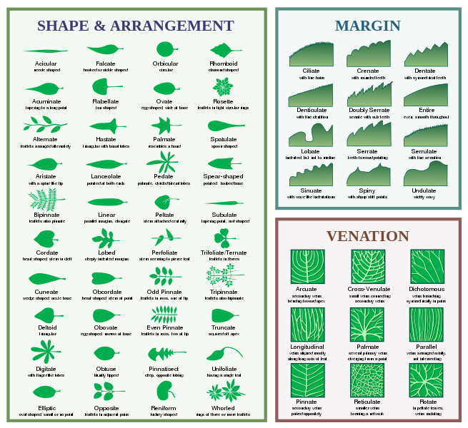

## Table of Contents

## What is Leaf in the context of machine learning?

In machine learning, a leaf refers to the end nodes of a decision tree. A decision tree is a type of algorithm that makes decisions by splitting data into branches based on certain conditions. The leaf is where the tree stops splitting and provides a final prediction or decision. For example, in a decision tree used for classifying whether an email is spam or not, the leaf might say "spam" or "not spam" based on the email's features.

Leaves are important because they represent the outcomes of the decision-making process in the tree. The path from the root of the tree to a leaf shows the series of decisions that led to that final prediction. The quality of a decision tree often depends on how well the leaves classify or predict the data. If the leaves are too broad and cover too many different cases, the tree might not be very accurate. On the other hand, if the leaves are too specific, the tree might overfit and not generalize well to new data.

## How does Leaf differ from other machine learning frameworks?

Leaf is a machine learning framework that is designed to be lightweight and easy to use, especially for beginners. Unlike other frameworks like TensorFlow or PyTorch, which can be complex and require a lot of setup, Leaf aims to simplify the process of building and training machine learning models. It provides a user-friendly interface that allows users to quickly experiment with different models without getting bogged down in the details of the underlying system.

Another key difference is that Leaf focuses on decision trees and ensemble methods, such as Random Forests and Gradient Boosting Machines. These methods are often easier to understand and interpret compared to the [deep learning](/wiki/deep-learning) models that frameworks like TensorFlow and PyTorch are known for. For example, while a [neural network](/wiki/neural-network) in TensorFlow might involve complex layers and require a lot of tuning, a decision tree in Leaf can be built and visualized easily, helping users see exactly how the model makes its decisions.

In practice, this means that Leaf is particularly useful for tasks where interpretability is important, such as in healthcare or finance, where understanding the reasoning behind a prediction can be crucial. While other frameworks might offer more advanced features and flexibility, Leaf's simplicity and focus on decision trees make it a great choice for those new to [machine learning](/wiki/machine-learning) or those who need models that are easy to explain and understand.

## What are the main components of Leaf?

Leaf is made up of a few main parts that help you build and use machine learning models easily. The first part is the decision tree builder. This part lets you create decision trees, which are simple models that make choices by splitting data into different paths. Each path leads to a leaf, which is the end of the tree and gives a final prediction. The decision tree builder in Leaf is easy to use and helps you see how the tree works by showing you the paths and the leaves.

The second part of Leaf is the ensemble methods. These are ways to combine many decision trees to make a stronger model. Two common ensemble methods in Leaf are Random Forests and Gradient Boosting Machines. Random Forests use many decision trees and combine their predictions to make a final decision. Gradient Boosting Machines build trees one by one, with each new tree trying to fix the mistakes of the trees before it. Both methods can make better predictions than a single tree, and Leaf makes it easy to use them.

The last part of Leaf is the user interface. This part is designed to be simple and easy to understand, even if you are new to machine learning. You can use Leaf to quickly try out different models and see how they work. The interface lets you see the decision trees and how they make predictions, which can be very helpful if you need to explain your model to others. Overall, Leaf's main components work together to make machine learning easier and more understandable.

## Can you explain how to set up a basic Leaf project?

Setting up a basic Leaf project is easy and straightforward. First, you need to install Leaf on your computer. You can do this by downloading it from the official Leaf website or using a package manager like pip. Once you have Leaf installed, you can start a new project by creating a new folder for your project and opening it in your favorite code editor. Inside this folder, you will create a Python file, for example, `main.py`, where you will write your Leaf code.

In your `main.py` file, you can start by importing the Leaf library and creating a simple decision tree. Here is an example of how to do this:

```python
import leaf

# Create a simple decision tree
tree = leaf.DecisionTree()

# Train the tree with some data
# Here, you would replace 'data' and 'target' with your actual data
tree.fit(data, target)

# Use the tree to make predictions
predictions = tree.predict(new_data)
```

This code shows you how to import Leaf, create a decision tree, train it with some data, and use it to make predictions. You can then run your `main.py` file to see the results. With these simple steps, you can start using Leaf to build and test your machine learning models.

## What types of models can be built using Leaf?

Leaf is great for building models that use decision trees. You can make a single decision tree model, which is like a flowchart that makes choices based on your data. Each choice leads to a leaf, which is the end of the tree and gives you a final prediction. This is easy to understand and use, especially if you're new to machine learning.

Leaf also lets you build more advanced models called ensemble methods. Two common types are Random Forests and Gradient Boosting Machines. Random Forests use many decision trees and combine their predictions to make a final decision. This can be more accurate than using just one tree. Gradient Boosting Machines build trees one by one, with each new tree trying to fix the mistakes of the trees before it. Both types of models can be built easily in Leaf, helping you make better predictions.

To start building these models, you just need to import Leaf and use its simple functions. For example, you can create a Random Forest like this:

```python
import leaf

# Create a Random Forest
forest = leaf.RandomForest()

# Train the forest with some data
forest.fit(data, target)

# Use the forest to make predictions
predictions = forest.predict(new_data)
```

This code shows how easy it is to set up and use a Random Forest model in Leaf.

## How does Leaf handle data preprocessing?

Leaf makes data preprocessing easy by providing simple tools to clean and prepare your data. You can use Leaf to handle missing values, which are gaps in your data. For example, if some information is missing, Leaf can fill those gaps with a common value like the average or the most frequent one. Leaf also helps you change your data into the right format for your model. If you have words or categories, Leaf can turn them into numbers that the model can understand.

Another important part of preprocessing in Leaf is scaling your data. This means making sure all your numbers are on the same level so one type of data doesn't overpower the others. Leaf can do this by making all your numbers fit between 0 and 1, or by making them have the same average and spread. This helps your model work better and make more accurate predictions. Here is an example of how you might use Leaf to preprocess your data:

```python
import leaf

# Create a preprocessor
preprocessor = leaf.Preprocessor()

# Handle missing values
preprocessor.impute_missing_values(data)

# Encode categorical data
preprocessor.encode_categorical(data)

# Scale the data
preprocessor.scale_data(data)

# Use the preprocessed data to train a model
model = leaf.DecisionTree()
model.fit(preprocessor.transform(data), target)
```

## What are the performance optimization techniques available in Leaf?

Leaf offers several ways to make your models work faster and better. One way is pruning, which means cutting off parts of the decision tree that don't help much with predictions. This makes the tree smaller and quicker to use. Leaf also uses something called feature selection, where it picks only the most important pieces of your data to use in the model. This can make the model faster and sometimes even more accurate because it focuses on what really matters.

Another technique Leaf uses is parallel processing. This means it can use more than one part of your computer at the same time to build and train models. For example, when building a Random Forest, Leaf can work on different trees at the same time, making the whole process quicker. Leaf also has tools to fine-tune your models, like adjusting how deep the trees can grow or how many trees to use in a Random Forest. These adjustments can help make your model work better without taking too long to run.

## How can Leaf be integrated with other data science tools?

Leaf can be easily connected with other data science tools to make your work easier. For example, you can use Leaf with popular data analysis libraries like pandas to handle and preprocess your data. After you've cleaned your data with pandas, you can feed it into Leaf to build your models. Leaf also works well with visualization tools like matplotlib or seaborn, so you can see how your decision trees and predictions look. This makes it easier to understand and explain your models to others.

Another way Leaf integrates with other tools is through machine learning frameworks like scikit-learn. You can use Leaf to build your initial models and then use scikit-learn to try different techniques or improve your models further. For example, you could use Leaf to create a basic decision tree and then use scikit-learn's tools to fine-tune it or combine it with other models. This flexibility allows you to use the best parts of different tools to get the best results for your project.

## What are some common use cases for Leaf in industry?

Leaf is often used in industries where understanding how decisions are made is important. For example, in healthcare, doctors might use Leaf to help predict if a patient has a certain disease. They can see how the model makes its decision by looking at the decision tree, which helps them trust the model more. In finance, banks might use Leaf to decide if someone should get a loan. The decision tree can show them exactly why a loan was approved or denied, which is helpful for explaining their decisions to customers or regulators.

Another common use of Leaf is in customer service and marketing. Companies can use Leaf to predict what customers might want to buy next or to figure out which customers are likely to leave. By using a decision tree, they can see which factors are most important for these predictions, like how often a customer shops or what they usually buy. This helps them make better decisions about how to keep their customers happy and coming back.

## Can you discuss the scalability features of Leaf for large datasets?

Leaf is designed to handle large datasets well, making it a good choice for big projects. One way it does this is by using parallel processing. This means Leaf can use multiple parts of your computer at the same time to work on your data. For example, when building a Random Forest, Leaf can create different trees at the same time, which makes the whole process faster. This is really helpful when you have a lot of data because it can take a long time to go through it all if you do it one piece at a time.

Another way Leaf handles large datasets is by using smart techniques to pick only the most important parts of your data. This is called feature selection. By focusing on what really matters, Leaf can make your models work faster and sometimes even better. It also has a method called pruning, which means cutting off parts of the decision tree that don't help much. This makes the tree smaller and quicker to use, which is important when you have a lot of data to process.

## How does Leaf support distributed computing and what are its limitations?

Leaf supports distributed computing by using multiple parts of a computer or even multiple computers at the same time to work on your data. This is helpful when you have a big dataset because it can make the process of building and training models much faster. Leaf does this by splitting the work into smaller pieces and letting different parts of the system handle each piece. For example, when building a Random Forest, Leaf can create different trees on different computers, which speeds up the whole process. This way, even if you have a lot of data, Leaf can still handle it well and give you results quickly.

However, Leaf has some limitations when it comes to distributed computing. One limitation is that it might not work as well with very large and complex setups as some other tools designed specifically for distributed systems. For example, while Leaf can use multiple computers, it might not be as good at handling thousands of computers at once compared to specialized frameworks like Apache Spark. Also, setting up Leaf for distributed computing can be a bit tricky and might need some extra work to get everything working smoothly. So, while Leaf is great for many tasks, if you need to handle extremely large and complex distributed systems, you might need to look at other options.

## What advanced features does Leaf offer for expert users, such as custom model architectures or hyperparameter tuning?

Leaf offers several advanced features for expert users, including the ability to create custom model architectures. You can modify the decision tree or ensemble methods to fit your specific needs. For example, you might want to change how the tree splits the data or how many trees are used in a Random Forest. Leaf lets you do this by giving you control over the tree-building process. You can also use Leaf to create new types of models by combining different decision trees in unique ways, allowing you to experiment and find the best model for your data.

Another important feature for expert users is hyperparameter tuning. This means adjusting the settings of your model to make it work better. Leaf provides tools to help you do this easily. You can try different settings and see how they affect your model's performance. For example, you might change the maximum depth of a decision tree or the number of trees in a Random Forest to see if it improves your predictions. Leaf makes it simple to test these changes and find the best settings for your model.

## References & Further Reading

[1]: Breiman, L. (2001). ["Random Forests"](https://link.springer.com/article/10.1023/A:1010933404324). Machine Learning, 45(1), 5–32.

[2]: Friedman, J. H. (2001). ["Greedy Function Approximation: A Gradient Boosting Machine."](https://www.jstor.org/stable/2699986) The Annals of Statistics, 29(5), 1189-1232.

[3]: Quinlan, J. R. (1986). ["Induction of Decision Trees."](https://link.springer.com/article/10.1007/BF00116251) Machine Learning, 1(1), 81-106.

[4]: Pedregosa, F. et al. (2011). ["Scikit-learn: Machine Learning in Python."](https://dl.acm.org/doi/10.5555/1953048.2078195) Journal of Machine Learning Research, 12, 2825-2830.

[5]: Hastie, T., Tibshirani, R., & Friedman, J. (2009). ["The Elements of Statistical Learning: Data Mining, Inference, and Prediction."](https://link.springer.com/book/10.1007/978-0-387-84858-7) Springer Series in Statistics.