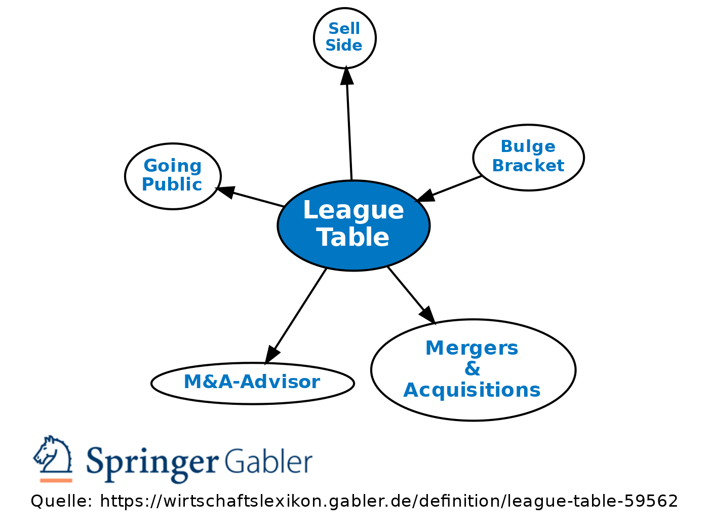

Ranking systems are pivotal in a variety of fields, notably finance and sports, where they serve as vital tools for performance measurement and decision-making. In finance, these systems help in assessing investment opportunities, analyzing market trends, and facilitating effective portfolio management. Similarly, in sports, rankings influence league standings, guide team strategies, and offer insights into competitive dynamics. 

This article examines the concept of ranking systems, focusing on their role in sports through league tables and the application of algorithmic trading principles in crafting robust and actionable standings. League tables typically rank teams based on a series of performance metrics, such as wins, losses, and overall points. They act as a barometer for team performance throughout a season, providing fans, analysts, and team managers with a snapshot of current standings and a basis for future predictions.



Algorithmic trading, a staple in modern financial markets, shares comparable methodologies with sports standings, particularly through the use of computational algorithms to analyze and predict outcomes. By understanding these ranking mechanisms, stakeholders in both finance and sports can gain invaluable insights, aiding in strategic decision-making.

As we explore the intersection of mathematics, finance, and sports, we aim to uncover the methodologies behind ranking systems. These systems are structured to provide fair and reliable assessments through a combination of statistical analyses and computational models. Whether for optimizing investment portfolios or enhancing sports analytics, a comprehensive understanding of ranking systems is essential for those looking to make informed decisions in these fields.

By navigating the principles underpinning these ranking mechanisms, this article aims to illustrate their importance and potential applications, offering a foundation from which both financial analysts and sports strategists can operate more effectively.

## Table of Contents

## What Are League Tables in Sports?

League tables in sports are crucial components for ranking teams and assessing performance across various competitions. These tables rank teams based on established criteria, including wins, losses, points earned, and a range of other performance-related metrics. Such an arrangement is instrumental in defining the standings within leagues, offering fans and analysts a clear picture of team capabilities and competitive edge.

Traditionally, league tables capture a team's performance over a season or specified timeframe, serving as a snapshot of how each team has fared. This periodical assessment aids in understanding both the current performance levels of teams and predicting future outcomes through statistical analysis. The predictive aspect of league tables relies heavily on historical data combined with analytical methods that can project potential trajectories based on current [statistics](/wiki/bayesian-statistics).

Teams utilize league tables as strategic tools to evaluate their position relative to competitors. By analyzing where they stand and understanding the metrics behind these standings, teams can identify areas for improvement and devise strategies to enhance their rankings. A team's ability to interpret league interactions and adjust its strategies accordingly can often determine its success within a competition.

For analysts, league tables provide a foundation for deeper insights into team performance and league dynamics. By incorporating additional data, such as point differentials, head-to-head records, or conditions of play, analysts can deduce more nuanced interpretations of team strengths and areas of dominance. This depth of analysis helps fans engage more practically and makes strategic planning more robust.

In conclusion, league tables are indispensable in sports for offering a structured overview of team rankings and dynamics. They not only reflect past and current performances but also aid in shaping the future through data-driven insights and strategic foresight.

## The Role of Graph Theory in Sports

Graph theory provides a robust mathematical framework for analyzing team dynamics and match outcomes in sports. By representing teams as vertices and games played as edges connecting these vertices, graph theory facilitates a comprehensive visualization of complex league schedules. This approach aids in deciphering patterns in team performances, offering insights into the interconnected nature of sports competitions.

In this context, a directed graph can be used where directed edges signify the outcome of matches between teams. For instance, if team A defeats team B, a directed edge is drawn from vertex A to vertex B. This representation allows analysts to capture not only the results but also the directionality of matches, indicating which team emerged victorious.

Graph theory's application extends beyond simple win-loss records by incorporating the strength of opponents. In sports rankings, the quality of each opponent is crucial in determining the significance of a match's outcome. Therefore, graph-based models can weigh victories against stronger opponents more heavily than those against weaker ones. This ensures that the rankings truly reflect the competitive landscape of the sport.

The utility of graph theory in sports is further exemplified through its role in algorithms like PageRank, originally developed for web search engines. PageRank evaluates the importance of a web page based on the quality and quantity of links it receives. In sports, an analogous approach can be applied by considering the network of victories and the prestige of opponents. The underlying formula for PageRank, adapted for sports, can be expressed as:

$$
PR(T_i) = \frac{1 - d}{N} + d \sum_{T_j \in L(T_i)} \frac{PR(T_j)}{C(T_j)}
$$

Where:
- $PR(T_i)$ is the PageRank of team $T_i$.
- $d$ is a damping factor (usually set around 0.85).
- $N$ is the total number of teams.
- $L(T_i)$ denotes the set of teams defeated by $T_i$.
- $C(T_j)$ represents the number of victories by team $T_j$.

This adaptation of PageRank in sports provides a nuanced understanding of team standings, considering not just the number of wins but the competitiveness of each match. By leveraging graph theory, sports analysts gain the ability to derive more reliable and insightful rankings, reflecting both individual matches and overall league performance.

## PageRank: From Web to Sports

PageRank, a seminal algorithm initially created by Larry Page and Sergey Brin, was designed to rank web pages in search engine results and has since found significant applicability in sports analytics. In its original form, PageRank evaluates the importance of web pages based on the quantity and quality of links pointing to them. In the context of sports, this concept is adapted to prioritize the quality of wins against strong teams over victories against weaker opponents.

The core of PageRank's application in sports involves constructing a network where teams are represented as nodes and games described as directed edges indicating victories. The algorithm distributes "rank" among teams by iteratively processing the network of matches played. A team accumulates higher rank points not only by winning matches but also by defeating highly ranked adversaries. Thus, the PageRank score, $PR$, of a team is calculated iteratively using:

$$
PR(T_i) = (1-d) + d \sum_{T_j \in B(T_i)} \frac{PR(T_j)}{L(T_j)}
$$

where:
- $PR(T_i)$ is the PageRank of team $T_i$,
- $d$ is a damping factor, usually set around 0.85,
- $B(T_i)$ is the set of teams defeated by $T_i$,
- $L(T_j)$ is the number of teams that $T_j$ has defeated.

This method provides a more sophisticated understanding of team standings by going beyond simple win-loss records. It offers a holistic view by considering the competitive quality of the matches played. For instance, beating an undefeated top team would contribute more to the winning team’s rank than defeating a team with a poor performance history. This can be especially beneficial in leagues with unevenly distributed team strengths or when evaluating inter-league competitions.

To implement PageRank in a sports setting using Python, one can utilize existing graph libraries such as NetworkX. Below is a basic illustration of how one might begin setting up such a calculation:

```python
import networkx as nx

# Create a directed graph
G = nx.DiGraph()

# Add edges, where each edge is a victory from one team over another
# For example, if team A defeated team B, add an edge from B to A
G.add_edges_from([("TeamB", "TeamA"), ("TeamC", "TeamA"), ("TeamA", "TeamD")])

# Calculate PageRank
pagerank = nx.pagerank(G, alpha=0.85)

# Output the PageRank scores
print(pagerank)
```

By integrating PageRank, sports analysts can produce rankings that reflect not just the results on the surface but the nuanced competitive landscape teams navigate. Such advanced methodologies are proving pivotal in sports analytics, enriching the insights that can be drawn from match data and ensuring a more fair and comprehensive system for determining team performance and rankings.

## Algorithmic Trading and Sports Standings

Algorithmic trading employs computational algorithms to process vast amounts of financial data rapidly, aiming to create predictive models that can drive trading decisions. This advanced approach can be adapted to sports standings, leveraging similar data analysis methodologies to predict outcomes and enhance performance assessments.

In both financial markets and sports, precise and rapid data processing is crucial for making informed decisions. Algorithmic systems analyze historical data to identify patterns that can inform future actions. In sports, similar algorithms are used to analyze a plethora of data points, such as player statistics, team performances, and external conditions, contributing to more accurate predictions of game outcomes and team rankings.

These algorithms often engage in simulation exercises, creating scenarios that help predict future performances. In finance, Monte Carlo simulations might be deployed to predict stock prices based on historical [volatility](/wiki/volatility-trading-strategies). Correspondingly, in sports, simulations can project team standings by assessing potential match outcomes against a range of variables, such as player injuries or weather conditions.

Machine learning enhances these predictive models by enabling algorithms to adapt to new data and changing conditions. For instance, [reinforcement learning](/wiki/reinforcement-learning)—a [machine learning](/wiki/machine-learning) technique where models learn optimal strategies through trial and error—can be deployed to refine predictions dynamically as a season progresses. This adaptability is critical in sports, where team strategies and conditions evolve continually.

By drawing parallels between algorithmic financial models and sports ranking systems, we can leverage financial insights to improve sports analytics. In finance, algorithms might use indicators like moving averages to predict market trends. Similarly, sports algorithms can apply weighted averages to assess team strengths, adjusting these weights based on more recent and pertinent data.

This combination of algorithmic precision and machine learning adaptability provides a robust framework not only for forecasting but also for real-time decision-making in competitive sports environments, thereby enhancing the overall quality of rankings and performance assessments.

## Conclusion: Future of Ranking Systems

Ranking systems in both finance and sports are continuously evolving, driven by advancements in technology and data analysis. With the growing availability of large datasets and sophisticated algorithms, these systems are becoming more dynamic and precise, effectively reflecting the uncertainties inherent in real-world scenarios. Algorithm-based evaluations leverage computational power to process and interpret complex data, allowing for the creation of more accurate and nuanced rankings.

In sports, the evolution of ranking methodologies holds the potential to redefine competition structures. By incorporating advanced statistical models, machine learning, and algorithmic insights, these systems can provide a more engaging and equitable competitive environment. For instance, algorithms can adjust rankings based not only on win-loss records but also on additional variables like margin of victory, strength of schedule, and player performance, offering a deeper analysis of team capabilities. This leads to a more comprehensive view of competitive dynamics, enabling leagues to structure fairer competitions and enhancing the spectator experience.

For teams, analysts, and investors, understanding these evolving systems is crucial. The ability to interpret sophisticated rankings informs strategic decision-making, from player acquisitions and game strategy in sports to investment choices in financial markets. Access to precise, data-driven insights equips stakeholders with the tools needed to gain a competitive edge, manage risks, and optimize performance.

Looking ahead, the future of ranking systems hinges on their capacity to integrate diverse data analytics techniques while maintaining transparency and accuracy. Rapid advancements in [artificial intelligence](/wiki/ai-artificial-intelligence) and machine learning will further empower these systems to process increasingly complex datasets and generate rankings that adapt swiftly to changing conditions. This will ensure that performance measurement remains both relevant and reliable, ultimately supporting innovation and excellence in both finance and sports.

## References & Further Reading

[1]: Langville, A. N., & Meyer, C. D. (2006). ["Google's PageRank and Beyond: The Science of Search Engine Rankings."](https://archive.org/details/googlespagerankb0000lang) Princeton University Press.

[2]: Borm, P., van den Nouweland, A., & Toeters, M. (2002). ["A Graph-Theoretical Approach to Games and Economic Behavior."](https://pure.uvt.nl/ws/portalfiles/portal/1179191/NABPTS5612823.pdf) Journal of Economic Theory.

[3]: Lopez de Prado, M. (2018). ["Advances in Financial Machine Learning."](https://www.amazon.com/Advances-Financial-Machine-Learning-Marcos/dp/1119482089) Wiley.

[4]: Aronson, D. R. (2007). ["Evidence-Based Technical Analysis: Applying the Scientific Method and Statistical Inference to Trading Signals."](https://onlinelibrary.wiley.com/doi/book/10.1002/9781118268315) Wiley.

[5]: Cormen, T. H., Leiserson, C. E., Rivest, R. L., & Stein, C. (2009). ["Introduction to Algorithms."](https://archive.org/details/introduction-to-algorithms-third-edition-2009) MIT Press.