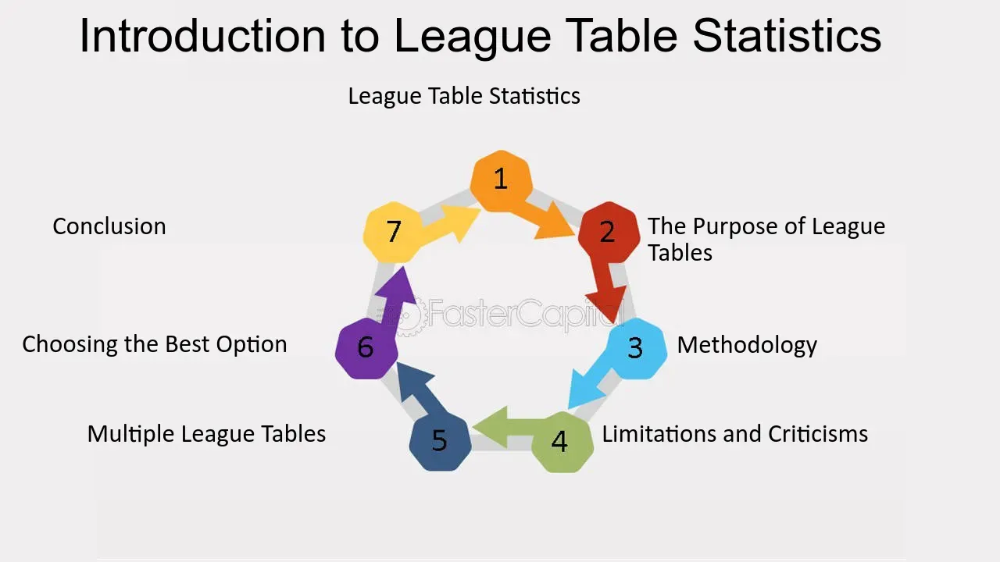

## Table of Contents

## What is a league table?

A league table is a list that shows the positions of teams or players in a competition. It usually shows who is winning and who is losing. The table is often used in sports like soccer, basketball, and hockey. In a league table, teams get points for winning or drawing games. The team with the most points at the end of the season is usually the winner.

League tables can also be used in other areas, like schools or businesses. For example, schools might use a league table to show which schools are doing the best in exams. Companies might use them to show which salespeople are selling the most products. No matter where they are used, league tables help people see who is doing well and who needs to improve.

## What is the purpose of a league table?

The main purpose of a league table is to show how well teams or players are doing in a competition. It helps everyone see who is winning and who is losing by listing the teams or players in order of their performance. In sports, a league table shows points earned from wins and draws, making it easy to see which team is leading and which ones need to catch up.

League tables are also used in other areas like schools and businesses. In schools, they can show which schools are doing the best in exams, helping parents and students make choices about where to study. In businesses, league tables can rank salespeople based on how much they sell, encouraging them to work harder. Overall, league tables are a simple way to compare performance and see who is doing well and who needs to improve.

## How is a league table typically structured?

A league table is usually set up like a chart. At the top, you see the names of the teams or players. Next to their names, there are columns that show different things like how many games they played, how many they won, how many they lost, and how many they tied. There's also a column for the total points they have. The teams or players are listed from the top to the bottom, with the one with the most points at the top.

Sometimes, there are extra columns in the league table. These can show things like how many goals a team scored or how many goals they let in. In sports where points are given for different results, like three points for a win and one point for a draw, these details help show why a team has the points they do. The structure makes it easy to see who is doing well and who needs to work harder.

## What sports commonly use league tables?

Many sports use league tables to show how teams are doing. Soccer is one of the most common sports that uses league tables. In soccer, teams play against each other over a season, and points are given for wins and draws. The team with the most points at the end of the season wins the league. Other sports like basketball and hockey also use league tables. In these sports, teams play a series of games, and their wins and losses are tracked in the table.

Rugby and cricket are other sports that often use league tables. In rugby, teams earn points for winning matches and sometimes for losing by a small margin. Cricket leagues, like the Indian Premier League, use tables to show which teams are doing well. Even in American sports like baseball and football, league tables, often called standings, are used to rank teams based on their performance throughout the season. These tables help fans and players see who is leading and who needs to catch up.

## How are points calculated in a league table?

Points in a league table are usually calculated based on the results of games. In many sports, a team gets three points for winning a game. If the game ends in a tie, each team gets one point. If a team loses, they get no points. At the end of the season, all the points from all the games are added up to see which team has the most points and is at the top of the table.

Some sports might use different rules for calculating points. For example, in rugby, a team can get four points for a win, and they might even get a bonus point for scoring a lot of tries or losing by a small margin. In soccer, the standard is three points for a win and one point for a draw, but some leagues might have different rules. No matter the sport, the points help show how well a team is doing and where they stand in the league table.

## What are the different methods for breaking ties in a league table?

When teams in a league table have the same number of points, they need a way to decide who is ranked higher. One common way to break a tie is by looking at the goal difference. This is when you take the number of goals a team scored and subtract the number of goals they let in. The team with the bigger goal difference gets the higher spot. If the goal difference is also the same, then they might look at the number of goals scored. The team that scored more goals gets the higher rank.

Another method for breaking ties is to look at the results of the games played between the tied teams. This is called head-to-head results. If one team beat the other team when they played each other, that team gets the higher spot. If they had the same results in their games, like one win each, then other ways might be used. Some leagues use a points per game system if teams played a different number of games. This way, it's fair even if one team played more games than the other.

Sometimes, if all these methods still don't break the tie, other factors can be used. For example, some leagues might look at away goals if the tied teams played each other. Or they might use a playoff game or a coin toss as a last resort. Each league has its own rules, so it's important to know what method they use to decide who goes where in the table when points are the same.

## How do league tables affect team strategies?

League tables can change how teams play because they show who is winning and who is losing. Teams near the bottom of the table might try to play safer to avoid losing more points. They might focus on not letting the other team score, even if it means they don't score much themselves. Teams at the top might try to win every game to keep their lead. They might take more risks to score more goals and get more points.

Teams in the middle of the table might change their strategy depending on what they want to achieve. If they want to move up, they might play more attacking to try and win more games. If they want to avoid dropping down, they might play more defensively to make sure they don't lose. Knowing where they are in the league table helps teams decide what to do in each game.

## What historical changes have occurred in the format of league tables?

Over time, the way league tables are set up has changed a lot. In the early days of sports like soccer, league tables were simple. They just showed how many games teams won, lost, or tied. But as sports grew and more people watched, league tables got more detailed. They started to include things like goal difference and the number of goals scored. This helped show not just who won, but how well teams played. Also, the way points were given changed. At first, teams got two points for a win, but later many leagues switched to three points for a win to make games more exciting and encourage teams to play for a win instead of a tie.

Another big change happened with technology. In the past, league tables were printed in newspapers or shown on TV. Now, with the internet, you can see league tables online and they update in real-time. This means fans can see how their team is doing right after a game ends. Also, different sports started using league tables in new ways. For example, in rugby, they added bonus points for scoring a lot of tries or losing by a small margin. These changes made league tables more interesting and gave teams more ways to earn points. Overall, league tables have become more detailed and useful over time, helping fans and teams understand the competition better.

## How can league tables be used for predictive analytics in sports?

League tables can help predict how teams will do in the future by looking at their past performance. If a team is at the top of the table, it's likely they will keep doing well because they have been winning a lot of games. People can use the points, goals scored, and goals let in to guess how a team might do in their next games. For example, if a team has a good goal difference, it means they are scoring more than they are letting in, which is a good sign for future games.

Also, league tables can show patterns that help make predictions. If a team always does well against certain other teams, that can help guess the result of their next game against those teams. Computers can use all this data from league tables to make smart guesses about who will win or lose. This helps fans, coaches, and even people who bet on sports to make better choices based on what the numbers say.

## What are the psychological impacts of league standings on players and teams?

Being on a league table can affect how players and teams feel. When a team is at the top of the table, the players might feel happy and confident. They know they are doing well and this can make them want to keep playing their best. But if a team is at the bottom, the players might feel stressed and worried. They might be scared of losing more games and dropping down to a lower league. This can make them play worse because they are not feeling good.

Coaches and fans also feel the impact of where a team is on the league table. If a team is doing well, the coach might feel proud and the fans might be excited and supportive. But if the team is doing badly, the coach might feel pressure to make the team better. Fans might get upset and start to lose hope. All these feelings can change how everyone acts and plays, making the league table more than just a list of numbers. It can really affect the mood and performance of everyone involved.

## How do different countries or leagues vary in their use of league tables?

Different countries and leagues use league tables in different ways. In soccer, for example, the English Premier League gives three points for a win and one point for a draw, which is common in many European leagues. But in some countries like Brazil, the league might use a different system where teams can get bonus points for certain achievements, like scoring a lot of goals in a game. Also, some leagues might have different ways to break ties, like using head-to-head results or goal difference, while others might use different methods.

In other sports, the use of league tables can also vary. In American sports like the NFL, the league table is called standings and includes not just wins and losses but also other factors like strength of schedule. This means how hard the teams a team played were. In basketball, the NBA uses a league table that includes wins and losses, but they also have a playoff system that decides the final winner. So, even though league tables are used around the world, each country and league might have its own special way of setting them up and using them.

## What advanced statistical models can be applied to enhance the analysis of league tables?

Advanced statistical models can make league tables even more useful by looking deeper into the numbers. One model that can be used is called regression analysis. This model helps find out which things, like how many goals a team scores or how many they let in, really affect where they end up in the league table. By using regression analysis, people can see which stats are most important for winning and losing. Another model is called machine learning. This can look at a lot of past games and find patterns that are hard for people to see. Machine learning can help predict how a team might do in future games based on how they have played before.

Another useful model is called Elo rating system. This system gives teams a score that changes after each game, showing how strong they are compared to other teams. The Elo system can help make league tables more accurate by showing not just how many points a team has, but how good they are overall. Also, models like Monte Carlo simulations can be used to run thousands of different game scenarios to see all the possible ways a season might end. This can help people understand the chances of a team winning the league or getting into the playoffs. These advanced models help make league tables better at showing what's really going on in a competition.

## What is the Role of Graph Theory in Sports?

Graph theory provides a robust mathematical framework for analyzing team dynamics and match outcomes in sports. By representing teams as vertices and games played as edges connecting these vertices, graph theory facilitates a comprehensive visualization of complex league schedules. This approach aids in deciphering patterns in team performances, offering insights into the interconnected nature of sports competitions.

In this context, a directed graph can be used where directed edges signify the outcome of matches between teams. For instance, if team A defeats team B, a directed edge is drawn from vertex A to vertex B. This representation allows analysts to capture not only the results but also the directionality of matches, indicating which team emerged victorious.

Graph theory's application extends beyond simple win-loss records by incorporating the strength of opponents. In sports rankings, the quality of each opponent is crucial in determining the significance of a match's outcome. Therefore, graph-based models can weigh victories against stronger opponents more heavily than those against weaker ones. This ensures that the rankings truly reflect the competitive landscape of the sport.

The utility of graph theory in sports is further exemplified through its role in algorithms like PageRank, originally developed for web search engines. PageRank evaluates the importance of a web page based on the quality and quantity of links it receives. In sports, an analogous approach can be applied by considering the network of victories and the prestige of opponents. The underlying formula for PageRank, adapted for sports, can be expressed as:

$$
PR(T_i) = \frac{1 - d}{N} + d \sum_{T_j \in L(T_i)} \frac{PR(T_j)}{C(T_j)}
$$

Where:
- $PR(T_i)$ is the PageRank of team $T_i$.
- $d$ is a damping factor (usually set around 0.85).
- $N$ is the total number of teams.
- $L(T_i)$ denotes the set of teams defeated by $T_i$.
- $C(T_j)$ represents the number of victories by team $T_j$.

This adaptation of PageRank in sports provides a nuanced understanding of team standings, considering not just the number of wins but the competitiveness of each match. By leveraging graph theory, sports analysts gain the ability to derive more reliable and insightful rankings, reflecting both individual matches and overall league performance.

## What is PageRank: From Web to Sports?

PageRank, a seminal algorithm initially created by Larry Page and Sergey Brin, was designed to rank web pages in search engine results and has since found significant applicability in sports analytics. In its original form, PageRank evaluates the importance of web pages based on the quantity and quality of links pointing to them. In the context of sports, this concept is adapted to prioritize the quality of wins against strong teams over victories against weaker opponents.

The core of PageRank's application in sports involves constructing a network where teams are represented as nodes and games described as directed edges indicating victories. The algorithm distributes "rank" among teams by iteratively processing the network of matches played. A team accumulates higher rank points not only by winning matches but also by defeating highly ranked adversaries. Thus, the PageRank score, $PR$, of a team is calculated iteratively using:

$$
PR(T_i) = (1-d) + d \sum_{T_j \in B(T_i)} \frac{PR(T_j)}{L(T_j)}
$$

where:
- $PR(T_i)$ is the PageRank of team $T_i$,
- $d$ is a damping factor, usually set around 0.85,
- $B(T_i)$ is the set of teams defeated by $T_i$,
- $L(T_j)$ is the number of teams that $T_j$ has defeated.

This method provides a more sophisticated understanding of team standings by going beyond simple win-loss records. It offers a holistic view by considering the competitive quality of the matches played. For instance, beating an undefeated top team would contribute more to the winning team’s rank than defeating a team with a poor performance history. This can be especially beneficial in leagues with unevenly distributed team strengths or when evaluating inter-league competitions.

To implement PageRank in a sports setting using Python, one can utilize existing graph libraries such as NetworkX. Below is a basic illustration of how one might begin setting up such a calculation:

```python
import networkx as nx

# Create a directed graph
G = nx.DiGraph()

# Add edges, where each edge is a victory from one team over another
# For example, if team A defeated team B, add an edge from B to A
G.add_edges_from([("TeamB", "TeamA"), ("TeamC", "TeamA"), ("TeamA", "TeamD")])

# Calculate PageRank
pagerank = nx.pagerank(G, alpha=0.85)

# Output the PageRank scores
print(pagerank)
```

By integrating PageRank, sports analysts can produce rankings that reflect not just the results on the surface but the nuanced competitive landscape teams navigate. Such advanced methodologies are proving pivotal in sports analytics, enriching the insights that can be drawn from match data and ensuring a more fair and comprehensive system for determining team performance and rankings.

## References & Further Reading

[1]: Langville, A. N., & Meyer, C. D. (2006). ["Google's PageRank and Beyond: The Science of Search Engine Rankings."](https://archive.org/details/googlespagerankb0000lang) Princeton University Press.

[2]: Borm, P., van den Nouweland, A., & Toeters, M. (2002). ["A Graph-Theoretical Approach to Games and Economic Behavior."](https://pure.uvt.nl/ws/portalfiles/portal/1179191/NABPTS5612823.pdf) Journal of Economic Theory.

[3]: Lopez de Prado, M. (2018). ["Advances in Financial Machine Learning."](https://www.amazon.com/Advances-Financial-Machine-Learning-Marcos/dp/1119482089) Wiley.

[4]: Aronson, D. R. (2007). ["Evidence-Based Technical Analysis: Applying the Scientific Method and Statistical Inference to Trading Signals."](https://onlinelibrary.wiley.com/doi/book/10.1002/9781118268315) Wiley.

[5]: Cormen, T. H., Leiserson, C. E., Rivest, R. L., & Stein, C. (2009). ["Introduction to Algorithms."](https://archive.org/details/introduction-to-algorithms-third-edition-2009) MIT Press.