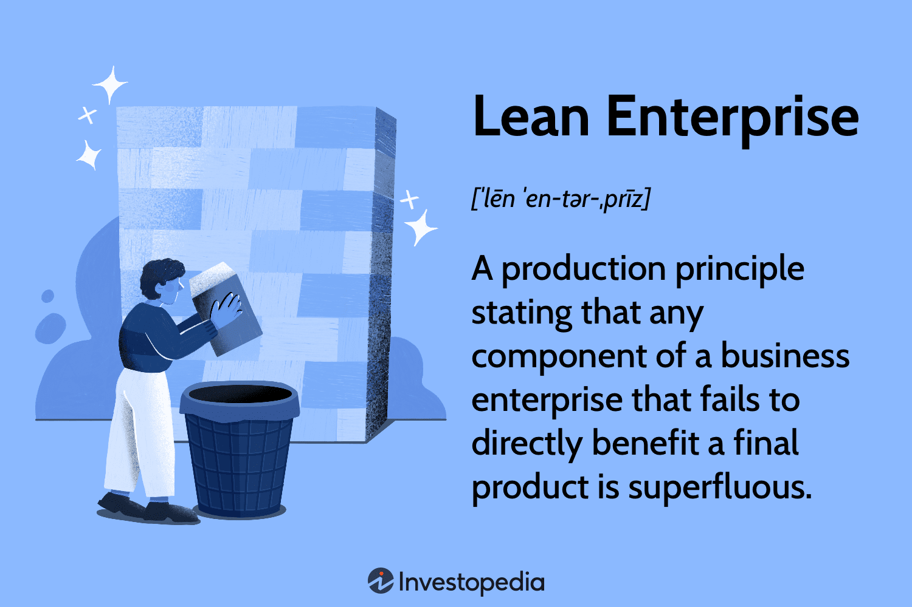

In today's fast-paced business environment, achieving efficient processes and high-quality outcomes are essential for organizational success and competitiveness. To meet these demands, companies increasingly turn to methodologies such as Lean Six Sigma and Lean Enterprise, which focus on reducing waste, improving processes, and enhancing quality. These methodologies originate from established practices in manufacturing and service sectors but have broader applications across various industries.

Lean Six Sigma combines the principles of Lean, which aim to eliminate non-value-added activities, with Six Sigma's focus on minimizing defects and process variability. This integration provides a robust framework for driving quality improvements and operational efficiencies. Meanwhile, the Lean Enterprise approach emphasizes creating customer value by systematically reducing waste and optimizing processes.



In this article, we explore how the core principles and techniques of Lean Six Sigma and Lean Enterprise can align with algorithmic trading strategies to optimize performance and enhance value creation. Algorithmic trading, which relies on complex algorithms and high-speed data analysis to execute trades, presents a unique opportunity to apply Lean methodologies. These strategies can benefit from streamlined operations, reduced latency, and improved accuracy in trade execution.

The discussion will also cover the basic tenets of Lean principles, which include identifying customer value, mapping value streams, ensuring smooth process flow, leveraging pull systems, and striving for perfection. We will explore how these principles, when applied to algorithmic trading, can lead to more efficient and reliable trading operations and unlock new avenues for value-driven improvements.

Finally, understanding the intersection of Lean methodologies and algorithmic trading provides insights into how organizations across industries can harness these approaches for comprehensive process optimization and sustained success.

## Table of Contents

## Understanding Lean Enterprise

Lean Enterprise emphasizes the elimination of non-value-added activities to enhance the overall value of products or services. This methodology is rooted in the principles of the Toyota Production System, which fundamentally focuses on creating value for customers by minimizing waste. Waste in this context, often referred to as "Muda" in Lean terminology, may take several forms, including defects, overproduction, waiting, non-utilized talent, transportation, inventory, motion, and excess processing.

A key component of Lean Enterprise is value stream mapping. This involves a detailed analysis of the flow of materials and information necessary to bring a product or service to the consumer. By mapping out every step in the production process, organizations can identify bottlenecks and inefficiencies, subsequently optimizing these processes to enhance flow and reduce waste. Flow optimization ensures that processes proceed smoothly with minimal interruptions or delays, echoing the Toyota mantra of "making things flow."

Another fundamental principle of Lean Enterprise is just-in-time (JIT) production. JIT aligns raw-material orders from suppliers directly with production schedules, thereby reducing inventory costs and waste. It ensures that resources are only used and goods are only produced as they are needed, allowing for more efficient operations.

Lean Enterprise principles have transcended the automotive industry and have been widely adopted in manufacturing, service, and healthcare sectors. In manufacturing, these principles have enabled factories to produce goods more efficiently by streamlining operations and reducing unnecessary costs. In services, Lean has helped improve customer satisfaction by delivering faster and more reliable service. The healthcare sector has adopted Lean principles to optimize patient care processes, reduce waiting times, and improve overall service quality.

The versatility and scalability of Lean Enterprise principles make them applicable across various industries and business processes, driving continuous improvement and operational excellence.

## Lean Six Sigma: Combining Efficiency and Quality

Lean Six Sigma integrates the waste-reduction methodologies of Lean with the quality improvement principles of Six Sigma. This hybrid approach focuses on enhancing efficiency while simultaneously improving the quality of processes across various sectors. 

Originating from the practices developed by Motorola in the mid-1980s, Six Sigma aims to reduce process defects and variability through a structured, data-informed approach. By statistically analyzing processes, Six Sigma seeks to identify and eliminate causes of errors, thereby optimizing operational efficiency. Lean, on the other hand, emphasizes the systematic elimination of waste and promotes a culture of continuous improvement.

The DMAIC framework—Define, Measure, Analyze, Improve, and Control—serves as the cornerstone of Lean Six Sigma, guiding its process improvement initiatives. Each phase of DMAIC plays a critical role: 

1. **Define**: Identify the problem and project goals from a customer’s perspective.
2. **Measure**: Collect data and establish baselines to quantify the problem.
3. **Analyze**: Investigate and determine the root causes of the defects or inefficiencies.
4. **Improve**: Design and implement solutions to address the root causes.
5. **Control**: Monitor the improvements to ensure sustained results.

Lean Six Sigma’s adaptability makes it applicable beyond manufacturing, extending its benefits to finance, healthcare, and other service-oriented industries. For example, in healthcare, Lean Six Sigma can streamline patient flow and reduce waiting times, while in finance, it enhances transaction processing efficiency and accuracy.

The implementation of Lean Six Sigma is supported by a strong statistical foundation, emphasizing meticulous data analysis and process control. It unites Lean's focus on speed and efficiency with Six Sigma's precision and emphasis on quality, creating a dynamic framework that is suited to rapidly changing business environments.

The use of Lean Six Sigma involves strategic planning and cultural shifts within organizations. Successful adoption demands a commitment to training and leadership support to navigate potential resistance and ensure sustainable improvements. As industries face rising complexities, Lean Six Sigma provides a disciplined approach for organizations looking to optimize operations through both efficiency and quality enhancements.

## Core Lean Principles

The Core Lean Principles provide a foundational approach to process improvement by emphasizing value as defined by the customer, value stream, flow, pull, and perfection. The concept of value is central, focusing on what customers perceive as valuable, with all improvement efforts aligning to enhance this perception. Identifying value requires understanding customer needs and expectations and then aligning processes to meet or exceed these demands efficiently.

Value Stream Mapping is a critical tool that illustrates the detailed steps and processes involved in delivering a product or service. By mapping out the entire value stream, organizations can pinpoint non-value adding activities, such as delays, redundancies, or errors, and target them for elimination. Value Stream Mapping helps create a visual representation of the process, allowing teams to collaboratively identify and address inefficiencies.

Flow ensures that processes run smoothly and efficiently by minimizing interruptions and bottlenecks. In an optimized flow system, work progresses through the various stages seamlessly, reducing waiting times and improving overall process speed. To achieve flow, organizations often restructure workflows, reallocate resources, and automate repetitive tasks wherever possible.

The Pull principle ensures that products or services are produced based on actual demand rather than forecasts. This approach reduces overproduction and inventory costs, leading to a more efficient use of resources. By implementing a pull-based system, businesses can react more flexibly to real-time changes in customer demand.

Finally, perfection is the ultimate goal of Lean, striving for continuous improvements and waste elimination. Organizations practicing Lean consistently seek ways to refine activities and processes, fostering a culture of ongoing enhancement and innovation. The pursuit of perfection aligns with the philosophy of Lean, aiming to deliver maximum value with minimal waste.

```python
# Example Python code to calculate process efficiency

def process_efficiency(value_added_time, total_time):
    """Calculate process efficiency based on value-added time and total process time."""
    try:
        efficiency = (value_added_time / total_time) * 100
        return round(efficiency, 2)
    except ZeroDivisionError:
        return "Total time cannot be zero."

# Example usage
value_added_time = 50  # time spent on activities that add value
total_process_time = 80  # total process time

efficiency = process_efficiency(value_added_time, total_process_time)
print(f"Process Efficiency: {efficiency}%")
```

The adherence to these five principles supports organizations in their quest to optimize processes while maximizing customer satisfaction and operational efficiencies.

## Application of Lean Principles in Algorithmic Trading

Algorithmic trading is a process-driven approach that can significantly benefit from the application of Lean principles. By focusing on streamlining trading processes and minimizing waste, these principles can enhance trading efficiency and accuracy.

Value Stream Mapping (VSM) serves as a critical tool in optimizing order execution paths within [algorithmic trading](/wiki/algorithmic-trading) systems. The mapping process involves charting all the steps required for executing a trade, from order initiation to completion. This comprehensive overview allows for the identification and elimination of redundant or inefficient steps, thereby reducing latency and errors. By minimizing these friction points, trading systems can achieve faster execution times and more reliable outcomes. For instance, employing VSM can highlight suboptimal routing paths in high-frequency trading environments, where milliseconds can make a substantial difference.

Flow, another fundamental Lean principle, focuses on ensuring that trading operations proceed without unnecessary interruptions or bottlenecks. In algorithmic trading, maintaining a consistent and smooth flow is crucial for optimal performance. This can be achieved by adopting a systematic approach to data processing and ensuring that computational resources are adequately allocated. Efficient flow management can prevent delays caused by data congestion or processing queues, thus enhancing the overall speed and responsiveness of trading algorithms.

The Pull principle is about executing trades based on real-time market demand signals rather than pre-determined schedules or predictions. In algorithmic trading, implementing a pull-based approach means configuring systems to react dynamically to current market conditions. By doing so, trades are executed in response to immediate demand, ensuring that transactions align with current market metrics and thereby optimizing returns. This principle also aids in capitalizing on short-lived market opportunities and prevents unnecessary holding costs associated with unsold positions.

Python, a common language in algorithmic trading, can be employed to implement these principles effectively. An example of code enhancing flow might look like this:

```python
import time
import requests

def execute_trade(order_id):
    start_time = time.time()

    # Improved flow: Efficient data retrieval and processing
    data = requests.get(f'https://api.tradingplatform.com/order/{order_id}')
    process_trade_data(data.json())

    # Minimize latency using optimized execution path
    optimize_order_path(order_id)

    execution_time = time.time() - start_time
    print(f"Trade executed in: {execution_time} seconds")

def optimize_order_path(order_id):
    # Logic to optimize the order path using VSM analysis
    pass
```

In summary, the integration of Lean principles such as Value Stream Mapping, Flow, and Pull can drastically optimize algorithmic trading operations. By streamlining processes, reducing waste, and ensuring that trades are responsive to real-time market conditions, these methodologies provide a structured approach to achieving superior trading performance.

## Challenges and Opportunities

Implementing Lean and Lean Six Sigma principles in any organization often encounters resistance due to organizational inertia. This resistance can stem from a reluctance to change entrenched processes and the fear of upsetting the status quo. Employees may be hesitant to adopt new methodologies due to uncertainty or a lack of understanding of the potential benefits. To overcome these challenges, adequate training is essential. Training equips employees with the necessary skills and knowledge to effectively implement Lean and Lean Six Sigma practices, thereby reducing resistance and fostering an environment conducive to change. Furthermore, leadership commitment is crucial in driving these initiatives. Leaders must actively champion the adoption of Lean methodologies, creating a culture that values efficiency and continuous improvement.

The integration of Lean principles with algorithmic trading offers a unique opportunity to enhance trading strategies. Algorithmic trading, which relies heavily on real-time data analytics, can significantly benefit from Lean strategies aimed at waste reduction and process optimization. By applying Lean principles, trading operations can be streamlined to minimize latency and errors, ensuring that order execution paths are efficient and responsive to market conditions. Leveraging real-time data analytics allows for the continuous monitoring and improvement of trading processes, aligning with Lean's focus on continuous improvement.

Continuous improvement is a cornerstone of both Lean and Lean Six Sigma principles. It is essential for maintaining the gains achieved through these methodologies. Adaptability is also critical, as organizations must be willing to refine and evolve their processes to keep pace with changing market dynamics and technological advancements. The combination of continuous improvement and adaptability ensures that organizations can sustain the benefits of Lean methodologies, maintaining a competitive edge and driving long-term success.

Overall, while challenges exist in implementing Lean and Lean Six Sigma principles, the opportunities presented by their integration with algorithmic trading can lead to significant improvements in efficiency and value. Through effective training, strong leadership, and a commitment to continuous improvement, organizations can overcome these challenges and optimize their operations.

## Conclusion

Lean Six Sigma and Lean Enterprise offer robust frameworks for enhancing efficiency and quality across various processes, including algorithmic trading. By integrating Lean principles with algorithmic trading, organizations can achieve more efficient, reliable, and value-driven operations. Lean methodologies emphasize the reduction of waste and the optimization of processes, which can significantly enhance algorithmic trading strategies by improving order flow and execution precision. For example, utilizing Value Stream Mapping can pinpoint inefficiencies in the trade execution path, thereby minimizing latency and errors.

As industries evolve with technological advancements, the integration of Lean methodologies with algorithmic trading is crucial for sustained success. This combination allows for a more adaptive and responsive trading environment, where real-time data analytics can be leveraged to optimize decision-making processes. The use of Lean principles such as 'Pull', which ensures trades are executed in response to actual market demand, enhances the responsiveness of trading systems to market conditions.

Organizations are encouraged to embrace Lean Six Sigma and Lean Enterprise principles for comprehensive process optimization. By fostering a culture of continuous improvement and adaptability, businesses can maintain and enhance competitive advantage in rapidly changing markets. This strategic alignment not only boosts operational efficiency but also ensures long-term sustainability in the face of evolving industry demands.

## References & Further Reading

[1]: Womack, J. P., & Jones, D. T. (1996). ["Lean Thinking: Banish Waste and Create Wealth in Your Corporation."](https://www.researchgate.net/publication/200657172_Lean_Thinking_Banish_Waste_and_Create_Wealth_in_Your_Corporation) Simon & Schuster.

[2]: George, M. L., Rowlands, D., Price, M., & Maxey, J. (2005). ["The Lean Six Sigma Pocket Toolbook: A Quick Reference Guide to 100 Tools for Improving Quality and Speed."](https://books.google.com/books/about/The_Lean_Six_Sigma_Pocket_Toolbook_A_Qui.html?id=NEB-ZzrkQhcC) McGraw-Hill.

[3]: Liker, J. K. (2004). ["The Toyota Way: 14 Management Principles from the World's Greatest Manufacturer."](https://www.researchgate.net/publication/290007864_The_14_principles_of_the_Toyota_way_An_executive_summary_of_the_culture_behind_TPS) McGraw-Hill.

[4]: "Operational Excellence with Lean Six Sigma: A Combination of Data-driven Analytical Algorithms for Quality and Efficiency Improvement" in the [International Journal of Production Economics.](https://www.scirp.org/(S(czeh4tfqyw2orz553k1w0r45))/reference/referencespapers?referenceid=3054045)

[5]: Pyzdek, T., & Keller, P. (2013). ["The Six Sigma Handbook, Fourth Edition."](https://books.google.com/books/about/The_Six_Sigma_Handbook_Fourth_Edition.html?id=K7oBngEACAAJ) McGraw-Hill Education.