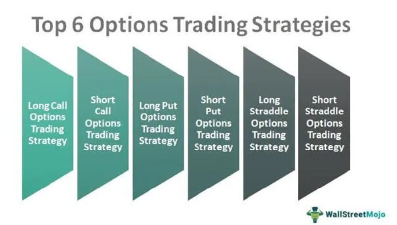

Options trading is an integral component of the financial markets, offering astute investors a range of strategies to navigate diverse economic conditions. Among these strategies, Long-Term Equity Anticipation Securities (LEAP) options have recently gained prominence due to their potential for long-term investment returns. These options are designed as long-term contracts with expiration periods typically stretching from one to three years, thereby offering investors extended horizons for strategic positioning.

LEAP options provide particular advantages by allowing investors to leverage positions with comparatively less capital than would be required to purchase equities outright. This provides an opportunity to assume larger positions while maintaining a level of capital efficiency. In this context, the extended duration of LEAP options allows investors to align their strategies with long-term market trends and financial goals, making them especially appealing for those with a buy-and-hold strategy.



The advent of algorithmic trading, which employs computer programs to execute trades based on predefined criteria, has further revolutionized the landscape of options trading. By integrating algorithmic systems with LEAP options, investors can benefit from a structured, disciplined approach that minimizes emotional biases. This synergy provides tools not only for optimizing entry and exit points but also for the strategic management of positions in accordance with prevailing market conditions.

This article explores how combining options trading strategies with LEAP options and algorithmic trading can be leveraged for improved investment outcomes. By harnessing the calculative rigor of algorithms, it is possible to achieve a disciplined execution of complex options strategies, culminating in enhanced potential returns on investments.

## Table of Contents

## Understanding LEAP Options

LEAP options, standing for Long-Term Equity Anticipation Securities, represent a category of options contracts characterized by extended expiration periods ranging typically from one to three years. These options retain all fundamental characteristics of traditional options, with their primary distinctiveness lying in their longevity, which renders them particularly appealing for investors with a long-term investment outlook.

The essential advantage of LEAP options is their ability to provide substantial leverage. Leverage, in financial terms, allows investors to control a larger amount of an asset with a comparatively smaller capital outlay. In the context of LEAP options, this means an investor can potentially gain exposure to the price movements of a stock or an index without committing to a significant upfront investment as would be required when purchasing the stock outright. This can be expressed as:

$$
\text{Leverage} = \frac{\text{Exposure to underlying asset}}{\text{Initial cost}}
$$

For instance, procuring a LEAP call option could enable an investor to capture upward price movements of the underlying asset while mitigating the initial expenditure traditionally associated with stock purchases.

Moreover, LEAP options offer other benefits inherent to options trading, such as the ability to hedge existing positions against adverse price movements. The extended time frames of LEAPs provide investors with greater flexibility and a wider horizon over which market strategies can be executed.

Furthermore, the pricing of LEAP options adheres to the principles intrinsic to options valuation, such as the Black-Scholes model. This model accounts for factors including the current price of the underlying asset, the strike price of the option, the time to expiration, risk-free interest rates, and the [volatility](/wiki/volatility-trading-strategies) of the underlying asset. It can be represented as follows for a call option:

$$
C = S_0N(d_1) - Xe^{-rt}N(d_2)
$$

where:

- $C$ is the call option price,
- $S_0$ is the current stock price,
- $X$ is the strike price,
- $r$ is the risk-free interest rate,
- $t$ is the time to expiration,
- $N$ is the cumulative distribution function of the standard normal distribution,
- $e$ is the base of the natural logarithm,
- $d_1$ and $d_2$ are intermediate calculations based on the inputs above.

LEAP options therefore present an appealing vehicle for long-term strategic investment, offering both leverage and hedging capability, while allowing investors to capitalize on anticipated directional price movements over an extended period.

## LEAP Options in Investment Strategies

Leveraging LEAP options within a diversified investment strategy can effectively balance risk and reward. As a type of long-term option, LEAP (Long-Term Equity Anticipation Securities) options provide investors with the flexibility to plan for extended horizons, spanning one to three years. This extended timeframe allows investors to ride out short-term market volatility while aiming for longer-term financial goals.

LEAP options are particularly advantageous for buy-and-hold investors who seek to control larger portfolios with reduced capital. Unlike traditional options, which typically expire within a few months, LEAP options grant the investor an opportunity to participate in the long-term movement of the underlying stock or index. This characteristic is conducive to strategies that rely on a prolonged investment period, reducing the need for frequent portfolio adjustments.

Through the prudent use of LEAP options, investors can potentially increase their exposure to stocks and indices while carefully managing risk. By buying LEAP call options, investors can secure the right but not the obligation to purchase a stock at a specified price, known as the strike price, over the long term. This facilitates portfolio expansion without requiring a significant capital outlay compared to purchasing the underlying asset directly.

For example, if an investor anticipates that a particular stock will rise significantly over the next two years, they might purchase a LEAP call option. This approach allows them to control the stock for a fraction of the cost, offering leverage. The leverage effect is defined as the ratio of the option's delta, which measures price change relative to the stock, to the price of the option. Greater leverage can mean higher potential returns on capital, though it can also increase risk.

In terms of risk management, LEAP options can be used to create a protective hedge within an investor’s portfolio. For instance, an investor may use LEAP put options to protect against a downturn in the market. This strategy locks in a minimum selling price for the stock, effectively setting a floor on potential losses. By integrating LEAP options into their investment strategy, investors not only leverage potential stock price increases but also safeguard against significant downturns.

In summary, LEAP options serve as a versatile tool within a diversified investment strategy. They enable investors to gain extensive market exposure with less capital and effectively balance risk and reward through thoughtful planning and implementation.

## Algorithmic Trading and Options

Algorithmic trading involves the use of computer programs to execute trades automatically, based on a set of pre-defined criteria, which grants investors the advantages of speed and efficiency. This method significantly reduces the emotional [factor](/wiki/factor-investing) often associated with trading, as it eliminates the need for human judgment in real-time execution, thereby promoting a more disciplined trading approach.

Integrating [algorithmic trading](/wiki/algorithmic-trading) with Long-Term Equity Anticipation Securities (LEAP) options provides investors the ability to automate strategy execution. LEAP options, which are options contracts with expiration dates ranging from one to three years, allow investors to capitalize on longer-term market movements. By employing algorithmic trading, investors can systematically engage in strategies involving LEAP options without the manual oversight typically required.

One of the primary benefits of combining algorithmic trading with LEAP options is the optimization of entry and [exit](/wiki/exit-strategy) points. Algorithms can analyze vast datasets and identify optimal points in the trade cycle, facilitating more precise trading strategies. For instance, using specific technical indicators or [machine learning](/wiki/machine-learning) models, an algorithm can trigger buy or sell orders when certain market conditions are met.

Algorithms are also capable of sophisticated risk management. By pre-programming various risk parameters, such as stop-loss and take-profit levels, the system can autonomously adjust these metrics based on real-time data. This capability ensures that trading positions are monitored and adjusted promptly, minimizing potential losses and maximizing gains.

Furthermore, algorithmic systems can recognize and capitalize on market trends. By continuously analyzing historical and current data, algorithms can detect patterns and trends that might not be immediately evident to human traders. For example, a Python script utilizing libraries such as NumPy and pandas could efficiently process large volumes of financial data to identify statistically significant patterns:

```python
import numpy as np
import pandas as pd

# Example data
data = pd.Series([random.gauss(0, 1) for _ in range(1000)])
moving_average = data.rolling(window=30).mean()

# Identify buy signals when price is above moving average
buy_signals = (data > moving_average).astype(int).diff().fillna(0)

# Output of buy signals
print(buy_signals[buy_signals == 1])
```

In this example, the algorithm calculates a simple moving average and identifies buy signals when the current price exceeds the moving average, demonstrating a basic strategy that algorithms can execute automatically.

The amalgamation of algorithmic trading with LEAP options enhances an investor's ability to maintain a systematic and unbiased trading plan. This integration equips investors with robust tools to navigate the complexities of financial markets effectively, maintaining a competitive edge in achieving long-term investment goals.

## Advantages of Integrating LEAP Options and Algo Trading

Integrating LEAP (Long-Term Equity Anticipation Securities) options with algorithmic trading presents several advantages that enhance the decision-making process and execution of investment strategies. Firstly, using algorithms for trading LEAP options ensures discipline and consistency, vital for executing strategies without being influenced by emotional biases. This systematic approach allows for the precise and timely execution of trades, following pre-determined criteria without deviation.

The complexity of multi-leg options strategies, which can be challenging to monitor manually, is effectively handled through algorithmic trading. Algorithms can quickly analyze various combinations and permutations of options trades, providing optimal solutions that align with the investor's objectives. This complexity often involves dynamic hedging or adjusting positions based on market conditions, which algorithms can manage with efficiency.

Algorithms have the inherent capability to adapt swiftly to changing market conditions, a crucial factor in optimizing long-term investment strategies. This adaptability is achieved through continuous market data analysis, where algorithms can identify trends and patterns that inform optimal entry and exit points. The speed at which algorithms operate allows for immediate adjustments, ensuring that investment strategies remain aligned with market realities.

For instance, a Python-based algorithm for trading LEAP options might utilize libraries such as NumPy for numerical analysis or Pandas for data manipulation. A simple example could involve setting up conditions for executing trades when specific criteria are met:

```python
import numpy as np
import pandas as pd

# Example conditions for executing LEAP options trades
def execute_trade(current_price, moving_average, trend_strength):
    if current_price > moving_average and trend_strength > threshold:
        return "Buy LEAP Option"
    elif current_price < moving_average and trend_strength < -threshold:
        return "Sell LEAP Option"
    else:
        return "Hold"

# Sample data
current_price = 105
moving_average = 100
trend_strength = 10
threshold = 5

# Trade execution based on conditions
trade_decision = execute_trade(current_price, moving_average, trend_strength)
print(trade_decision)  # Output: "Buy LEAP Option"
```

In this example, the algorithm evaluates the current price relative to a moving average and a measure of trend strength to decide whether to buy, sell, or hold LEAP options. Such automated systems facilitate the handling of complex strategies, ensuring that trades are executed timely and according to the investor's pre-defined strategy.

By leveraging the powerful combination of LEAP options and algorithmic trading, investors can better manage the intricacies of options trading, keep pace with fast-evolving market conditions, and enhance the potential for achieving desired investment outcomes. This approach not only optimizes the performance of trading strategies but also reduces the operational overhead involved in manually monitoring and executing trades.

## Challenges and Considerations

Effective algorithmic trading requires a comprehensive understanding of trading strategies as well as precise programming. This precision is necessary as algorithms execute trades automatically based on pre-defined criteria. If these criteria are not well-defined or if the algorithm is improperly coded, it can lead to significant financial losses. Thus, traders must ensure that their algorithms are thoroughly tested and optimized under varying market conditions.

One of the main challenges in algorithmic trading is the frequent and unpredictable changes in market conditions. Markets are influenced by a multitude of factors including economic indicators, geopolitical events, and even investor sentiment. These factors can lead to sudden shifts, affecting the performance of trading algorithms. As such, traders often need to adjust their algorithms to reflect current market conditions. This might involve [backtesting](/wiki/backtesting) algorithms on historical data to verify their effectiveness across different scenarios.

Another critical consideration in algorithmic trading is [liquidity](/wiki/liquidity-risk-premium). Liquidity refers to the ability to quickly buy or sell assets in the market without causing a significant impact on the asset's price. Low liquidity can lead to slippage, where the actual execution price deviates from the intended price, potentially resulting in financial losses. Traders must ensure their algorithms account for liquidity issues by, for example, setting limits on the [volume](/wiki/volume-trading-strategy) of assets traded or timing trades during periods of higher market activity to reduce slippage risks.

Investors utilizing algorithmic trading need to employ robust risk management techniques. This might involve setting stop-loss limits or developing strategies that protect against extreme market movements. Additionally, they should be aware of the technological infrastructure on which their trading systems depend, as latency and system failures can adversely impact trading performance. By understanding these challenges and incorporating measures to address them, investors can enhance the effectiveness and reliability of their algorithmic trading strategies.

## Conclusion

The strategic use of LEAP (Long-Term Equity Anticipation Securities) options when combined with algorithmic trading offers investors a robust mechanism to enhance their investment portfolios. LEAP options, known for their extended expiration period, provide a structured opportunity to maintain positions over a longer horizon with reduced capital compared to buying the underlying assets. This long-term nature can be effectively leveraged by integrating algorithmic trading, which enhances decision-making through automation and empirical analysis.

Investors utilizing algorithms to manage their LEAP options can better execute strategies with precision and efficiency. Algorithms can be designed to automate the identification of optimal entry and exit points by analyzing market trends and historical data patterns. This systematization minimizes emotional trading decisions and ensures consistency. Moreover, algorithmic strategies can quickly adjust to fluctuating market conditions, a crucial factor considering the unpredictability and complexity of financial markets. This adaptability is essential for sustaining performance and mitigating risks over time.

However, investors must recognize that continuous learning and adaptation are critical components of success in options trading. The financial markets are dynamic, and assumptions that underlie algorithms can become outdated. An investor must regularly review and update their strategies to accommodate new market information and changes in macroeconomic conditions. Additionally, understanding the intricacies of both LEAP options and algorithmic trading is fundamental, as effective implementation requires deep insights into these areas.

In conclusion, while LEAP options and algorithmic trading offer significant advantages, they also require a commitment to ongoing education and technological understanding to navigate ever-evolving market landscapes. This approach ensures the potential for enhanced returns is not only achieved but sustained.

## References & Further Reading

[1]: Haug, E. G. (2006). ["The Complete Guide to Option Pricing Formulas,"](https://www.amazon.com/Complete-Guide-Option-Pricing-Formulas/dp/0786312408) McGraw-Hill.

[2]: Black, F., & Scholes, M. (1973). ["The Pricing of Options and Corporate Liabilities,"](https://www.cs.princeton.edu/courses/archive/fall09/cos323/papers/black_scholes73.pdf) Journal of Political Economy, 81(3), 637-654.

[3]: Hull, J. C. (2014). ["Options, Futures, and Other Derivatives,"](https://www.amazon.com/Options-Futures-Other-Derivatives-9th/dp/0133456315) 9th Edition, Pearson.

[4]: Chan, E. P. (2009). ["Quantitative Trading: How to Build Your Own Algorithmic Trading Business,"](https://github.com/ftvision/quant_trading_echan_book) Wiley Finance.

[5]: Lopez de Prado, M. (2018). ["Advances in Financial Machine Learning,"](https://www.amazon.com/Advances-Financial-Machine-Learning-Marcos/dp/1119482089) Wiley Finance.