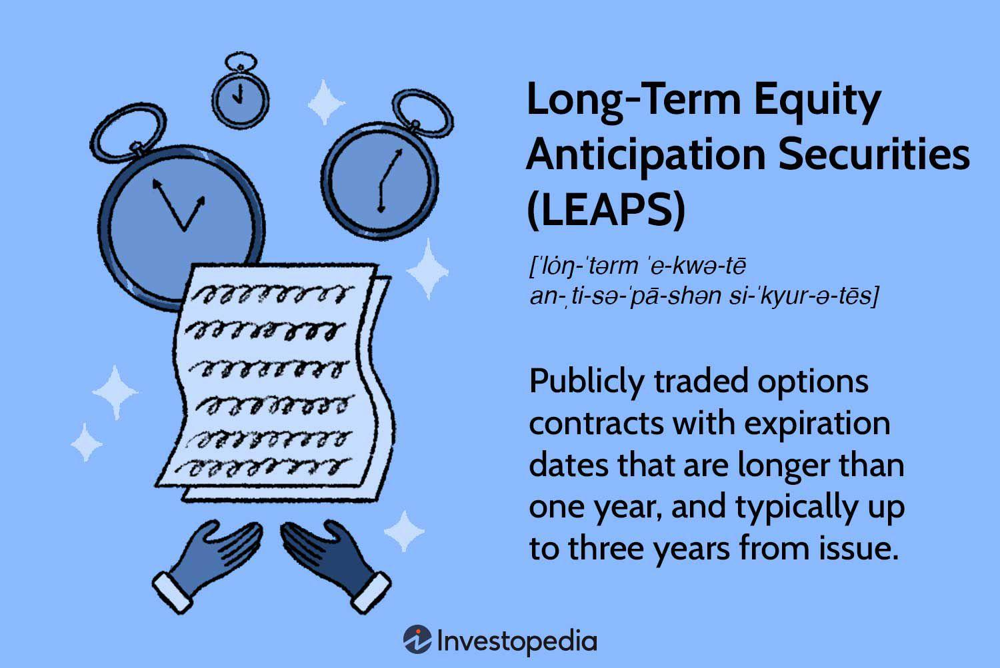

## Table of Contents

## What are LEAPS options?

LEAPS options, or Long-Term Equity AnticiPation Securities, are a type of option that has a longer expiration period than regular options. While regular options usually expire within a year, LEAPS can last up to three years. This longer time frame gives investors more flexibility and time to make decisions about their investments. LEAPS are available for stocks and ETFs, and they come in two types: call options and put options. A call option gives the buyer the right to buy the underlying asset at a set price before the option expires, while a put option gives the buyer the right to sell the underlying asset at a set price before the option expires.

Investors use LEAPS for different reasons. Some use them to bet on the long-term movement of a stock or ETF. For example, if an investor thinks a stock will go up over the next two years, they might buy a LEAPS call option. Others use LEAPS to hedge their portfolios. This means they use LEAPS to protect their investments from potential losses. For instance, if an investor owns a stock and is worried it might go down, they could buy a LEAPS put option to limit their potential loss. The longer duration of LEAPS makes them a useful tool for long-term investment strategies.

## How do LEAPS options differ from standard options?

LEAPS options are different from standard options mainly because of how long they last. Standard options usually expire within a year, but LEAPS can last up to three years. This longer time frame means investors have more time to decide what to do with their investments. It's like having a longer runway to make decisions about buying or selling.

Another difference is how people use LEAPS. Because they last longer, investors often use LEAPS to make long-term bets on stocks or ETFs. For example, if someone thinks a stock will go up over the next few years, they might buy a LEAPS call option. Standard options, on the other hand, are usually used for shorter-term trades. Also, LEAPS can be used to protect investments for a longer time, which is something standard options can't do as effectively because they don't last as long.

## What are the expiration dates for LEAPS options?

LEAPS options last a lot longer than regular options. While regular options usually expire within a year, LEAPS can last up to three years. This means if you buy a LEAPS option, you have more time before you have to decide what to do with it.

The exact expiration dates for LEAPS options can change depending on the stock or [ETF](/wiki/etf-trading-strategies) you're looking at. But generally, they are set for January, which means they expire on the third Friday of January in the years they are set to expire. This gives investors a clear date to plan around.

## What types of LEAPS options are available?

LEAPS options come in two types: call options and put options. A call option gives the buyer the right to buy the underlying stock or ETF at a set price before the option expires. This is useful if you think the price of the stock or ETF will go up over time. On the other hand, a put option gives the buyer the right to sell the underlying stock or ETF at a set price before the option expires. This can be helpful if you think the price will go down and you want to protect your investment.

Both types of LEAPS options are available for a wide range of stocks and ETFs. This means you can find LEAPS options for many different companies and investment funds. Whether you're looking to make a long-term bet on a stock going up with a call option, or you want to hedge against a potential drop with a put option, LEAPS give you the flexibility to plan your investments over a longer period, up to three years.

## How can LEAPS options be used for long-term investment strategies?

LEAPS options can be a great tool for long-term investment strategies because they give you more time to make decisions about your investments. If you think a stock or ETF will go up over the next few years, you can buy a LEAPS call option. This lets you buy the stock at a set price later on, even if the price goes up a lot. It's like having a long-term bet that the stock will do well, without having to pay the full price right away.

On the other hand, if you're worried that a stock you own might go down in value, you can buy a LEAPS put option to protect your investment. This gives you the right to sell the stock at a set price, no matter how low the market price goes. It's a way to limit your losses over a longer period, which is something regular options can't do as well because they don't last as long. Using LEAPS this way can help you feel more secure about your long-term investments.

## What are the advantages of using LEAPS options over other investment vehicles?

LEAPS options have a big advantage because they last longer than regular options. While regular options expire within a year, LEAPS can last up to three years. This longer time frame gives you more time to make decisions about your investments. If you think a stock will go up over the next few years, you can buy a LEAPS call option and wait to see if you're right without rushing. It's like having more time to let your investment grow before you have to do anything.

Another advantage of LEAPS options is that they can help you protect your investments for a longer time. If you're worried that a stock you own might go down, you can buy a LEAPS put option. This gives you the right to sell the stock at a set price, even if the market price drops a lot. Because LEAPS last longer, you can use them to hedge against potential losses over a longer period, which is something you can't do as well with regular options. This makes LEAPS a useful tool for planning your investments over the long term.

## What are the risks associated with LEAPS options?

LEAPS options come with some risks you should know about. One big risk is that they can lose all their value if the stock or ETF doesn't move the way you expect. If you buy a LEAPS call option and the stock price stays the same or goes down, your option might become worthless when it expires. This means you could lose the money you spent on the option. It's like betting on a horse race, but if your horse doesn't win, you don't get your money back.

Another risk is that LEAPS options can be expensive. Because they last longer than regular options, they often cost more. If you're not sure the stock will move enough to make up for the cost, you might end up losing money. Plus, if the stock moves a lot right away, you might have been better off buying a regular option that's cheaper. It's like paying for a longer movie ticket, but if the movie isn't good, you might wish you had saved your money.

## How do you calculate the price of a LEAPS option?

The price of a LEAPS option is figured out using a model called the Black-Scholes model. This model looks at a few things to decide how much the option should cost. It looks at the current price of the stock, how much time is left until the option expires, the strike price of the option, the expected [volatility](/wiki/volatility-trading-strategies) of the stock, and the risk-free [interest rate](/wiki/interest-rate-trading-strategies). The longer the time until the option expires, the more it usually costs because there's more time for the stock to move in your favor.

Another thing that affects the price of a LEAPS option is how much the stock is expected to move around, which is called volatility. If people think the stock will move a lot, the option will cost more because there's a bigger chance it will be worth something when it expires. The price also depends on whether it's a call option or a put option, and where the stock price is compared to the strike price. If the stock is far away from the strike price, the option will be cheaper because it's less likely to end up being worth something.

## What are some common strategies for trading LEAPS options?

One common strategy for trading LEAPS options is called "buy and hold." If you think a stock will go up over the next few years, you can buy a LEAPS call option. This gives you the right to buy the stock at a set price later on, even if the price goes up a lot. It's like making a long-term bet that the stock will do well without having to pay the full price right away. You can hold onto the option for up to three years, waiting to see if your prediction comes true. If the stock price goes above the strike price, you can make money by exercising the option or selling it for a profit.

Another strategy is using LEAPS options to protect your investments, which is called hedging. If you own a stock and you're worried it might go down, you can buy a LEAPS put option. This gives you the right to sell the stock at a set price, no matter how low the market price goes. It's a way to limit your losses over a longer period. Because LEAPS last longer than regular options, you can use them to protect your investments for up to three years. This can give you peace of mind and help you plan your investments over the long term.

A third strategy is called "covered LEAPS." If you own a stock and you want to make some extra money, you can sell LEAPS call options against the stock you own. This is like renting out your stock for a while. You get paid for selling the option, but if the stock price goes above the strike price, you might have to sell your stock at that price. It's a way to earn some income while still holding onto your stock, but it comes with the risk that you might have to give up your stock if the price goes up a lot.

## How does volatility affect LEAPS options?

Volatility is how much a stock's price moves around, and it has a big effect on LEAPS options. If a stock is expected to be very volatile, meaning its price could change a lot, the price of a LEAPS option will be higher. This is because there's a bigger chance the option will be worth something when it expires. For example, if you buy a LEAPS call option and the stock is expected to move a lot, there's a better chance the stock price will go above the strike price, so the option is more valuable.

On the other hand, if a stock is expected to be less volatile, meaning its price doesn't change much, the price of a LEAPS option will be lower. This is because there's a smaller chance the option will be worth something at the end. For instance, if you buy a LEAPS put option and the stock is expected to stay pretty steady, there's less chance the stock price will drop below the strike price, so the option is less valuable. Volatility is a key [factor](/wiki/factor-investing) in deciding how much to pay for a LEAPS option.

## What are the tax implications of trading LEAPS options?

Trading LEAPS options can have different tax effects depending on how you use them. If you hold a LEAPS option for less than a year before selling it or it expires, any profit you make is considered short-term capital gain. This is taxed at the same rate as your regular income, which can be pretty high. On the other hand, if you hold the option for more than a year, any profit you make is considered long-term capital gain. This is usually taxed at a lower rate, which can save you money.

Another thing to think about is if you use LEAPS options to hedge your investments. If you buy a LEAPS put option to protect a stock you own and you end up selling the stock at a loss, you might be able to use that loss to lower your taxes. This is called tax loss harvesting. But, the rules around this can be tricky, so it's a good idea to talk to a tax professional to make sure you're doing everything right and taking advantage of all the tax benefits you can.

## How can LEAPS options be integrated into a diversified investment portfolio?

LEAPS options can be a useful part of a diversified investment portfolio because they give you more time to make decisions about your investments. If you think a stock or ETF will go up over the next few years, you can buy a LEAPS call option. This lets you bet on the stock without having to buy it right away. It's like having a long-term ticket to buy the stock at a set price later on. By adding LEAPS call options to your portfolio, you can spread out your investments and not put all your money into one thing. This can help balance out your risks and give you a chance to make money in different ways.

Another way to use LEAPS options in a diversified portfolio is to protect your investments. If you own a stock and you're worried it might go down, you can buy a LEAPS put option. This gives you the right to sell the stock at a set price, no matter how low the market price goes. It's like having insurance for your stock. By using LEAPS put options, you can protect your investments over a longer time than with regular options. This can help you feel more secure about your portfolio and make sure you're covered if the market doesn't go the way you expect.

## References & Further Reading

[1]: Bloomberg. (n.d.). ["Introduction to Options."](https://www.library.nd.edu/event/introduction-to-bloomberg-terminal-navigation-and-functions-2024-09-16/)

[2]: Cboe. (n.d.). ["LEAPS® Options"](https://www.cboe.com/tradable_products/equity_indices/leaps_options/)

[3]: Hull, J. C. (2017). ["Options, Futures, and Other Derivatives"](https://books.google.com/books/about/Options_Futures_and_Other_Derivatives_eB.html?id=2iopDwAAQBAJ) (9th ed.). Pearson.

[4]: Reuters. (n.d.). ["Options Trading for Beginners."](https://www.stockbrokers.com/education/how-to-trade-options)

[5]: Wilmott, P. (2006). ["Paul Wilmott Introduces Quantitative Finance"](https://www.wiley.com/en-us/Paul+Wilmott+Introduces+Quantitative+Finance,+2nd+Edition-p-9781118836798) (2nd ed.). Wiley.

[6]: Yan, X. & Zhao, C. (2015). ["A Bayesian Approach to Modeling Trading Strategies."](https://onlinelibrary.wiley.com/doi/abs/10.1002/aenm.201502175) Journal of Financial Econometrics. 