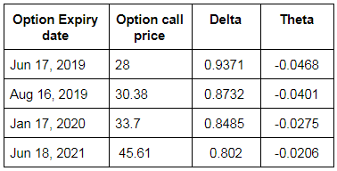

In the rapidly evolving world of algorithmic trading, options strategies like LEAP options have gained significant popularity. Long-Term Equity Anticipation Securities (LEAPs) provide investors the ability to position themselves for future market movements with longer expiration horizons exceeding one year. This feature makes LEAP options particularly appealing in the context of algo trading, where long-term market trends can be systematically exploited for potential profit.

LEAP options stand apart due to their extended duration, contrasting with the limited lifespan of standard options. This allows traders and algorithmic systems to engage in strategies that span over longer periods, potentially enhancing the capacity to ride out short-term volatility while capturing overarching market trends. LEAP options are not only instruments for speculation but also serve as vital tools for risk management, offering a blend of speculative opportunity and hedging capacity that aligns perfectly with the strategic objectives often pursued by algorithmic traders. 



Utilizing LEAP options in algorithmic trading to capitalize on long-term market trends involves a nuanced understanding of financial markets and a strategic framework that aligns with these extended contracts. The possibility of entering positions with lower capital requirements compared to outright stock purchases further underscores their attractiveness. As such, this article will explore LEAP options, examining their characteristics and functionality, and how they can be systematically applied in algorithmic trading models. The aim is to equip traders and developers with the insights needed to integrate LEAP options effectively into sophisticated trading algorithms.

## Table of Contents

## What are LEAP Options?

LEAPs, or Long-Term Equity Anticipation Securities, are sophisticated financial instruments offering an extended duration compared to typical options. These options have expiration dates exceeding one year, typically stretching up to three years. LEAPs present a unique avenue for investors and traders to participate in the equity markets, offering distinct strategic benefits tailored for long-term market engagements.

One of the key advantages of LEAP options is their capacity to facilitate longer-term market participation with potentially lower initial capital outlays than buying shares outright. This is especially beneficial for traders seeking exposure to the market without a significant upfront investment. By purchasing LEAP options, investors can control larger positions for a fraction of the cost, allowing for capital allocation flexibility across a diversified portfolio.

Moreover, LEAPs offer investors a tool to manage risk effectively while speculating on future price movements. Through the use of these options, traders can establish positions that benefit from anticipated price increases or decreases over a prolonged timeframe. This is crucial in strategies where market trends are expected to evolve over months or even years. The intrinsic value associated with LEAP options also accumulates as the underlying asset moves in the anticipated direction, potentially leading to significant returns.

The extended duration of LEAP options mitigates the risks associated with short-term [volatility](/wiki/volatility-trading-strategies), providing a cushion against temporary market fluctuations. This makes them particularly attractive for traders focusing on long-term trends or macroeconomic developments that are expected to influence market conditions. LEAPs, therefore, present a balanced approach, enabling traders to harness long-term growth opportunities while maintaining a defined risk structure through the predetermined expiration periods.

In conclusion, LEAP options are versatile financial instruments that allow investors to align their strategies with long-term market expectations. They offer the dual benefits of lower capital requirements compared to direct stock purchases and the ability to carefully manage risk through strategic positioning over extended timeframes.

## Benefits of Using LEAPs in Algo Trading

In [algorithmic trading](/wiki/algorithmic-trading), Long-Term Equity Anticipation Securities (LEAPs) provide significant advantages by facilitating long-term strategic planning and enabling automated execution. One of the primary benefits of using LEAPs is their ability to reduce capital exposure. This is achieved by allowing traders to define risk over extended periods, which is particularly beneficial for algorithms designed for long-term investments. The extended expiration period of LEAPs means that traders can plan for market trends that unfold over months or even years, thus aligning their investment horizons with their trading strategies.

Moreover, LEAPs offer flexibility in creating multi-leg strategies. This flexibility allows traders to employ combinations of options to hedge or speculate on the market movements effectively. For instance, combining LEAPs with shorter-term options can create strategies that respond to both immediate and future market conditions. This versatility is particularly useful in algorithmic trading, where automated systems can be programmed to execute complex strategies involving multiple legs.

LEAPs also enable the construction of strategies that balance potential returns with controlled risk exposure. For example, by purchasing a LEAP call option while simultaneously selling a near-term call option, traders can create a calendar spread strategy. Such strategies can be easily automated within an algorithmic trading system using programming languages like Python, which supports libraries and frameworks specifically designed for options trading. Here's a simple example of how Python can be used to calculate potential outcomes of a LEAP-based strategy:

```python
import numpy as np

# Define parameters
initial_stock_price = 100
leap_call_strike = 110
short_term_call_strike = 105
time_to_expiration_leap = 2  # in years
risk_free_rate = 0.02

# Black-Scholes formula components
def black_scholes_call_price(S, K, T, r, sigma):
    d1 = (np.log(S / K) + (r + 0.5 * sigma**2) * T) / (sigma * np.sqrt(T))
    d2 = d1 - sigma * np.sqrt(T)
    call_price = S * norm.cdf(d1) - K * np.exp(-r * T) * norm.cdf(d2)
    return call_price

# Assume some volatility for calculation
volatility = 0.25

leap_call_price = black_scholes_call_price(initial_stock_price, leap_call_strike, time_to_expiration_leap, risk_free_rate, volatility)
short_term_call_price = black_scholes_call_price(initial_stock_price, short_term_call_strike, 0.5, risk_free_rate, volatility)

# Print calculated option prices
print(f"LEAP Call Price: {leap_call_price}")
print(f"Short-term Call Price: {short_term_call_price}")
```

In this Python example, the `black_scholes_call_price` function calculates the theoretical price of a call option using the Black-Scholes formula given parameters such as stock price, strike price, time to expiration, risk-free rate, and volatility. This type of analysis and automation is key to efficiently executing LEAP-based strategies within algorithmic trading systems.

Overall, LEAPs present a compelling choice in algorithmic trading by providing a mechanism to define long-term risk, reduce capital exposure, and execute sophisticated multi-leg strategies, aligning with the strategic requirements of automated trading systems.

## Popular LEAP Options Strategies

There are several strategies for employing LEAPs in trading, each tailored to different market outlooks and risk appetites.

- **Buying LEAP Calls**: This strategy involves purchasing call options with long-term expiration dates, spanning more than one year. Investors deploy this approach when they anticipate significant price growth in an underlying asset over an extended period. A key advantage lies in the ability to leverage potential price increases while limiting the initial capital required. For instance, purchasing a LEAP call gives the holder the right, but not the obligation, to buy the underlying asset at a specified strike price before the expiration date, thereby benefiting from price appreciation with a capped initial investment.

- **Buying LEAP Puts**: Employing LEAP puts is advantageous for traders seeking to hedge against potential declines in an existing investment or speculating on downward market movements. By buying a LEAP put, an investor obtains the right to sell the underlying asset at a predetermined price far in advance. This strategy can serve as a long-term insurance policy, protecting the portfolio from significant downturns without committing funds to short-term market activities.

- **Bull Call Spread Strategy**: This sophisticated approach combines buying a LEAP call while simultaneously selling another LEAP call with the same expiration but a higher strike price. The bull call spread strategy effectively reduces the net premium paid by offsetting the cost of the purchased call with the premium received from the sold call. This method aims to enhance the trader's risk-reward ratio by setting a maximum potential profit if the asset closes above the higher strike price, while simultaneously defining potential losses to the net premium spent.

These strategies illustrate how LEAP options can be tailored to match various investment goals, ranging from capitalizing on long-term asset appreciation to guarding against market declines, ultimately providing traders with innovative ways to manage their risk and reward profiles over extended timeframes.

## Implementing LEAP Options in Algo Trading Systems

Setting up a LEAP (Long-Term Equity Anticipation Securities) strategy in an automated trading system requires careful selection of options contracts, which are determined by their expiration dates and strike prices. These choices should align with the overarching goals and parameters of the trading algorithm. The implementation involves several key components to enhance the strategy's effectiveness and ensure its alignment with long-term investment objectives.

Algorithms tasked with executing LEAP strategies often rely on historical data and predictive analytics to identify optimal entry and [exit](/wiki/exit-strategy) points. Historical data allows the algorithm to analyze past market trends and price movements to forecast potential future scenarios. Predictive analytics can leverage [machine learning](/wiki/machine-learning) models to predict asset price directionality, enabling more informed decision-making. For example, a simple Python-based linear regression model can be used to predict future prices:

```python
import numpy as np
from sklearn.linear_model import LinearRegression

# Sample historical price data
X = np.array([[1], [2], [3], [4], [5]])  # Time periods
y = np.array([100, 105, 110, 108, 115])  # Prices

# Create and train the model
model = LinearRegression().fit(X, y)

# Predict future price
future_time_period = np.array([[6]])
predicted_price = model.predict(future_time_period)
print(predicted_price)
```

Backtesting is vital in assessing how the LEAP strategy would have performed in historical contexts. This process involves simulating the strategy against historical data to evaluate its profitability and risk. Through [backtesting](/wiki/backtesting), traders can identify weaknesses or potential improvements in the algorithm, reducing the risk of unforeseen losses in actual trading. Additionally, it helps in understanding the impact of different market conditions on the LEAP strategy's performance.

Continuous evaluation is equally important, as market conditions and asset performance can change over time. It ensures the strategy remains aligned with current market dynamics and adjusts appropriately to new patterns or anomalies. This is often achieved through regular updates to the predictive models and recalibration of the algorithm as new data becomes available.

By integrating predictive analytics, backtesting, and continuous evaluation, traders can effectively implement LEAP options in algorithmic trading systems. This approach not only enhances the strategic application of LEAPs but also helps in maximizing returns while managing risks over extended investment horizons.

## Potential Limitations and Considerations

LEAP options, despite their advantages for long-term strategic trading, present certain limitations and considerations that traders must account for. A notable feature of LEAPs is their higher premium costs, attributable to their extended expiration periods. This extended duration provides increased exposure to market volatility, making LEAPs more expensive than standard short-term options. As a result, traders need to carefully assess these costs against potential returns when formulating their strategies.

Time decay, denoted by the Greek term theta (θ), represents the erosion of an option's value as it approaches expiry. For LEAPs, time decay is relatively slow in comparison to short-term options, but as expiration comes closer, it can exert a significant impact on the option's market value. Consequently, traders must continuously monitor and manage the timing of their positions to mitigate unwanted depreciation.

Another crucial consideration is the absence of dividends for option holders. While dividends can influence underlying stock prices, LEAP holders do not benefit directly from dividend payouts. If a LEAP option strategy is being constructed, it is essential to consider the ex-dividend dates and potential impacts on the underlying asset valuation, thereby affecting the intrinsic value of the option.

Market conditions play a pivotal role in the profitability of LEAP strategies. Factors such as economic indicators, changes in interest rates, and broader market trends can alter the anticipated performance of options over the extended time frame. Additionally, transaction costs, including brokerage fees and spreads, can accumulate significantly over time, reducing net returns. Therefore, optimizing the cost-efficiency of trading activities is critical to maintaining profitability.

Proper risk management strategies are vital to counteract these limitations. Utilizing predictive analytics and regular evaluation of LEAP positions can aid in adjusting strategies to suit evolving market conditions. Continuous assessment of transaction costs and careful management of entry and exit points will further enhance the strategic use of LEAP options in algorithmic trading systems.

## Conclusion

LEAP options, or Long-Term Equity Anticipation Securities, provide an appealing alternative to conventional stock investments and short-term options within the context of algorithmic trading. By offering defined risk parameters and reduced capital commitments, LEAPs enable traders to strategize more flexibly over extended periods. This characteristic is particularly useful for algorithms designed to capture long-term market trends and optimize risk-return profiles.

To effectively exploit LEAP options, it is crucial for traders to comprehend their intricacies. Understanding factors such as time decay and market volatility, which significantly impact LEAPs, can enhance decision-making and strategy formulation. LEAPs’ extended expiration periods make them conducive to multi-leg strategies, which can be fine-tuned through algorithms to balance risk and return effectively.

In algorithmic trading, robust modeling and analytics are essential to harness the advantages of LEAP options. By incorporating historical market data and predictive analytics, traders can automate entry and exit strategies that maximize the potential benefits of LEAPs. For instance, employing machine learning algorithms to identify patterns in trading data can yield insights that inform the execution of LEAP-based strategies.

Furthermore, backtesting plays a vital role in ensuring that these strategies are both effective and profitable. By simulating LEAP strategies against historical market conditions, traders can refine their approaches and anticipate potential challenges. Continuous evaluation and adjustments based on real-time data are equally important, as they help maintain the relevance and accuracy of the trading models.

In conclusion, LEAP options offer traders a comprehensive toolset for navigating the complex landscape of algorithmic trading. When leveraged with an understanding of their unique characteristics and supported by robust algorithms, LEAPs have the potential to significantly enhance long-term trading strategies, providing a valuable complement to traditional investment approaches.

## References & Further Reading

[1]: Bloomberg. (n.d.). ["Introduction to Options."](https://www.library.nd.edu/event/introduction-to-bloomberg-terminal-navigation-and-functions-2024-09-16/)

[2]: Cboe. (n.d.). ["LEAPS® Options"](https://www.cboe.com/tradable_products/equity_indices/leaps_options/)

[3]: Hull, J. C. (2017). ["Options, Futures, and Other Derivatives"](https://books.google.com/books/about/Options_Futures_and_Other_Derivatives_eB.html?id=2iopDwAAQBAJ) (9th ed.). Pearson.

[4]: Reuters. (n.d.). ["Options Trading for Beginners."](https://www.stockbrokers.com/education/how-to-trade-options)

[5]: Wilmott, P. (2006). ["Paul Wilmott Introduces Quantitative Finance"](https://www.wiley.com/en-us/Paul+Wilmott+Introduces+Quantitative+Finance,+2nd+Edition-p-9781118836798) (2nd ed.). Wiley.

[6]: Yan, X. & Zhao, C. (2015). ["A Bayesian Approach to Modeling Trading Strategies."](https://onlinelibrary.wiley.com/doi/abs/10.1002/aenm.201502175) Journal of Financial Econometrics. 