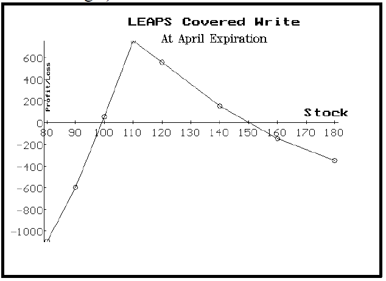

## Table of Contents

## What are LEAPS and how do they differ from standard options?

LEAPS, or Long-Term Equity Anticipation Securities, are options contracts that have expiration dates much further into the future than standard options. While standard options usually expire within a year, LEAPS can have expiration dates up to three years away. This longer time frame allows investors to make longer-term bets on the direction of a stock or index without having to roll over shorter-term options repeatedly.

The main difference between LEAPS and standard options is the time until expiration. Because LEAPS have more time until they expire, they are generally more expensive than standard options. This higher cost is due to the increased time value, which is the portion of the option's price that comes from the potential for the underlying stock to move in the desired direction over a longer period. However, this longer duration can be beneficial for investors who want to hedge their portfolios or speculate on long-term trends without the need for frequent adjustments.

## What is covered call writing and how does it work?

Covered call writing is a strategy where you own a stock and then sell someone else the right to buy that stock from you at a set price before a certain date. This is called selling a call option. The price at which the stock can be bought is called the strike price, and the date by which it must be bought is the expiration date. When you sell the call option, you get money right away, which is called the premium. This strategy is called "covered" because you already own the stock, so you can deliver it if the buyer decides to exercise the option.

The main goal of covered call writing is to earn extra income from the premiums while still holding onto the stock. If the stock price stays below the strike price until the expiration date, the option will expire worthless, and you keep the premium and the stock. However, if the stock price goes above the strike price, the buyer might exercise the option, and you'll have to sell your stock at the strike price. This means you might miss out on further gains if the stock keeps going up, but you still get to keep the premium and the profit from selling the stock at the strike price.

## How can LEAPS be used in covered call writing strategies?

LEAPS can be a useful tool in covered call writing strategies because they let you hold onto a stock for a longer time. When you buy a LEAPS call option, you have the right to buy the stock at a certain price for up to three years. This means you can use the LEAPS as a way to own the stock without actually buying it right away. Then, you can sell shorter-term call options against your LEAPS, just like you would with actual stock. This can help you earn money from the premiums of the shorter-term calls while still having a long-term position in the stock.

Using LEAPS in this way can be a good strategy if you think the stock will go up over time but you want to make some extra money along the way. If the stock price stays below the strike price of the shorter-term calls you sell, those options will expire worthless, and you get to keep the premiums. If the stock price goes above the strike price, you might have to sell the stock at that price, but you can still buy it back using your LEAPS if you want to keep your position. This way, you can make money from the premiums and still have a chance to benefit from the stock's long-term growth.

## What are the benefits of using LEAPS in covered call writing?

Using LEAPS in covered call writing can help you make money over a longer time. When you buy a LEAPS call option, you get to hold onto a stock for up to three years without buying it right away. This means you can sell shorter-term call options against your LEAPS and earn money from the premiums. If the stock price stays below the strike price of the shorter-term calls, those options will expire worthless, and you get to keep the premiums. This can be a good way to make extra money while you wait for the stock to go up over time.

Another benefit is that you can keep your long-term position in the stock even if the shorter-term calls are exercised. If the stock price goes above the strike price of the shorter-term calls, you might have to sell the stock at that price. But since you have the LEAPS, you can buy the stock back at the LEAPS strike price if you want to keep your position. This way, you don't miss out on the stock's long-term growth. Using LEAPS in covered call writing can give you more flexibility and help you make money from both the premiums and the stock's potential increase in value over time.

## What are the risks associated with using LEAPS in covered call writing?

Using LEAPS in covered call writing can be risky because the stock might not go up as much as you expect. If the stock stays the same or goes down, the LEAPS you bought might lose value. This means you could lose money on the LEAPS even if you make some money from selling the shorter-term call options. Also, if the stock goes up a lot, you might have to sell it at the strike price of the shorter-term calls, which could be lower than the market price. This means you might miss out on bigger gains if the stock keeps going up.

Another risk is that LEAPS are more expensive than regular options because they last longer. If you spend a lot of money on LEAPS and the stock doesn't move in your favor, you could lose a big part of your investment. Also, selling shorter-term call options against your LEAPS means you have to keep track of them and decide what to do when they expire or get exercised. This can be hard and might lead to mistakes if you're not careful. So, while using LEAPS in covered call writing can help you make money, it also comes with risks that you need to think about carefully.

## How do you select the appropriate LEAPS for covered call writing?

When [picking](/wiki/asset-class-picking) the right LEAPS for covered call writing, you need to think about how long you want to keep your position in the stock. LEAPS can last up to three years, so you should choose one that fits your long-term plans. You also need to look at the strike price of the LEAPS. If you think the stock will go up a lot, you might want to buy a LEAPS with a higher strike price. This way, you can buy the stock at a good price if you need to, and you might make more money if the stock goes up a lot.

Another thing to think about is the cost of the LEAPS. They are more expensive than regular options because they last longer. You need to make sure you can afford them and that the potential gains from selling shorter-term call options against them are worth it. Also, you should look at how much the stock moves around. If the stock is very volatile, you might want to pick a LEAPS that gives you more room to make money from the shorter-term calls. By thinking about these things, you can choose the best LEAPS for your covered call writing strategy.

## What are the tax implications of using LEAPS in covered call writing?

When you use LEAPS in covered call writing, you need to think about taxes. If you sell a shorter-term call option and it expires worthless, the money you get from the premium is usually taxed as ordinary income. But if the call option gets exercised and you have to sell the stock, any profit you make from selling the stock could be taxed as a capital gain. The tax rate for capital gains depends on how long you held the stock before selling it. If you held it for more than a year, it's a long-term capital gain, which usually has a lower tax rate than short-term gains.

Also, when you buy a LEAPS call option, it's seen as an investment. If you sell the LEAPS later for more than you paid, that profit is also a capital gain. But if the LEAPS loses value and you sell it for less than you paid, you might be able to use that loss to lower your taxes. It's important to keep track of all these things because they can affect how much tax you have to pay. Talking to a tax advisor can help you understand all the tax rules and plan your strategy better.

## How does the time decay of LEAPS affect covered call writing strategies?

Time decay is when an option loses value as it gets closer to its expiration date. For LEAPS, which can last up to three years, time decay happens more slowly than for regular options. This slower time decay can be good for covered call writing because it means the LEAPS you buy will keep more of their value over time. When you sell shorter-term call options against your LEAPS, those shorter-term options will lose value faster. This means you can keep selling new shorter-term calls and [earning](/wiki/earning-announcement) money from the premiums while your LEAPS stay valuable.

However, time decay can still affect your strategy. If the stock price doesn't move up as much as you hoped, the LEAPS might lose value over time, even if it's slower than regular options. This means you could lose money on the LEAPS if the stock doesn't perform well. So, while the slower time decay of LEAPS can help you earn more from selling shorter-term calls, you need to keep an eye on the stock's price and be ready to adjust your strategy if things don't go as planned.

## Can you provide a step-by-step example of setting up a LEAPS covered call?

Let's say you think a company called ABC stock is going to go up over the next two years. You want to make some money while you wait, so you decide to use LEAPS in a covered call writing strategy. First, you buy a LEAPS call option for ABC stock with a strike price of $50 and an expiration date two years from now. This LEAPS costs you $10 per share, so for 100 shares, you pay $1,000. Now, you have the right to buy ABC stock at $50 per share anytime in the next two years.

Next, you start selling shorter-term call options against your LEAPS. Let's say the current price of ABC stock is $55, and you sell a call option with a strike price of $60 that expires in one month. You get a premium of $2 per share for this call option, so you earn $200 for selling 100 call options. If ABC stock stays below $60 by the expiration date, the call option expires worthless, and you keep the $200. You can then sell another call option for the next month and keep earning money from the premiums. If ABC stock goes above $60, the buyer might exercise the call option, and you'll have to sell the stock at $60. But since you have the LEAPS, you can buy the stock back at $50 if you want to keep your position in ABC stock.

## How do market conditions influence the effectiveness of LEAPS in covered call writing?

Market conditions can really change how well LEAPS work in covered call writing. If the market is going up slowly and steadily, LEAPS can be a good choice. You can buy a LEAPS and then sell shorter-term call options against it to make money from the premiums. As long as the stock price stays below the strike price of the shorter-term calls, you keep the money from the premiums. The slow growth of the market means your LEAPS keep their value over time, and you can keep selling new calls to earn more money.

But if the market is very up and down or going down, using LEAPS in covered call writing can be riskier. If the stock price drops a lot, your LEAPS might lose value even though they have a long time until they expire. This means you could lose money on the LEAPS, even if you make some money from selling the shorter-term calls. If the market is very volatile, the shorter-term calls might get exercised more often, making it harder to keep your position in the stock. So, you need to watch the market closely and be ready to change your strategy if things get too risky.

## What advanced strategies can be employed with LEAPS in covered call writing?

One advanced strategy with LEAPS in covered call writing is called the "LEAPS collar." In this strategy, you buy a LEAPS call option on a stock you own, and then you sell shorter-term call options against it, just like in regular covered call writing. But you also buy a shorter-term put option on the same stock to protect against a big drop in the stock price. The put option gives you the right to sell the stock at a certain price if it goes down too much. This way, you can earn money from the premiums of the shorter-term calls while also having some protection if the stock price falls.

Another strategy is called "rolling up and out." If the stock price goes up a lot and the shorter-term call options you sold get exercised, you can use your LEAPS to buy the stock back at a lower price. Then, you can sell new call options with a higher strike price and a later expiration date. This lets you keep earning money from the premiums while also taking advantage of the stock's upward movement. By rolling up and out, you can keep your long-term position in the stock and still make money from the shorter-term calls.

## How can one monitor and adjust a LEAPS covered call position over time?

To keep your LEAPS covered call position working well, you need to watch the stock price and the market every day. If the stock price stays below the strike price of the shorter-term calls you sold, those options will expire worthless, and you get to keep the money from the premiums. But if the stock price goes up a lot and gets close to or above the strike price, you might need to make a change. You can buy back the shorter-term calls before they get exercised if you want to keep your stock. Or, if the calls do get exercised, you can use your LEAPS to buy the stock back at a lower price and then sell new calls with a higher strike price.

Over time, you might need to adjust your strategy based on how the stock and the market are doing. If the stock price goes down a lot, your LEAPS might lose value, so you could decide to sell them and cut your losses. Or, if the stock is going up slowly and steadily, you can keep selling new shorter-term calls to make more money from the premiums. It's important to stay flexible and be ready to change your plan if the market gets too risky or if the stock doesn't move the way you expected. By keeping a close eye on things and making smart adjustments, you can make the most of your LEAPS covered call strategy.

## References & Further Reading

[1]: Fabozzi, F. J., Kolm, P. N., Pachamanova, D. A., & Focardi, S. M. (2007). ["Robust Portfolio Optimization and Management."](https://onlinelibrary.wiley.com/doi/book/10.1002/9781119202172) Wiley Finance.

[2]: Cottle, J., Murray, G. H., & Block, F. (1989). ["Graham and Dodd's Security Analysis."](https://www.amazon.com/Graham-Dodds-Security-Analysis-1989-08-01/dp/B01K2DYDC0) McGraw-Hill Education.

[3]: Natenberg, S. (1994). ["Option Volatility and Pricing: Advanced Trading Strategies and Techniques."](https://www.amazon.com/Option-Volatility-Pricing-Strategies-Techniques/dp/0071818774) McGraw-Hill Education.

[4]: Black, F., & Scholes, M. (1973). ["The Pricing of Options and Corporate Liabilities."](https://www.cs.princeton.edu/courses/archive/fall09/cos323/papers/black_scholes73.pdf) Journal of Political Economy, 81(3), 637-654.

[5]: Hull, J. C. (2014). ["Options, Futures, and Other Derivatives."](https://elibrary.pearson.de/book/99.150005/9781292410623) Pearson.

[6]: Haug, E. G. (2007). ["The Complete Guide to Option Pricing Formulas."](https://archive.org/details/completeguidetoo0000haug) McGraw-Hill Education.

[7]: Chan, E. (2009). ["Quantitative Trading: How to Build Your Own Algorithmic Trading Business."](https://github.com/ftvision/quant_trading_echan_book) Wiley Trading.