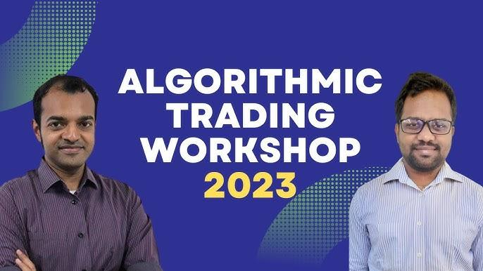

## Table of Contents

## What is algorithmic trading and why is it important?

Algorithmic trading is when computers use math formulas to buy and sell stocks and other financial things quickly. Instead of people making these decisions, a computer program does it automatically. The program follows a set of rules that tell it when to trade, how much to trade, and what to trade. This can happen very fast, sometimes in just a few seconds.

This kind of trading is important because it can make trading more efficient and less emotional. Computers don't get scared or excited like people do, so they can stick to the plan better. Also, because computers can handle a lot of information very quickly, they can find good trading opportunities that people might miss. This can help make the market work better and can save time and money for people who use these programs.

## What are the basic concepts a beginner should know before starting algorithmic trading?

Before you start algorithmic trading, it's important to understand a few basic ideas. First, you need to know about financial markets. These are places where people buy and sell things like stocks, bonds, and commodities. You should learn how these markets work, including what makes prices go up and down. Another key concept is programming. Algorithmic trading uses computer programs to make trades, so you'll need to learn at least one programming language, like Python, to write these programs. It's also helpful to understand basic math and statistics, as these are used to create the trading rules or algorithms.

Another important thing to know is risk management. This means understanding how much money you can lose and setting rules to protect yourself. For example, you might decide to stop trading if you lose a certain amount of money. It's also crucial to test your algorithms before using real money. This can be done with something called [backtesting](/wiki/backtesting), where you use historical data to see how your algorithm would have performed in the past. Lastly, you should be aware of the costs involved, like fees for trading and the cost of the technology you'll need. Knowing these basics will help you start [algorithmic trading](/wiki/algorithmic-trading) with a better understanding of what you're getting into.

## How can someone set up their first algorithmic trading strategy?

To set up your first algorithmic trading strategy, start by choosing a simple idea for your trading rule. This could be something like buying a stock when its price goes up by a certain percentage and selling it when it goes down by another percentage. Once you have your idea, you need to write it into a computer program using a language like Python. There are many online tutorials and resources that can help you learn how to do this. After writing your program, you'll need to connect it to a trading platform, which is a website or software where you can buy and sell stocks. Many platforms offer ways to link your program to their system, so look for one that supports algorithmic trading.

Next, before using real money, it's very important to test your strategy. You can do this through backtesting, which means running your program on old market data to see how it would have worked in the past. This can help you see if your idea is good or if you need to make changes. After backtesting, you might want to try paper trading, where you use your program in real-time but with fake money. This lets you see how your strategy works in the current market without risking any real money. Once you're happy with how your strategy performs, you can start using it with a small amount of real money, always keeping an eye on how it's doing and being ready to make adjustments if needed.

## What programming languages are commonly used in algorithmic trading?

The most common programming language used in algorithmic trading is Python. Python is popular because it's easy to learn and has lots of tools that help with trading. For example, there are libraries like Pandas for handling data and NumPy for doing math. Also, many trading platforms support Python, making it easier to connect your trading programs to the market.

Another language often used is C++. C++ is faster than Python, which can be important if you want to make very quick trades. It's more complex to learn, but it's good for building trading systems that need to handle a lot of information very quickly. Some traders also use R for its strong data analysis tools, though it's less common for actual trading.

Lastly, Java is sometimes used in algorithmic trading, especially in big financial companies. Java is good for building large, stable systems. It's not as easy to learn as Python, but it's very reliable, which is important when you're dealing with a lot of money.

## What are the key components of a trading algorithm?

A trading algorithm has several key parts that work together to make trades. The first part is the trading rule or strategy. This is the main idea of what you want your program to do, like buying a stock when its price goes up by a certain amount. The second part is data handling. Your algorithm needs to get information about the market, like stock prices and trading volumes, and use this data to make decisions. The third part is the execution system. This part actually makes the trades, sending orders to buy or sell to the trading platform.

Another important part is risk management. This means setting rules to protect your money, like deciding when to stop trading if you're losing too much. It's also important to have a way to test your algorithm. This includes backtesting, where you run your program on old market data to see how it would have worked, and paper trading, where you test it in real-time but with fake money. All these parts need to work together smoothly for your trading algorithm to be successful.

## How do you backtest an algorithmic trading strategy?

Backtesting an algorithmic trading strategy means checking how your trading idea would have worked in the past. You do this by using old market data to run your trading program. First, you need to get this old data, which you can find from many places online. Then, you tell your program to pretend it's in the past and make trades based on the prices and other information from that time. You watch how your program does, seeing if it would have made money or lost money.

After running your program on the old data, you look at the results. You want to see things like how much money you would have made or lost, how often you would have made trades, and how risky those trades would have been. If your program did well in the past, that's a good sign, but it's not a guarantee it will do well in the future. You might need to change your trading rules to make them better, and then you can backtest again to see if the changes help.

## What are common pitfalls and how can they be avoided in algorithmic trading?

One common pitfall in algorithmic trading is over-optimizing your strategy based on past data. This means you keep changing your trading rules until they work perfectly on the old data, but then they don't work well in the real market. To avoid this, don't just focus on making your strategy fit the past perfectly. Instead, use different sets of old data to test your strategy, and make sure it still works well even if you change some things. Also, try to keep your strategy simple and don't change it too much just because it didn't work perfectly in one test.

Another pitfall is not managing risk properly. If you don't set rules to protect your money, you could lose a lot very quickly. To avoid this, always set limits on how much you're willing to lose, and stick to them. Use stop-loss orders, which automatically sell your stocks if the price drops too much, to help protect your money. It's also important to start with a small amount of money when you first try your strategy in the real market, so you can see how it works without risking too much.

Lastly, technical issues can cause big problems in algorithmic trading. Your computer or the trading platform might stop working, or there might be a delay in getting market data. To avoid these problems, always have a backup plan. Use good, reliable technology, and have a way to trade manually if your program stops working. Also, keep an eye on your program and be ready to step in if something goes wrong.

## How can one optimize an algorithmic trading strategy for better performance?

To optimize an algorithmic trading strategy for better performance, start by collecting more data. The more information you have about the market, the better your program can understand what's happening and make good trading decisions. You can use data from different places, like stock prices, news articles, and even social media. Also, try different ways of analyzing this data. Sometimes, using new math formulas or changing how you look at the data can help your strategy work better. It's like trying different tools to see which one fits the job best.

Another important way to optimize your strategy is by testing it a lot. Use backtesting to see how your strategy would have done in the past with the new changes you made. If it works better, that's great, but if it doesn't, you can try something else. It's also a good idea to test your strategy in real-time but with fake money, called paper trading. This helps you see how it would work right now without losing any real money. Keep making small changes and testing them until you find what works best. Remember, the market changes all the time, so you might need to keep optimizing your strategy even after you start using it for real.

## What advanced techniques can be used to improve algorithmic trading strategies?

One advanced technique to improve algorithmic trading strategies is using [machine learning](/wiki/machine-learning). Machine learning is when computers learn from data to make better predictions. In trading, you can use it to look at lots of market information and find patterns that are hard for people to see. For example, you can teach a computer to predict if a stock's price will go up or down based on past prices, news, and other things. This can help your trading program make smarter decisions and maybe make more money. But remember, machine learning needs a lot of good data to work well, and it's not always easy to set up.

Another technique is called high-frequency trading. This is when you make a lot of trades very quickly, sometimes in just a few seconds. To do this, you need really fast computers and a good connection to the trading platform. High-frequency trading can help you take advantage of small changes in the market that happen very fast. But it's risky because the market can move against you quickly, and it can be expensive because you might need to pay a lot for the technology and trading fees. So, you need to be careful and make sure you understand the risks before you start doing this kind of trading.

## How do regulatory considerations affect algorithmic trading?

Regulatory considerations are very important in algorithmic trading. Different countries have rules about what you can and can't do when you use computers to trade. For example, some places have rules about how fast you can trade or what kind of information you can use. These rules are there to make sure the market is fair and to stop people from cheating. If you don't follow these rules, you could get in big trouble, like having to pay fines or even going to jail. So, it's really important to know the rules in your country and make sure your trading program follows them.

Also, regulators often keep an eye on algorithmic trading to make sure it's not causing problems in the market. Sometimes, if a lot of people are using the same kind of trading program, it can make the market go up and down a lot, which can be bad for everyone. Regulators might make new rules or change old ones to stop this from happening. As someone doing algorithmic trading, you need to stay updated on these rules and be ready to change your strategy if the rules change. This can be a lot of work, but it's necessary to keep trading legally and safely.

## What role does machine learning play in modern algorithmic trading?

Machine learning is a big deal in modern algorithmic trading because it helps computers learn from data and make better guesses about the market. Traders use machine learning to look at a lot of information, like stock prices, news, and even what people are saying on social media. By finding patterns in this data, machine learning can help predict if a stock's price will go up or down. This can make trading strategies smarter and maybe make more money. But it's not easy to set up because you need a lot of good data and the right tools to make it work well.

Another way machine learning helps is by making trading programs adapt to changes in the market. The market is always changing, and what worked yesterday might not work today. Machine learning can help your trading program learn from new data and change its rules to keep working well. This means your strategy can stay good even when the market changes. But you have to be careful because machine learning can sometimes make mistakes if it's not set up right, so it's important to keep testing and checking how it's doing.

## How can one stay updated with the latest trends and technologies in algorithmic trading?

Staying updated with the latest trends and technologies in algorithmic trading can be done by reading a lot and joining groups where people talk about trading. There are many websites, blogs, and online forums where people share new ideas and news about algorithmic trading. You can also follow experts on social media who often post about what's new and what's working well. Joining online groups or forums lets you ask questions and learn from others who are also into algorithmic trading. This way, you can keep up with what's happening and maybe even find new ways to make your trading better.

Another good way to stay updated is by going to conferences and webinars. These events often have talks by people who know a lot about algorithmic trading, and they can tell you about the newest technologies and strategies. Sometimes, you can even try out new tools or software at these events. Also, taking online courses or reading [books](/wiki/algo-trading-books) about algorithmic trading can help you learn about the latest stuff. These resources are often updated to include new trends and technologies, so they can be a great way to keep learning and stay ahead in the world of algorithmic trading.

## What are the steps to master Algorithmic Trading?

Mastering algorithmic trading requires a structured approach that combines the acquisition of essential skills, the development of robust trading strategies, and practical experience through simulation and networking. The following steps outline a path to gaining proficiency in this field.

### 1. Acquire Essential Skills

To begin your journey in algorithmic trading, it is imperative to build a strong foundation in both finance and technology. Resources such as [books](/wiki/algo-trading-books), online courses, and certifications provide invaluable knowledge. Notable among these is the Executive Program in Algorithmic Trading (EPAT) offered by QuantInsti, which covers a wide range of topics including quantitative techniques, risk management, and trading strategies.

A solid understanding of programming, especially in Python, is crucial. Python is favored in algorithmic trading due to its extensive libraries like Pandas, NumPy, and scikit-learn, which facilitate data manipulation, statistical analysis, and machine learning. Familiarity with statistical concepts and quantitative analysis is also necessary to analyze and interpret financial data effectively.

### 2. Develop Trading Strategies

Developing trading strategies is central to algorithmic trading. These strategies are based on mathematical and statistical models that predict market movements and identify profitable trading opportunities. It is vital to understand the significance of these strategies and learn how to implement them through coding.

A strategy typically involves identifying a trading signal, determining the market entry and [exit](/wiki/exit-strategy) points, and risk management. Python can be used to automate this process. For instance, by using the Moving Average Crossover strategy, you can signal a buy or sell action when different moving averages intersect.

### 3. Backtest Strategies

Before deploying any trading strategy in real markets, it is vital to perform thorough [backtesting](/wiki/backtesting) using historical data. Backtesting evaluates how a strategy performs with past data and helps in understanding its potential profitability and risks. Popular Python libraries like Backtrader or PyAlgoTrade can be helpful tools in this process, allowing you to simulate trading over historical data and analyze results.

### 4. Paper Trading

Paper trading is an essential step that allows you to test your strategies in a simulated environment, thus mitigating financial risk. It provides practical experience and lets you see how your algorithms perform in a real-time market scenario without actual monetary involvement. Many trading platforms offer paper trading functionalities to assist learners in this phase.

### 5. Explore Different Roles and Network

Finally, explore various roles within the algorithmic trading domain to understand where your skills best align. Positions like quant analysts, algorithmic traders, or software developers each have unique characterizations and expectations. Networking with industry professionals through forums, conferences, and social media can offer invaluable insights into the industry and help in identifying potential career paths.

By following these steps, learners can systematically build their competence in algorithmic trading and position themselves for a successful career in the financial markets.

## How to leverage Learning Resources?

To effectively master algorithmic trading, leveraging robust learning resources is essential. One credible resource is the Executive Programme in Algorithmic Trading (EPAT) offered by QuantInsti. This program provides a structured and comprehensive learning path, covering crucial aspects such as financial markets, programming, and quantitative analysis. The EPAT [course](/wiki/best-algorithmic-trading-courses) is particularly useful for individuals seeking a formal education and certification in algorithmic trading, as it offers practical training and mentorship from industry experts.

In addition to formal courses, free resources can significantly enhance your learning journey. Online tutorials, available on platforms like Coursera, Khan Academy, and YouTube, offer beginner to advanced content on programming languages such as Python, which is critical for developing trading algorithms. Books by experts such as "Algorithmic Trading" by Ernest P. Chan provide valuable insights into trading strategies and quantitative finance. Webinars hosted by trading professionals often cover current trends and innovations in algo trading, offering insights into real-world applications.

Staying updated with industry trends is crucial in the fast-evolving landscape of algorithmic trading. Participating in trading workshops and seminars keeps learners connected with advancements and challenges in the field. Community events and conferences like the Quantitative Finance Conference provide networking opportunities with industry professionals, allowing learners to gain firsthand knowledge and insights from experienced practitioners.

By strategically utilizing these resources, individuals can build a strong foundation in algorithmic trading and stay competitive in this dynamic field.

## What are Career Opportunities in Algo Trading?

Algorithmic trading is not only transforming the mechanics of trading but also expanding career opportunities in the financial industry. Individuals skilled in this domain are in high demand across various sophisticated finance sectors. Typical roles include quantitative analysts, algorithmic traders, and quant developers, each playing a critical part in designing, implementing, and refining trading strategies.

Quantitative analysts, commonly known as quants, apply mathematical models to financial markets to predict price movements and assess risk. Their work involves rigorous quantitative analysis and implementation of models using programming languages such as Python and R. Quants often hold advanced degrees in finance, mathematics, [statistics](/wiki/bayesian-statistics), or computer science.

Algorithmic traders are responsible for executing trades based on strategies that involve statistical and quantitative analysis. These traders leverage algorithms to identify trading opportunities, automate the trading process, and manage trading risks efficiently. Skills in statistical modeling, machine learning, and programming are essential for success in this role.

Quant developers sit at the intersection of trading and technology. They are tasked with developing the software and platforms necessary for implementing complex trading strategies. Proficient in programming languages like Python, C++, and Java, quant developers focus on system architecture, software development, and real-time data processing.

The demand for algorithmic trading professionals is particularly strong in investment banks, which use sophisticated trading models for proprietary trading and client execution. Hedge funds, known for their aggressive trading strategies, also rely heavily on algos to generate alpha—the excess return of an investment relative to a benchmark index. In these institutions, algo trading helps optimize trades, reduce human error, and increase execution speed.

The growth of fintech companies has further expanded career opportunities in this field. These innovative firms employ algorithmic trading to provide cutting-edge solutions such as robo-advisors, peer-to-peer lending platforms, and blockchain-based financial services. As fintech continues to evolve, it integrates algorithmically-driven insights to offer personalized and efficient financial products to consumers and businesses alike.

Professionals equipped with the right algorithmic trading skills can navigate and thrive in these diverse sectors. By continuously expanding their knowledge and technical expertise, they are well-positioned to meet the evolving challenges and leverage the emerging opportunities within the finance industry.

## References & Further Reading

[1]: ["Algorithmic Trading and DMA: An Introduction to Direct Access Trading Strategies"](https://www.semanticscholar.org/paper/Algorithmic-trading-%26-DMA-%3A-an-introduction-to-Johnson/aa5de1ab883d5e23b6651faa7c1807586d688e4b) by Barry Johnson

[2]: ["Inside the Black Box: The Simple Truth About Quantitative Trading"](https://www.amazon.com/Inside-Black-Box-Quantitative-Trading/dp/0470432063) by Rishi K. Narang

[3]: ["Algorithmic Trading: Winning Strategies and Their Rationale"](https://www.wiley.com/en-us/Algorithmic+Trading%3A+Winning+Strategies+and+Their+Rationale-p-9781118460146) by Ernie Chan

[4]: ["Python for Finance: Mastering Data-Driven Finance"](https://books.google.com/books/about/Python_for_Finance.html?id=2qd9DwAAQBAJ) by Yves Hilpisch

[5]: ["Quantitative Finance for Dummies"](https://www.wiley.com/en-us/Quantitative+Finance+For+Dummies-p-9781118769461) by Steve Bell