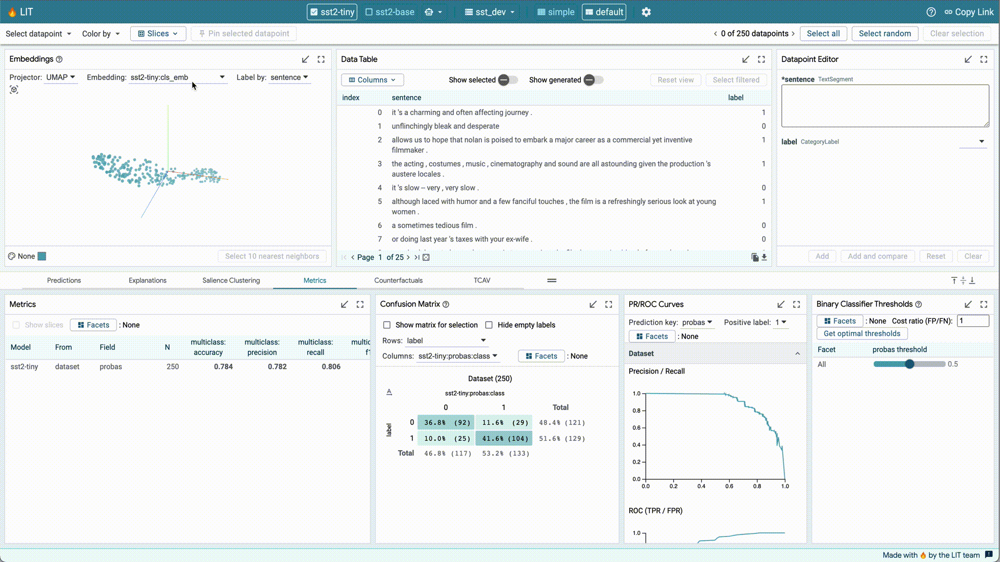

## Table of Contents

## What is the Learning Interpretability Tool (Lit) and its purpose in machine learning?

The Learning Interpretability Tool (LIT) is a platform designed to help people understand and improve machine learning models. It is made by Google and is used by researchers and developers to see how their models work and make them better. LIT lets you look at different parts of a model, like how it makes decisions or how well it performs on certain tasks. This is important because it helps make sure the models are fair and accurate.

One key feature of LIT is that it allows users to interact with the model in real-time. This means you can change things and see the results right away, which is very helpful for figuring out what parts of the model need to be fixed or improved. LIT also has tools that help explain why a model makes certain predictions, which can be useful for understanding complex models like those used in natural language processing or image recognition. By using LIT, people can make their machine learning models more trustworthy and effective.

## How does Lit help in understanding and improving machine learning models?

LIT helps in understanding machine learning models by providing a way to look inside them. It shows how a model makes its decisions, which can be hard to see otherwise. For example, if you have a model that guesses what someone is saying, LIT can show you which words the model thinks are important. This helps you see if the model is focusing on the right things or if it's getting confused by something it shouldn't be.

LIT also helps improve models by letting you play around with them in real-time. You can change the model a bit and see right away how it affects the results. This is useful because you can try different ideas quickly and see what works best. For instance, if you find that your model isn't good at understanding certain kinds of sentences, you can tweak it and see if it gets better. This makes the process of making a model better much faster and easier.

Overall, LIT makes [machine learning](/wiki/machine-learning) models more transparent and easier to work with. By showing what's going on inside the model and letting you experiment with changes, it helps make sure the model is fair and accurate. This is important because it means the models can be trusted more, and they can do a better job at whatever task they are meant to do.

## What are the key features of Lit that make it useful for model interpretability?

LIT has several key features that make it great for understanding and improving machine learning models. One of the main features is its ability to show you how a model makes decisions. For example, if you're using a model to understand what people are saying, LIT can highlight the words the model thinks are important. This helps you see if the model is focusing on the right things or if it's getting confused. LIT also lets you look at how well the model does on different tasks, so you can see where it's strong and where it needs work.

Another important feature of LIT is its real-time interaction. This means you can make changes to the model and see the results right away. This is really helpful because you can try different ideas quickly and see what works best. For instance, if you find that your model isn't good at understanding certain kinds of sentences, you can tweak it and see if it gets better. This makes the process of improving a model much faster and easier.

LIT also has tools that explain why a model makes certain predictions. This is useful for understanding complex models, like those used in understanding language or recognizing images. By using these tools, you can make your machine learning models more trustworthy and effective. Overall, these features of LIT help make machine learning models more transparent and easier to work with, which is important for ensuring they are fair and accurate.

## Can you explain how to set up and use Lit for a basic machine learning project?

To set up LIT for a basic machine learning project, first make sure you have Python installed on your computer. Then, you can install LIT using pip, which is a tool for installing Python packages. Just open your command line and type `pip install lit-[nlp](/wiki/nlp-natural-language-processing)`. Once LIT is installed, you'll need to prepare your data and model. For example, if you're working on a text classification task, you'll need a dataset of text examples and a trained model that can classify these texts. You can use popular machine learning libraries like TensorFlow or PyTorch to train your model. After you have your data and model ready, you can start LIT by running a Python script that imports LIT and sets up your data and model.

Using LIT is pretty straightforward once it's set up. Start by opening LIT in your web browser. You'll see a dashboard where you can upload your dataset and load your model. Once your data and model are loaded, you can start exploring how your model works. For example, you can select a text example from your dataset and see how your model classifies it. LIT will show you which parts of the text the model thinks are important for its decision. You can also try making small changes to the text and see how the model's prediction changes in real-time. This helps you understand what your model is paying attention to and where it might be going wrong. By experimenting with different examples and tweaking your model, you can improve its performance and make sure it's working the way you want it to.

## What types of data and models are compatible with Lit?

LIT can work with many types of data, like text, numbers, and images. If you're working with text, you can use LIT to understand how a model reads and understands words and sentences. For numbers, LIT helps you see how a model uses them to make guesses. And if you're working with images, LIT can show you which parts of the picture the model thinks are important. As long as your data can be put into a format that LIT understands, you can use it to explore your model.

LIT is also good with many kinds of models. It works well with models that classify things, like deciding if an email is spam or not. It also works with models that predict numbers, like guessing house prices. LIT can handle models made with popular tools like TensorFlow and PyTorch. This means you can use LIT with almost any machine learning model you have, as long as you can load it into LIT.

## How does Lit assist in visualizing and analyzing model predictions?

LIT helps you see and understand how your machine learning model makes its guesses by showing you which parts of the data the model thinks are important. For example, if you're using a model to understand what people are saying, LIT can highlight the words the model focuses on. This helps you see if the model is looking at the right things or if it's getting confused. LIT also lets you see how well the model does on different tasks, so you can find out where it's good and where it needs to get better.

Another way LIT helps is by letting you change things and see the results right away. If you're working on a text classification task, you can try changing some words in a sentence and watch how the model's guess changes. This real-time interaction makes it easy to test different ideas quickly and see what works best. By using these features, you can make your model more accurate and trustworthy, which is important for making sure it does its job well.

## What are some common use cases for Lit in different industries?

In the healthcare industry, LIT can be used to improve models that help doctors understand patient data. For example, if a model is used to predict if a patient has a certain disease, LIT can show which symptoms or test results the model thinks are important. This helps doctors see if the model is focusing on the right things or if it's missing something important. By using LIT, doctors can make the model better and more reliable, which can lead to better patient care.

In the finance industry, LIT is useful for models that predict things like stock prices or credit risk. If a model is used to decide if someone should get a loan, LIT can show which parts of the person's financial history the model is looking at. This helps banks see if the model is fair and accurate. By using LIT, banks can make sure their models are making good decisions, which can help them serve their customers better and avoid making bad loans.

## How can Lit be integrated into existing machine learning workflows?

LIT can be easily added to the machine learning projects you're already working on. First, you need to install LIT using the command `pip install lit-nlp`. After that, you can write a Python script to load your data and model into LIT. This script will help you set up your data and model so that LIT can use them. Once everything is set up, you can start LIT and see how your model works with your data. This way, LIT becomes a part of your regular machine learning work, helping you understand and improve your models without changing your whole process.

Once LIT is part of your workflow, you can use it to look at your model's predictions and see which parts of the data it thinks are important. For example, if you're working on a project to classify text, LIT can show you which words in a sentence the model is focusing on. You can also make small changes to the data and watch how the model's guesses change in real-time. This helps you test different ideas quickly and see what works best. By using LIT in your existing workflow, you can make your models better and more reliable without starting from scratch.

## What advanced techniques does Lit offer for expert users to enhance model interpretability?

LIT offers several advanced techniques for expert users to dive deeper into model interpretability. One key feature is counterfactual explanations, which let you see how changing parts of the input data affects the model's output. For example, if you're working on a text classification model, you can change a few words in a sentence and watch how the model's prediction changes. This helps you understand which parts of the input are most important for the model's decision. LIT also supports saliency maps, which visually highlight the parts of the input that the model finds most relevant. This is especially useful for image classification tasks, where you can see which pixels in an image the model is focusing on.

Another advanced technique LIT offers is the ability to perform sensitivity analysis. This allows you to see how small changes in the model's parameters affect its predictions. By tweaking the model and observing the outcomes in real-time, you can identify which parameters have the biggest impact on the model's performance. Additionally, LIT provides tools for creating custom visualizations and metrics, allowing you to tailor the interpretability analysis to your specific needs. These advanced features make LIT a powerful tool for experts looking to thoroughly understand and improve their machine learning models.

## How does Lit handle large datasets and complex models?

LIT is designed to work well with big datasets and complicated models. It can handle large amounts of data by letting you load and look at parts of the data at a time. This means you don't have to wait for the whole dataset to load before you start working. LIT also uses smart ways to show data and model results, so you can understand them even if they are complex. For example, if you have a model that looks at a lot of text, LIT can show you which words the model thinks are important without making you wait too long.

When it comes to complex models, LIT has tools that help you see inside them. It can show you how the model makes its guesses and what parts of the data it focuses on. This is useful if you're working with models that do hard tasks, like understanding language or recognizing images. LIT lets you change things and see the results right away, so you can try different ideas quickly and see what works best. This makes it easier to improve your model, even if it's very complicated.

## Can you discuss any limitations or challenges users might face when using Lit?

One challenge users might face when using LIT is that it can be slow with very large datasets. If you have a lot of data, LIT might take a long time to load everything, which can be frustrating. Also, if your model is very complex, LIT might struggle to show you all the details you need quickly. This means you might have to wait or work with smaller parts of your data at a time.

Another limitation is that LIT might not work well with every type of model or data. If your model or data is in a format that LIT doesn't understand, you might need to change it before you can use LIT. This can take extra time and effort. Also, while LIT is great for understanding how models work, it might not have all the tools you need for every kind of analysis. You might need to use other tools along with LIT to get a complete picture of your model's performance.

## What future developments or enhancements are planned for Lit?

LIT is always getting better, and the people who make it have some cool plans for the future. They want to make LIT work faster with big datasets, so you don't have to wait as long to see your results. They also want to add more tools that help you understand how your model makes decisions. This way, even if your model is very complicated, LIT will help you see inside it more easily.

Another thing they're working on is making LIT work with more types of models and data. This means you won't have to change your model or data as much to use LIT. They also want to make it easier to use LIT with other tools you might need for your project. By doing this, LIT will become an even better helper for understanding and improving your machine learning models.

## References & Further Reading

[1]: ["The What-If Tool: Code-Free Probing of Machine Learning Models"](https://research.google/blog/the-what-if-tool-code-free-probing-of-machine-learning-models/) by Google AI Blog.

[2]: Olah, C., Mordvintsev, A., & Schubert, L. (2017). ["Feature Visualization"](https://distill.pub/2017/feature-visualization/). Distill.

[3]: ["LIME: Local Interpretable Model-agnostic Explanations"](https://github.com/marcotcr/lime) by Ribeiro, M. T., Singh, S., & Guestrin, C. (2016). 

[4]: Molnar, C. (2020). ["Interpretable Machine Learning"](https://christophm.github.io/interpretable-ml-book/). 

[5]: ["M2C2: Model Cards for Model Checklists and Counterms"](https://m2c2-project.github.io/m2c2kit-docs/) by Google AI Blog.