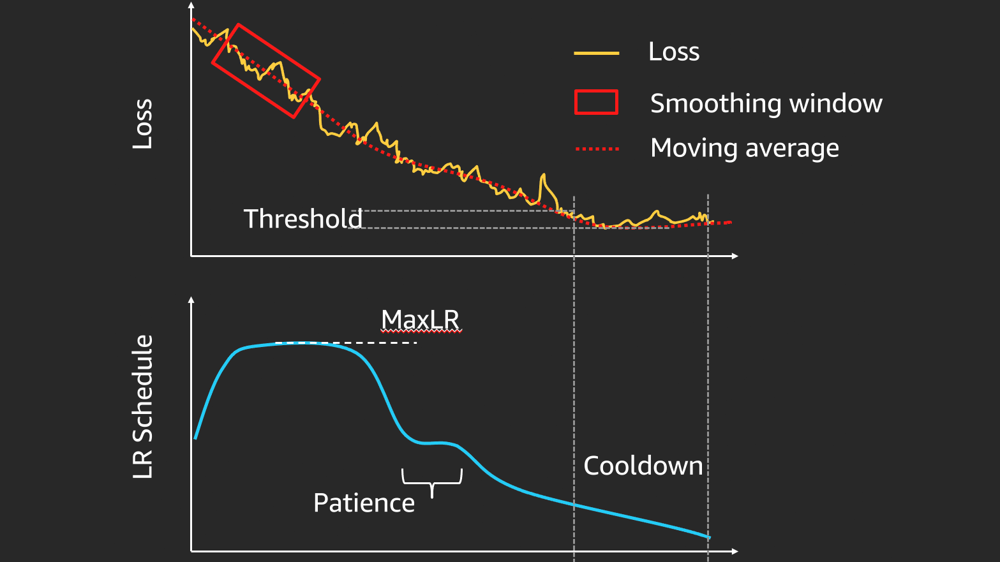

## Table of Contents

## What is a learning rate in the context of machine learning?

In machine learning, the learning rate is a crucial hyperparameter that determines how much a model adjusts with each step of training. Think of it as the size of the steps the model takes down the path of learning. If the learning rate is too high, the model might take big steps and overshoot the best solution, possibly missing it entirely. On the other hand, if the learning rate is too low, the model will take tiny steps, making the training process very slow and potentially getting stuck in a less optimal solution.

To illustrate, imagine you're trying to find the lowest point in a valley by walking downhill. A high learning rate would be like taking giant leaps, which might make you jump over the lowest point. A low learning rate would be like taking baby steps, which could take forever to reach the bottom. The goal is to find a learning rate that allows the model to converge to the best solution efficiently. Mathematically, the learning rate is often denoted as $$\alpha$$ and is used in the update rule for the model's parameters, such as in gradient descent where the update for a parameter $$w$$ might look like $$w = w - \alpha \cdot \nabla J(w)$$, where $$\nabla J(w)$$ is the gradient of the loss function with respect to $$w$$.

## Why is it important to adjust the learning rate during training?

Adjusting the learning rate during training is important because it helps the model learn more effectively. If the learning rate stays the same throughout training, the model might either take too long to learn or miss the best solution entirely. By changing the learning rate, we can make the model take bigger steps at the beginning when it's far from the best solution, and smaller steps as it gets closer. This way, the model can reach the best solution faster and more accurately.

One common way to adjust the learning rate is called learning rate scheduling. This means we have a plan for how the learning rate should change over time. For example, we might start with a high learning rate and slowly decrease it as training goes on. This can be done using a simple formula like $$ \text{new_learning_rate} = \text{initial_learning_rate} \times \text{decay_rate}^{\text{epoch}} $$. By doing this, we help the model find the best solution more efficiently without getting stuck or overshooting.

## What is a learning rate schedule and how does it differ from a fixed learning rate?

A learning rate schedule is a plan for how the learning rate should change during the training of a [machine learning](/wiki/machine-learning) model. Instead of keeping the learning rate the same throughout the entire training process, a schedule adjusts it over time. This can help the model learn faster and more accurately. For example, you might start with a high learning rate to make big changes early on, and then slowly lower it to make smaller, more precise changes as the model gets closer to the best solution. A common way to do this is to use a formula like $$ \text{new_learning_rate} = \text{initial_learning_rate} \times \text{decay_rate}^{\text{epoch}} $$, where the learning rate decreases with each epoch.

A fixed learning rate, on the other hand, stays the same throughout the entire training process. This can be simpler to set up, but it might not be as effective. If the learning rate is too high, the model might overshoot the best solution and never find it. If it's too low, the model might take too long to learn or get stuck in a less optimal solution. By using a learning rate schedule, you can avoid these problems and help the model find the best solution more efficiently.

## Can you explain the concept of Linear Warmup in learning rate schedules?

Linear Warmup is a technique used in learning rate schedules where the learning rate starts at a low value and gradually increases to a target value over a set number of training steps or epochs. This helps the model to begin training gently, allowing it to learn the basics without making large, potentially disruptive changes early on. Imagine you're teaching someone to ride a bike; you wouldn't start by pushing them down a steep hill. Instead, you'd start on flat ground and slowly increase the challenge. Similarly, Linear Warmup eases the model into the training process.

After the warmup period, the learning rate can either stay at the target value or start to decrease according to another schedule, like a decay function. The formula for Linear Warmup might look like $$ \text{learning_rate} = \text{initial_rate} + (\text{target_rate} - \text{initial_rate}) \times \frac{\text{current_step}}{\text{warmup_steps}} $$. If the current step is less than the warmup steps, the learning rate increases linearly from the initial rate to the target rate. This approach can help the model converge more smoothly and can be particularly useful in large-scale models or when using very large batch sizes.

## How does Linear Decay work as a learning rate schedule?

Linear Decay is a type of learning rate schedule where the learning rate starts at a high value and gradually decreases in a straight line over time. Imagine you're sliding down a slide. At the top, you start fast, but as you go down, you slow down smoothly until you reach the bottom. In machine learning, this means the model makes big changes at the beginning of training and smaller changes as it gets closer to the best solution. The formula for Linear Decay might look like $$ \text{new_learning_rate} = \text{initial_learning_rate} - \text{decay_rate} \times \text{epoch} $$. This helps the model find the best solution without jumping over it or getting stuck.

Using Linear Decay can help the model learn more effectively. By starting with a high learning rate, the model can quickly move toward the best solution. Then, as the learning rate decreases, the model makes smaller adjustments, allowing it to fine-tune its performance. This approach can be especially useful when you want to balance the speed of learning with the accuracy of the final model.

## What are the benefits of using Cosine Annealing in learning rate schedules?

Cosine Annealing is a learning rate schedule that helps a machine learning model learn better by changing the learning rate in a smooth, wavy pattern. Imagine you're riding a bike on a road that goes up and down like a wave. At the top of each wave, the learning rate is high, so the model makes big changes. At the bottom, the learning rate is low, and the model makes small changes. This pattern helps the model find the best solution without getting stuck or jumping over it. The formula for Cosine Annealing might look like $$ \text{learning_rate} = \text{min_lr} + \frac{1}{2} (\text{max_lr} - \text{min_lr}) (1 + \cos(\frac{\text{current_epoch} \cdot \pi}{\text{epochs_per_cycle}})) $$. This smooth change can help the model learn more effectively.

One big benefit of Cosine Annealing is that it helps the model explore different solutions and then fine-tune them. By starting with a high learning rate and then slowly lowering it, the model can quickly find a good solution and then make small adjustments to make it even better. This can be especially helpful when training complex models that need to balance speed and accuracy. Cosine Annealing also helps avoid getting stuck in a bad solution because the learning rate goes up and down, giving the model chances to escape from less optimal solutions and find better ones.

## How does the Inverse Square Root Schedule adjust the learning rate over time?

The Inverse Square Root Schedule is a way to change the learning rate as a model trains. It starts with a high learning rate and then slowly lowers it over time. The learning rate gets smaller and smaller, but it does so in a special way. Instead of going down in a straight line like Linear Decay, it goes down following a curve that looks like the bottom part of a U. The formula for the Inverse Square Root Schedule is $$ \text{learning_rate} = \frac{\text{initial_learning_rate}}{\sqrt{\text{step}}} $$. This means the learning rate gets divided by the square root of the number of steps the model has taken.

Using the Inverse Square Root Schedule can help a model learn better. At the beginning, the high learning rate helps the model make big changes and quickly find a good solution. As the model keeps training, the learning rate gets smaller, which helps the model make smaller, more precise changes. This way, the model can fine-tune its performance and get even better results. This schedule is often used in models that need to keep learning over a long time, like in language translation or other complex tasks.

## What is Exponential Decay and in what scenarios is it most effective?

Exponential Decay is a way to change the learning rate during training. It starts with a high learning rate and then slowly lowers it over time. The learning rate goes down following a curve that gets smaller and smaller quickly at first, and then more slowly. The formula for Exponential Decay is $$ \text{new_learning_rate} = \text{initial_learning_rate} \times \text{decay_rate}^{\text{epoch}} $$. This means the learning rate gets multiplied by a number less than 1, which makes it smaller with each epoch.

Exponential Decay is most effective in scenarios where you want the model to learn quickly at the start and then make smaller changes as it gets closer to the best solution. It's useful when you're training models that need to find a good solution fast and then fine-tune it. For example, it works well in tasks like image recognition or natural language processing where the model needs to learn a lot of different things and then adjust them to get the best results. By using Exponential Decay, you can help the model find the best solution more efficiently.

## Can you describe the Step Decay method and its application in deep learning?

Step Decay is a way to change the learning rate during the training of a [deep learning](/wiki/deep-learning) model. Instead of changing the learning rate smoothly like in other methods, Step Decay drops the learning rate suddenly at certain points in the training. Imagine you're walking down a hill and every few steps, you suddenly start taking smaller steps. The formula for Step Decay can look like $$ \text{new_learning_rate} = \text{initial_learning_rate} \times \text{decay_rate}^{\lfloor \frac{\text{epoch}}{\text{step_size}} \rfloor} $$. This means the learning rate stays the same for a while and then drops by a certain amount at regular intervals.

In deep learning, Step Decay is useful when you want the model to learn quickly at first and then slow down to fine-tune its performance. For example, if you're training a model to recognize images, you might start with a high learning rate to help the model learn the basics fast. Then, after a certain number of epochs, you drop the learning rate to help the model make smaller, more precise changes. This can help the model find the best solution more efficiently, especially in tasks where the model needs to balance speed and accuracy.

## What is the 1cycle policy and how does it help in training neural networks?

The 1cycle policy is a learning rate schedule that helps train neural networks more effectively. It works by changing the learning rate in a special way during training. The learning rate starts low, then goes up to a high value, and finally comes back down to a low value again. This up-and-down pattern helps the model learn quickly at first and then fine-tune its performance. The 1cycle policy can be described by a formula like $$ \text{learning_rate} = \text{max_lr} \times \left(1 - \frac{\text{current_step}}{\text{total_steps}}\right)^{\text{power}} $$, where the learning rate changes based on the current step and the total number of steps.

Using the 1cycle policy can make training neural networks faster and better. When the learning rate is high, the model can make big changes and find a good solution quickly. As the learning rate goes down, the model makes smaller changes, which helps it fine-tune its performance and get even better results. This schedule is especially helpful in tasks like image recognition or natural language processing, where the model needs to learn a lot of different things and then adjust them to get the best results. By using the 1cycle policy, you can help the model find the best solution more efficiently.

## How do Cyclical Learning Rate policies like Slanted Triangular Learning Rates work?

Cyclical Learning Rate policies, like Slanted Triangular Learning Rates, change the learning rate in a special way during training. They make the learning rate go up and down in a pattern that looks like a triangle. The learning rate starts low, goes up to a high value, and then comes back down to a low value again. This up-and-down pattern helps the model learn quickly at first and then fine-tune its performance. The formula for Slanted Triangular Learning Rates can look like $$ \text{learning_rate} = \text{initial_lr} + (\text{max_lr} - \text{initial_lr}) \times \left(1 - \frac{\text{current_step}}{\text{total_steps}}\right) $$. This helps the model find the best solution more efficiently by balancing speed and accuracy.

Slanted Triangular Learning Rates are especially useful in training neural networks for tasks like image recognition or natural language processing. By starting with a low learning rate and then increasing it, the model can make big changes and learn the basics fast. As the learning rate goes down, the model makes smaller changes, which helps it fine-tune its performance and get even better results. This schedule can help the model avoid getting stuck in a bad solution and find a better one more quickly.

## What advanced techniques like Cosine Power Annealing and Polynomial Rate Decay can be used for fine-tuning learning rates?

Cosine Power Annealing is a way to change the learning rate during training that helps a model learn better. It's like Cosine Annealing, but it uses a power to make the learning rate change in a special way. The learning rate goes up and down in a smooth wave, but the power makes the wave change faster or slower. The formula for Cosine Power Annealing is $$ \text{learning_rate} = \text{min_lr} + \frac{1}{2} (\text{max_lr} - \text{min_lr}) (1 + \cos(\frac{\text{current_epoch} \cdot \pi}{\text{epochs_per_cycle}}))^p $$, where $$ p $$ is the power. This helps the model explore different solutions and then fine-tune them, making it easier to find the best solution without getting stuck.

Polynomial Rate Decay is another way to change the learning rate that helps a model learn more effectively. It starts with a high learning rate and then slowly lowers it over time, following a curve that looks like a polynomial. This means the learning rate goes down smoothly, but it can do so in different ways depending on the polynomial's power. The formula for Polynomial Rate Decay is $$ \text{learning_rate} = (\text{initial_learning_rate} - \text{end_learning_rate}) \times (1 - \frac{\text{current_step}}{\text{total_steps}})^p + \text{end_learning_rate} $$, where $$ p $$ is the power of the polynomial. This schedule is useful when you want the model to learn quickly at first and then make smaller changes as it gets closer to the best solution.