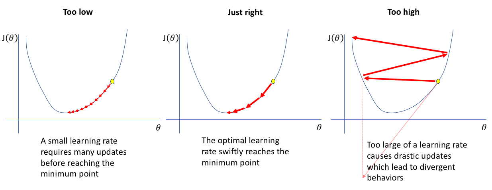

## Table of Contents

## What is a learning rate in machine learning?

In machine learning, the learning rate is a key setting that controls how much a model changes in response to the errors it makes. Imagine you're trying to find the bottom of a valley (the best solution) by walking downhill. The learning rate is like deciding how big of a step you take with each move. If your steps are too big, you might overshoot the bottom and end up climbing the other side. If they're too small, it might take you forever to get there.

Choosing the right learning rate is crucial because it affects how quickly and effectively your model learns. If the learning rate is too high, the model might miss the best solution and keep jumping around. If it's too low, the training can be very slow, and the model might get stuck before reaching the best solution. A good learning rate helps the model reach the best solution faster and more reliably.

## Why is the learning rate important in training machine learning models?

The learning rate is super important in training machine learning models because it decides how much the model changes with each step it takes to get better. Think of it like trying to find the best spot in a big field. If you take big steps, you might miss the best spot and keep jumping around. If you take tiny steps, it might take forever to get there. The learning rate is like choosing the size of those steps. If it's just right, the model can find the best solution quickly and smoothly.

If the learning rate is too high, the model might overshoot the best solution and never settle down. It's like trying to hit a target but throwing the ball too hard every time. On the other hand, if the learning rate is too low, the model might take tiny steps and never reach the best solution because it's moving too slowly. It's like trying to walk to a faraway place but only taking baby steps. Getting the learning rate right helps the model learn faster and more accurately, making the whole training process more efficient.

## How does the learning rate affect the performance of a model?

The learning rate is like a knob that you turn to decide how fast your [machine learning](/wiki/machine-learning) model learns. If you set it too high, the model might jump around a lot and miss the best answer. It's like trying to find a treasure but taking such big steps that you keep walking past it. When the learning rate is too high, the model can become unstable and might not find the best solution because it overshoots the target.

On the other hand, if the learning rate is too low, the model will learn very slowly. It's like trying to find the same treasure but taking tiny steps. You'll eventually get there, but it might take a long time. A low learning rate can make the training process very slow, and the model might get stuck before reaching the best solution. Finding the right learning rate helps the model learn at a good speed and find the best solution more reliably.

## What are the common values for learning rates used in practice?

In practice, common values for learning rates often fall between 0.001 and 0.1. A good starting point that many people use is 0.01. This value works well for a lot of different models and problems. If the model isn't learning well or is learning too fast, you might need to adjust the learning rate. Sometimes, people use a technique called learning rate scheduling, where the learning rate changes over time to help the model learn better.

For more advanced models like deep neural networks, people often start with a smaller learning rate, like 0.001. This helps the model take smaller steps and learn more carefully. If the model is still not learning well, you might try even smaller values, like 0.0001. The key is to find a balance so the model learns quickly but doesn't miss the best solution.

## What is learning rate scheduling and why is it used?

Learning rate scheduling is a way to change the learning rate while the model is learning. Instead of keeping the learning rate the same the whole time, you make it smaller or bigger at different points. This helps the model learn better because it can take bigger steps at the start when it's far from the best answer, and then take smaller steps later when it's getting close. It's like using a map to find a treasure: at first, you might take big steps to get to the right area, but then you need smaller steps to find the exact spot.

People use learning rate scheduling because it can make the model learn faster and more accurately. If the learning rate is too big all the time, the model might jump around and miss the best answer. If it's too small, the model might take forever to get there. By changing the learning rate, you can help the model find the best answer more easily. There are different ways to schedule the learning rate, like making it smaller by a certain amount after a set number of steps, or using a formula to change it smoothly over time.

## How can one choose an appropriate learning rate for a model?

Choosing the right learning rate is important because it can make your model learn faster and find the best answer more easily. A good way to start is to try a common learning rate like 0.01. If your model is learning too fast and jumping around, you might need to make the learning rate smaller, like 0.001 or even 0.0001. If it's learning too slowly, you might need to make it bigger, like 0.1. Sometimes, you can use a method called learning rate scheduling, where the learning rate changes over time to help the model learn better. This can help the model take big steps at the start and then smaller steps when it's getting close to the best answer.

One way to find the best learning rate is to try different values and see how well the model learns with each one. You can start with a small learning rate and slowly make it bigger until the model starts to learn well. Another way is to use a technique called learning rate range test, where you start with a very small learning rate and slowly increase it while watching how the model's performance changes. This can help you find the learning rate that makes the model learn the fastest without jumping around too much. By trying different learning rates and seeing how the model responds, you can find the best one for your problem.

## What are the consequences of setting the learning rate too high or too low?

If you set the learning rate too high, your model might jump around a lot and miss the best solution. It's like trying to find a treasure but taking such big steps that you keep walking past it. When the learning rate is too high, the model can become unstable and might not settle down to find the best answer because it overshoots the target. For example, if you're using a learning rate of 0.1 and your model's performance keeps going up and down without getting better, it might be because the learning rate is too high.

On the other hand, if you set the learning rate too low, your model will learn very slowly. It's like trying to find the same treasure but taking tiny steps. You'll eventually get there, but it might take a long time. A low learning rate can make the training process very slow, and the model might get stuck before reaching the best solution. For instance, if you're using a learning rate of 0.0001 and your model's performance isn't improving much over many training steps, it might be because the learning rate is too low. Finding the right learning rate helps the model learn at a good speed and find the best solution more reliably.

## What is the difference between fixed and adaptive learning rates?

A fixed learning rate stays the same throughout the entire training process. It's like deciding to take the same size steps every time you walk, no matter where you are on your journey. If you choose a fixed learning rate, like 0.01, it will stay 0.01 from the beginning to the end of training. This can be simple to use, but it might not be the best choice for all situations because the model might need different step sizes at different times to learn well.

An adaptive learning rate changes as the model learns. It's like adjusting your step size based on how close you are to your goal. If the model is far from the best answer, it might take bigger steps, and as it gets closer, it can take smaller steps. Methods like Adam or RMSprop are examples of adaptive learning rates. They automatically adjust the learning rate to help the model learn faster and more accurately. This can be more effective than using a fixed learning rate because it can adapt to the needs of the model as it learns.

## How do adaptive learning rate methods like Adam and RMSprop work?

Adaptive learning rate methods like Adam and RMSprop adjust the learning rate automatically while the model is learning. They do this by looking at how the model is doing and changing the learning rate to help it learn better. For example, Adam uses two things to adjust the learning rate: one is a moving average of the gradients (which show how the model is changing), and the other is a moving average of the squared gradients. This helps Adam take into account both the direction and the size of the steps the model is taking. RMSprop works by keeping track of the average of the squared gradients and using that to adjust the learning rate, which helps the model take smaller steps when the gradients are big and bigger steps when they're small.

These methods make it easier to train models because they can handle different kinds of problems without needing to change the learning rate by hand. Adam, for instance, uses a formula to update the learning rate that looks like this: $$ \alpha_t = \alpha \cdot \frac{\sqrt{1 - \beta_2^t}}{1 - \beta_1^t} $$, where $$\alpha$$ is the initial learning rate, $$\beta_1$$ and $$\beta_2$$ are hyperparameters, and $$t$$ is the current time step. This formula helps Adam adjust the learning rate based on how the model is doing at each step. RMSprop, on the other hand, uses a simpler formula to adjust the learning rate based on the average of the squared gradients, which helps the model learn more smoothly. By automatically adjusting the learning rate, these methods can help the model find the best solution faster and more reliably.

## What are some techniques to optimize the learning rate during training?

One way to optimize the learning rate during training is to use learning rate scheduling. This means changing the learning rate over time to help the model learn better. For example, you might start with a bigger learning rate so the model can take big steps at the beginning, and then make it smaller as the model gets closer to the best answer. This can be done in different ways, like reducing the learning rate by a certain amount after a set number of steps, or using a formula to change it smoothly over time. A common method is to use a formula like $$ \alpha_t = \alpha_0 \cdot \gamma^{\frac{t}{T}} $$, where $$\alpha_t$$ is the learning rate at time $$t$$, $$\alpha_0$$ is the initial learning rate, $$\gamma$$ is a decay rate, and $$T$$ is the total number of steps. This helps the model learn faster and more accurately by adjusting the learning rate as needed.

Another technique is to use adaptive learning rate methods like Adam or RMSprop. These methods automatically adjust the learning rate based on how the model is doing. For example, Adam uses a formula to update the learning rate that looks like $$ \alpha_t = \alpha \cdot \frac{\sqrt{1 - \beta_2^t}}{1 - \beta_1^t} $$, where $$\alpha$$ is the initial learning rate, $$\beta_1$$ and $$\beta_2$$ are hyperparameters, and $$t$$ is the current time step. This helps Adam take into account both the direction and the size of the steps the model is taking. RMSprop, on the other hand, adjusts the learning rate based on the average of the squared gradients, which helps the model learn more smoothly. By using these methods, you don't need to change the learning rate by hand, making it easier to train the model and find the best solution.

## How can learning rate impact the convergence speed and final accuracy of a model?

The learning rate can really affect how fast your model learns and how well it does in the end. If you set the learning rate too high, the model might jump around a lot and never find the best answer. It's like trying to find a treasure but taking such big steps that you keep walking past it. When the learning rate is too high, the model can become unstable and might not settle down to find the best solution because it overshoots the target. For example, if you're using a learning rate of 0.1 and your model's performance keeps going up and down without getting better, it might be because the learning rate is too high. This can slow down the convergence speed because the model keeps missing the best spot.

On the other hand, if you set the learning rate too low, the model will learn very slowly. It's like trying to find the same treasure but taking tiny steps. You'll eventually get there, but it might take a long time. A low learning rate can make the training process very slow, and the model might get stuck before reaching the best solution. For instance, if you're using a learning rate of 0.0001 and your model's performance isn't improving much over many training steps, it might be because the learning rate is too low. Finding the right learning rate helps the model learn at a good speed and find the best solution more reliably, which can improve both the convergence speed and the final accuracy of the model.

## What advanced strategies exist for fine-tuning learning rates in complex models?

One advanced strategy for fine-tuning learning rates in complex models is called learning rate scheduling. This means changing the learning rate over time to help the model learn better. For example, you might start with a bigger learning rate so the model can take big steps at the beginning, and then make it smaller as the model gets closer to the best answer. This can be done in different ways, like reducing the learning rate by a certain amount after a set number of steps, or using a formula to change it smoothly over time. A common method is to use a formula like $$ \alpha_t = \alpha_0 \cdot \gamma^{\frac{t}{T}} $$, where $$\alpha_t$$ is the learning rate at time $$t$$, $$\alpha_0$$ is the initial learning rate, $$\gamma$$ is a decay rate, and $$T$$ is the total number of steps. This helps the model learn faster and more accurately by adjusting the learning rate as needed.

Another advanced strategy is to use adaptive learning rate methods like Adam or RMSprop. These methods automatically adjust the learning rate based on how the model is doing. For example, Adam uses a formula to update the learning rate that looks like $$ \alpha_t = \alpha \cdot \frac{\sqrt{1 - \beta_2^t}}{1 - \beta_1^t} $$, where $$\alpha$$ is the initial learning rate, $$\beta_1$$ and $$\beta_2$$ are hyperparameters, and $$t$$ is the current time step. This helps Adam take into account both the direction and the size of the steps the model is taking. RMSprop, on the other hand, adjusts the learning rate based on the average of the squared gradients, which helps the model learn more smoothly. By using these methods, you don't need to change the learning rate by hand, making it easier to train the model and find the best solution.

A third strategy involves using techniques like learning rate range tests or cyclic learning rates. In a learning rate range test, you start with a very small learning rate and slowly increase it while watching how the model's performance changes. This can help you find the learning rate that makes the model learn the fastest without jumping around too much. Cyclic learning rates involve changing the learning rate in a cycle, going from a low value to a high value and back again. This can help the model escape from local minima and find the best solution more reliably. By trying different learning rates and seeing how the model responds, you can find the best one for your problem.

## References & Further Reading

[1]: Goodfellow, I., Bengio, Y., & Courville, A. (2016). [Deep Learning.](https://link.springer.com/article/10.1007/s10710-017-9314-z) MIT Press.

[2]: Ruder, S. (2016). [An overview of gradient descent optimization algorithms.](https://arxiv.org/abs/1609.04747) arXiv preprint arXiv:1609.04747.

[3]: Bottou, L. (2012). [Stochastic Gradient Descent Tricks.](https://link.springer.com/chapter/10.1007/978-3-642-35289-8_25) In Neural Networks: Tricks of the Trade (pp. 421-436). Springer, Berlin, Heidelberg.

[4]: Zeiler, M. D. (2012). [ADADELTA: An adaptive learning rate method.](https://arxiv.org/abs/1212.5701) arXiv preprint arXiv:1212.5701.

[5]: Duchi, J., Hazan, E., & Singer, Y. (2011). [Adaptive subgradient methods for online learning and stochastic optimization.](https://dl.acm.org/doi/10.5555/1953048.2021068) Journal of Machine Learning Research, 12, 2121-2159.

[6]: Kingma, D. P., & Ba, J. (2014). [Adam: A method for stochastic optimization.](https://arxiv.org/abs/1412.6980) arXiv preprint arXiv:1412.6980.