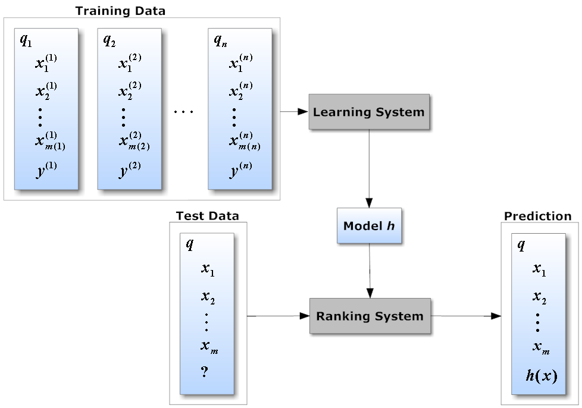

## Table of Contents

## What is a Learning to Rank model in machine learning?

Learning to Rank, often abbreviated as LTR, is a type of machine learning model used to rank items in a specific order based on their relevance to a given query. This technique is commonly used in search engines, recommendation systems, and other applications where sorting items by importance or relevance is crucial. The main goal of an LTR model is to learn a scoring function that can predict the relevance of an item to a query, allowing the system to rank items in a way that the most relevant ones appear at the top.

There are three main approaches to Learning to Rank: pointwise, pairwise, and listwise. In the pointwise approach, the model treats each item independently and tries to predict its relevance score. For example, it might use regression to assign a score to each item based on its features. The pairwise approach, on the other hand, focuses on comparing pairs of items and learning to rank one item higher than another. This is often done using techniques like RankNet, which uses a neural network to predict the probability that one item is more relevant than another. Finally, the listwise approach considers the entire list of items at once and tries to optimize the ranking of the whole list, often using metrics like Normalized Discounted Cumulative Gain (NDCG) to evaluate performance.

## How does a Learning to Rank model differ from traditional ranking methods?

Learning to Rank models differ from traditional ranking methods mainly in how they use data and make decisions. Traditional ranking methods often rely on manually crafted rules or simple algorithms to sort items. For example, a search engine might rank web pages based on keyword matches and the number of backlinks. These methods can be effective but are limited because they don't adapt well to new data or complex patterns. They also require a lot of human effort to fine-tune and update the rules.

In contrast, Learning to Rank models use machine learning to automatically learn how to rank items. They can analyze large amounts of data to find patterns and relationships that humans might miss. For instance, an LTR model can learn from past user interactions to understand what makes an item relevant to a query. This means the model can improve over time and adapt to changes in user behavior or data. By using techniques like regression or neural networks, LTR models can create a scoring function that predicts the relevance of an item, leading to more accurate and personalized rankings.

## What are the main approaches to Learning to Rank: pointwise, pairwise, and listwise?

The pointwise approach to Learning to Rank treats each item separately. It tries to guess how important each item is by itself. For example, it might use a simple math formula or a machine learning model to give each item a score. The items are then sorted based on these scores. This method is easy to understand and use but might not be as good at figuring out the order of items compared to other methods.

The pairwise approach looks at pairs of items instead. It tries to learn which item in a pair should come first. A common way to do this is by using a model like RankNet, which uses a neural network to predict if one item is more important than another. By comparing many pairs, the model can figure out the best order for a whole list of items. This method is usually better at sorting items than the pointwise approach because it directly focuses on the order.

The listwise approach looks at the whole list of items at once. It tries to make the entire list as good as possible. This method often uses special math formulas, like Normalized Discounted Cumulative Gain (NDCG), to check how well the list is sorted. By looking at the whole list, the model can make better decisions about the order of items. This can lead to the best results, but it's also the most complex way to do Learning to Rank.

## Can you explain the basic architecture of a DCN-V2 model?

The DCN-V2 model, or Deep & Cross Network Version 2, is a type of neural network used for recommendation systems. It combines the strengths of both deep neural networks and cross networks to better capture feature interactions. The basic architecture of DCN-V2 includes an input layer, a cross network, a deep network, and an output layer. The input layer takes in the raw features of the data, which can be both numerical and categorical. These features are then fed into both the cross network and the deep network.

The cross network in DCN-V2 is designed to explicitly model feature interactions of any order. It does this by using a series of cross layers, where each layer applies a transformation to the input features to capture higher-order feature interactions. The formula for a single cross layer can be expressed as $$x_{l+1} = x_0 \cdot (W_l \cdot x_l + b_l) + x_l$$, where $$x_l$$ is the input to the $$l$$-th layer, $$W_l$$ and $$b_l$$ are the weights and bias of the layer, and $$x_0$$ is the input to the first layer. The deep network, on the other hand, is a standard feed-forward neural network that captures implicit feature interactions through its multiple hidden layers. The outputs from both the cross network and the deep network are then combined and fed into the output layer, which produces the final prediction.

In summary, DCN-V2's architecture allows it to effectively model both low-order and high-order feature interactions, making it particularly useful for tasks like click-through rate prediction in recommendation systems. By integrating the cross network with the deep network, DCN-V2 can learn complex patterns in the data while maintaining efficiency and interpretability.

## What are the key components of the DCN-V2 architecture and their functions?

The DCN-V2 model has an input layer, a cross network, a deep network, and an output layer. The input layer takes in the raw data features, which can be numbers or categories. These features go into both the cross network and the deep network. The cross network helps the model understand how different features work together. It uses special layers called cross layers to do this. Each cross layer changes the input features to find new ways they connect. The formula for a cross layer is $$x_{l+1} = x_0 \cdot (W_l \cdot x_l + b_l) + x_l$$, where $$x_l$$ is what goes into the layer, $$W_l$$ and $$b_l$$ are numbers that help the layer work, and $$x_0$$ is the first input. The deep network is like a regular neural network with many layers. It helps the model find hidden patterns in the data.

The outputs from the cross network and the deep network come together and go into the output layer. This layer makes the final prediction. The DCN-V2 model is good at understanding both simple and complex ways features interact. This makes it useful for things like guessing if someone will click on a link in a recommendation system. By using both the cross network and the deep network, DCN-V2 can learn a lot from the data while still being easy to understand and use.

## How does cross-network interaction in DCN-V2 help in improving ranking performance?

The cross-network in DCN-V2 helps improve ranking performance by explicitly modeling feature interactions of any order. Unlike traditional neural networks that might miss out on important but subtle connections between features, the cross-network uses special layers called cross layers to capture these interactions. Each cross layer applies a transformation to the input features, allowing the model to find new ways they connect. The formula for a single cross layer is $$x_{l+1} = x_0 \cdot (W_l \cdot x_l + b_l) + x_l$$, where $$x_l$$ is the input to the layer, $$W_l$$ and $$b_l$$ are the weights and bias, and $$x_0$$ is the initial input. By doing this, the cross-network can uncover complex patterns in the data that might be crucial for accurate ranking.

By integrating the cross-network with a deep network, DCN-V2 combines the strengths of both explicit and implicit feature interactions. The deep network captures hidden patterns through its multiple layers, while the cross-network ensures that even the most subtle feature interactions are not overlooked. This dual approach allows DCN-V2 to learn more effectively from the data, leading to better predictions and, consequently, improved ranking performance. The ability to model both low-order and high-order feature interactions makes DCN-V2 particularly useful for applications like recommendation systems, where understanding the nuanced relationships between features can significantly enhance the user experience.

## What are the typical datasets used for training and evaluating Learning to Rank models like DCN-V2?

Learning to Rank models like DCN-V2 are often trained and evaluated using datasets that come from real-world applications such as search engines and recommendation systems. Some common datasets include the Microsoft Learning to Rank (MSLR) dataset, which has information about web pages and their relevance to different search queries, and the Yahoo! Learning to Rank Challenge dataset, which is similar but focuses on web search results. These datasets are useful because they have lots of examples and different kinds of data, which helps the model learn how to rank items accurately.

Another popular dataset is the LETOR (Learning to Rank for Information Retrieval) dataset, which includes several smaller datasets like OHSUMED and TREC. These datasets have information about documents and their relevance to queries, which is perfect for training models to sort search results. The datasets usually come with features that describe the items and their relevance scores, which the model uses to learn how to rank items. By using these datasets, researchers and developers can test and improve Learning to Rank models like DCN-V2 to make sure they work well in real-world situations.

## How do you preprocess data for use in a Learning to Rank model such as DCN-V2?

Preprocessing data for a Learning to Rank model like DCN-V2 involves several steps to make sure the data is ready for the model to learn from. First, you need to clean the data by removing any missing or incorrect information. This means checking for empty values and either filling them in or removing those entries. Next, you should transform the data into a format that the model can understand. This often means turning categorical data, like types of items, into numbers that the model can work with. For example, you might use a technique called one-hot encoding to turn categories into a series of 0s and 1s. You also need to normalize numerical data, like prices or ratings, so that all features are on the same scale. This can be done using methods like min-max normalization or standardization.

After cleaning and transforming the data, you need to prepare it specifically for Learning to Rank tasks. This involves creating feature vectors for each item-query pair. Each feature vector includes information about both the item and the query, as well as any other relevant data. For instance, if you're ranking products for a search query, the feature vector might include the product's price, its relevance score to the query, and user interaction data. You also need to label the data with relevance scores, which can be done using human judgments or historical interaction data. These scores help the model learn how to rank items correctly. Finally, you should split the data into training, validation, and test sets to train the model, tune its performance, and evaluate how well it works.

## What metrics are commonly used to evaluate the performance of Learning to Rank models?

Learning to Rank models are often evaluated using metrics that measure how well the model sorts items. One common metric is Normalized Discounted Cumulative Gain (NDCG), which looks at how relevant the items at the top of the list are. NDCG takes into account that items at the top of the list are more important than items lower down. The formula for NDCG at position k is $$NDCG@k = \frac{DCG@k}{IDCG@k}$$, where DCG (Discounted Cumulative Gain) is the sum of the relevance scores of the items, discounted by their position, and IDCG (Ideal Discounted Cumulative Gain) is the maximum possible DCG for the given list.

Another important metric is Mean Reciprocal Rank (MRR), which focuses on the position of the first correct answer in the list. MRR is useful when you want to know how quickly the model finds the most relevant item. It's calculated as the average of the reciprocal ranks of the first correct item across all queries. For example, if the first correct item is at position 2, its reciprocal rank is $$ \frac{1}{2} $$. These metrics help researchers and developers understand how well a Learning to Rank model like DCN-V2 is performing and where it might need improvement.

## How can hyperparameters in DCN-V2 be tuned for optimal performance?

To get the best results from DCN-V2, you need to adjust its hyperparameters carefully. Hyperparameters are like settings that you can change to make the model work better. Some important hyperparameters in DCN-V2 are the number of cross layers, the number of hidden layers in the deep network, the learning rate, and the batch size. You can use a method called grid search to try different combinations of these settings. Grid search means you test the model with many different settings and see which one works best. Another way is to use random search, where you randomly pick different settings to try. Both methods help you find the best hyperparameters, but they can take a long time because you need to run the model many times.

Once you have some good guesses for the hyperparameters, you can use a more advanced method called Bayesian optimization. This method is smarter because it uses what it learns from earlier tries to pick the next settings to test. This can help you find the best settings faster than grid search or random search. For example, if you find that a learning rate of 0.01 works better than 0.1, Bayesian optimization will use that information to choose the next learning rate to try. By using these methods to tune the hyperparameters, you can make DCN-V2 work as well as possible for your specific task.

## What are some advanced techniques for improving the accuracy of DCN-V2 models?

One advanced technique for improving the accuracy of DCN-V2 models is to use feature engineering. This means creating new features from the existing data that can help the model learn better. For example, you might combine two features to create a new one that captures a specific relationship between them. This can help the cross network in DCN-V2 find more meaningful interactions. Another technique is to use regularization methods like L1 or L2 regularization. These methods add a penalty to the model's loss function to prevent it from overfitting to the training data. Overfitting happens when the model learns the training data too well and doesn't perform as well on new data. By adding regularization, you can make the model generalize better to new situations.

Another way to improve DCN-V2's accuracy is to use ensemble methods. This means combining the predictions of multiple DCN-V2 models to get a better overall prediction. For example, you could train several DCN-V2 models with different hyperparameters and then average their predictions. This can help reduce errors and improve the model's performance. Additionally, you can use techniques like early stopping to prevent overfitting. Early stopping means you stop training the model when its performance on a validation set starts to get worse, even if the performance on the training set is still improving. By using these advanced techniques, you can make your DCN-V2 model more accurate and reliable.

## How does DCN-V2 compare to other state-of-the-art Learning to Rank models in terms of performance and efficiency?

DCN-V2, or Deep & Cross Network Version 2, is known for its ability to capture both low-order and high-order feature interactions effectively. Compared to other state-of-the-art Learning to Rank models like DeepFM and xDeepFM, DCN-V2 often performs better in terms of accuracy. This is because it uses a cross network that explicitly models feature interactions of any order, which can lead to more accurate predictions. For example, in tasks like click-through rate prediction, DCN-V2 can achieve higher Normalized Discounted Cumulative Gain (NDCG) scores, which means it's better at ranking items in the right order. The formula for NDCG at position k is $$NDCG@k = \frac{DCG@k}{IDCG@k}$$, where DCG (Discounted Cumulative Gain) is the sum of the relevance scores of the items, discounted by their position, and IDCG (Ideal Discounted Cumulative Gain) is the maximum possible DCG for the given list.

In terms of efficiency, DCN-V2 is also competitive. While models like DeepFM and xDeepFM can be complex and require a lot of computational resources, DCN-V2 is designed to be more efficient. It achieves this by using a simpler architecture that combines the strengths of both deep and cross networks. This means DCN-V2 can often train faster and use less memory than other models. For example, when training on large datasets like the Microsoft Learning to Rank (MSLR) dataset, DCN-V2 can reach good performance in fewer epochs compared to other models. This makes it a good choice for applications where both accuracy and efficiency are important, such as recommendation systems and search engines.