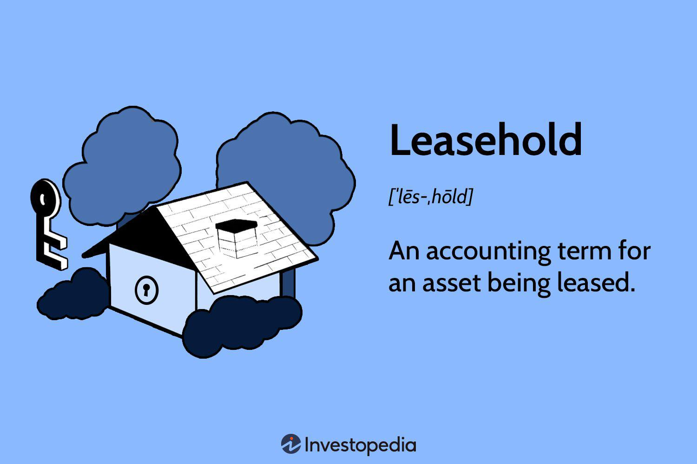

In today's rapidly evolving financial landscape, gaining a thorough understanding of diverse asset types and trading methods is crucial for both seasoned investors and newcomers. This article serves as a comprehensive overview of leasehold assets, property leasing, and algorithmic trading—key components that are shaping modern investment strategies and property markets. 

Leasehold assets represent a significant category within real estate, characterized by agreements in which the lessee holds the right to use a property for a specified period, as outlined in a lease contract. This is in contrast to freehold ownership, where the property is owned outright. Leasehold interests offer unique opportunities and challenges, including flexible use of property accompanied by the necessity to adhere to specific lease terms.



Property leasing further complicates and enriches this asset class by introducing various types of leasehold interests, each with its own set of rules dictating lease duration, renewal, and the rights of the lessee. Understanding these intricacies is vital for making informed decisions in property investments.

Parallel to developments in real estate are advancements in trading technologies. Algorithmic trading, which involves the use of sophisticated computer algorithms to execute trades, is becoming increasingly commonplace. Its advantages, such as the ability to execute trades at high speeds, reduce transaction costs, and minimize human errors, make it a powerful tool for optimizing investment strategies.

By exploring the integration of leasehold assets with algorithmic trading, investors can potentially enhance their returns through automated processes that offer real-time market insights and efficient trade execution. Consequently, this article aims to equip investors and property enthusiasts with the knowledge required to navigate and capitalize on these evolving opportunities.

## Table of Contents

## Understanding Leasehold Assets

Leasehold assets are a distinctive category of property ownership where the lessee is granted the right to use and occupy a property for a predetermined duration, as delineated in a lease agreement. This arrangement starkly contrasts with freehold properties, in which ownership of the land itself is transferred. In leasehold agreements, the lessee holds a lease for a set term, which could range from a short period to several decades, depending on the terms negotiated between the lessee and the lessor.

The primary characteristic of leasehold assets is the temporary nature of the tenure, which is bound by the terms of the lease. This agreement defines several crucial elements, including the lease duration, rent payments, and responsibilities for the maintenance and repair of the property. At the expiration of the lease term, the property typically reverts to the lessor unless provisions within the lease allow for an extension or conversion to a freehold.

Leasehold assets provide certain advantages, particularly in terms of flexibility and economic considerations. For instance, acquiring a leasehold interest can be less capital-intensive than purchasing a freehold property, making it an attractive option for individuals and businesses seeking to use real estate without substantial upfront investment. Additionally, lessees might enjoy flexibility in terms of property use, provided they adhere to the conditions set forth in the lease. This can be particularly beneficial for businesses that require specific property modifications or operations over a limited timeframe.

However, holding leasehold assets also presents challenges. Lessees must comply with the lease's terms, which can impose restrictions on how the property is used or modified. Furthermore, the lease agreement may contain clauses that affect the costs associated with utilizing the asset, such as maintenance obligations, service charges, or the need to restore the property to its original condition at the end of the lease term. Such obligations can impact the overall cost-benefit analysis of holding a leasehold interest.

In summary, leasehold assets represent a significant segment of property investment and use, defined by their temporary nature and the contractual relationship between the lessee and the lessor. Understanding these assets' inherent benefits and challenges is essential for effectively managing and maximizing the potential of leasehold properties within one's portfolio.

## Types of Leasehold Interests

Leasehold interests are categorized primarily into four types: Tenancy for Years, Periodic Tenancy, Tenancy at Will, and Tenancy at Sufferance. Each type presents unique characteristics that influence lease duration, renewal procedures, and the legal rights of the lessee.

1. **Tenancy for Years**: This type of leasehold interest is established for a fixed term, defined by the lease agreement. It could range from a few months to several decades. This certainty in lease duration is beneficial for both lessees and lessors, as it provides stability and predictability. Typically, at the end of the term, the lease does not automatically renew unless specified. This type of leasing offers the right for peaceful possession throughout the lease period, barring any breach of conditions.

2. **Periodic Tenancy**: Unlike Tenancy for Years, a Periodic Tenancy does not end on a fixed date. Instead, it continues for successive periods, such as weekly, monthly, or yearly, until terminated by either party with appropriate notice. The flexibility of Periodic Tenancies makes them suitable for lessees who may need indefinite leasing arrangements. Notice periods and renewal conditions are often stipulated within the lease agreement or governed by statutory law, which varies by jurisdiction.

3. **Tenancy at Will**: This tenancy offers significant flexibility as it allows both the lessee and the lessor to terminate the agreement at any time without cause. However, in practice, a reasonable notice period is often expected. Tenancy at Will lacks the security of tenure present in other lease types, making it less common and riskier for long-term investments.

4. **Tenancy at Sufferance**: This occurs when a lessee remains in possession of the property after the expiration of a lawful tenancy, without the lessor's consent. It is characterized by minimal legal protection for the lessee, who may be subject to eviction at any time. This type of tenancy does not operate as an agreement but rather as a legal aftermath of overstaying a prior lease.

Understanding these leasehold categories is vital for making informed decisions in property investments. Each type offers different levels of commitment, stability, and flexibility, affecting the strategic planning of both property developers and individual investors. Such knowledge ensures effective negotiation and defensible investment strategies tailored to individual circumstances and market dynamics.

## Property Leasehold Key Components

The lease agreement forms the foundation of any leasehold property arrangement. This document specifies essential terms such as lease duration, rent, and the responsibilities of both the lessee and lessor. The lease duration is a critical component, indicating the period during which the lessee can legally occupy and use the property. Rent is typically outlined in explicit terms, detailing payment frequency, amount, and any escalation clauses that may adjust rent over time.

Responsibilities delineated in the lease agreement often include maintenance and repair obligations, which ensure the property remains in good condition throughout the lease term. The division of these duties between the lessee and the lessor influences the overall leasehold experience. Generally, the lessor is responsible for structural repairs, while the lessee handles interior maintenance.

Leasehold improvements represent another crucial component, referring to modifications made by the lessee to tailor the property to their needs. These improvements, ranging from minor adjustments to significant renovations, are critical for maximizing the lessee's utility and comfort. However, any modifications typically require the lessor's approval to ensure they align with legal and regulatory requirements, as well as lease terms.

Legal considerations are pivotal in shaping leasehold agreements. These include compliance with zoning regulations, adherence to building codes, and ensuring that the lease does not contravene any existing legal stipulations. Furthermore, understanding the legal framework helps in navigating potential disputes and ensuring a fair execution of lease terms. For instance, clear clauses regarding dispute resolution mechanisms can prevent costly legal battles.

Maintenance obligations are vital in maintaining the property's value and longevity. They encompass routine inspections, repairs of wear and tear, and adherence to safety standards. These duties are usually outlined clearly in the lease agreement, detailing the scope of responsibilities for both parties. Effective management of maintenance tasks not only preserves the asset's condition but also enhances the lessee's experience, potentially leading to lease renewals and reduced vacancies.

In summary, the key components of property leaseholds—lease agreements, improvements, legal aspects, and maintenance—interact to structure and govern the relationship between lessee and lessor. Understanding these elements is essential for both parties to ensure a mutually beneficial and legally sound leasehold arrangement.

## Algorithmic Trading: An Overview

Algorithmic trading employs sophisticated computer algorithms to automate the execution of trading orders in financial markets. These algorithms are designed to buy or sell financial instruments, such as stocks, futures, or currencies, at optimal prices and times, using a predefined set of rules and parameters. This automated approach is prevalent across various markets, enhancing efficiency and accuracy in trading.

One of the significant advantages of [algorithmic trading](/wiki/algorithmic-trading) is its capacity for high-frequency trading ([HFT](/wiki/high-frequency-trading-strategies)). High-frequency trading involves executing a large number of orders in fractions of a second, capitalizing on small price movements and market inefficiencies. This capability allows traders to engage in numerous transactions swiftly, potentially increasing their profitability while minimizing the risk of human error.

Algorithmic trading also contributes to reduced transaction costs. By automating trade execution, algorithms minimize the need for manual intervention, which can be costly in terms of both time and money. Additionally, these automated systems can execute trades faster and more accurately than a human trader, leading to lower market impact costs and slippage, which is the difference between the expected price of a trade and the actual price at which it is executed.

Moreover, algorithms can analyze vast amounts of market data in real-time, enabling traders to make informed decisions quickly. By integrating historical market data with real-time information, algorithms can recognize trading opportunities that may not be apparent to human traders. This data-driven approach allows for more strategic decision-making and can help traders identify patterns and trends that enhance their investment strategies.

For investors looking to integrate algorithmic trading into their operations, it is essential to understand the programming and logic behind these systems. Algorithm development typically involves statistical analysis and quantitative models that forecast market movements. Python is often used for this purpose due to its extensive libraries and frameworks tailored for financial analysis and algorithmic trading.

```python
import pandas as pd
import numpy as np

# Sample pseudo-code for a simple moving average strategy
def calculate_moving_average(prices, window):
    return prices.rolling(window=window).mean()

# Example execution for a stock's price data
stock_prices = pd.Series([100, 102, 104, 103, 102, 101, 105, 107])
moving_average = calculate_moving_average(stock_prices, window=3)

# Trading signal based on moving average strategy
def trading_signal(prices, moving_average):
    signal = np.where(prices > moving_average, "Buy", "Sell")
    return signal

signals = trading_signal(stock_prices, moving_average)
print(signals)
```

Understanding the implementation of algorithmic trading can significantly enhance investment strategy effectiveness, as traders can automate repetitive tasks, analyze data more efficiently, and execute trades with precision. In today's tech-driven financial markets, this confluence of technology and trading is reshaping how investors approach market opportunities.

## Integrating Leasehold Assets with Algo Trading

Integrating leasehold assets with algorithmic trading presents a compelling opportunity for investors seeking to enhance the efficiency and profitability of their property portfolios. Algorithmic trading, characterized by its use of complex algorithms to make automated trading decisions, can significantly optimize the management of leasehold property investments.

Automation in trading allows investors to manage diverse asset portfolios with enhanced precision and speed. By leveraging algorithmic trading, investors can access real-time market analysis, enabling them to make informed decisions about buying, selling, or holding investments in leasehold properties. This is particularly advantageous in volatile markets where quick decision-making can be the difference between profit and loss.

The incorporation of algorithmic trading into leasehold investment strategies also facilitates improved trading execution. Algorithms can be designed to handle large volumes of data, analyze market trends, and execute trades at optimal prices, minimizing the reliance on manual intervention and reducing the risk of human error. For instance, an algorithm could continuously monitor leasehold market prices and execute a trade when certain predefined conditions, such as price thresholds or market indicators, are met. Below is a basic example of a Python script implementing a simple algorithmic trading strategy using market data:

```python
import numpy as np
import pandas as pd

# Sample data: historical leasehold property prices
data = {'date': pd.date_range(start='1/1/2023', periods=100, freq='D'),
        'price': np.random.uniform(low=200000, high=300000, size=100)}
df = pd.DataFrame(data)

# Simple moving average strategy
df['SMA_10'] = df['price'].rolling(window=10).mean()

# Define trading signals
df['signal'] = 0
df['signal'][10:] = np.where(df['price'][10:] > df['SMA_10'][10:], 1, -1)

# Trade execution logic
df['position'] = df['signal'].diff()

# Output resulting trading signals
print(df[df['position'] != 0][['date', 'price', 'position']])
```

In this script, a simple moving average (SMA) strategy is implemented to generate signals for buying (1) or selling (-1) based on the leasehold property prices. Investors can adapt more sophisticated algorithms to account for a broader range of variables and market indicators, providing a customized approach tailored to specific investment goals.

By integrating algorithmic trading with leasehold assets, investors benefit from a more agile investment strategy. This integration is particularly useful in property markets where timing and responsiveness to market changes are critical. The automation provided by algorithmic trading not only enhances decision-making in real-time but also improves risk management, ultimately leading to potentially higher investment returns and reduced exposure to unfavorable market conditions.

## Conclusion

Understanding leasehold assets and algorithmic trading is crucial for investors seeking to maximize their opportunities in modern financial markets. Leasehold assets, with their unique characteristics and potential for property use flexibility, provide valuable options for diverse investment portfolios. When combined with algorithmic trading, which optimizes trading orders through advanced computer algorithms, investors can achieve a more agile and informed approach to managing their assets.

The synergy between property leasing and advanced trading strategies offers the potential to enhance investment returns by facilitating timely and precise investment decisions. Algorithmic trading, by providing real-time market analysis and executing trades at optimal prices, reduces transaction costs and minimizes human error, making it an invaluable tool for managing leasehold investments. This integration supports a strategy that is both efficient and adaptable, crucial in today's ever-evolving financial environment.

To navigate the complexities of current asset types and trading technologies effectively, staying informed and adaptable is essential. Continuous education and awareness of market trends, technological advancements, and regulatory changes are necessary to maintain a competitive edge. By embracing both modern trading methods and traditional investment assets like leaseholds, investors position themselves to take full advantage of the dynamic opportunities available in the financial markets today.

## References & Further Reading

[1]: Bergstra, J., Bardenet, R., Bengio, Y., & Kégl, B. (2011). ["Algorithms for Hyper-Parameter Optimization."](https://dl.acm.org/doi/10.5555/2986459.2986743) Advances in Neural Information Processing Systems 24.

[2]: ["Advances in Financial Machine Learning"](https://www.amazon.com/Advances-Financial-Machine-Learning-Marcos/dp/1119482089) by Marcos Lopez de Prado

[3]: ["Evidence-Based Technical Analysis: Applying the Scientific Method and Statistical Inference to Trading Signals"](https://www.amazon.com/Evidence-Based-Technical-Analysis-Scientific-Statistical/dp/0470008741) by David Aronson

[4]: ["Machine Learning for Algorithmic Trading"](https://github.com/stefan-jansen/machine-learning-for-trading) by Stefan Jansen

[5]: ["Quantitative Trading: How to Build Your Own Algorithmic Trading Business"](https://www.amazon.com/Quantitative-Trading-Build-Algorithmic-Business/dp/1119800064) by Ernest P. Chan