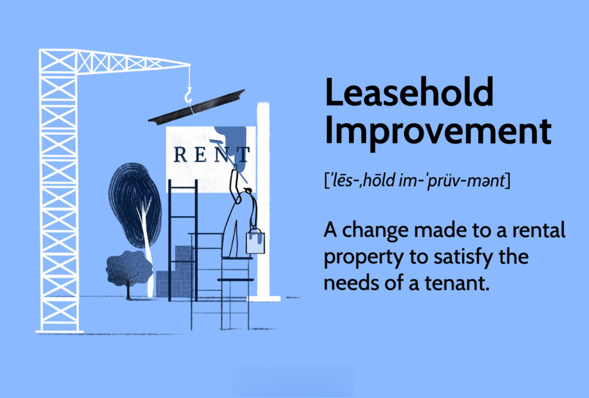

## Table of Contents

## What are leasehold improvements?

Leasehold improvements are changes or upgrades made to a rental property by a tenant. These improvements can include things like new walls, flooring, lighting, or plumbing. The purpose of these improvements is to make the space more suitable for the tenant's business needs. The tenant usually pays for these improvements, but sometimes the landlord might contribute or offer a rent reduction in return.

These improvements become part of the property and usually cannot be removed when the lease ends. Because of this, it's important for tenants to understand the terms of their lease agreement regarding leasehold improvements. The agreement should clearly state who owns the improvements at the end of the lease and whether the tenant needs to restore the property to its original condition. This helps avoid disputes and ensures both the tenant and landlord are clear on their responsibilities.

## How are leasehold improvements accounted for in financial statements?

Leasehold improvements are treated as assets on a company's balance sheet. When a business makes improvements to a leased space, it records the cost of these improvements as an asset. This asset is then depreciated over the shorter of the lease term or the useful life of the improvements. For example, if a business spends $10,000 on new flooring and the lease has 5 years left, the business would spread out the $10,000 cost over those 5 years, reducing the asset's value each year.

On the income statement, the depreciation of leasehold improvements shows up as an expense. This expense reduces the company's net income for the year. It's important for businesses to keep track of these expenses because they affect the overall profitability. Also, at the end of the lease, if the tenant has to remove the improvements or restore the property, there might be additional costs that need to be accounted for as expenses at that time.

## What is the difference between leasehold improvements and other fixed assets?

Leasehold improvements are a type of fixed asset, but they are different from other fixed assets like buildings or machinery. The main difference is that leasehold improvements are made to a space that the business does not own. Instead, the business rents the space and makes changes to make it better for their needs. These improvements become part of the rented property and usually cannot be taken away when the lease ends.

Other fixed assets, like buildings or machinery, are owned by the business and can be used as long as they are useful. These assets can also be sold or moved if the business wants to. With leasehold improvements, the business must follow the terms of the lease agreement, which might say what happens to the improvements at the end of the lease. This makes leasehold improvements different from other fixed assets because they are tied to the lease and the rented space.

## Can you explain the capitalization criteria for leasehold improvements?

Capitalization criteria for leasehold improvements means the rules a business follows to decide if they should record the cost of improvements as an asset on their financial statements. For leasehold improvements to be capitalized, they usually need to meet certain conditions. The main condition is that the improvement must increase the value or usefulness of the rented space. This means it should make the space better or more suitable for the business's needs. Also, the cost of the improvement should be significant enough to be considered an investment, not just a small repair or maintenance expense.

Another important thing to consider is the expected life of the improvement. If the improvement is expected to last longer than one year, it is more likely to be capitalized. This is because the business will spread out the cost of the improvement over its useful life, which is called depreciation. The business will also look at the lease agreement to see if the improvement can stay in the space for the whole lease term. If the lease is shorter than the useful life of the improvement, the business will depreciate the cost over the lease term instead.

## How do you determine the useful life of leasehold improvements?

The useful life of leasehold improvements is how long the improvements are expected to be useful to the business. It depends on how long the lease lasts and how long the improvements will last before they need to be replaced or fixed. If the lease is shorter than the time the improvements will last, then the useful life is the same as the lease term. This is because the business can only use the improvements for as long as they have the lease.

If the lease is longer than the life of the improvements, then the useful life is based on how long the improvements will actually last. For example, if new carpeting is expected to last 7 years but the lease is for 10 years, the useful life of the carpeting is 7 years. Businesses need to think about these things carefully because it affects how they record the cost of the improvements on their financial statements.

## What are the tax implications of leasehold improvements for businesses?

When a business makes leasehold improvements, it can affect their taxes. The cost of these improvements can be written off over time through depreciation. This means the business can reduce its taxable income each year by the amount of depreciation they claim on the improvements. The IRS has rules about how long the business can spread out this cost, usually over the useful life of the improvements or the lease term, whichever is shorter. This can help lower the business's tax bill each year.

At the end of the lease, there might be more tax things to think about. If the lease agreement says the business has to remove the improvements or put the space back to how it was, the cost of doing this can be a tax deduction in the year it happens. But if the business can leave the improvements and they add value to the property, there might be no extra tax cost. It's important for businesses to keep good records and maybe talk to a tax professional to make sure they handle the tax side of leasehold improvements correctly.

## How should leasehold improvements be depreciated, and what methods are commonly used?

Leasehold improvements should be depreciated over the shorter of the lease term or the useful life of the improvements. This means if a business makes changes to a rented space, they spread out the cost of these changes over time. This time is based on how long the lease lasts or how long the improvements will be useful, whichever is less. For example, if a business puts in new carpeting that should last 7 years but the lease is only for 5 years, they would spread out the cost over 5 years.

The most common method to depreciate leasehold improvements is the straight-line method. This means the business takes the total cost of the improvements and divides it evenly over the number of years they are depreciating it. So if the new carpeting cost $7,000 and the lease is for 5 years, the business would claim $1,400 as a depreciation expense each year. Another method, though less common for leasehold improvements, is the double declining balance method, which lets the business claim more depreciation in the early years and less in later years. But for leasehold improvements, the straight-line method is usually simpler and more straightforward.

## What happens to leasehold improvements at the end of a lease term?

At the end of a lease term, what happens to leasehold improvements depends on the lease agreement. If the agreement says the tenant can leave the improvements in place, they usually stay with the property. This can be good for the landlord because the space is already improved for the next tenant. But if the lease says the tenant must remove the improvements or restore the space to how it was before, the tenant has to do this work. This can cost the tenant money and time.

Sometimes, the tenant and landlord can negotiate what happens to the improvements. They might agree that the tenant can leave some improvements and take others with them. Or the landlord might pay the tenant for the improvements if they want to keep them. It's important for tenants to read the lease carefully and understand what they have to do at the end of the lease. This helps avoid surprises and makes sure both the tenant and landlord are happy with how things end.

## How do leasehold improvements affect the lessee's balance sheet and income statement?

When a business makes leasehold improvements, they add the cost of these improvements as an asset on their balance sheet. This means the business shows the money they spent on making the rented space better as something they own, even though they don't own the building. Over time, the business will reduce the value of this asset by spreading out the cost over the shorter of the lease term or the useful life of the improvements. This process is called depreciation, and it lowers the value of the asset on the balance sheet each year.

On the income statement, the business records the depreciation of leasehold improvements as an expense. This expense reduces the business's net income for the year. By claiming this expense, the business can lower its taxable income, which might help reduce its tax bill. At the end of the lease, if the business has to remove the improvements or restore the space, any costs for doing this would also be shown as an expense on the income statement in the year they happen.

## What are the GAAP and IFRS standards regarding leasehold improvements?

Under Generally Accepted Accounting Principles (GAAP), leasehold improvements are treated as fixed assets on the balance sheet. They are recorded at their cost and then depreciated over the shorter of the lease term or the useful life of the improvements. The depreciation expense is recognized on the income statement, which reduces the business's net income. If the lease agreement requires the lessee to remove the improvements or restore the space at the end of the lease, any costs for doing this are also expensed on the income statement in the year they occur.

International Financial Reporting Standards (IFRS) have similar rules for leasehold improvements. They are also capitalized as assets on the balance sheet and depreciated over the shorter period between the lease term and the useful life of the improvements. The depreciation is recorded as an expense on the income statement, impacting the business's net income. Like GAAP, if there are costs for removing improvements or restoring the space at the end of the lease, these costs are recognized as expenses in the year they are incurred.

## How should leasehold improvements be disclosed in financial reports?

When a business makes leasehold improvements, they need to show this in their financial reports. They do this by listing the cost of the improvements as an asset on their balance sheet. This means they write down how much they spent on making the rented space better. Over time, they will show that the value of this asset goes down. This is because they spread out the cost over the time they can use the improvements, which is called depreciation. They show how much the asset has gone down in value each year on the balance sheet.

On the income statement, the business shows the depreciation of the leasehold improvements as an expense. This means they take away the amount of depreciation from their earnings each year. By doing this, they can lower their taxable income, which might help them pay less in taxes. If they have to take out the improvements or fix the space back to how it was at the end of the lease, they will show any costs for doing this as an expense on the income statement in the year it happens.

## What are some common challenges and best practices in managing leasehold improvements?

Managing leasehold improvements can be tricky because of the rules and agreements involved. One big challenge is making sure the improvements fit with what the lease says. If the lease says you have to take the improvements out or fix the space back to how it was when you leave, it can cost a lot of money. Another challenge is figuring out how long the improvements will last and how to spread out their cost over time. This is important for keeping the [books](/wiki/algo-trading-books) right and for taxes. Also, businesses need to keep good records of everything they spend on improvements so they can prove it to the tax people if they need to.

To do a good job with leasehold improvements, it's smart to read the lease carefully and talk to the landlord before starting any work. This can help avoid surprises later. It's also a good idea to work with a good contractor who knows what they're doing and can help plan the work to fit the space and the business's needs. Keeping clear records of all the costs and talking to a tax expert can help make sure the business handles the improvements correctly on their books and for taxes. Planning ahead and understanding the lease can make managing leasehold improvements a lot easier.

## How do you account for leasehold improvements?

Leasehold improvements are considered capital improvements and must adhere to specific accounting procedures under standards such as ASC 842. Under these guidelines, leasehold improvements should be capitalized and then amortized over the shorter period of either the useful life of the improvement or the lease term. This approach ensures that the cost of the improvements is systematically allocated over the period that benefits are derived, aligning with the principles of accrual accounting.

The calculation for amortization of leasehold improvements can be represented mathematically as:

$$
\text{Annual Amortization Expense} = \frac{\text{Cost of Leasehold Improvements}}{\text{Shorter of Useful Life or Lease Term}}
$$

Consider a scenario where a company invests $100,000 in leasehold improvements with a useful life of 10 years, while the remaining lease term is 8 years. The annual amortization expense would be:

$$
\text{Annual Amortization Expense} = \frac{100,000}{8} = \$12,500
$$

Special tax considerations for leasehold improvements have been influenced significantly by legislative changes, especially following the Tax Cuts and Jobs Act (TCJA) of 2017. The TCJA introduced several amendments, impacting how businesses account for and realize tax benefits from leasehold improvements. For instance, prior to the TCJA, leasehold improvements might have been eligible for a 15-year recovery period or bonus depreciation. Post-TCJA, qualified improvement property typically falls under a 39-year recovery period unless other tax planning strategies are employed.

Tax implications of leasehold improvements can directly influence a company's cash flow and tax liabilities. Businesses should identify whether improvements qualify as "qualified improvement property" to benefit from any available deduction or accelerated depreciation.

Accurate accounting for leasehold improvements requires careful documentation and continuous evaluation. This process ensures compliance with both accounting standards and tax regulations, potentially saving companies significant time and financial resources. Properly managing leasehold improvements not only enhances the transparency of financial reporting but also plays a critical role in strategic tax planning.

## References & Further Reading

[1]: ["Accounting for Leasehold Improvements"](https://viewpoint.pwc.com/dt/us/en/pwc/accounting_guides/leases/leases__4_US/chapter_8_other_topi_US/8_1_1_leasehold_improvements.html) by IFAC

[2]: ["Property, Plant and Equipment—Proceeds before Intended Use (Amendments to IAS 16)"](https://www.iasplus.com/en/news/2020/05/ias-16) by IFRS

[3]: ["ASC 842 - Leases"](https://asc.fasb.org/layoutComponents/getPdf?isSitesBucket=false&fileName=GUID-B634D7F7-44FF-49D9-ABC9-EE1D1A346D77.pdf) by the Financial Accounting Standards Board (FASB)

[4]: ["The Basics of Lease Accounting"](https://corporatefinanceinstitute.com/resources/accounting/lease-accounting/) by Ken Tysiac 

[5]: ["Tax Cuts and Jobs Act: A Comparison for Businesses"](https://www.irs.gov/newsroom/tax-cuts-and-jobs-act-a-comparison-for-businesses) by Sally P. Schreiber