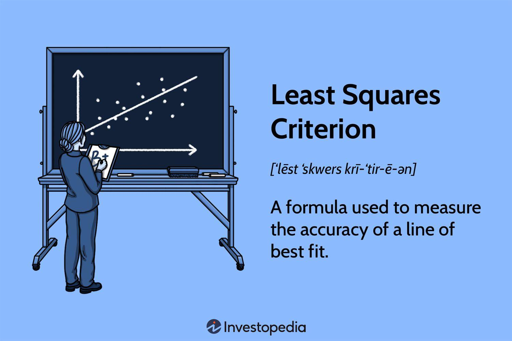

In the fast-paced world of financial markets, accurate data analysis is crucial for making informed trading decisions. With the increasing complexity and volume of market data, traders are more than ever reliant on robust analytical methods to make precise predictions and formulate strategies. Among these methods, the least squares technique stands out as a powerful statistical tool. It enables traders to find the optimal line of best fit for datasets, a task essential when analyzing historical price movements to forecast future trends.

This article explores how the intersection of data analysis, least squares methods, and algorithmic trading can greatly enhance trading strategies. Algorithmic trading involves the use of mathematical models to automate the execution of trades based on historical and real-time data. By incorporating least squares into algorithmic models, traders can gain predictive insights necessary for developing effective trading algorithms.



We delve into the mathematical foundation underlying the least squares method and its practical applications within trading contexts. This approach not only provides a deeper understanding of market dynamics but also equips traders with the essential knowledge needed to utilize these methods effectively. By enhancing their grasp of least squares, traders can better identify market trends, refine their strategies, and ultimately gain a competitive edge in the trading environment.

The aim of this article is to provide a comprehensive guide on employing these techniques, demonstrating how they integrate into the broader landscape of data-driven trading. Emphasis will be placed on both theoretical concepts and practical applications, ensuring that traders at all levels can leverage these tools to enhance their trading strategies.

## Table of Contents

## Understanding the Least Squares Method

The least squares method is a widely used statistical technique in regression analysis for determining the best-fitting line through a set of observed data points. This methodology focuses on minimizing the sum of the squares of the differences between the observed values and the values predicted by the model. This minimization ensures that the resulting line (or model) is as close to the actual data as possible, thereby enhancing predictive accuracy.

Mathematically, the least squares method can be represented for a simple linear regression with the equation:

$$

y = \beta_0 + \beta_1 x + \epsilon 
$$

where $y$ is the dependent variable, $x$ is the independent variable, $\beta_0$ is the y-intercept, $\beta_1$ is the slope of the line, and $\epsilon$ is the error term. The aim is to determine the values of $\beta_0$ and $\beta_1$ such that the sum of squared residuals:

$$

S = \sum (y_i - \beta_0 - \beta_1 x_i)^2 
$$

is minimized.

In trading, applying the least squares method allows analysts to create models that can predict the future movement of asset prices based on historical data. This is crucial in generating trading signals and making data-driven decisions. For instance, traders frequently use least squares regression to model the relationship between an equity’s moving average and its price to identify trends and reversals.

Practical applications of least squares in trading can involve more complex scenarios beyond simple linear regression, such as multiple regression, to account for multiple influential factors. For example, a trader could use the least squares method to analyze how different economic indicators predict stock price movements, or how the prices of related commodities affect each other.

Here is a simple example using Python to perform a linear least squares regression, demonstrating its application in predicting market outcomes:

```python
import numpy as np
import matplotlib.pyplot as plt
from sklearn.linear_model import LinearRegression

# Sample data: years of market data and corresponding asset prices
years = np.array([1, 2, 3, 4, 5])
prices = np.array([100, 102, 104, 108, 112])

# Reshaping data for sklearn
X = years.reshape(-1, 1)
y = prices

# Fitting the regression model
model = LinearRegression().fit(X, y)

# Predicting prices
predicted_prices = model.predict(X)

# Plotting the results
plt.scatter(years, prices, color='blue', label='Actual Prices')
plt.plot(years, predicted_prices, color='red', label='Fitted Line')
plt.xlabel('Years')
plt.ylabel('Prices')
plt.title('Least Squares Regression in Trading')
plt.legend()
plt.show()
```

This code snippet reveals how easy it is to implement the least squares method to fit a model to market data and visualize the outcome. By adopting this approach, traders can generate forecasts about future price movements, which can subsequently be used to devise trading strategies.

The utility of the least squares method extends beyond simple predictions by serving as a foundational tool in creating complex algorithms that can adapt to dynamic market conditions. Its central role in data-driven trading strategies makes it indispensable for traders aiming to optimize their decision-making processes, improve strategy performance, and ultimately gain a competitive edge in the financial markets.

## Applications in Algorithmic Trading

Algorithmic trading has revolutionized the financial industry by utilizing advanced mathematical models to execute trades with precision and speed. Among these models, the least squares method is extensively employed to predict asset prices and develop effective trading algorithms. By examining historical data, the least squares method minimizes the discrepancy between observed and predicted values, thereby optimizing predictive accuracy.

The application of least squares in trading involves constructing regression models to identify trends in asset prices. For instance, linear regression, a common technique, models the relationship between an independent variable (such as time) and a dependent variable (such as asset prices). The regression line, $y = mx + c$, where $y$ is the predicted asset price, $m$ is the slope, $x$ is the independent variable, and $c$ is the y-intercept, represents the line that minimizes the sum of squared differences between the observed and predicted values.

In constructing trading algorithms, the use of least squares aids in determining buy and sell signals based on the regression line's slope. A positive slope may indicate an upward trend, suggesting a buying opportunity, while a negative slope could signal a potential decline, prompting a sell decision. These predictive insights enable traders to automate strategies, minimizing emotional bias and human error.

Here's a Python code snippet that demonstrates the practical application of the least squares method in automating a simple trading process:

```python
import numpy as np
import pandas as pd
import matplotlib.pyplot as plt
from sklearn.linear_model import LinearRegression

# Sample historical data (example: stock prices over time)
data = {'Time': [1, 2, 3, 4, 5], 'Price': [100, 102, 104, 103, 105]}
df = pd.DataFrame(data)

# Independent and dependent variables
X = df['Time'].values.reshape(-1, 1)
y = df['Price'].values.reshape(-1, 1)

# Linear regression model
model = LinearRegression()
model.fit(X, y)

# Predicting future prices
future_times = np.array([6, 7, 8]).reshape(-1, 1)  # Example future times
predicted_prices = model.predict(future_times)

# Plotting the results
plt.scatter(df['Time'], df['Price'], color='blue', label='Actual Prices')
plt.plot(df['Time'], model.predict(X), color='red', label='Regression Line')
plt.scatter(future_times, predicted_prices, color='green', label='Predicted Prices')
plt.xlabel('Time')
plt.ylabel('Price')
plt.legend()
plt.title('Least Squares Regression in Trading')
plt.show()
```

This code uses historical time-series data to construct a linear regression model that predicts future asset prices. By plotting the regression line and the predicted prices, traders can visualize potential market movements and adjust their strategies accordingly. This approach facilitates the development of trading algorithms that are robust to historical patterns, enabling systematic and informed trading decisions. As the financial markets continue to evolve, leveraging the least squares method within [algorithmic trading](/wiki/algorithmic-trading) remains crucial for optimizing investment strategies and enhancing market performance.

## Advantages and Challenges

The least squares method stands out in financial analysis by offering the advantage of simplicity and precise trend identification. It is particularly beneficial in algorithmic trading, where identifying and leveraging trends is central to strategy development. The method's straightforward mathematical framework enables traders to apply it efficiently without needing extensive computational resources. The primary computational goal, minimizing the sum of squares of discrepancies between observed and predicted values, ensures that the trend line or model reflects the underlying dataset closely. This accuracy is crucial for traders who rely on historical data to forecast future market behavior.

However, employing the least squares method is not without challenges. One significant drawback is its sensitivity to outliers. Outliers can disproportionately influence the trend line, leading to skewed analysis and unreliable predictions. An effective strategy to mitigate this issue involves robust statistical techniques such as outlier detection algorithms. For instance, using Python, traders can integrate outlier rejection methods before applying least squares:

```python
import numpy as np
from sklearn.linear_model import RANSACRegressor
from sklearn.datasets import make_regression

# Example dataset with outliers
X, y = make_regression(n_samples=100, n_features=1, noise=4.0)
y[::10] += 50  # Adding outliers

# Applying RANSAC for robust regression
ransac = RANSACRegressor()
ransac.fit(X, y)
line_y = ransac.predict(X)

# Plotting for visualization
import matplotlib.pyplot as plt
plt.scatter(X, y, color='red', label='Data with outliers')
plt.plot(X, line_y, color='blue', label='Robust fit')
plt.legend()
plt.show()
```

Another challenge is the limitation in handling complex, multi-variable market dynamics. The traditional least squares approach, effective for univariate linear problems, may struggle with the intricacies of multivariate or non-linear trends. To address this challenge, enhanced models like multivariate linear regression or generalized least squares (GLS) can be utilized to accommodate additional variables and correlations:

$$
\beta = (X^TX)^{-1}X^Ty
$$

where $X$ is the matrix of features including multiple independent variables, and $y$ is the dependent variable vector.

In algorithmic trading, sophisticated strategies often require dealing with multiple variables simultaneously. Utilizing [machine learning](/wiki/machine-learning) frameworks that build on the basic least squares foundations, such as ridge regression or polynomial regression, can enhance model robustness. These models help in regularizing and adapting to multiple market factors, thus providing a more comprehensive trading strategy.

Overall, while the least squares method is a foundational tool with clear advantages, addressing its challenges through outlier management and adaptation to complex dynamics is essential for its effective application in algorithmic trading.

## Case Study: Implementing a Least Squares Trading Strategy

Using the least squares method to refine trading strategies can significantly enhance the understanding of market dynamics and improve decision-making processes. This case study demonstrates this by focusing on the correlation between market indices.

### Market Index Correlations

Market indices are composite measures that reflect the performance of a group of stocks, commodities, or other financial instruments. By analyzing correlations between these indices, traders can identify potential co-movements and dependencies. For instance, understanding how the S&P 500 index correlates with the NASDAQ can provide insights into broader market trends.

To illustrate this, we will use a Python-driven approach to calculate and visualize the linear regression line, applying the least squares method to historical market index data.

### Step-by-Step Guide: Calculating and Plotting Regression Lines Using Python

**1. Data Collection and Preparation**

The first step is to collect historical data for the market indices of interest. This data might include daily closing prices over a specified period.

```python
import pandas as pd
import numpy as np
import matplotlib.pyplot as plt
from sklearn.linear_model import LinearRegression

# Load historical index data
indices_data = pd.read_csv('market_indices.csv')

# Extract relevant data for S&P 500 and NASDAQ
sp500 = indices_data['SP500']
nasdaq = indices_data['NASDAQ']

# Reshape data for regression
X = np.array(sp500).reshape(-1, 1)
y = np.array(nasdaq).reshape(-1, 1)
```

**2. Implementing the Least Squares Regression**

We use the `LinearRegression` model from `sklearn` to fit a regression line through our dataset.

```python
# Initialize the model
model = LinearRegression()

# Fit the model
model.fit(X, y)

# Predict using the regression model
predicted_nasdaq = model.predict(X)

# Coefficients of the regression line
slope = model.coef_[0]
intercept = model.intercept_
```

**3. Plotting the Regression Line**

Visualizing the data alongside the regression line can highlight the relationship and trends between the indices.

```python
# Plot data points
plt.scatter(sp500, nasdaq, color='blue', label='Data Points')

# Plot regression line
plt.plot(sp500, predicted_nasdaq, color='red', linewidth=2, label='Regression Line')

# Labels
plt.title('S&P 500 vs. NASDAQ Regression')
plt.xlabel('S&P 500 Index')
plt.ylabel('NASDAQ Index')
plt.legend()
plt.show()
```

### Impact on Trading Decisions and Outcomes

The results of this case study demonstrate how the least squares method aids in identifying key market relationships. The slope of the regression line indicates the direction and strength of the relationship between the indices. A positive slope suggests a positive correlation: as the S&P 500 increases, the NASDAQ tends to increase as well, and vice versa. Such insights are integral to constructing trading strategies, particularly in pairs trading where the relationship between two correlated assets is exploited.

By incorporating these quantitative insights into trading strategies, traders can position themselves based on expected market movements, potentially increasing the profitability of their trades. This method also assists in risk management by quantifying the extent of [volatility](/wiki/volatility-trading-strategies) that may be associated with correlated market moves. Additionally, it serves as a foundational tool for more advanced algorithmic trading systems that blend statistical analysis with real-time data processing.

Overall, implementing a least squares trading strategy based on market index correlations provides a structured approach to decision-making, which is crucial for achieving long-term success in algorithmic trading.

## The Future of Data Analysis in Trading

Advancements in machine learning and [artificial intelligence](/wiki/ai-artificial-intelligence) are significantly transforming algorithmic trading strategies. Machine learning algorithms can process vast amounts of data more efficiently than traditional methods, identifying patterns and predicting market movements with high accuracy. These technological improvements enable the development of sophisticated trading models that adapt continuously to evolving market conditions.

The least squares method plays a crucial role as a foundational tool in integrating these advanced analytical models. Although it is a traditional approach, its ability to provide simple yet effective predictive insights makes it valuable in constructing modern trading systems. By minimizing the sum of squared deviations between observed and predicted values, the least squares method refines the accuracy of machine learning models used in trading algorithms. It serves as a bridge between basic statistical techniques and complex algorithmic strategies, ensuring that the predictions remain rooted in a statistically sound framework.

Python, commonly used in algorithmic trading for its versatility and extensive libraries, offers numerous tools for implementing machine learning and AI-based trading strategies. Libraries like Scikit-learn and TensorFlow facilitate the implementation of regression models, where the least squares method can be employed to optimize model parameters. Below is a simple example of using Python and Scikit-learn to fit a linear regression model:

```python
from sklearn.model_selection import train_test_split
from sklearn.linear_model import LinearRegression
import numpy as np

# Example data
X = np.array([[1, 2], [2, 3], [3, 4], [4, 5]])
y = np.array([2, 3, 4, 5])

# Splitting data into training and test sets
X_train, X_test, y_train, y_test = train_test_split(X, y, test_size=0.2, random_state=0)

# Initialize linear regression model
model = LinearRegression()

# Fit model
model.fit(X_train, y_train)

# Predictions
predictions = model.predict(X_test)
```

Potential future trends in data analysis for trading include the integration of real-time data analytics and sentiment analysis from social media platforms, providing a richer context for trading decisions. Furthermore, quantum computing holds promise for enhancing algorithmic trading by solving complex computational problems more quickly, thereby improving the speed and accuracy of trade execution.

Moreover, the development of hybrid models that combine classical statistical methods, like least squares, with machine learning techniques can lead to more robust trading algorithms. These models can leverage the strengths of each method, using least squares regression to ensure statistical reliability, while machine learning elements bring adaptability and predictive power.

In conclusion, data analysis in trading is moving towards more integrative and adaptive techniques, with least squares continuing to maintain its relevance as a foundational statistical tool. The convergence of traditional and modern methods in algorithmic trading promises innovations that can potentially transform trading strategies for the better.

## Conclusion

The least squares method plays a pivotal role in enhancing algorithmic trading strategies by providing traders with a mathematical and statistical foundation for accurate data analysis. Its effectiveness lies in its ability to minimize the discrepancies between observed and predicted values, offering a robust mechanism for identifying trends and predicting future market movements. By integrating least squares into trading algorithms, traders can develop more reliable and efficient strategies that harness historical data for predictive insights.

Mastering the least squares method equips traders with a crucial tool for gaining a competitive edge in today's data-driven financial markets. As algorithmic trading largely depends on precise data interpretation and the ability to anticipate market changes, the mathematical rigor and simplicity of least squares make it indispensable. This method's strength in filtering noise and enhancing signal quality ensures that traders can execute well-informed decisions, potentially leading to greater profitability and reduced risks.

Additionally, the least squares method serves as a foundational element for more complex models and algorithms prevalent in algorithmic trading. By understanding and applying this technique, traders lay the groundwork for integrating advanced analytical models, including machine learning and artificial intelligence, further amplifying their strategic capabilities. Mastery of least squares, therefore, is not merely an academic exercise but a strategic investment in enhancing a trader's analytical arsenal, positioning them at the forefront of technological advancements in trading.

## FAQs

**Common questions about the least squares method and its application in finance and trading:**

1. **What is the Least Squares Method?**
   The least squares method is a statistical technique commonly used in regression analysis to identify the line of best fit for a set of data points. The primary objective is to minimize the sum of the squared differences between observed values and the values predicted by the model. The formula used is:
$$
   \text{Minimize } \sum_{i=1}^{n} (y_i - (mx_i + b))^2

$$

   where $y_i$ is the observed value, $mx_i + b$ is the predicted value, $m$ is the slope of the line, $b$ is the y-intercept, and $n$ is the number of data points.

2. **How is Least Squares Used in Trading?**
   In trading, least squares is often used in the creation of predictive models. These models can estimate future prices based on historical data, allowing traders to identify trends and make informed decisions. By calculating a regression line, analysts can predict how assets will perform, thus aiding in strategy formulation.

3. **Why is the Least Squares Method Important for Algorithmic Trading?**
   Algorithmic trading relies on historical data to automate trading decisions. The least squares method provides a mathematical basis to develop accurate models for predicting market trends. This increases the efficiency and profitability of algorithms through enhanced decision-making capabilities.

4. **What Are Common Misunderstandings About the Least Squares Method?**
   Some traders might mistakenly believe that the least squares method accounts for all market variables and complexities, overlooking its sensitivity to outliers and limited scope in multi-variable scenarios. It’s crucial to understand that while least squares can identify trends effectively, it may not adequately model non-linear relationships or sudden market shocks.

5. **Can Least Squares Handle Market Variability?**
   The least squares method is mostly linear and may struggle with highly volatile and non-linear market movements. However, improvements can be made through techniques like regularization or using a combination with other statistical models to account for complexity and variability in the market.

6. **Are There Any Software Tools for Implementing Least Squares in Trading?**
   Yes, various statistical and trading software, including Python libraries such as NumPy and SciPy, provide built-in functions to implement least squares regression. Example Python code to perform a simple least squares regression might look like this:

   ```python
   import numpy as np
   import matplotlib.pyplot as plt

   # Example data
   x = np.array([1, 2, 3, 4, 5])
   y = np.array([2, 3, 5, 7, 11])

   # Perform least squares regression
   A = np.vstack([x, np.ones(len(x))]).T
   m, c = np.linalg.lstsq(A, y, rcond=None)[0]

   # Plot the results
   plt.plot(x, y, 'o', label='Original data', markersize=10)
   plt.plot(x, m*x + c, 'r', label='Fitted line')
   plt.legend()
   plt.show()
   ```

   This code snippet demonstrates how least squares can be used to fit a linear model to a dataset, providing a foundation for predictive analysis in trading.

## References & Further Reading

1. **Montgomery, D. C., Peck, E. A., & Vining, G. G. (2012).** *Introduction to Linear Regression Analysis*. This comprehensive text covers the theoretical foundations of linear regression, including the least squares method, providing essential insights for statistical modeling and forecasting.

2. **Hastie, T., Tibshirani, R., & Friedman, J. (2009).** *The Elements of Statistical Learning: Data Mining, Inference, and Prediction.* This resource explores a wide range of data analysis techniques, emphasizing machine learning approaches useful in trading applications.

3. **Benninga, S. (2014).** *Financial Modeling*. This book introduces quantitative analysis in finance, demonstrating tools like Excel and VBA to model trading strategies based on the least squares method and other financial concepts.

4. **Chan, E. (2009).** *Quantitative Trading: How to Build Your Own Algorithmic Trading Business*. This work provides practical insights into building algorithmic trading systems, incorporating statistical methods like least squares to develop successful strategies.

5. **Murray, J. (2019).** *Financial Data Analysis: A Comprehensive Guide to Modeling and Forecasting*. This guide presents methods for analyzing financial data with a focus on prediction and modeling, critical for least squares applications in trading.

6. **Pysal, M., et al. (2021).** *Programming in Python 3: A Complete Introduction to the Python Language*. This source is particularly useful for implementing the least squares method and other statistical analyses in Python, which is crucial for algorithmic trading.

7. **Shreve, S. (2004).** *Stochastic Calculus for Finance II: Continuous-Time Models.* This advanced text discusses mathematical methods for financial modeling, including statistical tools that support algorithmic trading developments and least squares applications.

8. **Kats, D. (2021).** *Machine Learning for Financial Market Trading*. This recent publication bridges machine learning techniques with financial modeling and trading strategies, offering examples of integrating the least squares method with modern technologies.

9. **Research Articles and Journals:**
   - *Journal of Financial Economics* for scholarly articles on financial modeling techniques.
   - *Quantitative Finance* provides insights into quantitative methods and their application in financial markets.
   - *AI & Society* examines the intersection of advanced technologies like AI in algorithmic trading.

10. **Online Resources:**
    - *QuantInsti* (www.quantinsti.com): Offers free resources and courses on algorithmic trading, including the use of least squares in trading strategies.
    - *Investopedia* (www.investopedia.com): A rich source of articles explaining fundamental concepts, including statistical methods used in trading.
    - *Kaggle* (www.kaggle.com): A hub for datasets and code sharing, beneficial for practicing least squares implementations in Python for financial predictions.

