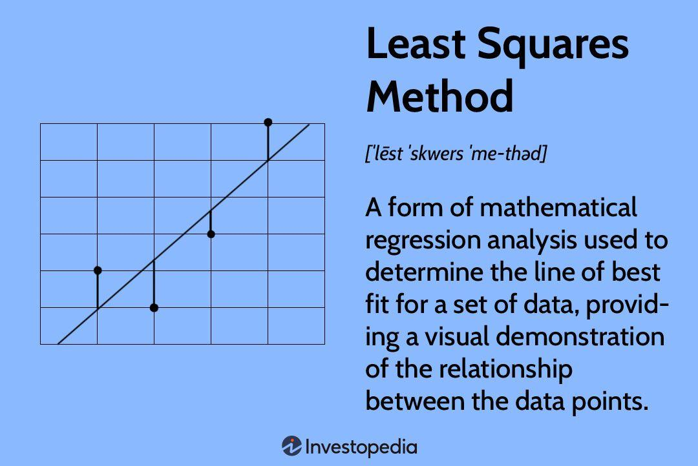

In the fast-paced world of financial markets, data analysis has become indispensable. Accurate data analysis is critical for traders who seek to understand and predict market behavior. Among the various mathematical methods deployed for this purpose, the least squares method stands out for its effectiveness in identifying relationships and patterns within data. It is a fundamental tool in statistical regression analysis, primarily used to find the line of best fit by minimizing the sum of the squares of the deviations between observed and predicted values. This technique provides traders with a clear structure for understanding the interplay between market variables, enhancing their ability to anticipate and respond to market movements.

Algorithmic trading, which relies heavily on data analysis and mathematical models, often employs the least squares method. The integration of such quantitative techniques allows for the automation of trades, enabling precise execution of trading strategies based on historical data and forecast models. By leveraging the least squares method, traders aim to extract meaningful insights from complex datasets, facilitating more informed decision-making processes.



As financial markets continue to evolve with technological advancements, the importance of sophisticated data analysis techniques like the least squares method only grows. This article explores the intersection of data analysis, least squares methods, and algorithmic trading, offering insights into how these techniques can enhance trading strategies, ultimately supporting traders in a highly competitive and data-centric trading environment.

## Table of Contents

## Understanding the Least Squares Method

The least squares method is a fundamental tool in statistical regression analysis used to find the line of best fit for a given dataset. The primary objective of this method is to minimize the sum of the squares of the differences between the observed values and the values predicted by the model. This minimizes the discrepancy between the data points and the fitted line, providing a clear representation of the relationship among variables.

In mathematical terms, for a simple linear regression, this relationship can be expressed as $y = \beta_0 + \beta_1x + \epsilon$, where $y$ is the dependent variable, $x$ is the independent variable, $\beta_0$ and $\beta_1$ are the coefficients to be estimated, and $\epsilon$ is the error term. The goal is to determine the values of $\beta_0$ and $\beta_1$ that minimize the sum of square errors (SSE), defined as:

$$
SSE = \sum_{i=1}^{n} (y_i - \beta_0 - \beta_1x_i)^2
$$

To achieve this, partial derivatives of the SSE with respect to $\beta_0$ and $\beta_1$ are set to zero, leading to the normal equations used to calculate these coefficients.

Traders harness the power of the least squares method to identify trends and forecast market behavior. By focusing on the relationship between independent variables such as time or indices and dependent variables like stock prices, they discern critical patterns that guide trading decisions. For example, by applying a least squares linear regression to historical price data, traders can identify the overall trend of a security's price movement, thereby allowing for informed predictions about future price behavior. 

This method's ability to highlight intricate links between market variables provides traders with strategic insights necessary for optimizing their trading decisions. Despite its utility, traders must also be alert to potential pitfalls such as overfitting, which can occur when the regression model is overly complex and fails to generalize well to new data. Nevertheless, the least squares method's simplicity and effectiveness in capturing key trends make it an invaluable tool in financial market analysis.

## Applications in Algorithmic Trading

Algorithmic trading, often referred to as algo trading, relies heavily on algorithms to execute trades. These algorithms are developed through comprehensive analysis of historical data and the application of mathematical models, such as the least squares method. This approach significantly enhances trading strategies by enabling automation, thus facilitating trades with greater precision and efficiency.

Least squares is a statistical method for estimating the coefficients of a linear equation that best fits a dataset. It does so by minimizing the sum of the squares of the residuals, which are the differences between observed and predicted values. In the context of [algorithmic trading](/wiki/algorithmic-trading), this method proves invaluable, particularly in developing strategies where understanding market trends and predicting asset price movements are critical.

For instance, consider a simplified linear regression model used to predict the future price of a security based on past data. Using the least squares method, a trader can determine the line of best fit that correlates the security's past price data with time. This line can be represented by the equation:

$$
y = mx + c
$$

where $y$ is the predicted price, $m$ represents the slope, $x$ is the time variable, and $c$ is the y-intercept. By calculating $m$ and $c$ that minimize the residual sum of squares, traders can more accurately forecast future price trends.

Python, a popular programming language for data analysis, can be used to implement this method. Here is a simple example of how one might apply the least squares method to a historical price dataset using Python:

```python
import numpy as np

# Example data: time (in days) and stock prices
x = np.array([1, 2, 3, 4, 5])
y = np.array([10, 12, 15, 17, 19])

# Performing a linear regression using the least squares method
A = np.vstack([x, np.ones(len(x))]).T
m, c = np.linalg.lstsq(A, y, rcond=None)[0]

# Predicted prices
predicted_y = m * x + c

print("Slope (m):", m)
print("Intercept (c):", c)
print("Predicted Prices:", predicted_y)
```

By applying this methodology, traders are equipped to spot correlations between different market variables and construct predictive models that embody these relationships. This capability is particularly advantageous when dealing with high-frequency trading, where algorithms must respond to market changes almost instantaneously. Additionally, the automation of these processes allows traders to eliminate human error and emotional biases, thereby optimizing overall trading performance.

In essence, the least squares method provides a straightforward yet powerful means of analyzing financial data to extract insights necessary for crafting robust trading strategies. Its integration into algorithmic trading underscores its importance for traders striving to maintain an edge in increasingly complex financial markets.

## Advantages and Challenges

The least squares method offers several compelling advantages in the context of trading. Its primary benefit lies in its simplicity and effectiveness in defining linear relationships between variables, which is crucial for predicting market trends and making informed investment decisions. By minimizing the sum of the squares of the differences between the observed and predicted values, the least squares method helps traders model and understand the underlying patterns of market data. This systematic approach to trend analysis supports the development of trading strategies that are both robust and efficient.

However, the method is not without challenges. One of its main drawbacks is sensitivity to outliers. Outliers can significantly skew the results, leading to inaccurate models and predictions. This limitation can hinder traders who rely on this method to inform their strategies. Moreover, the least squares method traditionally deals with two variables, limiting its capacity to capture the complexities of financial markets where multiple factors might interact simultaneously. This simplicity might result in the oversight of additional influential variables that could affect trading outcomes.

Algorithmic trading, which integrates the least squares method, also encounters challenges such as overfitting and market impact. Overfitting occurs when a model is too closely tailored to historical data, reducing its predictive power for future market conditions. Market impact refers to the changes in asset prices caused by the trading activity itself, which can further distort outcomes. Despite these challenges, advancements in computational power and data processing are continuously improving the ability to address such issues, making the least squares method a valuable component of algorithmic trading strategies.

## Case Study: Implementing a Least Squares Trading Strategy

Consider a scenario where a trader uses the least squares method to analyze the correlation between a stock's price and a market index, aiming to refine their trading strategy. This method involves plotting historical stock prices against corresponding index values to identify patterns that could signal future price movements.

The trader begins by collecting historical data for both the stock and the market index. They then use the least squares method to calculate the line of best fit. The least squares regression line is expressed by the formula $y = mx + b$, where $y$ represents the predicted stock price, $m$ is the slope of the line, $x$ is the index value, and $b$ is the y-intercept.

Utilizing Python, the trader can perform this analysis with libraries such as `numpy` and `matplotlib`. Here is a sample code snippet to calculate and plot the regression line:

```python
import numpy as np
import matplotlib.pyplot as plt
from scipy.stats import linregress

# Sample data: stock prices and corresponding market index values
stock_prices = np.array([202, 215, 210, 222, 225])
market_index = np.array([1500, 1523, 1540, 1565, 1570])

# Calculate the line of best fit
slope, intercept, r_value, p_value, std_err = linregress(market_index, stock_prices)

# Function to compute predicted stock prices
def predict_price(index_value):
    return slope * index_value + intercept

# Plot the data and the regression line
plt.scatter(market_index, stock_prices, color='blue', label='Actual Prices')
plt.plot(market_index, predict_price(market_index), color='red', label='Regression Line')
plt.xlabel('Market Index')
plt.ylabel('Stock Prices')
plt.title('Least Squares Regression')
plt.legend()
plt.show()

# Print the slope and intercept
print(f"Slope: {slope}, Intercept: {intercept}")
```

By determining the regression line, the trader can estimate stock prices based on the current or forecasted market index. Entry points are identified when the actual stock price falls below the predicted price (indicating potential undervaluation), while [exit](/wiki/exit-strategy) points are marked when the stock price exceeds the predicted value (suggesting overvaluation).

This method's strength lies in its ability to provide a systematic approach for predicting market behavior, yet it's important to be cautious of its limitations, especially in volatile market conditions. Real-world applications must consider external factors beyond the dataset to avoid reliance solely on historical performance. Nonetheless, this case study illustrates the practicality of the least squares method in creating adaptable trading strategies aligned with observed market trends.

## The Future of Data Analysis in Trading

As technology evolves, the role of data analysis in trading is undergoing significant transformation. Advanced techniques such as [machine learning](/wiki/machine-learning) (ML) and [artificial intelligence](/wiki/ai-artificial-intelligence) (AI) are set to further revolutionize algorithmic trading strategies. These technologies enable traders to process vast amounts of data with increased speed and accuracy, uncovering complex patterns that were previously difficult to identify using traditional methods alone.

The least squares method, fundamental for statistical analysis, remains an essential tool within this landscape. It supports more sophisticated models by providing a foundation in accurately identifying relationships between variables. For instance, ML algorithms often rely on linear regression for initial analyses, where the least squares method is crucial. This approach helps in optimizing predictive models before layering them with more complex analyses like neural networks or ensemble methods. 

In practice, combining traditional techniques with modern technology can improve predictive accuracy. Consider a scenario where a trader uses a simple linear regression model with least squares to approximate initial trends. By feeding these outputs into a machine learning model, traders can refine predictions, accommodating non-linear relationships and dataset anomalies.

For traders to maintain competitiveness in this data-centric era, continuous education and adaptation to emerging analytical tools are imperative. Utilizing programming languages like Python facilitates the integration of least squares with advanced data analysis techniques. Here's an example code snippet demonstrating a basic integration of least squares in a machine learning workflow:

```python
import numpy as np
from sklearn.linear_model import LinearRegression
from sklearn.model_selection import train_test_split
from sklearn.metrics import mean_squared_error

# Sample data
X = np.random.rand(100, 1) * 10  # Independent variable (e.g. market index)
y = 3 * X.squeeze() + np.random.randn(100) * 2  # Dependent variable (e.g. stock price)

# Splitting data
X_train, X_test, y_train, y_test = train_test_split(X, y, test_size=0.2, random_state=42)

# Linear regression model using least squares
model = LinearRegression()
model.fit(X_train, y_train)

# Predictions
y_pred = model.predict(X_test)

# Model evaluation
mse = mean_squared_error(y_test, y_pred)
print(f'Mean Squared Error: {mse}')

# The results from this model can be fed into more complex models for further improvement
```

Keeping abreast of technologies requires dedication to evolving methodologies and tools, allowing traders to navigate and leverage increasingly data-dominated markets. Organizations should prioritize training programs that focus on the latest data analysis advancements, ensuring that analysts can effectively deploy strategies that integrate both the old and the new. The fusion of established methods like least squares with advanced analytical approaches will be pivotal in mastering future market dynamics.

## Conclusion

The least squares method remains a cornerstone in the arsenal of data analysis tools for traders. By providing a clear and accurate way to model relationships between variables, it enhances the precision of algorithmic trading strategies. This method enables traders to distill complex market data into understandable trends, informing decisions with a mathematical foundation. The ability to fit a line that minimizes the discrepancies between observed and predicted values allows for clearer insights into market behavior and potential future trends.

In the evolving financial landscape, where data becomes increasingly abundant, the proficiency in using the least squares method is more indispensable than ever before. Its fundamental approach to regression analysis serves as a basis for more advanced techniques, including machine learning models that require the foundational understanding of statistical relationships. 

With markets continuously evolving, traders who master this method will have a significant advantage, as they can more effectively interpret data-driven signals and adapt their strategies accordingly. In a trading environment that prizes speed and accuracy, the least squares method remains a vital tool for gaining a competitive edge. As technology and data analysis techniques advance, integrating these methodologies sustainably will be crucial for ongoing success in trading.

## FAQs

1. **What is the least squares method?**

The least squares method is a mathematical technique used in statistical regression analysis for determining the best-fitting curve or line to a given set of data points. This method minimizes the sum of the squares of the differences between the observed values and those predicted by the model. In mathematical terms, if $y_i$ is the observed value and $f(x_i)$ is the predicted value, the goal is to minimize:

$$
S = \sum_{i=1}^{n} (y_i - f(x_i))^2
$$

This approach provides a clear understanding of relationships between variables and is especially useful for identifying trends.

2. **How is the least squares method applied in finance?**

In finance, the least squares method is applied to perform regression analysis, which helps in modeling and predicting market behaviors. Traders use it to analyze historical data of stock prices and economic indicators to discern trends and make informed predictions. For example, the method can be used to estimate the beta coefficient in the Capital Asset Pricing Model (CAPM), which quantifies the relationship between the return of a security and the return of the overall market.

3. **What are the benefits of using the least squares method in trading?**

The least squares method offers several benefits in trading:

- **Simplicity and clarity**: It provides a straightforward mathematical approach to understanding relationships between independent and dependent variables.
- **Trend identification**: It helps in identifying prevailing market trends, aiding traders in making strategic decisions based on quantitative data.
- **Systematic approach**: It delivers a systematic methodology for analyzing large datasets, making it easier to develop robust trading models.

4. **Can the least squares method predict future stock prices?**

While the least squares method can help identify trends and model relationships between variables, it has limitations in predicting future stock prices. The financial markets are influenced by a multitude of factors, including unforeseen variables and market sentiment, which may not be captured by the model. Therefore, while it offers insights into potential trends, relying solely on the least squares method for predicting future stock prices can result in overfitting and misinterpretation of market dynamics.

5. **How does algorithmic trading benefit from the least squares method?**

Algorithmic trading benefits from the least squares method through enhanced decision-making and strategy automation. By incorporating this method into algorithmic models, traders can automate the process of identifying and exploiting market trends with precision. The quantitative basis provided by least squares aids in developing algorithms that can execute trades efficiently based on historical data patterns. This systematic analysis helps in reducing the emotional bias in trading, allowing for more consistent application of trading strategies.

## References & Further Reading

[1]: Bergstra, J., Bardenet, R., Bengio, Y., & Kégl, B. (2011). ["Algorithms for Hyper-Parameter Optimization."](https://dl.acm.org/doi/10.5555/2986459.2986743) Advances in Neural Information Processing Systems 24.

[2]: ["Advances in Financial Machine Learning"](https://www.amazon.com/Advances-Financial-Machine-Learning-Marcos/dp/1119482089) by Marcos Lopez de Prado

[3]: ["Evidence-Based Technical Analysis: Applying the Scientific Method and Statistical Inference to Trading Signals"](https://www.semanticscholar.org/paper/Evidence-Based-Technical-Analysis%3A-Applying-the-and-Aronson/3b33df8737f1772e9e14d66a08c9696f140a2ee1) by David Aronson

[4]: ["Machine Learning for Algorithmic Trading"](https://github.com/stefan-jansen/machine-learning-for-trading) by Stefan Jansen

[5]: ["Quantitative Trading: How to Build Your Own Algorithmic Trading Business"](https://books.google.com/books/about/Quantitative_Trading.html?id=j70yEAAAQBAJ) by Ernest P. Chan