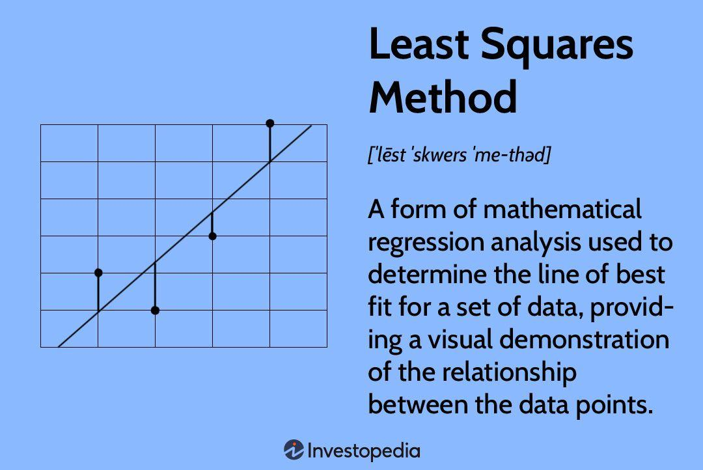

## Table of Contents

## What is Least Squares Regression and how does it relate to machine learning?

Least Squares Regression is a method used to find the best-fitting line through a set of data points. It does this by minimizing the sum of the squared differences between the observed values and the values predicted by the line. In simpler terms, it tries to make the line as close as possible to all the points by reducing the errors. The formula for the line is often written as $$y = mx + b$$, where \(m\) is the slope and \(b\) is the y-intercept. The method calculates \(m\) and \(b\) to minimize the squared errors, which is why it's called "least squares."

In machine learning, Least Squares Regression is a fundamental technique used in supervised learning, particularly for regression tasks. It's often used as a starting point for more complex models because it's simple and interpretable. Machine learning algorithms can build on the principles of least squares to handle more complex data and relationships. For example, in linear regression, which is a type of machine learning model, the goal is to predict a continuous outcome variable based on one or more predictor variables. The least squares method is used to find the best coefficients for these predictors, making it a key part of many machine learning models.

## How does the Least Squares method work to minimize errors in regression models?

The Least Squares method works by finding the line that best fits a set of data points. Imagine you have a bunch of dots on a graph, and you want to draw a straight line that comes as close as possible to all of them. The method does this by calculating the difference between each dot and the line, squaring those differences, and then adding them all up. The goal is to make this total as small as possible. This is why it's called "least squares" – it's trying to minimize the sum of the squares of the errors.

To find the best line, the Least Squares method uses a formula to calculate the slope (m) and the y-intercept (b) of the line. The formula for the line is $$y = mx + b$$. The method adjusts \(m\) and \(b\) to make the total of the squared errors as small as it can be. By doing this, the line ends up being the best possible fit for the data points. This approach is simple but powerful, and it's used in many areas, including machine learning, to make predictions based on data.

## What are the basic assumptions required for Least Squares Regression to be valid?

Least Squares Regression works well when certain things about the data are true. One big thing is that the relationship between the variables you're looking at should be linear. This means that if you plot your data on a graph, it should look like it could be well represented by a straight line. If the data doesn't follow a straight line, then using Least Squares Regression might not give you good results. Another important thing is that the errors, or the differences between the actual data points and the line, should be normally distributed. This means that if you looked at all the errors, they should form a bell-shaped curve around zero.

Another assumption is that the errors should have the same variance for all values of the predictor variable. This is called homoscedasticity. If the spread of the errors changes as the predictor variable changes, it's called heteroscedasticity, and it can make the Least Squares method less reliable. Lastly, the errors should be independent of each other. This means that knowing the error for one data point shouldn't help you predict the error for another data point. If the errors are related to each other, it can mess up the results of the regression.

These assumptions are important because they help make sure that the line you get from Least Squares Regression is a good fit for your data. If these assumptions aren't met, you might need to use a different method or transform your data to make it work better with Least Squares Regression. Checking these assumptions is a key part of using this method correctly.

## Can you explain the difference between Simple and Multiple Least Squares Regression?

Simple Least Squares Regression is used when you want to see how one thing affects another. For example, you might want to know how the number of hours studied affects the score on a test. In this case, you have one thing you're looking at (hours studied) and one thing you're trying to predict (test score). The formula for this is $$y = mx + b$$, where \(y\) is the thing you're trying to predict, \(x\) is the thing you're looking at, \(m\) is the slope, and \(b\) is where the line crosses the y-axis. The Least Squares method finds the best \(m\) and \(b\) to make the line as close as possible to all the data points.

Multiple Least Squares Regression is used when you want to see how more than one thing affects what you're trying to predict. For example, you might want to know how both the number of hours studied and the number of hours slept affect the test score. In this case, you have more than one thing you're looking at (hours studied and hours slept) and one thing you're trying to predict (test score). The formula for this is $$y = b_0 + b_1x_1 + b_2x_2 + ... + b_nx_n$$, where \(y\) is the thing you're trying to predict, \(x_1, x_2, ..., x_n\) are the things you're looking at, and \(b_0, b_1, b_2, ..., b_n\) are the coefficients that the Least Squares method finds to make the line as close as possible to all the data points. This method is more complex but can give a better understanding of how multiple factors work together to affect the outcome.

## How do you calculate the coefficients in a Least Squares Regression model?

To calculate the coefficients in a Simple Least Squares Regression model, you need to find the best values for the slope (\(m\)) and the y-intercept (\(b\)) in the equation \(y = mx + b\). The slope \(m\) can be calculated using the formula $$m = \frac{\sum{(x_i - \bar{x})(y_i - \bar{y})}}{\sum{(x_i - \bar{x})^2}}$$, where \(x_i\) and \(y_i\) are the individual data points, and \(\bar{x}\) and \(\bar{y}\) are the means of the \(x\) and \(y\) values, respectively. Once you have the slope, you can find the y-intercept \(b\) using the formula $$b = \bar{y} - m\bar{x}$$. These formulas help you find the line that minimizes the sum of the squared differences between the actual \(y\) values and the predicted \(y\) values.

For Multiple Least Squares Regression, the process is a bit more complex because you're dealing with multiple predictor variables. The goal is to find the coefficients \(b_0, b_1, b_2, ..., b_n\) in the equation \(y = b_0 + b_1x_1 + b_2x_2 + ... + b_nx_n\). This is typically done using matrix algebra, where you set up a system of equations and solve for the coefficients that minimize the sum of the squared errors. The solution involves calculating the inverse of the matrix of the predictor variables and multiplying it by the vector of the response variable. This method ensures that the line (or hyperplane in higher dimensions) fits the data as closely as possible by minimizing the errors.

## What is the role of the cost function in Least Squares Regression?

The cost function in Least Squares Regression is like a guide that helps find the best line to fit the data. It measures how far off the line's predictions are from the actual data points. The cost function used in Least Squares Regression is the sum of the squared differences between the observed values and the values predicted by the line. This is called the "least squares" method because it tries to make this total as small as possible. The formula for the cost function is $$J(m, b) = \sum{(y_i - (mx_i + b))^2}$$, where \(y_i\) are the actual values, \(x_i\) are the input values, \(m\) is the slope, and \(b\) is the y-intercept.

By minimizing the cost function, the Least Squares Regression finds the best values for \(m\) and \(b\) that make the line as close as possible to all the data points. This means the line will have the smallest total error. The process of adjusting \(m\) and \(b\) to minimize the cost function is what makes the line fit the data well. This approach is used in many areas, including machine learning, to make predictions based on data.

## How can you assess the goodness of fit for a Least Squares Regression model?

To assess the goodness of fit for a Least Squares Regression model, you can use a measure called the coefficient of determination, often written as \(R^2\). This number tells you how well the line fits the data. \(R^2\) is calculated as the ratio of the explained variation to the total variation in the data. The formula for \(R^2\) is $$R^2 = 1 - \frac{\sum{(y_i - \hat{y}_i)^2}}{\sum{(y_i - \bar{y})^2}}$$, where \(y_i\) are the actual values, \(\hat{y}_i\) are the predicted values, and \(\bar{y}\) is the mean of the actual values. The closer \(R^2\) is to 1, the better the line fits the data. If \(R^2\) is close to 0, it means the line doesn't fit the data very well.

Another way to assess the goodness of fit is by looking at the residuals, which are the differences between the actual values and the predicted values. You can plot these residuals against the predicted values or the independent variable to see if there's any pattern. If the residuals are randomly scattered around zero, it suggests that the model fits the data well. But if you see a pattern, like a curve or a funnel shape, it might mean that the model isn't capturing all the important features of the data. You can also use other statistical measures like the Mean Squared Error (MSE) or the Root Mean Squared Error (RMSE) to assess how well the model fits the data. These measures give you an idea of the average size of the errors, with smaller values indicating a better fit.

## What are some common problems encountered in Least Squares Regression and how can they be addressed?

One common problem in Least Squares Regression is multicollinearity, which happens when two or more of the predictor variables in a multiple regression model are highly correlated with each other. This can make it hard to figure out which variable is really affecting the outcome. To address this, you can check for multicollinearity by calculating the Variance Inflation Factor (VIF) for each predictor. If the VIF is high, you might need to remove or combine some of the correlated variables. Another approach is to use regularization techniques like Ridge or Lasso regression, which can help by adding a penalty to the coefficients to reduce their impact.

Another issue is heteroscedasticity, where the spread of the residuals changes as the predictor variable changes. This can make the model less reliable. You can spot heteroscedasticity by plotting the residuals against the predicted values or the independent variable. If you see a pattern, like a funnel shape, you might need to transform your data, such as using a log transformation, to make the variance more consistent. Alternatively, you can use weighted least squares, where you give more weight to data points with smaller variances, to help correct for this problem.

Outliers can also cause problems in Least Squares Regression because they can pull the regression line away from the rest of the data, making the model less accurate. You can identify outliers by looking at the residuals and finding points that are far from zero. One way to deal with outliers is to remove them if they are due to errors or are not representative of the data. Another approach is to use robust regression methods, like the Least Absolute Deviation (LAD) method, which are less sensitive to outliers. These methods focus on minimizing the absolute differences instead of the squared differences, which makes them less affected by extreme values.

## How does regularization affect Least Squares Regression, and what are the common regularization techniques?

Regularization is like adding a little rule to Least Squares Regression to stop it from getting too complicated. When you use Least Squares Regression without regularization, it might try to fit the data perfectly, even if that means the model gets really twisty and hard to understand. This can make the model good at predicting the data it was trained on, but not so good at predicting new data. Regularization helps by adding a penalty to the model's complexity, which makes it simpler and better at predicting new data. This penalty is added to the cost function, which is the thing the model tries to make as small as possible. So, the model has to balance fitting the data well and keeping things simple.

There are two common regularization techniques: Ridge Regression and Lasso Regression. Ridge Regression adds a penalty to the sum of the squares of the coefficients. The cost function for Ridge Regression looks like this: $$J(m, b) = \sum{(y_i - (mx_i + b))^2} + \lambda\sum{m^2}$$, where \(\lambda\) is a number that controls how much the model is penalized for being complex. A bigger \(\lambda\) means the model will be simpler. Lasso Regression is similar, but it adds a penalty to the sum of the absolute values of the coefficients. The cost function for Lasso Regression is: $$J(m, b) = \sum{(y_i - (mx_i + b))^2} + \lambda\sum{|m|}$$. This can make some coefficients become zero, which means those variables don't affect the outcome at all. Both techniques help make the model simpler and better at predicting new data.

## Can you discuss the application of Least Squares Regression in time series forecasting?

Least Squares Regression can be used in time series forecasting to predict future values based on past data. In this context, the time variable is used as the predictor, and the goal is to find a line that best fits the historical data points. The simplest form of this is a linear trend model, where the time series is modeled as $$y_t = mt + b + \epsilon_t$$. Here, \(y_t\) is the value at time \(t\), \(m\) is the slope representing the trend, \(b\) is the y-intercept, and \(\epsilon_t\) is the error term. By using Least Squares Regression, you can estimate \(m\) and \(b\) to minimize the sum of the squared errors, which helps in making accurate forecasts.

However, time series data often has more complex patterns, like seasonality or cycles, that a simple linear model might not capture well. To address this, you can use more advanced forms of Least Squares Regression, such as polynomial regression or regression with seasonal dummies. For example, if your data has a yearly cycle, you might add seasonal terms to your model to account for this, making it $$y_t = mt + b + \sum_{i=1}^{11} \beta_i D_{i,t} + \epsilon_t$$, where \(D_{i,t}\) are dummy variables for each month except one, and \(\beta_i\) are the coefficients for these dummies. By incorporating these additional terms, Least Squares Regression can better fit the data and provide more accurate forecasts for time series with seasonal patterns.

## How does Least Squares Regression handle multicollinearity, and what are the implications for model interpretation?

Least Squares Regression can run into problems when the predictor variables are highly correlated with each other, a situation called multicollinearity. When this happens, it becomes hard for the model to tell which variable is really affecting the outcome. The coefficients in the model can become unstable, and small changes in the data can lead to big changes in the coefficients. This makes it tough to trust the model's predictions and understand which variables are important. To check for multicollinearity, you can calculate the Variance Inflation Factor (VIF) for each predictor. If the VIF is high, it means there's a lot of multicollinearity, and you might need to remove or combine some of the correlated variables.

The implications of multicollinearity for model interpretation are significant. When multicollinearity is present, the coefficients of the correlated variables can be misleading. For example, if two variables are highly correlated, the model might assign a large coefficient to one variable and a small coefficient to the other, even though both variables are equally important. This can make it hard to explain the model to others or use it to make decisions. To address this, you can use regularization techniques like Ridge or Lasso regression. These methods add a penalty to the coefficients to reduce their impact, helping to stabilize the model and make it easier to interpret. By using these techniques, you can get a clearer picture of which variables really matter in your model.

## What advanced techniques can be used to improve the performance of Least Squares Regression models in complex datasets?

One advanced technique to improve the performance of Least Squares Regression models in complex datasets is to use polynomial regression. Instead of fitting a straight line, polynomial regression fits a curve that can better capture non-linear relationships in the data. The model becomes $$y = b_0 + b_1x + b_2x^2 + ... + b_nx^n$$, where \(b_0, b_1, b_2, ..., b_n\) are the coefficients that the Least Squares method calculates to minimize the errors. This approach allows the model to fit more complex patterns in the data, making it more accurate for datasets where the relationship between the variables isn't a simple straight line.

Another technique is to use regularization methods like Ridge or Lasso regression. These methods add a penalty to the coefficients to prevent the model from becoming too complex and overfitting the data. Ridge regression adds a penalty to the sum of the squares of the coefficients, making the cost function $$J(m, b) = \sum{(y_i - (mx_i + b))^2} + \lambda\sum{m^2}$$, where \(\lambda\) controls the strength of the penalty. Lasso regression, on the other hand, adds a penalty to the sum of the absolute values of the coefficients, making the cost function $$J(m, b) = \sum{(y_i - (mx_i + b))^2} + \lambda\sum{|m|}$$. Both methods help the model generalize better to new data by keeping the model simpler and more interpretable.