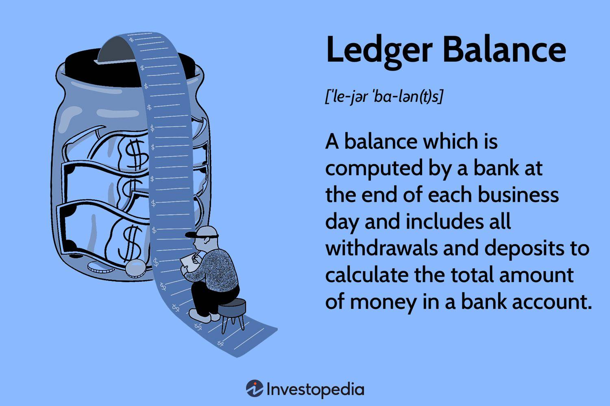

In today's rapidly evolving financial landscape, grasping financial terminology is more important than ever. The proliferation of digital platforms and the rise of algorithmic trading have transformed how financial transactions occur and how markets operate. Among these essential terms is the ledger balance, a fundamental concept in banking that significantly influences both individual financial planning and professional trading strategies.

The ledger balance represents the total amount of money in a bank account at the end of each business day, reflecting all completed transactions, such as deposits and withdrawals. This static snapshot is crucial for account holders, offering a clear view of their financial standing as they begin each new day. However, it's not just a tool for personal finance; the ledger balance holds substantial importance in algorithmic trading. Here, accurate data is paramount, and a precise understanding of the ledger balance helps traders make well-informed decisions.



This article will explore how the ledger balance functions, contrasting it with the available balance, a dynamic figure that fluctuates with transaction activity throughout the day. By understanding these distinctions, traders and investors can better manage their finances, reduce risks, and optimize their financial strategies. As technology continues to drive advancements in financial management, a clear grasp of such concepts ensures individuals and professionals alike can navigate their financial realities with greater confidence and precision.

## Table of Contents

## What is a Ledger Balance?

The ledger balance is a fundamental concept in banking, representing the total amount of money in a bank account at the close of each business day. This balance includes all deposits, such as monetary transfers and check deposits, and all withdrawals, such as purchases or ATM withdrawals. By the end of the business day, once all transactions have been processed, the ledger balance essentially captures a snapshot of the account's financial status.

To illustrate, consider the formula used to calculate the ledger balance:

$$
\text{Ledger Balance} = \text{Opening Balance} + \text{Credits} - \text{Debits}
$$

Credits refer to any deposits or reversals processed, while debits include withdrawals and other expenses incurred. This balance is then carried over as the opening balance for the next business day, offering a consistent point of reference for evaluating changes in account activity.

While the ledger balance might seem static, it is critical for effective financial management. By providing a clear view of the available funds at the start of each day, individuals and businesses can better plan their daily expenditures and ensure sufficient funds are available to meet their financial commitments. Understanding the ledger balance aids in maintaining budgetary discipline and facilitates prudent financial planning.

## Calculating the Ledger Balance

The ledger balance is a key financial metric that provides a comprehensive view of a bank account's balance at the end of each business day. It is calculated using a straightforward formula:

$$
\text{Ledger Balance} = \text{Opening Balance} + \text{Credits} - \text{Debits}
$$

This formula begins with the opening balance, which is the account balance at the start of the day. From there, all credit transactions are added. Credits typically include deposits, such as cash, checks, electronic funds transfers, or reversals of previous charges. Conversely, all debit transactions, such as cash withdrawals, checks written, and automatic payments, are subtracted from this amount. 

The resulting ledger balance provides a static figure that represents the account's financial position at the close of business, serving as the starting balance for the next day. This process ensures that the ledger balance accurately reflects all processed transactions, offering a precise snapshot of resources available for strategic financial management.

## Ledger Balance vs. Available Balance

The ledger balance and available balance are two distinct terms that are often misunderstood in banking and finance. The ledger balance represents the total amount of money in a bank account at the end of each business day, inclusive of all processed transactions, such as deposits and withdrawals. This balance is static and reflects the financial position at the close of business, becoming the opening balance for the next day.

In contrast, the available balance indicates the funds accessible for immediate withdrawal at any moment. Unlike the ledger balance, the available balance is dynamic and can fluctuate throughout the day. This is due to pending transactions such as checks that have not yet been cleared or authorized card payments that have not yet settled. These pending transactions are factored into the available balance, but not into the ledger balance until they are fully processed.

Understanding the differences between these balances is critical for effective financial management. The ledger balance provides a historical account of financial transactions, whereas the available balance offers a real-time snapshot of accessible funds. Confusing these two can lead to financial discrepancies, such as overdrafts, where withdrawals exceed the available balance, resulting in penalties or fees.

For instance, if a user has a ledger balance of $1,000 but has a pending debit card transaction of $200, the available balance would be $800. Any withdrawals or transactions beyond this amount could potentially lead to an overdraft. Hence, for both personal and business financial planning, it is vital to keep a close watch on the available balance to ensure expenditure does not exceed the immediately accessible funds.

## Importance of Ledger Balances

The ledger balance is a key element in financial management for both businesses and individuals due to its role in providing an accurate snapshot of an account’s financial position. For businesses, the ledger balance is vital for cash flow management, ensuring that they maintain sufficient [liquidity](/wiki/liquidity-risk-premium) to meet financial obligations. By offering a clear view of the funds available at the end of each business day, it helps businesses plan their expenditures and investments, ensuring clarity in financial standings. This predictability can be crucial for making strategic business decisions and maintaining financial health over the long term. 

For individuals, understanding the ledger balance aids in effective budgeting and financial planning. By knowing the exact amount available in the account after all transactions are settled, individuals can better manage their spending, avoiding the pitfalls of overspending and ensuring they stay within their financial means. The ledger balance serves as a grounding point for managing account activities, providing a stable starting point to plan future transactions, savings, and investments. This awareness helps in aligning personal financial goals with reality, ensuring a disciplined approach to money management.

Moreover, the ledger balance is instrumental in reconciling bank statements. When cross-referencing the ledger balance with a bank statement, account holders can spot discrepancies, such as unauthorized transactions or errors in recording, which can then be promptly addressed. This verification process ensures the integrity of financial records and provides a clearer understanding of an account's financial health. Reconciliation fosters accountability, which is vital for both businesses aiming for transparency in reporting and individuals keen on tracking their financial well-being.

## Ledger Balance in Algorithmic Trading

Algorithmic trading, which leverages automated platforms to execute trades at high speeds and frequencies, depends significantly on precise financial data, including the ledger balance. This figure is critical because it serves as a benchmark of the total financial resources available in a trader's account at the end of a trading day. The ledger balance provides an unchanging reference point that can be used to evaluate trading positions overnight and plan subsequent trading strategies.

For traders, it is imperative to monitor both the ledger and available balances. The ledger balance provides insight into the previous day's ending balance, whereas the available balance reflects funds accessible for immediate use, including any intra-day variations due to pending deposits or withdrawals. Together, these balances are crucial in managing trading risks and ensuring that trades are executed with optimal efficiency. An understanding of both balances helps traders avoid pitfalls such as over-leveraging or entering positions without sufficient funds, thus maintaining a healthy risk profile.

To facilitate the continuous monitoring of these balances, real-time API integrations and fintech tools have become indispensable. These technologies enable traders to access accurate and timely financial data from multiple accounts. Real-time APIs, for example, allow traders to fetch current balance information instantaneously, thereby ensuring that trades are based on the most up-to-date financial conditions. This capability is essential in fast-paced markets, where delays in data could lead to suboptimal trade execution.

Additionally, fintech innovations have enhanced the visibility and manageability of financial resources across various trading platforms. Tools that consolidate account information provide traders with a comprehensive view of their financial landscape, aiding in the optimization of trading performance. These tools often come equipped with features such as automated alerts and analytics, which help traders spot trends and anticipate necessary transactions before they become critical.

In summary, the accurate tracking of ledger and available balances, facilitated by technological solutions, plays a pivotal role in [algorithmic trading](/wiki/algorithmic-trading). This practice ensures that traders can manage their risk effectively and execute trades based on reliable financial data. As a result, real-time information systems and advanced fintech tools have become cornerstones in the strategic management of trading activities.

## Technological Innovations

Online and mobile banking platforms have dramatically transformed financial management by providing users with instant access to their financial data, including both ledger and available balances. This transparency enables users to make informed financial decisions efficiently. Banks and financial institutions have leveraged these technologies to offer enhanced customer experiences, allowing for a seamless interaction with personal and business accounts.

Advancements in Artificial Intelligence (AI) are playing a pivotal role in the proactive management of finances. AI-driven forecasting tools analyze transaction patterns and historical data to predict future balance changes, providing users with actionable insights into their financial health. These predictive analyses enable users to anticipate potential shortfalls or surpluses in their accounts, thus improving budgeting and strategic financial planning.

Financial applications have evolved to include a variety of features designed to facilitate effective money management. These apps categorize transactions automatically, which helps users in tracking their spending habits. They also enable the setting of customized alerts for different types of financial activities, such as deposits, withdrawals, and low-balance warnings. Such functionalities ensure that users are always aware of their financial status, allowing them to adjust their spending and saving strategies accordingly.

Moreover, the integration of real-time Application Programming Interfaces (APIs) in financial technology has allowed for quick and accurate data synchronization across various platforms and devices. This integration helps traders, businesses, and individuals monitor their account status and make timely decisions. Algorithms can be developed in Python to automatically analyze ledger and available balance data, potentially using libraries like NumPy and pandas for financial forecasting. For instance:

```python
import pandas as pd

# Example data: daily balances
data = {'Date': ['2023-01-01', '2023-01-02', '2023-01-03'],
        'Ledger Balance': [1500, 1550, 1600]}

df = pd.DataFrame(data)
df['Predictive Balance'] = df['Ledger Balance'] * 1.02  # assume a 2% daily increase prediction

print(df)
```

These digital innovations not only optimize financial oversight but also enhance transaction security through features like biometric authentication and encryption, bolstering user confidence in digital banking solutions. As technology continues to develop, the integration of AI and advanced data analytics in banking platforms is likely to deepen, reducing manual interventions and further refining the precision of financial management tools.

## Conclusion

The ledger balance serves as a vital component in understanding the overall financial health of a bank account, acting as a static snapshot at the end of each business day. This snapshot is crucial for both individual and institutional financial management, providing a clear picture of an account's standing. In personal finance, the ledger balance helps individuals track spending habits and adhere to budgets, contributing to informed decision-making. Meanwhile, in algorithmic trading, maintaining a precise ledger balance is essential. Traders use it to gauge available capital, manage risk, and ensure efficient execution of trades.

By understanding the dynamics between the ledger balance and the available balance, individuals and businesses can make more strategic financial decisions. The available balance, which accounts for pending transactions, offers a more dynamic view, while the ledger balance ensures stability and consistency in financial analysis. This distinction aids in preventing overdrafts and misunderstanding account liquidity.

Technological advancements have further enhanced the role of the ledger balance in financial management. Modern banking platforms and fintech applications have made access to precise ledger and available balances more seamless, ensuring real-time updates and comprehensive financial control. With tools like AI-driven forecasting and real-time API integrations, managing finances and executing trades with accuracy and efficiency is increasingly achievable. As technology progresses, these innovations continue to streamline financial operations, making both personal and trading activities more accurate and less risky.

## References & Further Reading

[1]: Lopez de Prado, M. (2018). ["Advances in Financial Machine Learning."](https://www.amazon.com/Advances-Financial-Machine-Learning-Marcos/dp/1119482089) Wiley.

[2]: Aronson, D. R. (2007). ["Evidence-Based Technical Analysis: Applying the Scientific Method and Statistical Inference to Trading Signals."](https://www.amazon.com/Evidence-Based-Technical-Analysis-Scientific-Statistical/dp/0470008741) Wiley.

[3]: Jansen, S. (2019). ["Machine Learning for Algorithmic Trading."](https://github.com/stefan-jansen/machine-learning-for-trading) Packt Publishing.

[4]: Chan, E. P. (2009). ["Quantitative Trading: How to Build Your Own Algorithmic Trading Business."](https://github.com/ftvision/quant_trading_echan_book) Wiley.

[5]: Hull, J. C. (2018). ["Options, Futures, and Other Derivatives."](https://www.semanticscholar.org/paper/Options%2C-Futures%2C-and-Other-Derivatives-Hull/89bdee500c8623864fc9eb7a471546aa713acc44) Pearson.