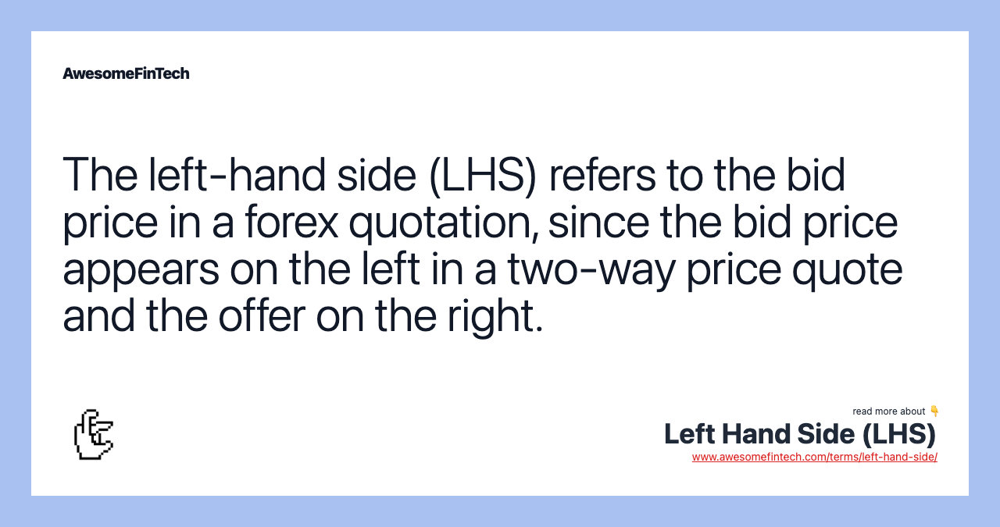

## Table of Contents

## What is the Left Hand Side (LHS) in Forex trading?

In Forex trading, the Left Hand Side (LHS) refers to the bid price. This is the price at which a trader can sell a currency pair. When you look at a Forex quote, you will see two prices: the bid price on the left and the ask price on the right. The bid price, or LHS, is important because it shows what the market is willing to pay for the base currency in the pair.

Understanding the LHS is crucial for traders because it helps them determine the best time to sell their currency. If the bid price is high, it means the market values the currency more, and it might be a good time to sell. Traders often watch the LHS closely to make informed decisions about when to enter or exit trades, aiming to maximize their profits or minimize their losses.

## How does the Left Hand Side differ from the Right Hand Side in Forex?

In Forex trading, the Left Hand Side (LHS) and the Right Hand Side (RHS) are two important parts of a currency quote. The LHS is the bid price, which is the price at which you can sell the base currency. It shows what the market is willing to pay for the currency you want to sell. On the other hand, the RHS is the ask price, which is the price at which you can buy the base currency. It shows what you need to pay to get the currency you want to buy.

The difference between the LHS and the RHS is called the spread. This spread is how brokers make money, as they buy at the lower bid price and sell at the higher ask price. For traders, understanding both the LHS and RHS is important because it helps them decide when to buy or sell a currency pair. If the bid price (LHS) is high, it might be a good time to sell, and if the ask price (RHS) is low, it might be a good time to buy.

## Why is understanding the Left Hand Side important for Forex traders?

Understanding the Left Hand Side (LHS) is important for Forex traders because it shows the bid price, which is the price at which they can sell their currency. Knowing the bid price helps traders decide if it's a good time to sell. If the bid price is high, it means the market is willing to pay more for the currency, so it might be a good time to sell and make a profit.

The LHS also helps traders understand the market's value of their currency at any given time. By watching how the bid price changes, traders can see trends and make better decisions about when to enter or [exit](/wiki/exit-strategy) trades. This can help them avoid selling at a loss and aim to sell when the price is at its highest, maximizing their profits.

## Can you explain the basic components of the Left Hand Side in a Forex quote?

In a Forex quote, the Left Hand Side (LHS) is the bid price. This is the price where you can sell the base currency. For example, if you see a quote for EUR/USD with 1.1000 on the left, that means you can sell one Euro for 1.1000 US Dollars. The bid price is important because it tells you what the market is willing to pay for your currency.

The LHS is one part of the whole quote. The other part is the ask price, which is on the right side. The difference between the bid price and the ask price is called the spread. This spread is how brokers make money. For traders, watching the LHS helps them decide when to sell their currency. If the bid price is high, it might be a good time to sell and make a profit.

## How do currency pairs on the Left Hand Side affect trading decisions?

The Left Hand Side (LHS) in a Forex quote shows the bid price, which is the price where you can sell the base currency. This is important for traders because it tells them what the market is willing to pay for their currency. If the bid price is high, it means the market values the currency more, so it might be a good time to sell and make a profit. Traders watch the LHS closely to decide when to sell their currency pairs.

By understanding the LHS, traders can see trends in the market. If the bid price is going up, it might mean more people want to buy the currency, so it could be a good time to sell. If the bid price is going down, it might be better to wait before selling. Watching the LHS helps traders make smart choices about when to enter or exit trades, aiming to make more money or lose less.

## What are some common strategies that focus on the Left Hand Side in Forex trading?

One common

## How does the Left Hand Side influence the bid-ask spread in Forex markets?

The Left Hand Side (LHS) in Forex trading is the bid price, which is the price where you can sell the base currency. The bid-ask spread is the difference between the bid price (LHS) and the ask price (RHS). The LHS directly affects the spread because it is one half of the equation. If the bid price goes up, the spread might get smaller if the ask price stays the same. But if the bid price goes down, the spread might get bigger if the ask price stays the same.

Traders watch the LHS to see how the spread changes. A smaller spread means it costs less to trade, which is good for traders. A bigger spread means it costs more to trade, which can eat into profits. By keeping an eye on the LHS, traders can decide the best times to buy or sell, trying to get the smallest spread possible. This helps them save money and make more profit from their trades.

## What role does the Left Hand Side play in determining Forex market trends?

The Left Hand Side (LHS) in Forex trading is the bid price, which shows what the market is willing to pay for a currency. By watching the LHS, traders can see how the value of a currency is changing over time. If the bid price is going up, it means more people want to buy the currency, which can be a sign

## How can traders use technical analysis on the Left Hand Side to predict market movements?

Traders can use technical analysis on the Left Hand Side (LHS) to predict market movements by looking at the bid price and how it changes over time. They use tools like moving averages, support and resistance levels, and chart patterns to see if the bid price is going up or down. If the bid price is going up, it might mean more people want to buy the currency, which could be a sign that the market is getting stronger. If the bid price is going down, it might mean fewer people want to buy, which could be a sign that the market is getting weaker.

By watching the LHS closely, traders can spot trends and make better decisions about when to buy or sell. For example, if the bid price keeps hitting a certain level and bouncing back up, that level is called support. If the bid price keeps going down to a certain level and then going down more, that level is called resistance. Traders can use these levels to guess where the price might go next. By using technical analysis on the LHS, traders can try to predict if the market will keep going up, go down, or stay the same, helping them make smarter trading choices.

## What are the psychological impacts of the Left Hand Side on Forex traders?

The Left Hand Side (LHS) in Forex trading, which is the bid price, can have a big impact on how traders feel. When the bid price goes up, traders might feel happy and confident because it means they can sell their currency for more money. This can make them want to trade more and take more risks. But if the bid price goes down, traders might feel worried or scared. They might think they will lose money if they sell now, so they might wait and hope the price goes back up. This can make them feel stressed and unsure about what to do next.

Watching the LHS all the time can also make traders feel tired and stressed out. They might spend a lot of time looking at charts and numbers, trying to guess what will happen next. This can make them feel like they are always on edge, waiting for the right moment to make a move. Over time, this stress can affect their health and how well they do in trading. It's important for traders to take breaks and not let the ups and downs of the LHS control their feelings too much.

## How do economic indicators correlate with movements on the Left Hand Side in Forex?

Economic indicators like employment rates, inflation, and GDP growth can have a big impact on the Left Hand Side (LHS) in Forex trading. The LHS is the bid price, which shows what the market is willing to pay for a currency. When good economic news comes out, like more people getting jobs or the economy growing faster, it can make people feel more confident about a country's currency. This confidence can push the bid price up because more people want to buy that currency. On the other hand, if the economic news is bad, like high unemployment or slow growth, it can make people less confident, and the bid price might go down as fewer people want to buy the currency.

Traders watch these economic indicators closely to guess how the LHS might move. For example, if a country's inflation rate goes up a lot, it might mean the central bank will raise interest rates to control inflation. Higher interest rates can make a currency more attractive to investors, which can push the bid price up. But if the inflation rate is too high and the economy is not doing well, it might scare investors away, and the bid price could go down. By understanding how these economic indicators affect the LHS, traders can make better decisions about when to buy or sell a currency.

## Can you provide advanced examples of how professional traders leverage the Left Hand Side for high-frequency trading?

Professional traders use the Left Hand Side (LHS) in high-frequency trading to make quick decisions about buying and selling currencies. They use special computer programs that watch the bid price all the time. These programs can spot tiny changes in the bid price very fast. When the bid price goes up even a little bit, the programs can tell the trader to sell the currency right away to make a small profit. This happens many times a day, and all these small profits can add up to a lot of money.

These traders also use the LHS to see patterns in how the bid price moves. They might notice that the bid price goes up at certain times of the day or after certain news comes out. They use this information to set up their trading programs to buy or sell at the best times. By doing this, they can make more money from the small changes in the bid price. It's all about being very fast and using the LHS to make smart choices quickly.

## References & Further Reading

[1]: ["Advances in Financial Machine Learning"](https://www.amazon.com/Advances-Financial-Machine-Learning-Marcos/dp/1119482089) by Marcos Lopez de Prado

[2]: "Algorithmic Trading and DMA: An introduction to direct access trading strategies" by Barry Johnson

[3]: ["Quantitative Trading: How to Build Your Own Algorithmic Trading Business"](https://github.com/LucindaYa/quant-resources/blob/master/Quantitative%20Trading%20How%20to%20Build%20Your%20Own%20Algorithmic%20Trading%20Business.pdf) by Ernest P. Chan

[4]: ["Machine Learning for Algorithmic Trading"](https://github.com/stefan-jansen/machine-learning-for-trading) by Stefan Jansen

[5]: ["Evidence-Based Technical Analysis: Applying the Scientific Method and Statistical Inference to Trading Signals"](https://www.amazon.com/Evidence-Based-Technical-Analysis-Scientific-Statistical/dp/0470008741) by David Aronson

[6]: "The Little Book of Currency Trading: How to Make Big Profits in the World of Forex" by Kathy Lien