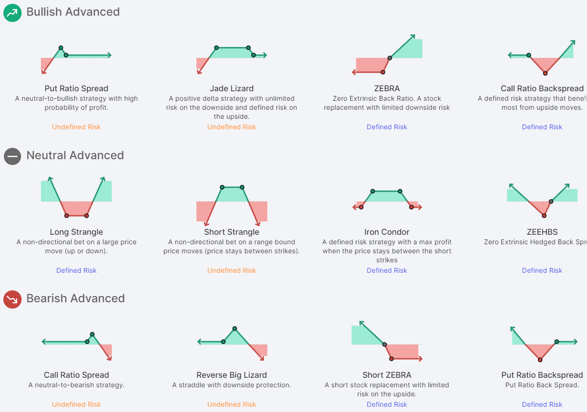

## Table of Contents

## What is a leg in trading?

In trading, a leg refers to a single part of a multi-step trading strategy or a single transaction within a larger trade. For example, if a trader is executing a strategy that involves buying and then selling a stock, each of these actions would be considered a leg of the trade. The term is commonly used in options trading, where a complex strategy might involve multiple legs, such as buying a call option and selling a put option at the same time.

Understanding legs is important because each leg can have its own risks and rewards. Traders need to manage each leg carefully to ensure the overall strategy is successful. For instance, in a multi-leg options strategy, one leg might be profitable while another is not, and the overall success depends on how well the trader balances these different parts. By breaking down a complex trade into its individual legs, traders can better analyze and manage their positions.

## How does a leg function in a trading strategy?

A leg in a trading strategy is like a single step in a bigger plan. Imagine you're following a recipe to bake a cake. Each ingredient you add or each step you take, like mixing or baking, is a leg. In trading, if you want to buy a stock and then sell it later, buying the stock is one leg, and selling it is another leg. Each leg has its own job and can affect how well your whole plan works.

When traders use legs in their strategies, they need to think about each part carefully. For example, in options trading, you might buy one option and sell another at the same time. Each of these actions is a leg. If one leg makes money but the other loses money, you need to balance them out to make your overall strategy successful. By looking at each leg separately, traders can see what's working and what's not, helping them make better decisions to reach their trading goals.

## What are the basic types of legs in trading?

In trading, there are two basic types of legs: buying legs and selling legs. A buying leg happens when a trader buys a stock, option, or another financial product. This is the first step in many trading strategies, where the trader hopes the price will go up so they can sell it later for a profit. A selling leg, on the other hand, is when a trader sells something they own or even something they don't own yet, which is called short selling. The goal here is to buy it back later at a lower price, making a profit from the difference.

These legs can be part of simple or complex trading strategies. For example, in a basic strategy, a trader might buy a stock (buying leg) and then sell it later (selling leg). In more complex strategies, like options trading, a trader might buy a call option (buying leg) and sell a put option (selling leg) at the same time. Each leg has its own risks and rewards, and traders need to manage them carefully to make sure their overall strategy works well.

## Can you explain the difference between a single leg and a multi-leg strategy?

A single leg strategy is like doing one thing at a time in trading. For example, if you buy a stock and then sell it later, that's a single leg strategy. It's simple because you're only making one move at a time. You buy something hoping its price will go up, and then you sell it to make a profit. It's easy to understand and manage because you're only dealing with one action.

A multi-leg strategy is more like juggling several things at once. It involves making multiple moves or trades at the same time. For instance, in options trading, you might buy a call option and sell a put option together. Each of these actions is a leg, and together they form a more complex strategy. Multi-leg strategies can be riskier and harder to manage because you need to keep an eye on all the legs at the same time. But they can also offer more ways to make money if you get it right.

## What are some common strategies that use legs?

One common strategy that uses legs is the straddle. In a straddle, a trader buys both a call option and a put option on the same stock with the same expiration date and strike price. The buying of the call option is one leg, and the buying of the put option is the other leg. The idea is to make money no matter which way the stock price moves. If the stock price goes up a lot, the call option makes money. If it goes down a lot, the put option makes money. It's like betting on big moves in either direction.

Another strategy is the spread, which can be used in both stocks and options. In a stock spread, a trader might buy one stock (one leg) and sell another related stock (another leg) at the same time. For example, you might buy shares of one tech company and sell shares of another tech company, hoping the first one will go up more than the second one goes down. In options, a spread might involve buying one option and selling another option with different strike prices or expiration dates. Each of these actions is a leg, and together they help the trader manage risk and potentially make a profit.

A third strategy is the iron condor, which is used in options trading. This strategy involves four legs: selling a call option, buying a call option at a higher strike price, selling a put option, and buying a put option at a lower strike price. All these options are on the same stock and have the same expiration date. The goal is to make money if the stock price stays within a certain range. If it does, all the options expire worthless, and the trader keeps the money from selling the options. It's a way to make money from a stock that isn't moving much.

## How do legs impact the risk and reward of a trading strategy?

Legs in a trading strategy can change how much risk you take and how much reward you might get. Each leg is like a step in your plan, and each step can make your trade more or less risky. For example, if you buy a stock hoping it will go up, that's one leg. If you then sell it later, that's another leg. If you only do one leg, like just buying the stock, you might lose money if the price goes down. But if you add another leg, like selling the stock at a certain price, you can limit your loss. So, more legs can help you manage risk better, but they also make things more complicated.

The reward part is also affected by legs. In a simple strategy with one leg, like buying a stock, your reward is how much the stock price goes up. But in a strategy with more legs, like buying and selling options at the same time, you can make money in different ways. For example, in a straddle, you buy a call and a put option. If the stock moves a lot in either direction, one of those options can make you money. So, more legs can give you more chances to make money, but you need to manage them well to make sure the reward is worth the extra risk.

## What should beginners know about managing legs in their trades?

For beginners, managing legs in trades can seem tricky at first, but it's important to start with simple strategies. A good way to begin is by focusing on single leg trades, like buying a stock and then selling it later. This helps you understand how one action affects your trade without getting overwhelmed. As you get more comfortable, you can learn about adding more legs, like buying and selling options at the same time. Remember, each leg adds complexity, so take your time to learn and practice with small amounts of money.

It's also crucial to understand that each leg in a trade has its own risks and rewards. For example, if you buy a stock, you hope it goes up, but if it goes down, you lose money. Adding another leg, like selling the stock at a certain price, can help limit your losses. But more legs mean more things to watch and manage. So, beginners should start with one or two legs and slowly build up their skills. Always keep an eye on how each leg is doing and be ready to adjust your plan if things aren't going as expected.

## How can legs be used to hedge positions in trading?

Legs can be used to hedge positions in trading by adding another leg to your trade that helps protect you from losses. For example, if you buy a stock and it goes down, you lose money. But if you add another leg, like buying a put option on that stock, you can limit your losses. The put option gives you the right to sell the stock at a certain price, so if the stock price drops, you can still sell it at the higher price you set with the put option. This way, the second leg acts like a safety net, helping you manage risk.

In another example, if you're worried about a stock you own going down, you can sell a call option on that stock as another leg. This means someone else can buy your stock at a set price if they want to. If the stock price stays the same or goes down, you keep the money from selling the call option, which can help offset any losses from the stock. By adding this leg, you're using it to hedge your position, making your overall trade safer.

## What advanced strategies involve multiple legs and how do they work?

One advanced strategy that uses multiple legs is the iron condor. This strategy involves four legs: selling a call option, buying a call option at a higher strike price, selling a put option, and buying a put option at a lower strike price. All these options are on the same stock and have the same expiration date. The goal is to make money if the stock price stays within a certain range. If it does, all the options expire worthless, and the trader keeps the money from selling the options. It's like betting that the stock won't move too much in either direction. This strategy can be tricky because you need to manage all four legs carefully, but it can help you make money from a stock that isn't moving much.

Another advanced strategy is the butterfly spread. This strategy involves three legs: buying a call option at a lower strike price, selling two call options at a middle strike price, and buying another call option at a higher strike price. All these options are on the same stock and have the same expiration date. The idea is to make money if the stock price ends up right around the middle strike price at expiration. If it does, the two call options you sold lose value, but the other two you bought gain value, and you make a profit. It's like betting that the stock will stay close to a certain price. This strategy can be complex because you need to balance all three legs, but it can offer a good reward if the stock price behaves as expected.

## How do market conditions affect the choice of legs in a trading strategy?

Market conditions play a big role in choosing the legs of a trading strategy. If the market is going up, traders might choose legs that take advantage of rising prices. For example, they might buy stocks or call options, hoping to sell them later at a higher price. On the other hand, if the market is going down, traders might choose legs that protect them from falling prices. They might buy put options or sell stocks short, hoping to buy them back later at a lower price. The key is to match the legs of your strategy with what you think the market will do.

Sometimes, the market can be very calm and not move much. In these conditions, traders might choose legs that make money from small price changes. They might use strategies like the iron condor, where they sell options that they hope will expire worthless if the market stays in a certain range. If the market is very unpredictable and moves a lot, traders might choose legs that can make money no matter which way the market goes. A strategy like a straddle, where they buy both a call and a put option, can work well in these conditions. By understanding the market, traders can pick the right legs to help them reach their goals.

## What are the key considerations for optimizing leg selection in complex trading strategies?

When choosing legs for complex trading strategies, it's important to think about what you expect the market to do. If you think the market will go up, you might want to pick legs that make money when prices rise, like buying stocks or call options. If you think the market will go down, you might choose legs that protect you from falling prices, like buying put options or selling stocks short. Also, consider how much risk you're willing to take. More legs can help manage risk better, but they also make things more complicated. So, you need to balance the potential rewards with the risks you're comfortable with.

Another thing to think about is how the legs work together. In strategies like the iron condor or butterfly spread, each leg has a specific job, and they need to work together to make the whole strategy successful. You should also look at the costs of each leg, like the price of buying options, and how those costs affect your overall profit. Lastly, keep an eye on the timing of each leg. Some legs might need to be set up at different times to work best with market conditions. By considering all these things, you can pick the right legs to help you reach your trading goals.

## How can traders use legs to exploit arbitrage opportunities?

Traders can use legs to exploit [arbitrage](/wiki/arbitrage) opportunities by taking advantage of price differences in the same asset across different markets. For example, if a stock is trading at a lower price on one exchange and a higher price on another, a trader can buy the stock at the lower price (one leg) and sell it at the higher price (another leg) at the same time. This way, they make a profit from the price difference without taking much risk, as long as the trades happen quickly enough.

In options trading, arbitrage can involve more complex strategies with multiple legs. For instance, a trader might find that the price of a stock and its options are not lined up correctly. They could buy the stock (one leg) and sell a call option (another leg) and buy a put option (a third leg) at the same time. If the prices are right, this can lock in a profit no matter what the stock does, as long as the legs are set up correctly. By carefully managing these legs, traders can take advantage of small pricing errors in the market.

## References & Further Reading

[1]: Bergstra, J., Bardenet, R., Bengio, Y., & Kégl, B. (2011). ["Algorithms for Hyper-Parameter Optimization."](https://dl.acm.org/doi/10.5555/2986459.2986743) Advances in Neural Information Processing Systems 24.

[2]: ["Advances in Financial Machine Learning"](https://www.amazon.com/Advances-Financial-Machine-Learning-Marcos/dp/1119482089) by Marcos Lopez de Prado

[3]: ["Evidence-Based Technical Analysis: Applying the Scientific Method and Statistical Inference to Trading Signals"](https://www.amazon.com/Evidence-Based-Technical-Analysis-Scientific-Statistical/dp/0470008741) by David Aronson

[4]: ["Machine Learning for Algorithmic Trading"](https://github.com/stefan-jansen/machine-learning-for-trading) by Stefan Jansen

[5]: ["Quantitative Trading: How to Build Your Own Algorithmic Trading Business"](https://www.amazon.com/Quantitative-Trading-Build-Algorithmic-Business/dp/1119800064) by Ernest P. Chan