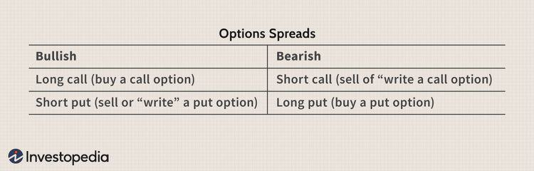

The fusion of algorithmic trading and trading legs has brought revolutionary changes to the financial markets, dramatically improving the speed and efficiency of trade executions. Algorithmic trading, or algo trading, involves using pre-programmed algorithms to automate trade execution, which enables traders to process vast amounts of data and execute trades at speeds impossible for humans to achieve. On the other hand, trading legs are the individual components of a strategy that involve multiple parts, often seen in futures and derivatives markets. 

By combining these two elements, traders have crafted sophisticated strategies that are capable of navigating the complex financial environment. Trading legs offer flexibility in managing spreads, arbitrage opportunities, and hedging, while algorithmic trading ensures precision and consistency. These robust trading strategies not only optimize performance but also mitigate risks associated with timing and execution.



This article provides a thorough overview of these concepts, examining the mechanics and strategies behind both trading legs and algorithmic trading. It aims to arm traders with the knowledge to implement these techniques effectively and navigate the competitive and ever-evolving financial markets. Welcome to the world where trading leg structures meet cutting-edge algo trading strategies, designed to elevate your trading success.

## Table of Contents

## Understanding Trading Legs

A trading leg is an essential element in multi-part trades and serves as a crucial building block for sophisticated trading strategies. Primarily seen in derivatives and futures contracts, trading legs are utilized for various purposes including hedging positions, capitalizing on arbitrage opportunities, and managing spreads.

**Types of Trading Legs**

1. **Options Legs**: In options trading, a leg typically refers to a component of a complex option strategy, such as a straddle, strangle, or butterfly spread. Each leg corresponds to a specific option contract, which can be either a call or a put, with distinct strike prices and expiration dates. For instance, in a straddle, an investor holds both a call and a put option at the same strike price and expiration date, creating two legs in the trade.

2. **Futures Legs**: Futures contracts often involve multiple legs when forming spreads or arbitrage strategies. For example, a calendar spread involves taking long and short positions in futures contracts of the same asset but with different delivery months. Here, timing is critical since the relative prices of these contracts can fluctuate based on factors such as interest rates and market conditions.

**Legging In and Out**

The process of legging 'in' and 'out' involves entering or exiting each part of a multi-leg trade sequentially rather than simultaneously. While legging can potentially offer better pricing, it also introduces additional timing risks. Traders must carefully consider market conditions and [liquidity](/wiki/liquidity-risk-premium) when deciding the sequence of executing trades.

- **Legging In**: This involves entering a multi-leg position one trade at a time. Traders might choose this approach to take advantage of temporary market anomalies or pricing inefficiencies. However, if the market moves unfavorably before the entire position is established, it can lead to suboptimal outcomes.

- **Legging Out**: Conversely, legging out involves selling or closing positions one leg at a time. This tactic might be used to lock in profits or minimize losses when market conditions shift, yet it also exposes traders to directional risk on any remaining open positions.

**Importance of Timing and Execution**

The success of trades involving multiple legs depends significantly on timing and execution precision. Market dynamics such as [volatility](/wiki/volatility-trading-strategies), liquidity, and transaction costs can affect the profitability of these strategies. Real-time data and advanced execution algorithms are often employed to minimize latency and improve trade timing, reducing the risks associated with market fluctuations.

Managing the risks in these trades often requires advanced risk analysis and dynamic hedging techniques. Analytical tools and software are commonly used to model potential outcomes and assess the risk-reward ratios of different leg configurations, facilitating more informed decision-making.

In conclusion, trading legs represent a versatile tool in the arsenal of financial market participants, allowing for nuanced trade constructions that can optimize returns, manage risk, and exploit market inefficiencies. Understanding the intricacies of trading legs enables traders to better navigate the complexities of modern financial markets.

## Algorithmic Trading: The Basics

Algorithmic trading, commonly known as algo trading, refers to the use of predefined algorithms to execute trades within financial markets. These algorithms can process vast amounts of data and make trade decisions at a speed and precision that humans cannot match. The fundamental aim is to enhance trading efficiency by incorporating key components such as data input, algorithm analysis, and trade execution.

### Key Components of Algorithmic Trading

1. **Data Input**: The foundational layer of any algorithmic trading system is the data input. This includes historical and real-time data such as price feeds, trade volumes, economic indicators, and more. The quality and accuracy of this data are crucial, as even minor discrepancies can significantly influence trading outcomes.

2. **Algorithm Analysis**: Once data is gathered, the algorithm analyzes it to identify trading opportunities. This can involve statistical calculations, trend analysis, or pattern recognition. The algorithm uses predefined mathematical models to determine the likelihood of profitable trades. This process is heavily dependent on quantitative techniques such as time-series analysis, regression models, and machine learning algorithms.

3. **Trade Execution**: The final stage involves executing trades based on the analysis. Trade execution algorithms determine the optimal timing, size, and price for trades, ensuring they comply with market regulations and minimize costs such as slippage and commissions. This step can happen within milliseconds in high-frequency trading systems, allowing traders to capitalize on small price differentials.

### Platforms and Systems

Several platforms and systems support [algorithmic trading](/wiki/algorithmic-trading). Popular ones include MetaTrader, QuantConnect, and TradeStation, each offering various tools for back-testing, optimization, and implementation of trading algorithms. These platforms often provide robust APIs, enabling traders to access real-time data and execute trades automatically.

### Benefits of Algorithmic Trading

Algorithmic trading provides several advantages:

- **Speed and Efficiency**: By processing large volumes of data quickly, it can execute trades at high speeds, often before market conditions change.
- **Complex Strategies**: Algorithms can manage and execute complex strategies involving multiple variables and constraints, which would be challenging for manual traders.
- **Elimination of Emotional Bias**: Automated systems ensure trades are based on data and predefined rules, eliminating the emotional biases that can distort human judgment.

### Basic Concepts and Terminology

Understanding algorithmic trading involves familiarizing oneself with key concepts and terminology:

- **Backtesting** is the process of testing an algorithm on historical data to assess its viability.
- **Latency** refers to the time delay in transmitting data from one point to another, essential in minimizing to improve execution speed.
- **Slippage** is the difference between the expected price of a trade and the actual price, often occurring during volatile markets.

In essence, algorithmic trading relies heavily on mathematical models, statistical analysis, and computing power to execute trades with precision and speed. This integration of technology in trading strategies is indispensable for modern traders seeking to maximize efficiency and minimize risks in financial markets.

## Popular Algo Trading Strategies

Algorithmic trading has transformed modern financial markets by introducing automated strategies that operate with high speed and precision. Among the array of strategies employed, several stand out for their effectiveness and popularity.

**Trend-Following Strategies** focus on identifying and capitalizing on market trends. These algorithms analyze historical price data to detect uptrends or downtrends and initiate trades in the direction of the identified trend. A common method involves moving averages, where a crossover between a short-term and a long-term moving average signals buy or sell actions. This strategy is particularly effective in volatile markets where trends are more pronounced.

**Mean Reversion Strategies** are based on the principle that asset prices tend to revert to their historical mean over time. These algorithms look for deviations from the mean and execute trades expecting the price will return to its average. For instance, if a stock's price significantly drops below its historical average, a mean reversion strategy may buy the stock with the expectation it will rebound. These strategies perform well in stable markets with less volatility.

**Statistical Arbitrage Strategies** involve exploiting price discrepancies between correlated assets. These algorithms identify pairs of securities with historically correlated movements and execute trades when a deviation occurs, buying the undervalued asset and shorting the overvalued one. The profits are captured when the prices converge. Statistical models and backtesting are crucial to determine the relationships and deviations.

High-frequency trading ([HFT](/wiki/high-frequency-trading-strategies)) algorithms are a class of strategies designed to operate in milliseconds. These exploit minor price changes with rapid trade execution, often utilizing co-location services to reduce latency. HFT strategies require sophisticated infrastructure and access to vast amounts of data to be effective.

**Market-Making Algorithms** provide liquidity by continuously quoting buy and sell prices for a security and profiting from the bid-ask spread. These algorithms adjust their spread and inventory based on market conditions and demand. The goal is to minimize risk while facilitating trades for other market participants.

The choice of an algorithmic strategy is heavily influenced by market conditions and trader objectives. For instance, in trending markets, trend-following might be preferred, while mean reversion could be more successful in range-bound environments. A trader's risk tolerance, capital, and access to technology also play critical roles in strategy selection.

Consider the following Python example of a simple moving average crossover strategy:

```python
import pandas as pd

# Assume 'data' is a DataFrame with a 'Close' column containing the closing prices
data['SMA20'] = data['Close'].rolling(window=20).mean()
data['SMA50'] = data['Close'].rolling(window=50).mean()

# Generate buy/sell signals
data['Signal'] = 0
data.loc[data['SMA20'] > data['SMA50'], 'Signal'] = 1
data.loc[data['SMA20'] < data['SMA50'], 'Signal'] = -1

# Identify trade execution points
data['Position'] = data['Signal'].diff()
```

This code illustrates how traders can implement a simple trend-following strategy using moving averages. The strategy generates a buy signal when the 20-day moving average crosses above the 50-day moving average and a sell signal when it crosses below. Such tools are foundational for structuring more complex algorithms that respond to dynamic market conditions.

## Integrating Trading Legs with Algo Trading

The integration of trading legs with algorithmic trading capitalizes on the strengths of both approaches to craft sophisticated trading strategies. Algorithmic trading, at its core, automates the process of order execution and utilizes complex algorithms to interpret market data. Trading legs, on the other hand, involve individual components of a larger trade, such as multiple option or futures contracts, and form the building blocks of a multi-stage trading strategy.

Automated systems bring a significant advantage to managing trades with multiple legs due to their ability to process and execute orders with high precision and speed. These systems can continually monitor market conditions and execute trades when pre-specified criteria are met, ensuring that each leg of the strategy is executed at the optimal moment. This level of precision is crucial for maintaining the profitability of complex trades, particularly in high-frequency trading environments where minute differences in price can impact overall profits.

A typical scenario where trading legs can optimize algorithmic trading strategies is in spread trading. Spread trading involves taking advantage of price differentials between two related securities, necessitating multiple trading legs. Automated systems effectively handle such complexity by executing both legs simultaneously or sequentially, depending on the strategy requirements, thus minimizing slippage and execution risk.

There are notable case studies highlighting the successful integration of trading legs with algorithmic trading. For instance, hedge funds frequently employ these tactics to exploit market inefficiencies. They leverage sophisticated algorithms to identify [arbitrage](/wiki/arbitrage) opportunities and execute trades involving multiple legs with precision across global markets. The success of these integrations is often gauged by the enhanced ability to manage large pools of assets while maintaining the [hedge fund](/wiki/hedge-fund-trading-strategies)’s risk thresholds.

For traders aiming to integrate these strategies, several best practices can enhance their effectiveness. Firstly, ensuring robust [backtesting](/wiki/backtesting) of trading algorithms with historical data is crucial. This allows traders to evaluate potential risks and refine their strategies under different market conditions. Additionally, selecting a trading platform that supports complex orders and offers real-time data access through APIs can significantly enhance execution speed and accuracy. Moreover, continuous monitoring and optimization of algorithmic strategies are essential to adapt to changing market dynamics.

Incorporating the combination of trading legs and algorithmic trading into a strategy requires careful planning and consideration. However, when executed effectively, this integration offers traders a powerful toolset to navigate the complexities of financial markets and optimize their trading outcomes.

## Choosing the Right Platforms and Tools

Selecting the right platforms and tools is essential for traders who aim to efficiently integrate trading legs and algorithmic trading. Platforms such as MetaTrader, QuantConnect, and TradeStation are renowned for supporting algorithmic trading due to their robust infrastructure and range of offerings.

**MetaTrader** is widely used for forex and futures trading. Its popularity stems from the comprehensive suite of analytical tools and an easy-to-use interface. It offers a custom scripting language known as MQL4/MQL5, allowing users to automate trading strategies through custom indicators and scripts. Beyond its ability to handle algorithmic trading, MetaTrader enables users to construct complex trades, which can include multiple trading legs. 

**QuantConnect** stands out for its support of quantitative trading strategies across different asset classes. It provides an open-access platform and libraries in various programming languages, especially Python and C#, to build sophisticated algorithmic strategies. QuantConnect offers a cloud-based IDE which makes backtesting and deploying algorithms on historical or real-time data straightforward. The platform's integration with equities, forex, and options trading allows users to incorporate trading legs efficiently.

**TradeStation** is another robust platform that is praised for its tools geared towards professional traders. TradeStation furnishes a wide variety of analytical tools and features built-in automated strategy trading. It supports EasyLanguage, a scripting language designed for traders to customize and automate their trading strategies effectively. The platform provides detailed analytics and relies on a robust API that supports real-time data trade execution—key components when dealing with complex trading strategies involving multiple legs.

When selecting a platform for trading legs and algorithmic trading, it is crucial to consider the availability and robustness of APIs. Real-time data and execution capabilities are vital, as delays can significantly affect the profitability of trades. APIs should reliably support the integration and enable traders to customize their strategies, adaptively responding to market signals.

Customization options and user-friendliness are additional critical factors. Platforms like MetaTrader and TradeStation provide extensive customization features through their scripting languages, allowing traders to tailor every aspect of their trading strategies. Meanwhile, QuantConnect provides a user-friendly coding environment that appeals to both beginners and experienced quantitative traders.

Additionally, traders should look for platforms with comprehensive backtesting capabilities. This feature enables traders to simulate their strategies on historical data before deploying them in live markets, reducing the risk associated with unproven strategies. Tools that provide advanced charts, indicator customization, and the ability to develop proprietary indicators or strategies add significant value for traders seeking to refine their approach.

In summary, the choice of platform can significantly impact the effectiveness of trading legs and algorithmic trading strategies. Traders should assess the robustness of APIs, the extent of customization available, and the overall user experience when choosing the best platform to meet their trading objectives.

## The Future of Trading Legs and Algo Trading

Emerging trends and technologies are poised to profoundly impact trading legs and algorithmic trading, with [artificial intelligence](/wiki/ai-artificial-intelligence) (AI) and [machine learning](/wiki/machine-learning) (ML) at the forefront. The application of these technologies is enhancing predictive analytics, enabling traders to develop sophisticated models that learn and adapt from historical data. AI and ML algorithms can identify patterns and correlations that are not immediately apparent, allowing traders to forecast market movements with greater accuracy. For instance, [deep learning](/wiki/deep-learning) techniques can process vast datasets to detect nonlinear relationships in financial markets, leading to improved trading strategies.

Increased automation is likely to reshape financial markets by accelerating the execution of trades and minimizing human intervention. Automated systems can process information at unprecedented speeds, making it possible to exploit market inefficiencies almost instantaneously. This shift may result in tighter spreads and increased market liquidity, benefiting traders who adapt quickly to these changes. Moreover, automation can reduce the risks associated with human error and emotional biases in trading, further optimizing decision-making processes.

However, the heightened reliance on AI and automation presents challenges. As trading strategies become more sophisticated, so too does the potential for system vulnerabilities, such as algorithmic malfunctions or flash crashes. Ensuring robust risk management protocols and regular system audits will be essential to mitigate these risks. Additionally, regulatory bodies may introduce new frameworks to address the implications of widespread algorithmic trading, requiring traders to stay informed and compliant with evolving guidelines.

Opportunities abound for those who embrace these technologies. By harnessing the power of AI and ML, traders can develop strategies that are responsive to market dynamics and capable of adjusting to varying conditions. Algorithmic solutions can be tailored to specific market segments, and the continuous feedback loop from real-time data allows for ongoing refinement of trading approaches.

To stay competitive, traders must commit to ongoing education and skill enhancement. Familiarity with programming languages such as Python and understanding ML frameworks like TensorFlow or PyTorch can be invaluable. Additionally, engaging with the trading community through forums and knowledge-sharing platforms can provide insights into emerging practices and innovations.

Overall, the integration of AI and machine learning in trading legs and algorithmic trading offers immense potential but requires continuous adaptation and learning. By investing in these technologies and remaining vigilant to industry changes, traders can position themselves strategically for future success.

## Conclusion

The integration of trading legs with algorithmic trading presents a transformative approach in modern financial markets. This fusion capitalizes on the strengths of both elements, creating trading strategies that can navigate complex market dynamics with precision. Key advantages include enhanced efficiency and risk management capabilities, as algo trading automates the intricate processes involved in managing multiple trading legs. 

The importance of strategy, timing, and technology cannot be overstated in achieving success. A robust strategy, supported by sophisticated timing and execution, allows traders to effectively respond to market changes. The technological infrastructure supporting algorithmic systems is crucial in maximizing the potential of these strategies, offering tools to process data quickly and execute trades accurately.

Traders are encouraged to explore and experiment with various approaches, understanding that the optimal strategy often varies based on market conditions and individual objectives. Continuous adaptation and learning are essential, as the financial landscape is perpetually evolving, and staying updated with new tools and methodologies helps maintain an edge.

This integration is not a one-size-fits-all solution; it requires careful calibration and a willingness to iterate on strategies. The benefits of combining trading legs with algorithmic trading are substantial, but they demand a commitment to education and experimentation. Traders should view these integrated strategies as a vital part of their broader investment toolkit, enhancing their ability to make informed decisions and optimize performance in the dynamic world of financial markets.

## References & Further Reading

[1]: Bergstra, J., Bardenet, R., Bengio, Y., & Kégl, B. (2011). ["Algorithms for Hyper-Parameter Optimization."](https://dl.acm.org/doi/10.5555/2986459.2986743) Advances in Neural Information Processing Systems 24.

[2]: ["Advances in Financial Machine Learning"](https://www.amazon.com/Advances-Financial-Machine-Learning-Marcos/dp/1119482089) by Marcos Lopez de Prado

[3]: ["Evidence-Based Technical Analysis: Applying the Scientific Method and Statistical Inference to Trading Signals"](https://www.amazon.com/Evidence-Based-Technical-Analysis-Scientific-Statistical/dp/0470008741) by David Aronson

[4]: ["Machine Learning for Algorithmic Trading"](https://github.com/stefan-jansen/machine-learning-for-trading) by Stefan Jansen

[5]: ["Quantitative Trading: How to Build Your Own Algorithmic Trading Business"](https://www.amazon.com/Quantitative-Trading-Build-Algorithmic-Business/dp/1119800064) by Ernest P. Chan