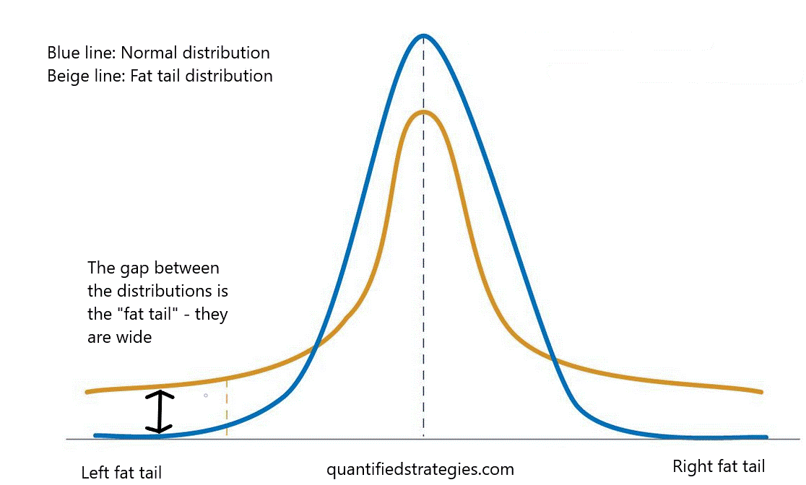

In an era marked by financial turbulence and rapid market shifts, mastering the art and science of financial strategies is more crucial than ever. This article sheds light on two pivotal strategies that are shaping contemporary financial landscapes: legacy hedge strategies and algorithmic trading. Legacy hedge strategies are established methods used to manage risk over longer periods, predominantly by mitigating the effects of price volatility in markets. They serve as a financial bulwark, providing certainty and stability to investors and companies, particularly those that are heavily reliant on commodities.

On the other hand, algorithmic trading represents a quantum leap in how trades are executed, bringing unprecedented speed and precision. This method employs sophisticated algorithms to automatically execute trades when certain market conditions are met, greatly enhancing efficiency and reducing the probability of human error. 



In this piece, we will dissect the convergence of these two strategies, examining how their integration can potentially harness the strengths of both long-term risk management and high-frequency trading. Through this exploration, one can better understand the benefits of utilizing these strategies in tandem, the complexities involved, and the practical applications that arise in diverse market scenarios. Ultimately, this convergence may offer new insights and opportunities for investors seeking to navigate today's volatile financial markets.

## Table of Contents

## What is Legacy Hedge in Finance?

A legacy hedge in finance refers to a long-term hedging strategy, traditionally executed through futures contracts, that is designed to stabilize revenue by mitigating the impact of market fluctuations. These hedges are primarily utilized by companies in the commodity sector, such as oil and agriculture firms, aiming to secure predictable cash flows despite volatile market conditions.

The principal advantage of a legacy hedge is its ability to provide certainty over financial outcomes by locking in prices for future transactions. This certainty is crucial for businesses that face inherent price volatility in raw materials, allowing them to forecast revenues more accurately and make informed operational decisions. For example, a wheat producer might use a legacy hedge to agree on a fixed price for its produce a year in advance, protecting itself against potential dips in market prices.

However, legacy hedges are not without limitations. If the market prices rise significantly above the hedged levels, the entity involved could miss out on higher profit margins. Thus, while these hedges insulate against downside risks and offer stability, they may also cap the potential for capitalizing on favorable price movements.

In practical application, the decision to implement a legacy hedge involves a trade-off: balancing the need for risk reduction with the opportunity costs associated with rigid pricing structures. As financial markets evolve, the strategic use of legacy hedges remains a cornerstone for entities seeking to navigate uncertain economic landscapes with reduced [volatility](/wiki/volatility-trading-strategies) risk.

## Algorithmic Trading: An Overview

Algorithmic trading involves the use of computer algorithms to execute orders in financial markets, underpinned by predetermined strategies that process data at high speed. This approach is recognized for its speed and efficiency, enabling traders to execute large volumes of trades almost instantaneously. By automating the trading process, [algorithmic trading](/wiki/algorithmic-trading) minimizes human intervention and thereby significantly reduces the margin for human error. This enhancement of precision in execution helps traders tap into short-lived market opportunities, such as [arbitrage](/wiki/arbitrage), more effectively.

The core of algorithmic trading consists of complex algorithms capable of analyzing multiple market conditions simultaneously. These algorithms consider various factors, including price, timing, and [volume](/wiki/volume-trading-strategy), to optimize trading outcomes. This capacity to process large datasets with precision ensures that trades align closely with strategy-defined parameters, eliminating the emotional bias that often affects human-based trading decisions.

Algorithmic trading systems are chiefly built on economic theories and financial engineering principles, often employing mathematical models such as linear regression for predicting price movements. A simple strategy might be based on identifying and exploiting a pricing anomaly, which could be expressed in Python as follows:

```python
# Example of a simple moving average crossover strategy
def moving_average(series, window):
    return series.rolling(window=window).mean()

def generate_signals(data, short_window, long_window):
    signals = pd.DataFrame(index=data.index)
    signals['price'] = data['price']

    # Create short and long simple moving averages
    signals['short_mavg'] = moving_average(signals['price'], short_window)
    signals['long_mavg'] = moving_average(signals['price'], long_window)

    # Create signals
    signals['signal'] = 0.0
    signals['signal'][short_window:] = np.where(signals['short_mavg'][short_window:] 
                                                > signals['long_mavg'][short_window:], 1.0, 0.0)   

    # Generate trading orders
    signals['positions'] = signals['signal'].diff()
    return signals

# Example usage
import pandas as pd
import numpy as np

# Simulated price data
data = pd.DataFrame({'price': np.random.rand(100)})
signals = generate_signals(data, short_window=20, long_window=50)
```

In this example, the algorithm generates trading signals based on the crossover between short-term and long-term moving averages. The trading decisions are automated, showing how algorithms can rapidly adapt to changing market dynamics without human delay.

Moreover, algorithmic trading enhances market responsiveness. By analyzing and acting on market data in real time, these systems can respond to market fluctuations more swiftly than their human counterparts. This heightened responsiveness not only improves [liquidity](/wiki/liquidity-risk-premium) but also contributes to tighter spreads in the market, benefiting all participants. As technologies advance, particularly in [machine learning](/wiki/machine-learning) and [artificial intelligence](/wiki/ai-artificial-intelligence), the potential for even more sophisticated algorithmic strategies is expected to grow, enabling further adaptation and efficiency in trading practices.

## Integration of Legacy Hedging with Algorithmic Trading

Combining legacy hedging strategies with algorithmic trading presents a compelling approach to portfolio management by leveraging the strengths of both traditional and modern techniques. Legacy hedges, which are typically long-term positions often established through futures contracts, provide a foundation of stability by locking in prices and stabilizing revenues. In contrast, algorithmic trading introduces the benefits of automation and precision, enabling rapid responses to market fluctuations.

Integrating these strategies involves the use of advanced algorithms capable of continuously monitoring market conditions. These algorithms can adjust hedge positions in real time, ensuring that the portfolio remains aligned with both short-term market opportunities and long-term risk management objectives. The ability to dynamically manage positions can be illustrated through a simplified example in Python:

```python
import numpy as np

# Simulated market conditions
market_conditions = np.random.normal(loc=0.0, scale=1.0, size=100)

# Initial hedge position
hedge_position = 0
rebalancing_threshold = 0.5

# Algorithmic adjustment of hedge positions
for condition in market_conditions:
    if abs(condition) > rebalancing_threshold:
        hedge_position += np.sign(condition) * rebalancing_threshold

print(f"Final hedge position: {hedge_position}")
```

This code snippet demonstrates how an algorithm might react to market conditions by adjusting the hedge position when fluctuations exceed a defined threshold. The integration of legacy hedging with algorithmic trading thus creates a system where long-term stability is maintained while short-term opportunities are tactically exploited.

The synergy between these strategies lies in achieving a balanced approach that captures long-term market trends while remaining responsive to immediate risks and opportunities. By employing algorithms that can seamlessly navigate between these two extremes, investors can potentially enhance the robustness and adaptability of their portfolios. This integration represents a significant advancement in controlling risk and optimizing financial outcomes in today's dynamic markets.

## Pros and Cons of Using Combined Strategies

Combining legacy hedging strategies with algorithmic trading can significantly enhance the stability and potential profitability of financial portfolios. The primary advantage of this integration is its ability to offer a dual-layered approach to risk management, stabilizing returns while capitalizing on favorable market conditions. Legacy hedges serve to provide long-term security against price volatility, while algorithmic trading facilitates rapid response to real-time market changes, potentially capturing profit opportunities as they arise.

However, this synergy of strategies introduces substantial complexity. Management of both strategies requires sophisticated models and robust technological infrastructure to ensure seamless execution. Investment in high-performance computing systems and expert personnel to design and maintain these systems is often necessary, which can substantially increase operational costs.

Moreover, careful calibration of these systems is paramount to balance the act of hedging effectively. Over-hedging can lead to excessive costs and erode potential profits, while under-hedging can leave the portfolio exposed to market risks. Implementing feedback loops where algorithmic systems constantly evaluate and adjust hedge positions based on historical data and predictive modeling can mitigate such risks. However, this requires advanced data analytics capabilities and thorough [backtesting](/wiki/backtesting) to validate models before live deployment.

In summary, while the combination of legacy hedging and algorithmic trading offers compelling advantages, it comes with inherent challenges that must be diligently managed to realize its full potential.

## Practical Applications

Legacy hedges have long been a staple in commodity markets, serving as a safeguard against fluctuating prices. These hedges, often structured with futures contracts, enable commodity companies to secure a fixed price for their goods, thereby stabilizing their revenue streams. This risk management tactic proves especially crucial in industries subject to extreme price volatility, like agriculture, energy, and metals.

Algorithmic trading has revolutionized the way multinational corporations manage currency and [interest rate](/wiki/interest-rate-trading-strategies) risks. In these scenarios, algorithmic programs can automate the detection of unfavorable exchange rate movements or interest rate changes, enabling swift execution of hedge strategies. This automation ensures that corporations can protect their financial positions without the necessity of continuous manual oversight. For instance, an algorithm can be programmed to execute a currency forward contract automatically if a certain exchange rate threshold is crossed.

Moreover, auto-hedging algorithms are increasingly being employed in trading environments to maintain dynamic and real-time balances against adverse market conditions. These algorithms take advantage of high-frequency trading technology to quickly adjust positions in response to market developments, maintaining the intended risk profile of the portfolio. The flexibility and precision offered by these algorithms allow traders and portfolio managers to respond instantaneously to market shifts, minimizing potential losses.

Overall, the practical application of integrating legacy hedges with algorithmic trading strategies offers a compelling approach to risk management, combining the stability of traditional methods with the dynamic adaptability of modern technology. This amalgamation not only enhances operational efficiency but also provides a more resilient financial posture in today's volatile markets.

## Challenges and Future of Hedging in Algorithmic Trading

Unforeseen market events present significant challenges to even the most sophisticated algorithms in algorithmic trading. Market disruptions such as geopolitical tensions, natural disasters, or rapid economic policy shifts can induce volatility that is difficult to predict and manage through existing algorithmic structures. These unexpected changes necessitate the development of more adaptive and resilient trading algorithms to effectively cope with such variability.

The future of hedging in algorithmic trading is closely tied to advancements in artificial intelligence (AI) and machine learning. These technologies offer promising solutions for enhancing the adaptability and efficiency of trading algorithms. For instance, machine learning algorithms can process vast amounts of market data and identify complex patterns indicative of potential market shifts. By continuously learning from new data, these systems can adjust their strategies dynamically, improving the robustness of hedging practices.

AI systems equipped with neural networks can model intricate relationships in financial data, allowing for the accurate prediction of market trends and automating decision-making processes. The integration of [reinforcement learning](/wiki/reinforcement-learning) within trading algorithms enables these systems to refine their strategies based on feedback from previous trading outcomes, optimizing hedging performance over time.

Python, a prevalent language in the field of algorithmic trading, provides numerous libraries that facilitate the development of AI-enhanced trading strategies. Libraries such as TensorFlow and PyTorch can be used to build and train complex machine learning models. For example, Python code implementing a basic [neural network](/wiki/neural-network) might look like this:

```python
import numpy as np
import tensorflow as tf
from tensorflow.keras.models import Sequential
from tensorflow.keras.layers import Dense

# Create a simple neural network model
model = Sequential([
    Dense(64, activation='relu', input_shape=(10,)),  # Input layer with 10 features
    Dense(32, activation='relu'),                     # Hidden layer
    Dense(1)                                         # Output layer
])

model.compile(optimizer='adam', loss='mse')

# Example data, replace with actual training data
X_train = np.random.random((1000, 10))
y_train = np.random.random((1000, 1))

# Train the model
model.fit(X_train, y_train, epochs=10, batch_size=32)
```

The ongoing evolution in technology is expected to expand the potential for integrated hedge strategies. Enhanced computational power and data analytics capabilities will allow for the seamless integration of legacy hedging strategies with cutting-edge algorithmic solutions. This amalgamation is positioned to unlock new efficiencies, offering a more comprehensive approach to risk management that balances long-term strategy with short-term market responsiveness.

As financial markets continue to advance, the role of sophisticated algorithmic solutions in hedging strategies will likely become more prominent. Continuous AI and machine learning advancements will equip financial professionals with tools capable of navigating the complexities of modern markets, ensuring stability and sustainability in trading operations.

## Conclusion

Hedging plays a crucial role in modern financial strategies, serving as a cornerstone for risk management and optimization. Legacy hedges, such as those utilizing futures contracts, are instrumental in providing security and stability over extended periods. By protecting against adverse market conditions, they allow entities, particularly commodity companies, to stabilize revenues amidst volatile pricing environments.

On the other hand, algorithmic trading introduces a layer of rapid execution and precision that manual trading methods cannot match. Algorithms can process and react to market data instantaneously, executing complex trading strategies with remarkable accuracy. This speed not only enhances market responsiveness but also reduces human error, presenting a significant advantage in today's fast-paced financial markets.

Looking ahead, the integration of legacy hedging with algorithmic trading is expected to yield more sophisticated solutions. As technology continues to advance, particularly with developments in artificial intelligence and machine learning, the adaptability of trading algorithms will likely improve. These advancements promise to expand the capability of financial strategies, merging the long-term security of legacy hedges with the agile, real-time adjustments facilitated by algorithmic trading.

The ongoing evolution in finance suggests that these integrated strategies will unlock new market opportunities, driving innovation and effectiveness in risk management. As the financial landscape becomes increasingly complex, the ability to combine the stability of legacy approaches with the dynamic potential of algorithms will be critical for seizing emerging opportunities and navigating the intricacies of future market environments.

## References & Further Reading

[1]: Bergstra, J., Bardenet, R., Bengio, Y., & Kégl, B. (2011). ["Algorithms for Hyper-Parameter Optimization."](https://dl.acm.org/doi/10.5555/2986459.2986743) Advances in Neural Information Processing Systems 24.

[2]: ["Advances in Financial Machine Learning"](https://www.amazon.com/Advances-Financial-Machine-Learning-Marcos/dp/1119482089) by Marcos Lopez de Prado

[3]: ["Evidence-Based Technical Analysis: Applying the Scientific Method and Statistical Inference to Trading Signals"](https://www.amazon.com/Evidence-Based-Technical-Analysis-Scientific-Statistical/dp/0470008741) by David Aronson

[4]: ["Machine Learning for Algorithmic Trading"](https://github.com/stefan-jansen/machine-learning-for-trading) by Stefan Jansen

[5]: ["Quantitative Trading: How to Build Your Own Algorithmic Trading Business"](https://www.amazon.com/Quantitative-Trading-Build-Algorithmic-Business/dp/1119800064) by Ernest P. Chan