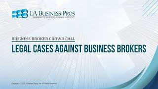

## Table of Contents

## What is a broker and what services do they typically provide?

A broker is someone who helps people buy and sell things, like stocks, real estate, or insurance. They work as a middle person between the buyer and the seller, making sure the deal goes smoothly. Brokers often have a lot of knowledge about the market they work in, which helps them give good advice to their clients.

Brokers provide many services to help their clients. For example, in the stock market, a broker can help you buy and sell stocks, give you advice on which stocks to invest in, and manage your investment portfolio. In real estate, a broker can help you find a house to buy, negotiate the price, and handle all the paperwork needed to complete the sale. They make the process easier and less stressful for their clients.

## What are common reasons for taking legal action against a broker?

People might take legal action against a broker if they think the broker did something wrong. One common reason is if the broker didn't tell the truth or hid important information. For example, in real estate, if a broker knows about a problem with a house but doesn't tell the buyer, the buyer might sue the broker for not being honest.

Another reason is if the broker made a big mistake that cost the client money. This can happen in the stock market if a broker buys or sells stocks at the wrong time or gives bad advice that leads to financial loss. Clients might sue to get back the money they lost because of the broker's mistake.

Sometimes, people sue brokers because they think the broker didn't do their job properly. This could be because the broker didn't follow the client's instructions or didn't handle the client's money carefully. In these cases, clients want to hold the broker accountable for not meeting their professional responsibilities.

## How can you identify if a broker has acted unethically or illegally?

You can tell if a broker has acted unethically or illegally if they don't tell you the whole truth. For example, if a real estate broker knows about a big problem with a house, like a leaky roof, but doesn't tell you, that's not right. They should always share all the important information with you. If they don't, they might be breaking the law or acting unethically.

Another sign is if the broker makes a big mistake that costs you money. If a stock broker buys or sells stocks at the wrong time and you lose money because of it, that could be a problem. They should be careful and follow your instructions. If they don't, and you lose money, they might have acted unethically or even illegally.

Lastly, if the broker doesn't do their job properly, that's another red flag. This can happen if they don't handle your money carefully or if they don't follow what you told them to do. If you think they didn't do what they were supposed to, it might be a sign that they acted unethically or illegally.

## What initial steps should you take before considering legal action against a broker?

Before you think about taking legal action against a broker, it's a good idea to talk to them first. Explain what you think they did wrong and see if they can fix it. Maybe they made a mistake and didn't mean to cause problems. They might be willing to make things right without going to court. This can save you time and money.

If talking to the broker doesn't work, you should gather all the evidence you have. This can include emails, contracts, and any records of what happened. It's important to have proof of what the broker did wrong. You might also want to talk to a lawyer who knows about these kinds of cases. They can tell you if you have a good reason to sue and help you understand what to do next.

## What are the different types of legal claims you might have against a broker?

One type of legal claim you might have against a broker is for fraud. This happens if the broker lies to you or hides important information on purpose. For example, if a real estate broker knows about a big problem with a house but doesn't tell you, that's fraud. Another type of claim is for negligence. This is when the broker makes a big mistake that costs you money. If a stock broker buys or sells stocks at the wrong time and you lose money because of it, you might have a claim for negligence.

Another claim you might have is for breach of fiduciary duty. This means the broker didn't do what they were supposed to do to look out for your best interests. For example, if they didn't follow your instructions or didn't handle your money carefully, that could be a breach of fiduciary duty. Lastly, you might have a claim for breach of contract. This happens if the broker didn't do what they promised in your agreement. If they agreed to do certain things and didn't do them, you could sue for breach of contract.

## How do you gather evidence to support your case against a broker?

To gather evidence against a broker, start by collecting all the documents related to your case. This includes emails, text messages, and any written agreements or contracts you have with the broker. These documents can show what the broker promised to do and what actually happened. You should also keep records of any financial transactions, like receipts or bank statements, that show how much money was involved and any losses you might have had.

Next, you might want to talk to other people who know about your situation. Witnesses, like other clients of the broker or people who saw what happened, can give statements about what they know. Their stories can help support your case. It's also a good idea to keep a journal or notes about your interactions with the broker, including dates and details of what was said or done. This can help you remember important details when you need to explain your case to a lawyer or in court.

## What is the process for filing a complaint with regulatory bodies against a broker?

Filing a complaint with a regulatory body against a broker starts with finding the right organization to contact. Different types of brokers are regulated by different groups. For example, if you have a problem with a stock broker, you might need to contact the Financial Industry Regulatory Authority (FINRA) or the Securities and Exchange Commission (SEC). If it's a real estate broker, you might need to go to your state's real estate commission. Once you know who to talk to, you can usually find a complaint form on their website or call them to get one.

After you have the form, fill it out with all the details about what the broker did wrong. Include any evidence you have, like emails, contracts, or financial records. It's important to be as clear and specific as possible. Once you send in your complaint, the regulatory body will review it. They might contact you for more information or to ask questions. They will then decide if the broker broke any rules and what should be done about it. This could lead to the broker being fined, losing their license, or even facing legal action.

## What are the potential outcomes of taking legal action against a broker?

When you take legal action against a broker, there are a few things that could happen. One possibility is that you might win your case. If you do, the court could make the broker pay you back for any money you lost because of their actions. They might also have to pay for your legal fees. Another outcome could be that the broker gets in trouble with the law. They might lose their license to work as a broker, or they could even face criminal charges if what they did was very serious.

On the other hand, you might not win your case. If the court decides that the broker didn't do anything wrong, you won't get any money back. You might also have to pay for your own legal fees, which can be expensive. Sometimes, even if you win, it can take a long time to get your money. Legal cases can drag on for months or even years, and that can be stressful and frustrating.

## How can hiring a lawyer specialized in financial disputes help your case against a broker?

Hiring a lawyer who knows a lot about financial disputes can really help your case against a broker. These lawyers understand the rules and laws that brokers have to follow. They can look at all your evidence and tell you if you have a good reason to sue. They know how to talk to the court and explain your side of the story in a way that makes sense. They can also help you gather more evidence and find witnesses who can support your case.

Having a specialized lawyer can also make the whole process easier for you. They can handle all the paperwork and talk to the other side for you. This means you don't have to worry about all the legal stuff, which can be confusing and stressful. Plus, if the broker did something really wrong, your lawyer can help make sure they get the right punishment, like losing their license or paying you back for your losses.

## What are the differences between arbitration and litigation when resolving disputes with a broker?

Arbitration and litigation are two ways to solve problems with a broker, but they work differently. Arbitration is usually faster and less formal than going to court. In arbitration, you and the broker agree to let a neutral person, called an arbitrator, listen to both sides and make a decision. This can be quicker and cheaper than a court case. Also, arbitration is often private, so your dispute doesn't become public. Many contracts with brokers have a clause that says you have to use arbitration instead of going to court.

Litigation, on the other hand, means taking your case to court. It's more formal and can take a lot longer. In court, a judge or jury will decide your case, and the process can be public. Litigation can be more expensive because of all the legal fees and court costs. But, if you win, you might get more money back than you would in arbitration. Also, going to court gives you the chance to appeal the decision if you think it's wrong, which you usually can't do with arbitration.

## What are the time limits for bringing a legal action against a broker, and how do they vary by jurisdiction?

The time you have to bring a legal action against a broker is called the statute of limitations. This time limit can be different depending on where you live and what kind of problem you have with the broker. For example, if you're dealing with a stock broker, you might have to file your claim within a few years from when the problem happened. But if it's a real estate broker, the time limit could be different. It's important to know these time limits because if you wait too long, you might not be able to take legal action at all.

Different places have different rules about how long you have to sue a broker. In some states, you might have two years to file a claim for fraud, while in others, you might have up to six years. It can also depend on whether you're suing for negligence, breach of contract, or something else. Because these time limits can be tricky and vary a lot, it's a good idea to talk to a lawyer who knows about these things in your area. They can help you understand how much time you have and make sure you don't miss your chance to take action.

## What advanced strategies can be used to maximize the chances of a successful outcome in a legal action against a broker?

To increase your chances of winning a case against a broker, it's important to gather strong evidence. This means collecting all the documents that show what the broker did wrong, like emails, contracts, and financial records. It's also helpful to find witnesses who can back up your story. These could be other clients of the broker or people who saw what happened. A good strategy is to work with a lawyer who specializes in financial disputes. They know the best ways to present your evidence and can help you find more proof to support your case. They can also help you understand the legal system and make sure you don't miss any important deadlines.

Another strategy is to consider using arbitration instead of going to court. Arbitration can be faster and less expensive, and it's often private, which means your dispute doesn't become public. Make sure to check if your contract with the broker has an arbitration clause, as this might be required. If you do go to court, be ready for a longer process. It's important to be patient and keep good records of everything that happens. Your lawyer can help you prepare for court and explain how to make the best arguments. Remember, the more prepared you are, the better your chances of a successful outcome.

## References & Further Reading

[1]: Bergstra, J., Bardenet, R., Bengio, Y., & Kégl, B. (2011). ["Algorithms for Hyper-Parameter Optimization."](https://papers.nips.cc/paper/4443-algorithms-for-hyper-parameter-optimization) Advances in Neural Information Processing Systems 24.

[2]: ["Advances in Financial Machine Learning"](https://www.amazon.com/Advances-Financial-Machine-Learning-Marcos/dp/1119482089) by Marcos Lopez de Prado

[3]: ["Evidence-Based Technical Analysis: Applying the Scientific Method and Statistical Inference to Trading Signals"](https://www.amazon.com/Evidence-Based-Technical-Analysis-Scientific-Statistical/dp/0470008741) by David Aronson

[4]: ["Machine Learning for Algorithmic Trading"](https://github.com/stefan-jansen/machine-learning-for-trading) by Stefan Jansen

[5]: ["Quantitative Trading: How to Build Your Own Algorithmic Trading Business"](https://www.amazon.com/Quantitative-Trading-Build-Algorithmic-Business/dp/1119800064) by Ernest P. Chan