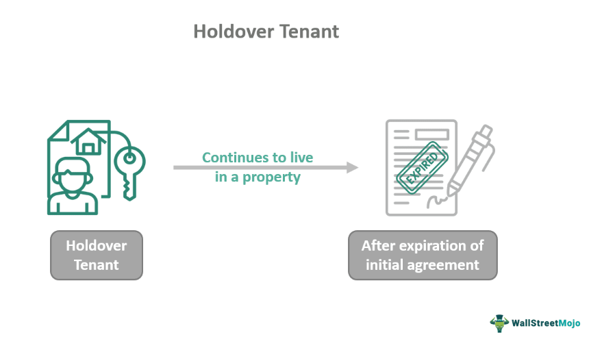

In today's rapidly evolving financial markets, brokers are navigating an increasingly complex landscape. The financial industry witnesses swift technological advancements, and one of the most transformative developments is algorithmic trading, often referred to as algo trading. Algorithmic trading employs pre-programmed instructions, accounting for variables such as timing, price, and volume, to execute large-scale trading at speeds beyond human capability. This shift has not only revolutionized the nature of transactions in financial markets but has also ushered in a new era of potential complexities within broker-client relationships.

As technology has advanced, so too have the potential risks and challenges associated with trading. Algo trading, while offering an unprecedented speed and efficiency advantage, introduces vulnerabilities, notably in terms of financial disputes. Errors in algorithm implementation, unexpected market behaviors, or system malfunctions can lead to significant financial discrepancies between brokers and their clients. Such challenges elevate the prospects of disputes, particularly when expectations are not met or when losses are incurred due to systemic or procedural flaws.



In this context, broker litigation emerges as a critical mechanism for resolving these financial disputes. The litigation process addresses the accountability and reconciliation of claims between brokers and clients, ensuring a legal adjudication of issues that arise from algo trading. Broker litigation not only aids in resolving disputes but also serves as a barometer for evaluating and evolving standards within the financial industry.

The role of broker litigation is multifaceted, encompassing various legal actions available to both clients and brokers when financial disagreements arise. Understanding the dynamic and complex nature of these legal options is essential for both parties. It ensures they can navigate potential disputes effectively, safeguarding their financial interests amid the changing landscape of algorithmic trading. This article aims to explore precisely these dimensions, providing insights into how broker litigation facilitates the resolution of conflicts and outlining the legal avenues available for addressing contentious issues in algorithmic trading settings.

## Table of Contents

## Understanding Broker Litigation

Broker litigation involves legal disputes that typically arise between brokerage firms and their clients. These disputes often stem from allegations of financial misconduct, including fraud, misrepresentation, or breaches of fiduciary duty. Understanding these common causes is crucial for both investors and brokers as they navigate complex financial relationships. 

Fraud in broker litigation often involves intentional deception by a broker to manipulate or mislead a client for monetary gain. This could include falsifying information or unauthorized trading that leads clients to sustain financial losses. Misrepresentation involves the provision of false or misleading information about investments, which may result in clients making uninformed or detrimental financial decisions. Breaches of fiduciary duty are equally significant; these occur when brokers fail to act in the best interests of their clients, violating the trust that is central to their professional relationship.

The legal frameworks governing broker litigation are designed to address these issues and provide a structured process for resolution. Common legal principles applied in these cases include contract law, securities law, and common law tort principles. Securities law, particularly, is pivotal in broker litigation as it regulates the conduct of securities transactions and aims to protect investors from malpractice. 

Litigation processes typically begin with the filing of a formal complaint, outlining the nature of the allegations and the desired remedies. This is usually followed by a discovery phase, where both parties gather relevant evidence. Settlement discussions may occur, but if the parties fail to reach an agreement, the case may go to trial. Arbitration is a common alternative to litigation, often required by brokerage agreements, wherein an arbitrator or a panel reviews the case and makes a binding decision.

Historical case studies provide valuable insights into effective litigation strategies. For instance, past cases have demonstrated the importance of thorough documentation of all communications and transactions between brokers and clients. Additionally, expert testimony can be critical in demonstrating how standard industry practices were not adhered to, or how the conduct of the brokerage firm deviated from regulatory norms.

In summary, broker litigation is a multifaceted field where knowledge of both the typical causes of disputes and the relevant legal processes is essential. By examining historical outcomes, investors and brokers can develop strategies to both prevent disputes and effectively resolve them when they occur.

## Financial Disputes in Algo Trading

Algorithmic trading, or algo trading, has revolutionized financial markets by leveraging automated systems to execute trades at speeds far beyond human capabilities. It presents advantages such as enhanced speed and accuracy, but it also introduces unique risks that can give rise to financial disputes. These risks primarily stem from malfunctioning algorithms or erroneous trades caused by technical glitches, coding errors, or unexpected market conditions.

### Common Issues in Algo Trading

One prevalent issue in [algorithmic trading](/wiki/algorithmic-trading) is trade execution errors. These errors can result from discrepancies between the intended and actual trade execution, often due to issues like slippage, latency, or incorrect pricing data. Slippage occurs when the price at which a trade is executed differs from the expected price, largely due to high [volatility](/wiki/volatility-trading-strategies) or delayed transmission times.

System failures are another critical concern. They can occur due to hardware malfunctions, software bugs, or external disruptions like cyberattacks, leading to unintended trading positions or losses. For instance, if a firm's trading infrastructure fails to respond to market changes rapidly, it could result in significant financial exposure.

### Financial Disputes and Potential Litigation

When these issues arise, they often lead to disputes between brokers and clients. Clients may allege that brokers breached fiduciary duties by failing to ensure reliable and accurate trading systems. Such allegations can trigger legal actions aimed at recovering losses that clients attribute to the broker's negligence.

A common avenue for addressing these grievances is arbitration, where both parties present their arguments to a neutral third party for resolution. In cases involving substantial financial losses, litigation in court may be pursued to seek compensatory damages.

### High-Profile Disputes

Several high-profile cases highlight the potential for disputes in algorithmic trading. One notable example is the "Knight Capital" incident in 2012, where a software error caused Knight Capital to incur a loss of approximately $440 million in less than an hour due to erroneous trades triggered by faulty code deployment.

Another case involved a major financial institution facing significant losses due to incorrect inputs in an algorithm, leading to unintended trades. Such incidents underscore the importance of robust testing, monitoring, and quick response mechanisms to mitigate the risk of algo trading-related disputes.

In conclusion, while algorithmic trading offers significant advantages, its complexities introduce new challenges and risks. Addressing these issues requires careful management, robust systems, and legal frameworks capable of resolving disputes effectively.

## Legal Actions and Remedies

In the complex world of financial markets, where algorithmic trading plays a prominent role, disputes between brokers and clients can frequently arise. When such conflicts occur, a variety of legal actions and remedies are available to address the grievances and seek resolution.

### Arbitration
Arbitration is a popular method of dispute resolution in the securities industry. It involves a neutral third party, the arbitrator, who listens to both sides before making a binding decision. Arbitration is generally quicker and less expensive than traditional litigation. The Financial Industry Regulatory Authority (FINRA) requires that investors entering into agreements with brokerage firms typically forego the right to sue in court and instead agree to arbitration. The pros of arbitration include confidentiality, speed, and reduced legal fees. However, cons can entail limited discovery opportunities and, in some cases, less predictability in the outcome.

### Mediation
Mediation is another form of dispute resolution where a neutral mediator assists the parties in negotiating a settlement. Unlike arbitration, mediation is non-binding unless an agreement is reached. It offers flexibility and allows for creative solutions that a court may not be able to provide. The process is typically collaborative, preserving relationships between parties. However, if unsuccessful, the parties may still need to pursue arbitration or litigation, which can lead to increased overall costs.

### Litigation
Pursuing a lawsuit in court offers a more formal and traditional route for dispute resolution. Litigation allows for comprehensive discovery processes and the opportunity to appeal unfavorable decisions. It is a preferable option when one of the parties seeks a public forum or needs the enforcement mechanisms available through the court. The downside includes significant time and expense, as well as the public nature of court cases, which may not be desirable for all parties involved.

### Selecting the Appropriate Legal Action
The choice between arbitration, mediation, and litigation depends on various factors including the nature and complexity of the dispute, the desired speed of resolution, and the willingness of parties to compromise. For instance, if maintaining a business relationship is a priority, mediation or arbitration may be more suitable. Conversely, if setting a legal precedent is a goal, litigation might be the preferred path.

### Case Examples
1. **Merrill Lynch, Pierce, Fenner & Smith Inc. v. Warren B. Welsh**: In this case, arbitration was chosen, resulting in an $11.7 million award to the claimant, highlighting how arbitration can offer significant financial restitution.

2. **Citigroup Global Markets Inc. v. Fiorentino**: This example underscores the potential for mediation to resolve disputes amicably, as the parties reached a satisfactory settlement without further court action.

3. **Goldman Sachs & Co. v. City of Reno**: Opting for litigation, this dispute emphasized the strategic use of court processes to address complex issues of securities fraud. The case concluded with a settlement that aligned with the city’s expectations after an extended litigation period.

In conclusion, selecting the right legal action requires a strategic evaluation of all available options and a clear understanding of each method’s potential impact. By considering the unique characteristics of their dispute and weighing the pros and cons of each approach, parties can navigate broker litigation effectively.

## Preventative Measures and Best Practices

Preventing financial disputes, particularly in the context of algorithmic trading, requires the adoption of proactive measures by both brokerage firms and their clients. Implementing robust risk management protocols is fundamental in mitigating potential issues before they escalate into legal disputes.

Firstly, brokerage firms should develop comprehensive risk management strategies that include regular stress testing of trading algorithms. This involves simulating various market conditions to evaluate the performance and reliability of the algorithms. Stress testing helps in identifying vulnerabilities that could lead to erroneous trades or system failures.

Training for brokers is equally critical. Brokers should receive continuous education on the latest developments in algorithmic trading and the specific algorithms employed by their firm. This knowledge empowers brokers to detect potential anomalies in trading activities early, enabling timely intervention.

Effective communication with clients is another preventive measure that cannot be overstated. Clear communication involves providing clients with detailed reports on the performance and strategy of their algorithmic trades. This transparency builds trust and helps in preemptively addressing any concerns that might arise.

Additionally, technology plays a pivotal role in monitoring and preventing trading errors. Advanced monitoring systems can automatically detect unusual patterns or deviations from expected trading behaviors, triggering alerts for immediate investigation. For instance, implementing [machine learning](/wiki/machine-learning) models can enhance anomaly detection capabilities. Here's an example of a simple Python snippet that demonstrates how machine learning can be used to detect anomalies in trading data:

```python
from sklearn.ensemble import IsolationForest
import numpy as np

# Simulated trading data
data = np.array([[0.2], [0.3], [0.4], [2.9], [0.5], [0.35]])

# Initialize the model
model = IsolationForest(contamination=0.1)

# Fit the model
model.fit(data)

# Predict anomalies
anomalies = model.predict(data)

# Output results
for index, value in enumerate(anomalies):
    if value == -1:
        print(f"Anomaly detected at index {index}: {data[index][0]}")
```

In this example, the `IsolationForest` model is used to identify anomalies in a set of trading data. The model flags data points that significantly deviate from the norm as potential anomalies, thus aiding in early detection and prevention of trading errors.

In conclusion, the integration of comprehensive risk management protocols, continuous broker training, transparent communication with clients, and advanced technological solutions is essential in reducing the risk of financial disputes in algorithmic trading. By adopting these best practices, brokerage firms and their clients can foster a more secure and reliable trading environment.

## Conclusion

Broker litigation plays a crucial role in resolving disputes related to algorithmic trading, necessitating a comprehensive understanding of the potential causes and available legal remedies. Algo trading, while offering speed and efficiency, introduces complexities that may lead to disagreements between brokers and clients. Identifying these potential flashpoints is vital for both parties, as it informs their approach to dispute resolution.

Preventative measures are fundamental in reducing the likelihood of disputes. By implementing robust risk management protocols and fostering clear communication lines between brokers and clients, many common issues can be preemptively addressed. This proactive stance minimizes the uncertainty and potential losses that unresolved conflicts can cause.

Effectively navigating broker litigation requires a strategic approach that is informed by previous experiences and cases. Legal strategies should be adaptive, taking into consideration past legal precedents where algorithmic trading complications were central. Each case is an opportunity to refine these strategies, thereby enhancing the effectiveness of future litigation efforts.

As algorithmic trading continually evolves, so must the legal frameworks that govern it. This evolution should be responsive to the challenges presented by technological advancements, ensuring that the legal structures in place are capable of effectively managing the unique issues arising from this complex domain. This adaptability is essential for maintaining the integrity and efficiency of financial markets in the face of ongoing technological change.

## References & Further Reading

[1]: Bergstra, J., Bardenet, R., Bengio, Y., & Kégl, B. (2011). ["Algorithms for Hyper-Parameter Optimization."](https://papers.nips.cc/paper/4443-algorithms-for-hyper-parameter-optimization) Advances in Neural Information Processing Systems 24.

[2]: ["Advances in Financial Machine Learning"](https://www.amazon.com/Advances-Financial-Machine-Learning-Marcos/dp/1119482089) by Marcos Lopez de Prado

[3]: ["Evidence-Based Technical Analysis: Applying the Scientific Method and Statistical Inference to Trading Signals"](https://www.amazon.com/Evidence-Based-Technical-Analysis-Scientific-Statistical/dp/0470008741) by David Aronson

[4]: ["Machine Learning for Algorithmic Trading"](https://github.com/stefan-jansen/machine-learning-for-trading) by Stefan Jansen

[5]: ["Quantitative Trading: How to Build Your Own Algorithmic Trading Business"](https://www.amazon.com/Quantitative-Trading-Build-Algorithmic-Business/dp/1119800064) by Ernest P. Chan