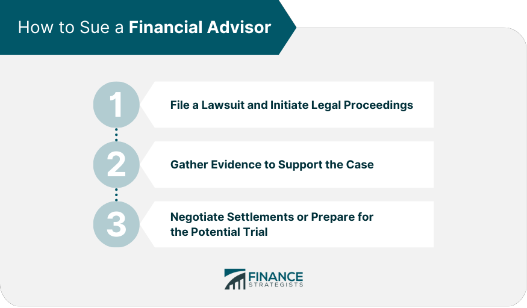

## Table of Contents

## What is a financial broker and what services do they typically provide?

A financial broker is a person or a company that helps people buy and sell things like stocks, bonds, and other investments. They act as a middleman between the buyer and the seller, making sure the transactions go smoothly. People use brokers because they have the knowledge and tools to help make good investment choices.

Brokers offer many services to their clients. They can give advice on what to invest in, help manage a person's investment portfolio, and even execute trades on behalf of their clients. Some brokers also provide research and analysis to help clients make informed decisions. This can be very helpful for people who don't have the time or expertise to manage their investments on their own.

## What are common reasons for suing a financial broker?

People might sue a financial broker if they think the broker did something wrong. One common reason is if the broker gives bad advice that makes the client lose money. For example, if the broker tells a client to buy a stock that turns out to be a bad investment, and the client loses a lot of money, they might sue the broker for not giving good advice.

Another reason for suing a broker is if they do something dishonest, like lying about an investment or not telling the whole truth. This is called fraud. If a broker says an investment is safe when it's really risky, and the client loses money because of it, the client might sue the broker for fraud.

Sometimes, people sue brokers for not following the rules. Brokers have to follow certain laws and rules set by the government and other organizations. If a broker breaks these rules, like not keeping good records or not telling clients about fees, the client might have a reason to sue the broker for breaking the rules.

## What is the statute of limitations for filing a lawsuit against a financial broker?

The statute of limitations for filing a lawsuit against a financial broker can vary depending on where you live and the type of claim you are making. In the United States, for example, the time limit can be different from one state to another. Generally, for claims related to fraud or breach of fiduciary duty, you might have between two to six years to file a lawsuit. It's important to check the specific laws in your area because missing the deadline can mean you lose your right to sue.

If your claim involves securities, like stocks or bonds, you might need to file your lawsuit within a shorter time frame. The Financial Industry Regulatory Authority (FINRA) has rules that say you usually have to file a claim within six years from the time the problem happened, or within two years from when you found out about the problem, whichever comes first. Always talk to a lawyer to make sure you understand the time limits that apply to your situation.

## How can you determine if you have a valid claim against a financial broker?

To figure out if you have a good reason to sue a financial broker, you need to look at what the broker did wrong. Did the broker give you bad advice that made you lose money? Did they lie to you or not tell you the whole truth about an investment? If so, you might have a claim for fraud or bad advice. It's important to gather evidence like emails, statements, and any other records that show what the broker told you and what happened with your investments.

Another thing to consider is whether the broker broke any rules. Brokers have to follow certain laws and regulations. If they didn't keep good records, didn't tell you about fees, or did something else against the rules, you might have a claim for breaking the rules. Talking to a lawyer can help you understand if what the broker did is against the law and if you have a strong case. They can look at your evidence and tell you if you have a good chance of winning your lawsuit.

## What are the differences between arbitration and litigation when suing a financial broker?

Arbitration and litigation are two ways to solve a problem with a financial broker. Arbitration is usually faster and less formal than going to court. In arbitration, a neutral person called an arbitrator listens to both sides and makes a decision. This process is often required by the contract you signed with your broker. Arbitration can be cheaper and quicker, but you usually can't appeal the decision if you don't like it.

Litigation, on the other hand, means going to court. It's more formal and can take a long time. In court, a judge or jury will hear your case and make a decision. You have more rights in court, like the right to appeal if you lose. Litigation can be more expensive and take longer, but it gives you more control over the process and the chance to have your case heard by a jury.

Choosing between arbitration and litigation depends on what you want. If you want a quick and less expensive solution, arbitration might be better. If you want more control and the chance to appeal, litigation could be the way to go. Talking to a lawyer can help you decide which option is best for your situation.

## What documentation and evidence are necessary to support a lawsuit against a financial broker?

To support a lawsuit against a financial broker, you need to gather important documents and evidence. This includes any emails, letters, or messages you exchanged with the broker. These can show what the broker told you about your investments. You should also collect your account statements and trade confirmations. These documents can help prove how much money you lost and what the broker did with your money. If you have any notes or recordings from meetings with the broker, those can be useful too.

Another important piece of evidence is any contract or agreement you signed with the broker. This can show what the broker promised to do and what rules they had to follow. If you have any reports or research the broker gave you, keep those as well. They can help show if the broker gave you bad advice or lied to you. Talking to a lawyer can help you figure out what other evidence you might need and how to organize it all to make your case strong.

## What are the potential defenses a financial broker might use in a lawsuit?

When a financial broker is sued, they might say they did nothing wrong. They could argue that they followed all the rules and gave good advice based on the information they had at the time. The broker might also say that the client knew the risks of the investments and agreed to them. They could show that the client signed agreements that explained the risks and that the client made the final decisions about what to invest in.

Another defense a broker might use is that any losses were due to things they couldn't control, like changes in the market or the economy. They might say that they warned the client about these risks and that the client still chose to invest. The broker could also argue that the client waited too long to sue, past the time limit set by the law, which is called the statute of limitations. If the broker can prove any of these points, it could help them win the lawsuit.

## How can you find and choose the right attorney to represent you in a lawsuit against a financial broker?

Finding the right attorney to help you sue a financial broker can be important. Start by looking for lawyers who specialize in financial law or securities law. You can search online, ask friends or family for recommendations, or use lawyer referral services. Make sure to check if the lawyer has experience with cases like yours. You can look at their website or ask them directly about their past cases and how they turned out. It's also a good idea to read reviews and see what other clients have said about working with them.

Once you have a list of potential lawyers, set up meetings to talk with them. During these meetings, ask about their fees and how they charge for their services. Some lawyers work on a contingency basis, which means they only get paid if you win your case. Others might charge by the hour. Make sure you understand how much it will cost and what you will get for that money. Also, pay attention to how well the lawyer listens to you and explains things. You want someone who understands your situation and can explain the legal process in a way that makes sense to you. Choose a lawyer who you feel comfortable with and who you think will fight hard for your case.

## What are the financial implications and costs associated with suing a financial broker?

Suing a financial broker can be expensive. You might have to pay for a lawyer, court fees, and other costs like getting documents or hiring experts to help with your case. If you win, you might get some of these costs back, but there's no guarantee. Some lawyers work on a contingency basis, which means they only get paid if you win, but they will take a percentage of your winnings, usually around 30% to 40%. If you lose, you might have to pay the broker's legal fees too, depending on the rules in your area.

The financial outcome of the lawsuit can also be uncertain. Even if you win, it might take a long time to get your money, and the amount you get might not cover all your losses or legal costs. If you lose, you won't get any money back, and you'll still have to pay for your legal fees. It's important to think about these costs and risks before deciding to sue. Talking to a lawyer can help you understand the potential costs and whether suing is the best choice for your situation.

## What role does the Financial Industry Regulatory Authority (FINRA) play in disputes with financial brokers?

FINRA helps people who have problems with their financial brokers. If you think your broker did something wrong, you can file a complaint with FINRA. They have a process called arbitration where a neutral person listens to both sides and makes a decision. This can be faster and cheaper than going to court. Many contracts with brokers say you have to use FINRA arbitration instead of suing in court.

FINRA also makes rules that brokers have to follow. They check to make sure brokers are doing things right and can punish brokers who break the rules. If you file a complaint, FINRA will look into it and see if the broker did something wrong. They can help you get your money back if the broker made a mistake or did something dishonest. Talking to FINRA can be a good first step if you have a problem with your broker.

## What are the possible outcomes of a lawsuit against a financial broker, and how might they affect your financial recovery?

When you sue a financial broker, there are a few things that could happen. You might win the lawsuit and get money back for what you lost. The court or arbitrator could decide that the broker did something wrong and should pay you for your losses. This money could help you recover some or all of what you lost. But, even if you win, it might take a long time to get your money, and the amount you get might not cover all your losses or the costs of the lawsuit.

On the other hand, you might lose the lawsuit. If you lose, you won't get any money back, and you'll still have to pay for your lawyer and other costs. In some cases, you might even have to pay the broker's legal fees if the rules in your area say so. Losing the lawsuit can make your financial situation worse because you'll be out the money you spent on the lawsuit without getting anything back. It's important to think about these possible outcomes before deciding to sue.

## What advanced legal strategies can be employed to enhance the chances of success in a lawsuit against a financial broker?

To increase your chances of winning a lawsuit against a financial broker, one advanced legal strategy is to use expert witnesses. These are people who know a lot about investing and can explain why the broker's advice was bad or dishonest. They can look at your investments and tell the court or arbitrator if the broker did something wrong. Having an expert on your side can make your case stronger because they can explain complicated things in a way that's easy to understand.

Another strategy is to focus on proving that the broker broke the rules. Every broker has to follow certain laws and rules set by organizations like FINRA. If you can show that the broker didn't follow these rules, like not telling you about fees or not keeping good records, it can help your case a lot. Your lawyer can look at the rules and find ways to show that the broker broke them. This can make it clear to the court or arbitrator that the broker was not doing their job right and should be held responsible.

## References & Further Reading

[1]: Bergstra, J., Bardenet, R., Bengio, Y., & Kégl, B. (2011). ["Algorithms for Hyper-Parameter Optimization."](https://dl.acm.org/doi/10.5555/2986459.2986743) Advances in Neural Information Processing Systems 24.

[2]: ["Advances in Financial Machine Learning"](https://www.amazon.com/Advances-Financial-Machine-Learning-Marcos/dp/1119482089) by Marcos Lopez de Prado

[3]: ["Evidence-Based Technical Analysis: Applying the Scientific Method and Statistical Inference to Trading Signals"](https://www.amazon.com/Evidence-Based-Technical-Analysis-Scientific-Statistical/dp/0470008741) by David Aronson

[4]: ["Machine Learning for Algorithmic Trading"](https://github.com/stefan-jansen/machine-learning-for-trading) by Stefan Jansen

[5]: ["Quantitative Trading: How to Build Your Own Algorithmic Trading Business"](https://books.google.com/books/about/Quantitative_Trading.html?id=j70yEAAAQBAJ) by Ernest P. Chan