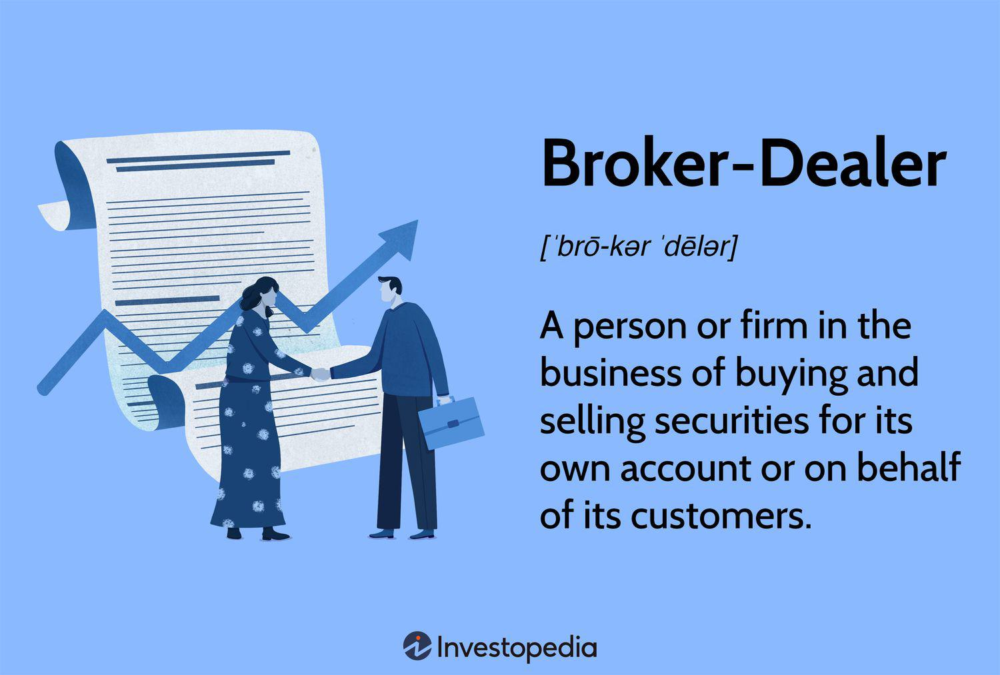

The world of finance is inherently complex, engaging various intermediary roles, of which financial brokers are pivotal. Brokers serve as essential conduits in the financial markets, offering expertise that helps investors make informed decisions and facilitate transactions effectively. However, the involvement of brokers, while beneficial, is not without risk, particularly considering modern advancements such as algorithmic trading. The reliance on sophisticated technologies introduces new challenges that can lead to disputes between investors and brokers.

Algorithmic trading, which leverages advanced algorithms to execute trades at speeds and frequencies beyond human capability, complicates the traditional landscape of broker-investor interactions. While these algorithms aim to optimize trading efficiency and profitability, instances may arise where they malfunction or are mismanaged, potentially causing substantial financial losses for investors. Such scenarios raise significant questions about accountability and the legal responsibilities of brokers.

When investors suspect misconduct or negligence on the part of their broker, legal actions become a viable consideration. Navigating the legal landscape in these situations involves understanding the potential complexities associated with broker lawsuits and algorithmic trading issues. This article explores the circumstances under which investors might seek legal recourse and the procedural landscape that governs such financial disputes. Whether through arbitration or litigation, addressing these issues requires meticulous attention to legal detail and a strong foundation of evidence.

## Table of Contents

## Understanding the Role of Financial Brokers

Financial brokers function as essential intermediaries in financial markets, bridging the gap between buyers and sellers. Their primary role is to facilitate transactions in various financial instruments such as stocks, bonds, and commodities. By providing access to the necessary trading platforms and market data, brokers enable both individual and institutional investors to participate in financial markets with greater efficiency.

Brokers also assist clients in making informed investment decisions. This advisory role often involves analyzing market trends, assessing financial risks, and developing tailored investment strategies that align with the client's financial goals. To enhance their services, many brokers now incorporate algorithmic trading programs, which leverage sophisticated mathematical models and computer algorithms to optimize trading activities. These algorithms can process vast amounts of data at high speeds, executing trades that align with predefined strategies, often with minimal human intervention.

The use of algorithms in trading has transformed the role of brokers, enabling them to offer precision and speed that manual trading cannot match. Algorithmic trading can help in identifying patterns and trends that might not be detectable through traditional analysis, thereby offering potential advantages in timing and pricing of trades.

However, with these advancements come challenges. When technical glitches occur or algorithms function improperly, it can lead to significant financial losses. Such issues raise questions about the integrity and legality of a broker’s operations. Investors may scrutinize whether brokers are adequately monitoring their systems or if conflicts of interest exist, for instance, where the broker prioritizes its profits over the client's interests.

These challenges emphasize the importance of transparency and accountability among brokers. Investors need assurance that their brokers are compliant with regulatory standards and that their trading systems are robust and reliable. The confidence investors place in brokers largely depends on the brokers’ ability to manage these sophisticated systems responsibly and ethically.

## Legal Foundations for Suing a Broker

Investors who suffer financial losses attributed to broker negligence or misconduct have several legal avenues to consider. Key grounds for lawsuits include misrepresentation, unauthorized trading, and churning. Misrepresentation occurs when brokers provide false information or omit crucial facts, leading investors to make uninformed decisions. Unauthorized trading involves brokers executing trades without the explicit consent of the investor, violating the trust relationship fundamental to broker-client interactions. Churning refers to excessive trading by a broker primarily to generate commissions, which may not be in the best interest of the client.

Understanding arbitration clauses within brokerage contracts is crucial. These clauses often mandate that disputes be resolved through arbitration rather than through traditional litigation. While arbitration can be less formal and more expedient, it may also limit the investor's ability to pursue certain claims or appeal decisions. The Financial Industry Regulatory Authority (FINRA) often oversees such arbitration processes in the financial industry, offering a platform intended to balance expediency and fairness. Analyzing and comprehending these clauses is essential for investors considering legal action, as they significantly influence the strategy and potential outcomes of any dispute resolution process.

## Algo Trading and Related Legal Challenges

Algorithmic trading, often referred to as algo trading, revolutionizes financial markets by utilizing computer algorithms to execute and manage positions. These algorithms, programmed to follow a specific set of instructions, capitalize on vast computational power and advanced statistical models, allowing traders to execute orders at speeds and frequencies unavailable to humans. Algo trading is prevalent in high-frequency trading environments, where algorithms scan multiple markets and execute orders based on predefined criteria almost instantaneously.

Despite its advantages, [algorithmic trading](/wiki/algorithmic-trading) presents unique legal challenges. Chief among these is the risk of algorithm malfunction, where a programming error or unexpected market condition leads to erroneous trading activities. Such activities can result in significant financial loss, market disruptions, or regulatory scrutiny. For example, flash crashes, which are rapid and deep stock market declines followed by a quick recovery, have been partially attributed to algorithms acting on unforeseen or erroneous signals.

Another critical legal issue arises from the development and modification of these trading algorithms. If an unregistered individual develops or makes substantial changes to the trading algorithm, the legality of the trading activities could be called into question. This is because entities engaging in trading must adhere to regulatory standards, which often include registration requirements for individuals directly influencing trading operations. Unregistered creators or modifiers may not only face penalties but could also invalidate the trades executed under their algorithms, leading to further financial and legal repercussions.

Regulators like the Securities and Exchange Commission (SEC) and the Commodity Futures Trading Commission (CFTC) have, therefore, increased their oversight over algorithmic trading practices. They ensure compliance with market integrity rules and prevent potential abuses. Ensuring that personnel involved in developing or managing trading algorithms are adequately registered is crucial to meet legal obligations and mitigate risks associated with unauthorized trading practices.

In conclusion, while algorithmic trading advances market efficiency and [liquidity](/wiki/liquidity-risk-premium), it simultaneously necessitates rigorous checks to circumvent algorithm failures and regulatory breaches. Understanding the legal landscape and compliance requirements is indispensable for firms and individuals to safeguard against potential liabilities inherent in deploying sophisticated trading technologies.

## Steps in Filing a Broker Lawsuit

When pursuing legal action against a broker, meticulous preparation is crucial to bolstering the case's strength. The first essential step involves amassing comprehensive documentation of all interactions and transactions with the broker, including emails, phone records, written communication, trade confirmations, and account statements. This evidence constitutes the backbone of any legal claim, helping to substantiate alleged misconduct or negligence by the broker.

Following the collection of evidence, it is advisable to seek counsel from a legal expert specializing in financial disputes. These experts can provide a nuanced assessment of the case's validity, offering insights into potential outcomes and strategies. Their expertise is instrumental in understanding complex financial regulations and the intricacies of financial instruments that may underpin the dispute.

A critical decision point in the litigation process is choosing between arbitration and traditional litigation. Many brokerage agreements include arbitration clauses, requiring disputes to be settled through the Financial Industry Regulatory Authority (FINRA) rather than the courts. Arbitration is generally faster and less costly than litigation, but it may limit discovery and appeal rights. Therefore, understanding these contractual obligations is vital. If arbitration is the chosen route, one must be prepared to navigate the specific rules and procedures set by FINRA, which are designed to facilitate an efficient resolution process. Conversely, traditional litigation may be pursued if no binding arbitration clause exists, offering a broader scope for discovery and legal recourse.

## Consequences and Settlement Possibilities

Broker lawsuits often become protracted legal battles that consume significant time and financial resources. The litigation process may involve extensive document discovery, expert testimony, and potential appeals, which contribute to the overall length and cost. Legal fees for attorneys and experts, as well as court costs, can accumulate rapidly, placing a substantial financial burden on investors seeking redress.

Despite these challenges, successful lawsuits against brokers can lead to favorable outcomes for investors. Court judgments can mandate compensation for financial losses incurred due to broker misconduct, negligence, or other wrongful actions. The enforcement of such judgments ensures that brokers are held accountable, thus upholding ethical standards within financial markets.

A prevalent alternative to courtroom litigation is resolution through settlements facilitated by arbitration, often conducted through entities like the Financial Industry Regulatory Authority (FINRA). Arbitration is commonly stipulated in brokerage contracts as a preferred method for dispute resolution. It typically offers a more expedient and cost-effective path compared to traditional court proceedings. Arbitration hearings are usually less formal, allowing for a faster conclusion. 

Moreover, arbitration awards are generally binding and may be enforceable under federal laws in various jurisdictions, ensuring compliance by brokers. According to FINRA's arbitration [statistics](/wiki/bayesian-statistics), a significant proportion of investor claims are resolved through settlements before reaching a decision phase. This approach benefits both parties by minimizing expenses and avoiding the unpredictability of a trial verdict. 

Ultimately, the decision to pursue either traditional litigation or arbitration should be based on an investor's evaluation of their specific case attributes, legal advice, and the terms of the brokerage agreement. While arbitration can be advantageous for resolving disputes rapidly and economically, its outcomes may be constrained by the contractual obligations and arbitration rules that investors must carefully consider.

## Case Study: Algorithm Issues in Brokerage Firms

An illustrative case exemplifying the complexities associated with algorithmic trading within brokerage firms is the fine imposed by the Financial Industry Regulatory Authority (FINRA) on [Interactive Brokers](/wiki/interactive-brokers-api). This fine was associated with deficiencies in the firm's securities lending algorithm. FINRA identified inadequacies in Interactive Brokers' systems that failed to appropriately manage and oversee certain trading activities. Specifically, the algorithm used in their securities lending operations did not accurately match trades or ensure compliance with regulatory standards, ultimately risking market stability and investor protection.

Algorithmic trading relies on automated systems to execute trades at speeds and frequencies unimaginable to human traders. However, this case demonstrates how algorithmic deficiencies can lead to significant operational issues. The malfunctioning of Interactive Brokers' algorithm highlights the broader risks that accompany algorithmic trading, such as erroneous trades that could potentially amplify market distortions.

Regulatory oversight plays a pivotal role in ensuring that trading algorithms align with legal and ethical standards. The requirement for algorithms to undergo rigorous testing and validation is crucial to mitigate errors. Regulatory bodies like FINRA enforce compliance to safeguard market participants from the fallout of algorithmic mishaps.

The Interactive Brokers case underscores the potential consequences for brokerage firms when lapses occur in algorithmic management and oversight. Firms are required to ensure their algorithms are not only robust but also adaptable to evolving regulatory requirements. This incident serves as a cautionary tale, reminding brokers of the continual need for vigilance and due diligence in the development and deployment of trading algorithms.

## Conclusion

Taking legal action against a broker involves intricate financial and legal considerations. The decision to pursue litigation primarily hinges on the quality and quantity of evidence that substantiates claims of broker misconduct. Robust evidence increases the likelihood of a favorable outcome in both arbitration and court proceedings. 

However, the prospect of litigation entails significant costs and time investments. Legal fees, expert consultations, and potential arbitration costs must be factored into the decision-making process. Moreover, the longer duration of a court trial compared to arbitration can amplify these expenses, making it crucial for investors to thoroughly evaluate the financial implications.

Investors must also assess the potential benefits, such as compensation for losses incurred due to broker negligence or unauthorized trading. The decision to pursue a legal [course](/wiki/best-algorithmic-trading-courses) should balance these potential recoveries against the financial and temporal costs involved. In cases of algorithmic trading issues, specialized legal expertise becomes critical to navigate the complexities of automated trading systems and their associated regulations.

Ultimately, investors seeking legal recourse should engage financial litigation experts to provide an informed assessment of their case's strengths and possible outcomes. Such professional guidance can aid in determining the most strategic path forward, whether it be arbitration, litigation, or exploring settlement possibilities.

## References & Further Reading

[1]: Bergstra, J., Bardenet, R., Bengio, Y., & Kégl, B. (2011). ["Algorithms for Hyper-Parameter Optimization."](https://dl.acm.org/doi/10.5555/2986459.2986743) Advances in Neural Information Processing Systems 24.

[2]: ["Advances in Financial Machine Learning"](https://www.amazon.com/Advances-Financial-Machine-Learning-Marcos/dp/1119482089) by Marcos Lopez de Prado

[3]: ["Evidence-Based Technical Analysis: Applying the Scientific Method and Statistical Inference to Trading Signals"](https://www.amazon.com/Evidence-Based-Technical-Analysis-Scientific-Statistical/dp/0470008741) by David Aronson

[4]: ["Machine Learning for Algorithmic Trading"](https://github.com/stefan-jansen/machine-learning-for-trading) by Stefan Jansen

[5]: ["Quantitative Trading: How to Build Your Own Algorithmic Trading Business"](https://books.google.com/books/about/Quantitative_Trading.html?id=j70yEAAAQBAJ) by Ernest P. Chan