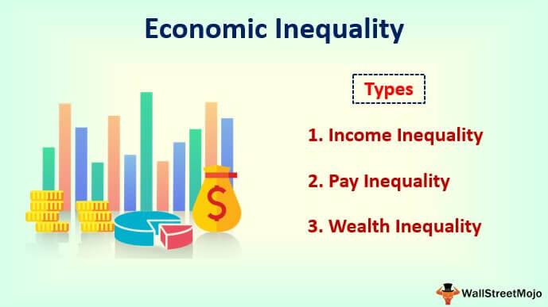

Economic justice refers to the equitable distribution of resources and opportunities within a society, ensuring that all individuals have fair access to economic prosperity. Central to this concept is the idea that economic systems should be structured in a way that benefits individuals equally, thus working towards addressing and reducing income inequality. Income inequality, a significant global challenge, is characterized by the unequal distribution of wealth and resources among different segments of the population. Addressing this inequality is critical for promoting social cohesion and fostering economic stability.

Economic justice is closely tied to legal milestones, as legislative and judicial actions have often played pivotal roles in shaping economic policies. Key legal frameworks and court rulings have historically sought to rectify income disparities by instituting policies that promote equitable economic practices. For example, minimum wage laws and tax reforms have been instrumental in driving legislative efforts towards fair economic distribution, reflecting the interconnectedness of legal measures and economic outcomes.

The advent of algorithmic trading, a form of trading that uses complex algorithms to automate and optimize financial transactions, presents new challenges in the context of economic justice. While algorithmic trading can enhance market efficiency and liquidity, it also raises concerns about exacerbating economic disparities. The speed and complexity of algorithmic transactions can disadvantage traditional traders and contribute to an uneven playing field, potentially leading to greater income inequality.

The intersection of economic justice, legal milestones, income inequality, and algorithmic trading signifies a complex dynamic that requires careful consideration. Legal frameworks must continually evolve to address the challenges posed by technological advancements in trading. This involves striking a balance between fostering innovation and ensuring that economic systems remain just and equitable.

The purpose of this article is to explore the interconnectedness of economic justice, legislative developments, income inequality, and algorithmic trading. Readers will gain insights into how legal milestones have shaped the pursuit of economic fairness, the implications of algorithmic trading on inequality, and potential future directions for enhancing economic justice in an evolving financial landscape. The article aims to provide a comprehensive understanding of how these elements interrelate and the critical role of law and policy in bridging the gap between technological advancement and economic equality.

## Table of Contents

## Understanding Economic Justice

Economic justice refers to the concept of fairness and equity in economic policy, distribution, and opportunities within a society. It rests on the principles that economic decisions should aim to provide equal access to resources, empower all individuals to have sufficient income that meets their basic needs, and allow individuals to pursue personal and professional goals without structural limitations. Economic justice seeks to create systems where wealth and resources are distributed fairly, reducing the disparities between different segments of the population.

Economic justice hinges upon several core principles, including equitable wealth distribution, equal opportunity, and the elimination of systemic barriers that prevent individuals from achieving economic success. These principles advocate for a balanced economic system where rewards and resources are allocated based on merit and need rather than privilege and power.

Economic policy and legislation play vital roles in promoting economic justice. Governments can implement policies that aim to create equitable conditions for all citizens, such as progressive taxation systems, social safety nets, minimum wage laws, and anti-discrimination measures. These efforts aim to mitigate income inequality and provide support to marginalized communities, ensuring that everyone has the opportunity to succeed regardless of their socio-economic background.

The historical evolution of economic justice movements showcases the continuous efforts to address systemic inequities. Over time, these movements have influenced significant changes in policy and legislation. In the 20th century, social security systems and labor rights were established in many countries, providing a foundation for economic justice. The civil rights movement further highlighted the intersection of economic and social equity, leading to anti-discrimination laws that tackled economic disparity affecting marginalized racial groups.

The pursuit of economic justice has also been evident in global movements advocating for fair trade practices, which emphasize the importance of equitable standards in international commerce. More recently, discussions around universal basic income and wealth taxes reflect continued efforts to reshape economic structures to promote fairness.

In summary, economic justice embodies the pursuit of equitable economic opportunities and outcomes for all individuals, supported by policy and legislation. Through historical struggles and ongoing advocacy, economic justice aims to dismantle systemic barriers to wealth and opportunity, fostering an economy that values fairness and inclusivity.

## Legal Milestones in Economic Justice

Legal milestones have played a pivotal role in shaping economic justice by enacting laws and policies that address income inequality and promote fairness. Key milestones include landmark court cases and pivotal legislation, such as minimum wage laws and tax reforms, which have significantly impacted income distribution, particularly among marginalized communities.

**Key Legal Milestones**

One of the critical milestones was the establishment of minimum wage laws, designed to ensure a basic standard of living for workers. The United States' Fair Labor Standards Act of 1938 set the groundwork by establishing a minimum wage, overtime pay eligibility, and child labor standards. This legislation aimed to protect workers from exploitation and reduce the income gap between different socio-economic groups.

Another significant legal development was the introduction of progressive tax reforms. The idea is to levy higher tax rates on higher income brackets, redistributing wealth and addressing disparities. Historical examples include the introduction of the income tax in the United States with the Revenue Act of 1913, which introduced a graduated income tax following the ratification of the Sixteenth Amendment. Such reforms are designed to create a more equitable taxation system, often aimed at reducing the wealth divide.

**Landmark Court Cases**

Several court cases have made substantial contributions to economic justice. One notable example is the 1954 Brown v. Board of Education decision, which, although primarily recognized for desegregating schools, also had economic implications by addressing systemic inequalities that impeded economic opportunities for marginalized groups. 

Similarly, the United States Supreme Court case, Lochner v. New York in 1905, initially set back economic justice by nullifying a state law limiting working hours, reflecting the tension between free-market principles and regulations aimed at protecting workers. This was eventually countered by later rulings and legislation that prioritized worker rights.

**Impact on Marginalized Communities**

Legal milestones have had profound effects on marginalized communities, often serving as both a catalyst for change and a reflection of societal progress towards economic fairness. For instance, equal pay legislation, such as the U.S. Equal Pay Act of 1963, aimed to close the wage gap between men and women, thus promoting economic equality across gender lines.

However, despite progress, disparities remain. Legal advancements often face challenges in implementation and enforcement, and their impacts can vary widely across different groups. For instance, while the minimum wage laws have uplifted many, they may not suffice in high-cost living areas or informal sectors where enforcement is weak. 

In conclusion, legal milestones set an important precedent for advancing economic justice, yet ongoing evaluation and adaptation are crucial to ensure these laws effectively bridge income gaps and uplift marginalized communities consistently.

## Income Inequality: A Global Challenge

Income inequality remains one of the most pressing global challenges today, manifesting across both developed and developing nations. The disparity in income distribution has widened significantly in recent decades, eroding social cohesion and economic stability.

**Current State of Income Inequality**

Globally, the Gini coefficient, a standard measure of income inequality, illustrates troubling levels of disparity. The coefficient ranges from 0, representing perfect equality, to 1, indicating maximum inequality. Nations like South Africa and Brazil consistently report high Gini coefficients, often above 0.6, while Scandinavian countries such as Norway and Sweden maintain lower levels around 0.25 due to robust welfare systems. The United States, one of the wealthier nations, has observed a rising Gini coefficient, now hovering around 0.41, reflecting increasing income concentration among the top earners.

**Factors Contributing to Rising Income Inequality**

Several key factors contribute to the growing income gap worldwide:

1. **Globalization and Technological Advancement**: While globalization has driven economic growth, it has also favored high-skill jobs, exacerbating income inequality. Technological advancements, especially in automation and artificial intelligence, have displaced low-skill labor, creating wage polarization.

2. **Educational Disparities**: Access to quality education remains uneven, particularly in developing regions. This imbalance perpetuates inequality, as higher education correlates strongly with increased earning potential.

3. **Labor Market Dynamics**: The decline of unionization and collective bargaining power has led to stagnant wage growth for the middle and lower-income earners, while executives and individuals with capital assets have seen significant income increases.

4. **Fiscal Policies**: Tax policies in many countries have increasingly favored the wealthy, with reductions in top tax rates and loopholes that allow for tax avoidance. This diminishes the redistributive potential of fiscal measures.

**Statistical Data Highlighting Disparities**

Data from the World Inequality Database indicates that the top 1% globally captured nearly 20% of the world’s income in recent years, while the bottom 50% received only 10%. Moreover, wealth concentration is even more pronounced, with the wealthiest 10% owning over 70% of global wealth. This concentration has historic roots and is exacerbated by compounding interest and capital income, which grow faster than wages for the lower and middle classes.

**Insights into Legal and Policy Interventions**

Efforts to curb income inequality have involved various legal and policy interventions:

- **Minimum Wage Increases**: By setting minimum wage thresholds, governments aim to uplift the lowest earners, although the impact varies widely based on enforcement and local economic conditions.

- **Progressive Taxation**: Implementing progressive tax systems where higher income brackets face higher tax rates can redistribute wealth effectively, as evidenced by countries with lower income inequality.

- **Universal Basic Income (UBI)**: Some countries have experimented with UBI, providing a safety net to all citizens. Although still largely exploratory, UBI could address inequality by ensuring a baseline income for everyone.

- **Education and Training Programs**: Investments in education, particularly in STEM and vocational training, can enhance employability and income potential, addressing some root causes of inequality.

While significant strides have been made in addressing income inequality, persistent gaps necessitate further concerted efforts. Global cooperation and innovative policy development remain crucial in bridging the divide and fostering more equitable societies.

## The Rise of Algorithmic Trading and Its Impact on Inequality

Algorithmic trading refers to the use of computer algorithms to execute trading orders in financial markets at speeds and frequencies that are impossible for human traders. These algorithms follow prescribed sets of rules and are designed to capture specific trading opportunities by analyzing vast amounts of market data. This approach to trading emerged in the early 2000s and has since become a dominant force in financial markets due to its efficiency and capability to process complex trade strategies rapidly.

One of the primary ways [algorithmic trading](/wiki/algorithmic-trading) has transformed financial markets is by increasing [liquidity](/wiki/liquidity-risk-premium). Algorithms can execute trades swiftly and in large volumes, contributing to tighter bid-ask spreads and enhancing the overall efficiency of market operations. This has made it easier for large institutional investors to enter and [exit](/wiki/exit-strategy) positions without significantly impacting market prices. However, while liquidity and efficiency are beneficial, the speed and complexity associated with algorithmic trading can also lead to increased [volatility](/wiki/volatility-trading-strategies) during periods of market stress.

Algorithmic trading has prompted discussions regarding its role in exacerbating economic inequality. By nature, this form of trading can be capital intensive, requiring significant financial resources to develop sophisticated algorithms and maintain the necessary technological infrastructure. Consequently, large financial institutions and well-capitalized hedge funds are more capable of leveraging these technologies compared to smaller investors or individuals. This disparity creates an uneven playing field, where those with access to advanced technology and capital can generate substantial profits, potentially widening the gap between wealthy and less wealthy market participants.

The regulatory challenges associated with algorithmic trading are significant. The fast-paced nature of algorithmic trades necessitates real-time monitoring and the development of sophisticated surveillance systems to detect and mitigate unhealthy market practices such as spoofing and front-running. Regulatory bodies like the U.S. Securities and Exchange Commission (SEC) and the European Securities and Markets Authority (ESMA) have introduced rules and guidelines to address these challenges. Measures include the requirement for robust risk control mechanisms and the submission of algorithmic strategies for regulatory approval to ensure market integrity.

In response to the potential for market disruption and inequality, legal efforts have focused on balancing innovation with fair practices. Regulations such as the 2012 U.S. Jumpstart Our Business Startups (JOBS) Act, MiFID II in Europe, and the Dodd-Frank Act have aimed to enhance transparency and impose stricter controls on trading activities. These regulations underscore a commitment to fostering an equitable trading environment, ensuring that technological advancements in finance do not exacerbate existing social and economic inequalities.

Despite these efforts, the continuous evolution of financial technology presents ongoing challenges. Effective regulation requires international cooperation and updated frameworks capable of adapting to rapid technological advancements within the financial sector. Efforts remain underway to create a fairer trading environment that balances financial innovation and economic equity.

## Intersections of Legal Milestones and Algorithmic Trading

Legal frameworks have evolved to address the complexities introduced by algorithmic trading, a technology-driven method of executing orders using automated pre-programmed trading instructions. This adaptation has been necessary to maintain market integrity and protect the interests of all market participants. 

### Legal Adaptations to Algorithmic Trading

Regulatory bodies worldwide have recognized the unique challenges presented by algorithmic trading, particularly its potential to disrupt markets and exacerbate economic inequality. As a result, several legal measures have been enacted to oversee these activities. Notable examples include the European Union’s Markets in Financial Instruments Directive II (MiFID II), the Dodd-Frank Act in the United States, and various other national regulations. MiFID II, implemented in 2018, introduced comprehensive requirements for transparency, risk management, and control mechanisms for algorithmic trading systems. It mandates the provision of kill switch mechanisms and robust system testing to prevent unintended market impacts.

The Dodd-Frank Act, enacted in response to the 2008 financial crisis, includes provisions aimed at increasing transparency and reducing systemic risks, with specific implications for algorithmic trading. It also led to the establishment of the Volcker Rule, which restricts banks from engaging in proprietary trading, thereby indirectly affecting algorithmic trading activities.

### Balancing Innovation with Economic Justice

The integration of algorithmic trading within financial markets has necessitated a balance between fostering innovation and maintaining economic justice. Legal frameworks strive to ensure that the advantages of algorithmic trading, such as increased liquidity and narrower bid-ask spreads, do not disproportionately benefit a select group of traders with advanced technological capabilities. Regulatory measures, therefore, focus on leveling the playing field by enforcing fair access to trading technologies and data.

Efforts to balance innovation with economic justice are evident in the requirement for equal access to market data and the prohibition of practices like latency [arbitrage](/wiki/arbitrage), where traders leverage milliseconds of information advantage. This has been an essential step towards averting market concentration and promoting equitable wealth distribution.

### Case Studies of Algorithmic Trading Regulation

The effectiveness of algorithmic trading regulations can be illustrated through multiple case studies. One significant example is the 2010 "Flash Crash," where the U.S. equity market plummeted temporarily, highlighting the dangers of unregulated algorithmic trading. This event led to the implementation of circuit breakers and limit up-limit down measures to mitigate similar risks in the future.

In another notable case, the London Whale incident in 2012 involved JPMorgan Chase, where flawed risk management in algorithmic trading resulted in substantial financial losses. This prompted stricter oversight and stress-testing requirements for financial institutions engaging in complex trading strategies.

Moreover, since the implementation of MiFID II, there have been improvements in market stability, indicating its success in crafting a framework that supports technological advancement without compromising economic fairness. However, continual monitoring and adaptation of these regulations are necessary as technology evolves and presents new challenges.

In summary, legal frameworks addressing algorithmic trading have undergone significant evolution, aiming to harmonize rapid technological advancements with principles of economic justice. Regulatory bodies continue to adapt by enacting measures that ensure robust market functioning and equitable access, fostering a balanced environment where innovation coexists with fairness and transparency.

## Future Directions: Bridging the Gap

In the age of algorithmic trading, enhancing economic justice requires a strategic approach that combines legal and policy measures, technological innovations, and international cooperation. Legal frameworks must evolve to address the complexities introduced by high-frequency and algorithmic trading systems, ensuring fairness in financial markets. Implementing robust regulation and oversight can limit the advantages gained by those with access to faster, more sophisticated trading algorithms. Regulatory bodies may consider measures such as transaction taxes or the imposition of speed limits on trades to level the playing field.

Technological innovations hold the potential to democratize financial markets, allowing broader participation and reducing economic inequality. Platforms utilizing blockchain technology can offer greater transparency and security, fostering trust among participants. Additionally, fintech solutions that provide widespread access to financial services and education can empower underserved populations, enhancing their economic opportunities.

International cooperation is crucial for tackling global income disparities. Harmonizing regulations and sharing best practices can prevent regulatory arbitrage, where traders exploit the differences in rules between jurisdictions. Collaborative efforts among countries can also lead to the development of global standards for algorithmic trading, ensuring that the benefits of financial innovation are distributed more equitably.

Looking forward, the future of economic justice in a rapidly evolving financial landscape involves a delicate balance between encouraging innovation and upholding fairness. Policymakers and regulators must continuously adapt to emerging technologies, proactively addressing potential disparities. Engaging stakeholders from different sectors, including finance, technology, and academia, can lead to more comprehensive and sustainable solutions. By fostering an inclusive dialogue, society can work towards a financial system that promotes both efficiency and equity, ensuring that technological advancement benefits all individuals, regardless of socioeconomic status.

## Conclusion

The exploration of economic justice highlights its pivotal role in addressing income inequality and shaping equitable societal structures. Legal milestones have historically served as benchmarks, ensuring justice through mechanisms like minimum wage laws and tax reforms. These legislative actions, reflected in landmark court cases worldwide, have consistently aimed to distribute wealth fairly and enhance opportunities for marginalized communities.

As the financial landscape evolves with innovations like algorithmic trading, the challenge becomes balancing these advancements with principles of economic equality. Algorithmic trading, while revolutionizing financial markets, raises concerns regarding its potential to widen economic disparities if left unregulated. This necessitates a dynamic legal and regulatory framework capable of adapting to technological innovations while safeguarding the interests of all socioeconomic groups.

The intersection of legal milestones and financial innovation underscores the ongoing necessity for vigilant advocacy and engagement in promoting fair economic practices. As global income inequality persists, it is imperative to enact and advocate for measures that align financial systems with economic justice. This includes encouraging international cooperation and leveraging technological innovations to democratize access to financial markets.

In conclusion, the harmonization of legal regulations with innovative financial practices is crucial. It requires persistent efforts and a collective commitment to engage with, and advocate for, policies that enhance economic justice and ensure a fairer distribution of wealth across society. Readers are encouraged to remain proactive in efforts to support and cultivate equitable economic frameworks.

## References & Further Reading

[1]: Galbraith, J. K. (2012). ["Inequality and Instability: A Study of the World Economy Just Before the Great Crisis."](https://academic.oup.com/book/11824) Oxford University Press.

[2]: Piketty, T. (2014). ["Capital in the Twenty-First Century."](https://www.jstor.org/stable/j.ctt6wpqbc) Harvard University Press.

[3]: O’Hara, M. (2015). ["High Frequency Trading and Its Impact on Markets."](https://www.tandfonline.com/doi/abs/10.2469/faj.v70.n3.6) Review of Finance, Volume 21, Issue 1.

[4]: Lopez de Prado, M. (2018). ["Advances in Financial Machine Learning."](https://books.google.com/books/about/Advances_in_Financial_Machine_Learning.html?id=oU9KDwAAQBAJ) Wiley.

[5]: MacKenzie, D. (2017). ["Mechanizing the Merc: The Chicago Mercantile Exchange and the Rise of High-Frequency Trading."](https://pubmed.ncbi.nlm.nih.gov/26387525/) Technology and Culture, Vol. 58, No. 1.

[6]: Stiglitz, J. E. (2012). ["The Price of Inequality: How Today’s Divided Society Endangers Our Future."](https://business.columbia.edu/sites/default/files-efs/imce-uploads/Joseph_Stiglitz/Price%20of%20Inequality%20for%20Sustainable%20Humanity.pdf) W.W. Norton & Company.

[7]: Lewis, M. (2014). ["Flash Boys: A Wall Street Revolt."](https://en.wikipedia.org/wiki/Flash_Boys) W.W. Norton & Company.

[8]: European Commission. (2018). ["Directive on markets in financial instruments repealing Directive 2004/39/EC of the European Parliament and of the Council (MiFID II)."](https://eur-lex.europa.eu/legal-content/EN/TXT/HTML/?uri=OJ:L_202402975) Official Journal of the European Union.