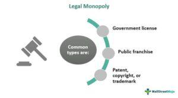

Legal monopolies in Europe and algorithmic trading in the United States represent pivotal aspects of contemporary economic and financial systems. A legal monopoly occurs when a government grants exclusive rights to a company or organization to operate in a specific sector, limiting competition. This practice is prevalent in certain European sectors where public welfare and infrastructure considerations are prioritized. Notable examples include utilities and postal services, where monopoly status is often justified by the need for uniform service delivery and substantial infrastructure investment.

In contrast, the United States has witnessed a profound transformation in financial markets with the rise of algorithmic trading. This method of trading involves the use of complex algorithms to execute orders at speeds and frequencies beyond human capability. Algorithmic trading has enhanced market efficiency and liquidity but also introduced challenges related to market volatility and systemic risk.

Understanding legal monopolies and algorithmic trading is crucial for grasping the broader dynamics of global markets. The regulation of these facets involves balancing innovation, competition, and consumer protection, ensuring that markets function efficiently and fairly. The European Union (EU) maintains strict regulations to manage monopolistic behaviors, safeguarding competitive market environments. Similarly, in the U.S., regulatory bodies like the Securities and Exchange Commission (SEC) and the Commodity Futures Trading Commission (CFTC) oversee algorithmic trading activities to prevent market abuse and enhance transparency.

This article explores these intricate topics, providing a comprehensive overview. Initially, it investigates into the concept of legal monopolies within European markets and the regulatory frameworks guiding them. Subsequently, it examines algorithmic trading in the U.S., discussing the associated benefits, risks, and regulatory oversight. The article concludes with a comparative analysis of how these regions approach regulation, highlighting ongoing challenges and potential future developments in both domains. Ultimately, it aims to offer insights into how effective regulation can foster competitive and equitable markets, encouraging collaboration among policymakers, regulators, and industry participants.

## Table of Contents

## Understanding Legal Monopolies in Europe

A legal monopoly in Europe refers to a market structure where a specific entity is granted the exclusive right to operate in a particular sector or provide certain services, often in exchange for regulation and oversight. This exclusivity is typically established by law or governmental directive, distinguishing it from a de facto monopoly that arises naturally through market dominance. Legal monopolies are commonly found in industries where the provision of services is deemed essential to the public's interest and where competition might result in reduced service efficiency or increased costs.

Several sectors in Europe are characteristic of legal monopolies, with postal services and utilities being prominent examples. Historically, many European nations have maintained state-run postal services to ensure consistent and universal mail delivery to all regions, recognizing the strategic and social importance of such services. For instance, France's La Poste and Royal Mail in the United Kingdom were traditionally state-controlled entities with exclusive rights to handle postal services. Although the postal sector has witnessed gradual liberalization in recent years, certain services, like the issuance of stamps for sending letters, remain monopolistic due to their public service obligations.

Utilities, including electricity, gas, and water supply, have also traditionally operated under legal monopoly statutes in various European nations. The rationale is that these industries benefit from economies of scale, where a single provider can produce goods or services more efficiently than multiple competing firms. Having one entity manage a region's water supply or electricity distribution reduces redundancies in infrastructure and ensures a standardized quality of service. In places such as Germany and Italy, regulated utilities continue to hold a monopoly over distribution networks, even as the broader energy markets open up to competition.

European Union (EU) legislation plays a crucial role in regulating these legal monopolies, balancing the need for consumer protection with market openness. The EU enforces regulations to prevent abuse of monopoly power, ensuring that the benefits of economies of scale do not result in unfair pricing or restricted market entry for potential competitors. For example, the EU's Third Energy Package aims to create a more competitive and integrated European energy market by unbundling energy production and supply from transmission networks. This legislative framework enhances transparency and competition, even within sectors traditionally dominated by single entities.

In summary, legal monopolies in Europe serve crucial roles in sectors where public interest and service efficiency are paramount. Through EU legislation and regulation, these monopolies are monitored to prevent anti-competitive practices while safeguarding essential service delivery to the public.

## Europe's Approach to Regulating Monopolies

The European Union has established a comprehensive framework to regulate monopolistic practices, centered on its antitrust laws. These regulations aim to promote competition, prevent the abuse of market dominance, and ensure fair trading conditions within the single market. Key components of EU antitrust laws include Articles 101 and 102 of the Treaty on the Functioning of the European Union (TFEU).

Article 101 TFEU prohibits agreements between companies that may prevent, restrict, or distort competition within the internal market. This includes cartels, collusive practices, and other agreements that have the potential to affect trade between EU member states. Violations can lead to hefty fines and mandates to alter business practices.

Article 102 TFEU addresses the abuse of a dominant position by one or more undertakings within the single market. It targets behaviors like unfair pricing, limiting production, or imposing discriminatory trading conditions that disadvantage competitors or consumers. The focus here is not on dominance itself, which is not illegal, but on its abuse.

The European Commission, as the executive body of the EU, plays a crucial role in enforcing antitrust laws. It acts as a watchdog, monitoring market practices and investigating potential breaches of competition laws. The European Commission has the authority to conduct investigations, impose fines, and require companies to cease infringing practices. It works closely with National Competition Authorities (NCAs) of member states to ensure cohesive enforcement across Europe.

Recent actions by the European Commission highlight its active stance against monopolistic behavior. For example, the Commission fined Google a record €4.34 billion in 2018 for illegal practices related to Android mobile devices to strengthen the dominance of its search engine. Similarly, in 2017, the Commission imposed a €2.42 billion fine on Google for manipulating search results to favor its comparison shopping service.

These actions demonstrate the EU's commitment to curbing monopolistic practices and fostering a competitive market environment. By maintaining rigorous oversight and enforcement, the European Commission aims to protect consumer interests and promote innovation and economic growth within the European Union.

## Algorithmic Trading in the United States

Algorithmic trading refers to the use of computer algorithms to manage the buying and selling of financial instruments automatically, leveraging speed and computational precision far beyond human capabilities. Algorithms make decisions that involve time, price, and [volume](/wiki/volume-trading-strategy) of orders in a split second, operating on pre-defined criteria. This type of trading became popular in the U.S. financial markets due to its ability to execute orders at speeds unachievable by traditional trading methods, significantly improving market [liquidity](/wiki/liquidity-risk-premium) and price efficiency.

In the U.S., [algorithmic trading](/wiki/algorithmic-trading) is crucial as it dominates the equity markets and has permeated into other asset classes, including commodities and foreign exchange. Its significance is underscored by improvements to market liquidity, enabling tighter bid-ask spreads and generally lowering transaction costs. However, the benefits come hand in hand with risks, most notably including market [volatility](/wiki/volatility-trading-strategies) and flash crashes, where markets can rapidly decline and recover due to automated trades.

The primary regulatory bodies overseeing algorithmic trading in the United States include the Securities and Exchange Commission (SEC) and the Commodity Futures Trading Commission (CFTC). The SEC is tasked with regulating securities markets, while the CFTC oversees commodity futures and options markets. Both agencies strive to maintain fair and orderly markets, reduce systemic risk, and protect investors.

The SEC has introduced regulations aimed at overseeing algorithmic trading, emphasizing the need for systems compliance and integrity, commonly referred to as "Regulation SCI." This demands that exchanges and some alternative trading systems adhere to stringent standards to improve the robustness of technological and cyber defenses. On the other hand, the CFTC focuses on ensuring that trading does not obscure market transparency or integrity. These regulatory frameworks are pivotal in safeguarding against the destabilizing potential of algorithmic trading and preserving trust in the financial markets.

Despite these regulatory efforts, challenges remain, stemming from the rapid evolution of technology. Algorithmic trading continues to evolve, demanding that regulatory frameworks adapt to new developments while ensuring they do not stifle innovation.

## Regulations Governing Algorithmic Trading in the U.S.

Algorithmic trading in the United States is governed by a comprehensive regulatory framework designed to mitigate risks such as market manipulation and ensure transparency and stability in financial markets. Two primary regulatory bodies overseeing these activities are the Securities and Exchange Commission (SEC) and the Commodity Futures Trading Commission (CFTC), each with set requirements to address the unique challenges posed by algorithmic trading.

### SEC's Regulation SCI

Regulation Systems Compliance and Integrity (Regulation SCI), implemented by the SEC, addresses the technological advances and complex interdependencies within the U.S. securities markets. It applies to key market participants, including self-regulatory organizations (SROs), certain alternative trading systems (ATSs), plan processors, and exempt clearing agencies. Regulation SCI obligates these entities to:

1. **Establish Robust Systems:** Entities must have policies and practices to ensure their systems are capable of maintaining operational capability and security. This includes maintaining system capacity, integrity, and availability.

2. **Notify the SEC:** Immediate notification to the SEC is required for any significant disruptions, systems compliance issues, or intrusions involving critical systems.

3. **Conduct Annual Reviews:** Entities must perform comprehensive annual reviews of their compliance with Regulation SCI and submit these evaluations to the SEC.

These requirements are designed to prevent systemic risks posed by technological failures, ensuring that algorithmic trading platforms do not contribute to market instability through outages or glitches.

### CFTC's Requirements

The CFTC oversees trading in the futures and derivatives markets. One notable regulation is the development of a framework for automated trading, proposed as Regulation AT (Automated Trading). Although not fully adopted, its provisions continue to inform current regulatory expectations:

1. **Registration of Algorithmic Trading Firms:** Under Regulation AT, firms that engage in algorithmic trading would be required to register with the CFTC, using defined criteria to capture entities with direct market access.

2. **Pre-Trade Risk Controls:** Firms must implement risk controls to prevent unintended trades, including limits on order message transmission and the ability to cancel orders effectively.

3. **Development and Testing:** Firms are expected to have rigorous standards for the development, testing, and deployment of their algorithmic strategies to avoid potentially disruptive events.

### Impact on Trading Firms and Investors

For trading firms, these regulations necessitate investments in compliance infrastructure and cybersecurity measures. Firms must allocate resources towards system checks, audits, and maintaining an audit trail of trading activities for regulatory scrutiny. The increased compliance costs can be significant, particularly for smaller firms. However, these measures also engender trust in market systems, reducing the likelihood of catastrophic trading failures and enhancing investor confidence.

From an investor standpoint, these regulations provide assurance that algorithmic trading, while complex and rapid, is conducted transparently and responsibly. The safeguards in place are intended to preserve market integrity and protect investors from the kinds of anomalies that led to events like the 2010 Flash Crash.

Overall, the regulatory landscape for algorithmic trading in the U.S. is structured to support a fair and orderly market environment, blending oversight with the innovation that algorithmic trading brings to financial markets. Continued collaboration between regulators, trading firms, and technology providers remains vital in evolving these frameworks effectively.

## Comparing Europe's Monopolistic Regulations with U.S. Algorithmic Trading Regulations

European and U.S. regulatory approaches to monopolistic practices and algorithmic trading display both commonalities and unique characteristics, reflecting their distinct economic priorities and market structures. Understanding these nuances illuminates the regulatory landscapes that define modern financial and economic environments.

### Similarities in Regulatory Approaches

Both Europe and the United States prioritize the balance between fostering innovation and maintaining market integrity. This dual objective is embedded in their respective regulatory frameworks, although implemented through different mechanisms. For instance, both regions establish legislative and oversight bodies to monitor compliance and enforce regulations.

In Europe, the European Commission oversees monopolistic practices through antitrust laws that aim to prevent the abuse of dominant market positions. Similarly, in the U.S., the Securities and Exchange Commission (SEC) and the Commodity Futures Trading Commission (CFTC) regulate algorithmic trading to prevent market manipulation and ensure transparency.

Another shared aspect is the focus on consumer protection. European legal monopoly regulations emphasize safeguarding consumer interests by preventing unfair pricing practices in sectors dominated by monopolies. In contrast, U.S. regulations governing algorithmic trading aim to protect investors by mitigating risks associated with high-frequency trading practices.

### Differences in Regulatory Approaches

The primary divergence between European monopolistic regulations and U.S. algorithmic trading regulations lies in their scope and application. European regulations are more focused on structural oversight, particularly in industries naturally inclined towards monopolistic structures such as utilities and postal services. These sectors are subject to strict pricing controls and service quality mandates to prevent consumer exploitation.

Conversely, U.S. algorithmic trading regulations are more concerned with behavioral oversight, targeting the specific trading practices that could disrupt market stability. Regulations such as the SEC’s Regulation Systems Compliance and Integrity (SCI) and requirements by the CFTC are designed to ensure that trading algorithms operate within defined safety parameters to prevent flash crashes and other destabilizing events.

### Balancing Innovation with Regulation

Both regions face the challenge of balancing innovation with regulatory oversight. Europe's approach tends to be more cautious, with stringent regulations that can sometimes stifle innovation in monopolistic sectors. For instance, regulations can limit the ability of monopolistic entities to adjust pricing strategies swiftly in response to market changes.

In the U.S., the regulatory environment is relatively more adaptable, allowing for the rapid evolution of new trading strategies while maintaining a baseline level of oversight to protect market integrity. However, this adaptability can sometimes lead to regulatory gaps that allow risky trading practices to go unchecked until they pose significant threats.

### Effectiveness of the Regulatory Frameworks

The effectiveness of these frameworks is often evaluated by their ability to prevent anti-competitive behavior and protect market participants without hindering economic growth. European regulations have generally been successful in ensuring fair competition and consumer protection in monopolized sectors, although critics argue they can impede market dynamism.

U.S. regulations on algorithmic trading have advanced in their ability to address complex technological trading methods, enhancing market stability through real-time monitoring and adaptability. Nevertheless, as trading technologies continue to evolve, these regulations must continually adapt to new methodologies and potential vulnerabilities.

In summary, while Europe and the U.S. both aim to balance innovation with regulation, their diverging focuses reflect their respective economic contexts. Europe’s legal monopoly oversight ensures stable service provision in naturally monopolistic sectors, whereas U.S. algorithmic trading regulations prioritize market stability amidst technological advances. Both frameworks demonstrate a commitment to maintaining fair, competitive, and robust economic systems.

## Challenges and Future Developments

Regulating both legal monopolies in Europe and algorithmic trading in the United States presents a formidable set of challenges and opportunities for future development. The dynamic nature of these sectors necessitates adaptable and forward-thinking regulatory frameworks.

### Current Challenges

**Legal Monopolies in Europe:**  
One major challenge facing European regulators is maintaining a balance between allowing certain sectors to operate as legal monopolies while ensuring these entities do not abuse their position to the detriment of consumers. Postal services and utilities, often structured as legal monopolies for reasons related to efficiency and national interest, risk becoming complacent without competitive pressures, potentially leading to higher prices or reduced service quality. Additionally, with rapid technological advancements, traditional monopoly sectors are facing new forms of competition that existing regulations may not adequately address.

**Algorithmic Trading in the United States:**  
In the U.S., algorithmic trading poses risks related to market stability and fairness. High-frequency trading ([HFT](/wiki/high-frequency-trading-strategies)), a subset of algorithmic trading, can lead to flash crashes and increased market volatility, as seen in the 2010 Flash Crash. Additionally, ensuring that these trading algorithms do not enable illicit activities such as market manipulation or insider trading is a persistent challenge for regulators. The complex and opaque nature of these algorithms can make oversight and enforcement difficult.

### Potential Upcoming Changes in Legislation or Policy

In Europe, there is an ongoing discussion about revising regulations governing legal monopolies to ensure they remain efficient and customer-focused in light of technological disruptions. This could involve stricter performance benchmarks or incentivizing innovation within monopoly sectors.

In the U.S., regulatory bodies such as the Securities and Exchange Commission (SEC) and the Commodity Futures Trading Commission (CFTC) are considering enhanced disclosure requirements for trading algorithms to improve transparency and accountability. There may also be stricter stress-testing requirements for algorithmic systems to better handle periods of high market volatility.

### Future Trends

**Legal Monopolies in Europe:**  
One possible trend is the gradual erosion of traditional monopolistic structures due to increased digitalization and competition from tech-driven startups. This may prompt a shift towards regulatory frameworks that support hybrid models, where public and private entities collaborate to deliver services.

**Algorithmic Trading in the United States:**  
Algorithmic trading is likely to become more sophisticated, incorporating elements of [artificial intelligence](/wiki/ai-artificial-intelligence) and [machine learning](/wiki/machine-learning) to improve decision-making processes. This advancement will require more robust regulatory approaches that encompass not just the algorithms themselves but also the data inputs and decision models.

To address these imminent changes, collaboration between regulators, industry participants, and policymakers is essential. This collaboration should focus on creating flexible yet robust regulatory frameworks capable of adapting to new technological advancements while ensuring the protection of consumer interests and market integrity.

## Conclusion

In conclusion, understanding the nuanced regulatory frameworks governing legal monopolies in Europe and algorithmic trading in the United States is crucial for maintaining competitive and fair markets. Legal monopolies, often found in sectors such as utilities and postal services, serve specific public interests but require careful oversight to prevent abuse of power. The European Union employs robust antitrust laws and a vigilant European Commission to ensure these monopolies operate fairly while addressing potential anti-competitive behaviors.

Conversely, the dynamic nature of algorithmic trading in the U.S. financial markets demands a different regulatory response. The SEC and CFTC have established comprehensive regulations aimed at mitigating risks such as market manipulation and ensuring transparency in trading practices. Effective regulation is essential not only for safeguarding the interests of investors and trading firms but also for fostering innovation in financial markets.

The comparative analysis reveals that both regions balance the need for regulation with the encouragement of innovation, albeit through distinct methodologies tailored to their specific market structures. The effectiveness of these frameworks lies in their adaptability to evolving market conditions and technological advancements.

It is imperative for policymakers, regulators, and industry stakeholders to engage collaboratively. By sharing insights and experiences, they can enhance regulatory measures that protect market integrity while promoting economic growth. As we move forward, addressing challenges and anticipating future developments in legal monopolies and algorithmic trading will require a concerted effort to craft policies that ensure fair competition and resilient financial markets.

## References & Further Reading

[1]: Vickers, J. (2008). ["Regulating Competition in Utilities."](https://www.ucl.ac.uk/jevons-institute/sites/jevons-institute/files/vickers_dec_08.pdf) The Economic Journal.

[2]: Hasbrouck, J. (2007). ["Empirical Market Microstructure: The Institutions, Economics, and Econometrics of Securities Trading."](https://academic.oup.com/book/52241) Oxford University Press.

[3]: Chlistalla, M. (2011). ["High-frequency trading: better than its reputation?"](https://c.mql5.com/forextsd/forum/168/high-frequency_trading_-_better_than_its_reputation.pdf) Deutsche Bank Research.

[4]: Fox, J., & Trebilcock, M. J. (2013). ["The Legal and Economic Structure of Monopoly and Regulatory Harms in International Law."](https://searchworks.stanford.edu/view/10154402) Cambridge University Press.

[5]: Aldridge, I. (2013). ["High-Frequency Trading: A Practical Guide to Algorithmic Strategies and Trading Systems."](https://books.google.com/books/about/High_Frequency_Trading.html?id=6l0DDQAAQBAJ) Wiley.