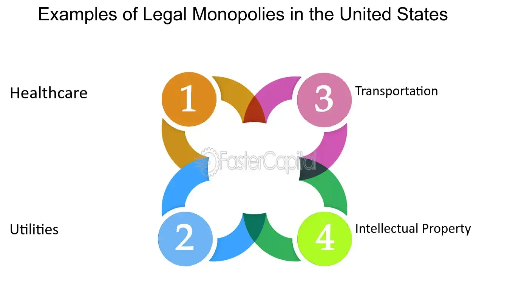

## Table of Contents

## What is a legal monopoly?

A legal monopoly is when the government gives one company the right to be the only one to sell a certain product or service. This means no other companies can offer the same thing. Governments might do this for different reasons, like to make sure the service is available everywhere, even in places where it might not be profitable, or to control important resources.

For example, a country might have a legal monopoly on its postal service. This means only the government's postal service can deliver mail. The government does this to make sure mail gets to everyone, even in remote areas where a private company might not want to go because it's too expensive. This helps keep the service reliable and available to all people.

## What are some examples of legal monopolies in the United States?

In the United States, one example of a legal monopoly is the United States Postal Service (USPS). The USPS has the exclusive right to deliver first-class mail, like letters and small packages. This means that no other company can deliver these types of mail. The government set it up this way to make sure that mail service reaches everyone, even in places where it might not be profitable for private companies to go.

Another example is utility companies, like those that provide electricity, water, or natural gas. In many areas, only one company is allowed to provide these services. This is because it would be too expensive and confusing to have multiple companies building their own sets of pipes and wires. By having a legal monopoly, the government can make sure that everyone gets these essential services, and it can regulate the prices to keep them fair.

## What are some examples of legal monopolies in Europe?

In Europe, one example of a legal monopoly is the postal services in many countries. For example, in France, La Poste has the exclusive right to deliver letters weighing less than 50 grams. This means that no other company can deliver these types of mail. The government gives La Poste this right to make sure that everyone in France can get their mail, even in small villages where it might not be profitable for private companies to go.

Another example is the railway systems in some European countries. In the United Kingdom, Network Rail owns and operates the railway infrastructure. This means they control the tracks and stations, and other train companies can only use them with permission. The government set up this system to make sure the railways are safe and reliable for everyone, and to manage the complex network efficiently.

## How are legal monopolies created and regulated in the United States?

Legal monopolies in the United States are created by the government when they decide that it's important for one company to provide a certain service or product without competition. This can happen through laws passed by Congress or decisions made by government agencies. For example, the government might decide that only the United States Postal Service can deliver first-class mail to make sure everyone gets their mail, even in places where it might not make money for private companies. The government gives the monopoly to make sure the service reaches all people, not just those in profitable areas.

Once a legal monopoly is created, it is regulated by the government to make sure it's doing its job right. This means the government keeps an eye on the company to make sure it's providing good service and not charging too much. For example, utility companies like those that provide electricity or water are often legal monopolies. The government watches over these companies to make sure they keep their prices fair and their service reliable. If the company doesn't follow the rules, the government can step in and make changes to protect the people who use the service.

## How are legal monopolies created and regulated in Europe?

In Europe, legal monopolies are created when governments decide that it's best for one company to provide a certain service or product without any competition. This can happen through laws passed by national governments or decisions made by European Union bodies. For example, many European countries have given their postal services the right to be the only ones to deliver letters up to a certain weight. This is done to make sure that everyone gets their mail, even in places where it might not be profitable for private companies to go. Governments make these rules because they want to ensure that important services are available to everyone.

Once a legal monopoly is set up in Europe, it is watched over by the government to make sure it is doing a good job. This means the government checks that the company is providing good service and not charging too much. For example, railway systems in some countries are legal monopolies, and the government keeps an eye on them to make sure they are safe and reliable. If the company isn't following the rules, the government can step in and make changes to protect the people who use the service. This helps to balance the power of the monopoly and make sure it serves the public well.

## What are the economic justifications for legal monopolies?

Legal monopolies can be good for the economy because they can make sure important services reach everyone. For example, if only one company can deliver mail, they will go to small towns and villages where it might not make money. This is important because everyone needs to get their mail. Also, when one company controls things like water or electricity, it can be cheaper and easier to manage. It would be too expensive to have many companies building their own pipes and wires everywhere.

Another reason for legal monopolies is that the government can control prices and make sure they are fair. If there is only one company providing a service, the government can watch over them and stop them from charging too much. This helps keep costs down for people who need the service. Legal monopolies can also help with big projects that need a lot of money, like building railways or power plants. It's easier for one company to do this than many small ones, and the government can help make sure it gets done right.

## What are the potential benefits of legal monopolies for consumers?

Legal monopolies can help make sure everyone gets important services, like mail or electricity. If there's only one company doing this, they will go to small towns and villages where it might not make money. This is good because everyone needs these services, no matter where they live. It's also easier and cheaper to have one company in charge of things like water or power. If many companies had to build their own pipes and wires, it would cost a lot more and be confusing.

Another benefit is that the government can keep prices fair. With only one company providing a service, the government can watch them closely and stop them from charging too much. This helps keep costs down for people who use the service. Legal monopolies can also make big projects easier to do, like building railways or power plants. It's simpler for one company to handle these big jobs, and the government can make sure it's done well.

## What are the potential drawbacks of legal monopolies for consumers?

Legal monopolies can make things harder for people who use their services. When there's only one company in charge, they might not work as hard to give good service. Without other companies to compete with, they don't have to worry about losing customers. This can mean slower service, fewer choices, and less innovation. For example, if there's only one postal service, they might not hurry to deliver your mail or offer new ways to send things.

Another problem is that legal monopolies can charge more money. When there's no competition, the company can set higher prices because people have no other choice. Even if the government tries to keep prices fair, it can be hard to stop the company from finding ways to charge more. This can make important services like electricity or water more expensive for everyone, which is tough on people who need to pay their bills.

## How do legal monopolies impact competition in the market?

Legal monopolies make it so that other companies can't compete in the same market. When the government says only one company can do something, like deliver mail or provide electricity, other businesses can't offer the same service. This means there's no competition, and the monopoly company doesn't have to worry about other companies trying to take their customers away. Without competition, the company might not work as hard to improve their service or keep prices low.

This lack of competition can be bad for the market. When there's only one company, they might not try to do better or come up with new ideas because they don't have to. This can make the service worse and more expensive for people who use it. But sometimes, the government watches over these monopolies to make sure they don't charge too much and to keep the service good. Still, it's hard to make sure the company always does what's best for everyone without other companies to compete with.

## What are the differences in legal monopoly regulations between the United States and Europe?

In the United States, legal monopolies are created and regulated by the government to make sure important services like mail or utilities reach everyone. The government gives one company the right to provide these services and then watches over them to make sure they do a good job and don't charge too much. For example, the United States Postal Service is the only one that can deliver first-class mail. The government keeps an eye on them to make sure they deliver mail to everyone, even in small towns, and that they keep their prices fair.

In Europe, legal monopolies are also set up by governments, but they can involve decisions made by the European Union as well. Like in the U.S., the government gives one company the right to do something, like deliver letters or run the railways, to make sure everyone gets the service. The government then makes sure the company is doing a good job and not overcharging. For example, in France, La Poste is the only one that can deliver letters under 50 grams. The government watches them to make sure they serve everyone and keep prices fair.

The main difference between the U.S. and Europe is that in Europe, the European Union can play a role in setting up and regulating these monopolies, while in the U.S., it's mostly handled by the national government. Both places aim to make sure important services are available to everyone and that the companies running these services don't take advantage of their position.

## What are some historical cases of legal monopolies that have been challenged or dismantled?

One big example of a legal monopoly that was challenged and dismantled is the Standard Oil Company in the United States. In the late 1800s and early 1900s, Standard Oil had control over almost all the oil refining and distribution in the country. People thought this was too much power for one company, so the government took them to court. In 1911, the Supreme Court decided that Standard Oil was a monopoly that hurt competition. They made the company break up into smaller pieces, which let other companies start competing in the oil business.

Another example is the breakup of AT&T, also known as "Ma Bell," in the United States. For many years, AT&T was the only company that could provide telephone service across the country. In the 1970s and 1980s, people started to think this wasn't fair, and it stopped new companies from starting up. The government took AT&T to court, and in 1982, they agreed to break up into smaller companies. This allowed more competition in the telephone industry and gave people more choices for their phone service.

## How might future technological advancements affect the existence and regulation of legal monopolies?

Future technological advancements could change the way legal monopolies work. New technology might make it easier for new companies to start up and compete with big monopolies. For example, if new ways of delivering mail or making electricity come along, it could mean that the old monopoly companies don't have to be the only ones doing these things anymore. This could make the government think about changing the rules to let more companies into the market, which would give people more choices and maybe better service.

Governments might also need to change how they watch over and control legal monopolies because of new technology. If new ways of doing things come up, the government might need to make new rules to make sure the monopoly companies are still doing a good job and not charging too much. Technology can also help the government keep a closer eye on these companies to make sure they are following the rules. This could mean that legal monopolies have to work harder to keep up with new technology and stay fair to the people they serve.

## References & Further Reading

[1]: Vickers, J. (2008). ["Regulating Competition in Utilities."](https://www.ucl.ac.uk/jevons-institute/sites/jevons-institute/files/vickers_dec_08.pdf) The Economic Journal.

[2]: Hasbrouck, J. (2007). ["Empirical Market Microstructure: The Institutions, Economics, and Econometrics of Securities Trading."](https://academic.oup.com/book/52241) Oxford University Press.

[3]: Chlistalla, M. (2011). ["High-frequency trading: better than its reputation?"](https://c.mql5.com/forextsd/forum/168/high-frequency_trading_-_better_than_its_reputation.pdf) Deutsche Bank Research.

[4]: Fox, J., & Trebilcock, M. J. (2013). ["The Legal and Economic Structure of Monopoly and Regulatory Harms in International Law."](https://searchworks.stanford.edu/view/10154402) Cambridge University Press.

[5]: Aldridge, I. (2013). ["High-Frequency Trading: A Practical Guide to Algorithmic Strategies and Trading Systems."](https://books.google.com/books/about/High_Frequency_Trading.html?id=6l0DDQAAQBAJ) Wiley.