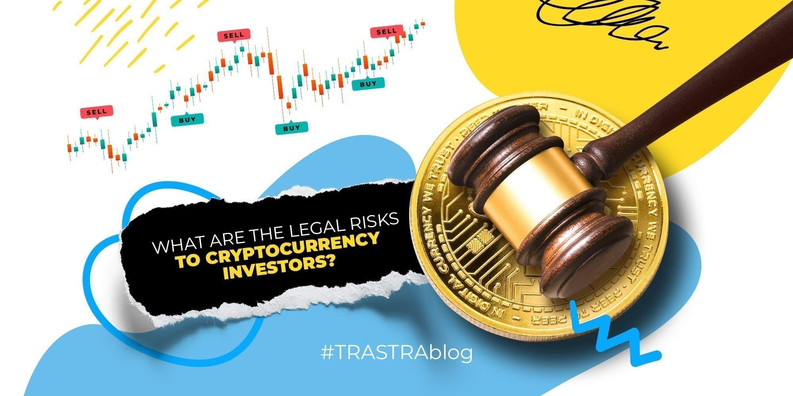

## Table of Contents

## What are cryptocurrencies and how do they differ from traditional investments?

Cryptocurrencies are a type of digital money that you can use to buy things online. They are not controlled by any government or bank, which makes them different from regular money. Instead, they use a technology called blockchain, which is like a big, public record book that keeps track of all transactions. People can send and receive cryptocurrencies directly, without needing a bank to help them. Some popular cryptocurrencies include Bitcoin, Ethereum, and Dogecoin.

Traditional investments, like stocks, bonds, and real estate, are very different from cryptocurrencies. When you invest in stocks, you are buying a small piece of a company, and you might get money back if the company does well. Bonds are like loans you give to a company or government, and they pay you back with interest. Real estate means buying property, like houses or land, which can go up in value over time. These investments are usually more stable and regulated by laws, but they can also take longer to see big profits. Cryptocurrencies, on the other hand, can change in value very quickly, which makes them riskier but also potentially more rewarding.

## What are the basic legal risks associated with investing in cryptocurrencies?

Investing in cryptocurrencies can come with some legal risks that you should know about. One big risk is that the rules about cryptocurrencies can be different in different countries. Some places might not allow you to use or invest in them at all. If you break these rules, you could get into trouble with the law. Also, because cryptocurrencies are not controlled by banks or governments, it can be hard to get help if something goes wrong, like if someone steals your money.

Another risk is that the laws about cryptocurrencies are still changing. What is okay to do today might not be okay tomorrow. This can make it hard to know if you are doing everything right. Plus, if you make money from cryptocurrencies, you might have to pay taxes on it, but figuring out how much to pay can be tricky because the rules are not always clear. It's a good idea to talk to a lawyer or a tax expert to help you understand the legal risks and make sure you are following the rules.

## How do regulatory frameworks vary across different countries for cryptocurrency investments?

Different countries have different rules about cryptocurrencies. In some places, like Japan and Switzerland, the government has made clear rules that let people use and invest in cryptocurrencies safely. Japan, for example, sees Bitcoin as a legal payment method and has strict rules for businesses that deal with cryptocurrencies. Switzerland is known for being friendly to blockchain and crypto businesses, with clear guidelines on how to operate legally. These countries want to encourage the growth of cryptocurrencies while also protecting people from risks.

In other countries, the rules can be much stricter or even unclear. China, for example, has banned banks from dealing with cryptocurrencies and has cracked down on crypto trading and mining. This makes it very hard for people in China to invest in cryptocurrencies legally. The United States has a mix of rules; some states are more open to cryptocurrencies, while others are more cautious. The U.S. government is still figuring out how to regulate cryptocurrencies, which can make it confusing for investors to know what is allowed.

Overall, the way countries handle cryptocurrencies can be very different. Some countries have clear rules to help people invest safely, while others have strict bans or unclear laws. It's important for anyone thinking about investing in cryptocurrencies to learn about the rules in their own country and maybe even get advice from a lawyer to stay safe and legal.

## What is the impact of anti-money laundering (AML) and know your customer (KYC) regulations on cryptocurrency investors?

Anti-money laundering (AML) and know your customer (KYC) rules are important for people who want to invest in cryptocurrencies. These rules help stop bad people from using cryptocurrencies to hide money they got from doing bad things, like stealing or selling drugs. When you want to use a cryptocurrency exchange or wallet service, they will ask you to prove who you are, like showing your ID or a utility bill. This is to make sure you are not trying to do anything illegal. It might feel like a hassle, but these rules help keep the cryptocurrency world safer for everyone.

These rules can also affect how easy or hard it is for you to invest in cryptocurrencies. In some countries, the rules are strict, which means you might have to go through a lot of checks before you can start investing. This can slow things down and might even stop some people from investing at all. But in other places, the rules might be easier to follow, making it simpler to get started. Either way, these rules are there to protect you and the whole cryptocurrency system from being used for bad things.

## How can tax laws affect cryptocurrency investments and what are the common tax pitfalls?

Tax laws can make a big difference when you invest in cryptocurrencies. In many countries, you have to pay taxes on the money you make from buying and selling cryptocurrencies. This is like when you make money from selling stocks or other investments. But figuring out how much tax you owe can be tricky because the value of cryptocurrencies can go up and down a lot. Sometimes, you might even owe taxes on cryptocurrencies you get as a gift or for free, like when you get paid in Bitcoin for a job. It's important to keep good records of all your cryptocurrency transactions so you can report them correctly on your taxes.

One common tax pitfall is not knowing when you need to pay taxes. For example, in some places, you have to pay taxes every time you trade one cryptocurrency for another, not just when you turn it into regular money. Another pitfall is forgetting to report all your transactions. If you don't keep good records, you might miss reporting some of your gains, which can get you in trouble with the tax authorities. It's a good idea to talk to a tax expert who knows about cryptocurrencies to help you avoid these problems and make sure you are following the tax laws correctly.

## What are the legal implications of cryptocurrency exchanges and wallets?

Cryptocurrency exchanges and wallets come with some legal things you need to think about. Exchanges are like online markets where you can buy, sell, or trade cryptocurrencies. They have to follow rules set by the government, like anti-money laundering (AML) and know your customer (KYC) rules. These rules help stop bad people from using the exchanges to do illegal things. If an exchange doesn't follow these rules, it can get in big trouble, and the people using the exchange might also face problems.

Wallets, on the other hand, are like digital safes where you keep your cryptocurrencies. Some wallets are run by companies, and they might also have to follow the same AML and KYC rules as exchanges. But if you use a wallet that you control yourself, like a software wallet on your computer, you might not have to follow these rules. Still, you need to be careful because if you do something illegal with your wallet, you could get in trouble. It's important to know the laws in your country about using exchanges and wallets to make sure you're doing everything right.

## How does the classification of cryptocurrencies as securities or commodities affect legal risks?

The way cryptocurrencies are classified, either as securities or commodities, can change the legal risks for people who invest in them. If a cryptocurrency is seen as a security, it means it's treated like stocks or bonds. This means the people who create and sell these cryptocurrencies have to follow strict rules set by the government. These rules are meant to protect investors by making sure they get all the right information before they invest. If someone breaks these rules, they could face big fines or even go to jail. This makes investing in cryptocurrencies that are classified as securities riskier because the rules are tougher and the punishments for breaking them are harsher.

On the other hand, if a cryptocurrency is classified as a commodity, it's treated more like gold or oil. The rules for commodities are usually not as strict as those for securities. This can make it easier for people to buy and sell these cryptocurrencies, but it also means there might be less protection for investors. The government might not watch these cryptocurrencies as closely, which can lead to more fraud or scams. So, the legal risks can be different depending on how a cryptocurrency is classified, and it's important for investors to understand these differences to stay safe.

## What legal protections exist for cryptocurrency investors against fraud and scams?

There are some legal protections for people who invest in cryptocurrencies to help them stay safe from fraud and scams. In many countries, the government has rules that make it harder for bad people to trick investors. For example, cryptocurrency exchanges have to follow rules like anti-money laundering (AML) and know your customer (KYC). These rules help make sure that the people using the exchanges are who they say they are and are not trying to do anything illegal. If an exchange doesn't follow these rules, it can get in big trouble, which can help protect investors.

But these protections can be different depending on where you live. In some places, the government watches cryptocurrencies closely and has strong rules to protect investors. In other places, the rules might not be as strong, which can make it easier for scammers to trick people. It's important for investors to learn about the laws in their country and be careful when they invest in cryptocurrencies. If someone thinks they have been scammed, they should talk to a lawyer or report it to the police to get help.

## How do smart contracts and decentralized finance (DeFi) introduce new legal challenges for investors?

Smart contracts and decentralized finance (DeFi) can bring new legal challenges for investors because they work differently from traditional finance. Smart contracts are like digital agreements that automatically do what they are supposed to do when certain things happen. They run on blockchain, which means no one person or company controls them. This can be good because it makes things faster and cheaper, but it also means that if something goes wrong, it can be hard to fix. For example, if a smart contract has a mistake in its code, it might not do what you expect, and there might not be anyone to help you fix it. This can make it tricky to know who is responsible if you lose money because of a smart contract problem.

DeFi, or decentralized finance, lets people do things like borrowing, lending, or trading money without using a bank or other middleman. It's all done on blockchain, which can make it hard for governments to keep track of what's happening. This can lead to legal problems because the rules about finance are usually made for traditional banks and might not fit well with DeFi. For example, if something goes wrong in a DeFi platform, it might be hard to know which laws apply or who should be held responsible. Also, because DeFi is new, the laws about it are still being figured out, which can make it risky for investors who might not know all the rules they need to follow.

## What are the implications of recent high-profile legal cases involving cryptocurrencies?

Recent high-profile legal cases involving cryptocurrencies have shown that governments are starting to take a closer look at this new kind of money. For example, in the United States, the case against FTX and its founder Sam Bankman-Fried has made headlines. FTX was a big cryptocurrency exchange that went bankrupt, and it turned out that a lot of money was missing. This case has shown that even big names in the crypto world can get in trouble if they break the law. It has also made people more aware that investing in cryptocurrencies can be risky because the rules are still being figured out.

Another important case is the one between the SEC and Ripple Labs. The SEC said that Ripple's cryptocurrency, XRP, was a security and not a commodity. This matters a lot because securities have stricter rules than commodities. The court's decision in this case could change how other cryptocurrencies are treated by the law. These cases show that the rules around cryptocurrencies are still changing, and investors need to be careful and keep up with the latest news to stay safe.

## How can investors mitigate legal risks when engaging in Initial Coin Offerings (ICOs) or Security Token Offerings (STOs)?

When you want to invest in Initial Coin Offerings (ICOs) or Security Token Offerings (STOs), it's important to know how to stay safe from legal problems. One way to do this is by doing your homework. Before you put your money into an ICO or STO, learn about the project and the people behind it. Check if they have shared all the important details about their project, like what they plan to do with the money and how they will make their idea work. Also, make sure the project follows the rules in your country. If it's an STO, it might be treated like a security, which means there are strict rules the project needs to follow. Talking to a lawyer who knows about cryptocurrencies can help you understand these rules better.

Another way to lower your legal risks is by being careful about where you invest your money. Stick to platforms and projects that have a good reputation and are known for following the law. Look for projects that have been checked by lawyers or other experts to make sure they are doing things the right way. Keep good records of all your investments, so you can show what you did if there are any questions later. Remember, the world of ICOs and STOs is still new, and the rules can change. Staying informed and being cautious can help you avoid legal troubles and protect your money.

## What future regulatory trends might impact the legal landscape for cryptocurrency investments?

In the future, governments might make more rules about cryptocurrencies to protect people who invest in them. Right now, the rules are different in different places, but more countries are starting to see that they need to keep an eye on cryptocurrencies. They might make new laws to stop fraud and scams, and to make sure that cryptocurrency exchanges and wallets follow the same rules as banks. This could mean more checks and paperwork for investors, but it would also make the cryptocurrency world safer and more trustworthy.

Another big trend could be how governments decide to treat cryptocurrencies, like if they are seen as money, securities, or commodities. This decision can change a lot of things for investors. If more cryptocurrencies are seen as securities, the rules will be stricter, and the people who create and sell them will have to follow more laws. On the other hand, if they are seen as commodities, the rules might be easier, but there could be less protection for investors. As these trends happen, it's important for people who invest in cryptocurrencies to keep learning about the new rules to stay safe and follow the law.

## What is Understanding Algorithmic Trading in Cryptocurrency?

Algorithmic trading refers to the use of computer algorithms and software designed to automatically execute trades within financial markets. In cryptocurrency, this approach is particularly attractive due to the market's inherent high [volatility](/wiki/volatility-trading-strategies) and its 24/7 operational hours. These characteristics provide a fertile ground for algorithmic trading, offering opportunities for rapid execution of trades and potential for enhanced returns.

In the cryptocurrency space, investors employ a variety of algorithms. Simple strategies might involve basic moving averages, which help identify trends over time by smoothing out price data. For example, a simple moving average (SMA) can be calculated as:

$$
\text{SMA} = \frac{P_1 + P_2 + \cdots + P_n}{n}
$$

where $P_1, P_2, \ldots, P_n$ are the closing prices over a period of $n$ days. More sophisticated strategies utilize complex quantitative models involving statistical analysis and machine learning algorithms to predict price movements and make informed trading decisions.

Understanding these algorithms is pivotal for mitigating potential legal issues. Poorly designed or implemented algorithms can inadvertently engage in activities that might be deemed manipulative or otherwise illegal across different jurisdictions. For instance, algorithms designed without adequate foresight could trigger spikes or crashes in the market, leading to scrutiny by regulatory bodies.

Moreover, [cryptocurrency](/wiki/cryptocurrency) [algorithmic trading](/wiki/algorithmic-trading) must navigate an evolving regulatory landscape. Different regions impose varying regulatory stipulations that can profoundly affect how algorithms are developed and deployed. The global nature of cryptocurrency means that legal frameworks from multiple jurisdictions must be considered simultaneously. It is thus crucial for traders to stay abreast of regulatory changes and ensure compliance to avoid legal pitfalls.

## References & Further Reading

[1]: Bergstra, J., Bardenet, R., Bengio, Y., & Kégl, B. (2011). ["Algorithms for Hyper-Parameter Optimization."](https://papers.nips.cc/paper/4443-algorithms-for-hyper-parameter-optimization) Advances in Neural Information Processing Systems 24.

[2]: ["Advances in Financial Machine Learning"](https://www.amazon.com/Advances-Financial-Machine-Learning-Marcos/dp/1119482089) by Marcos Lopez de Prado

[3]: ["Evidence-Based Technical Analysis: Applying the Scientific Method and Statistical Inference to Trading Signals"](https://books.google.com/books/about/Evidence_Based_Technical_Analysis.html?id=jbD47VkOHAEC) by David Aronson

[4]: ["Machine Learning for Algorithmic Trading"](https://github.com/stefan-jansen/machine-learning-for-trading) by Stefan Jansen

[5]: ["Quantitative Trading: How to Build Your Own Algorithmic Trading Business"](https://www.amazon.com/Quantitative-Trading-Build-Algorithmic-Business/dp/1119800064) by Ernest P. Chan

[6]: Securities and Exchange Commission. ["Framework for ‘Investment Contract’ Analysis of Digital Assets."](https://www.sec.gov/about/divisions-offices/division-corporation-finance/framework-investment-contract-analysis-digital-assets)

[7]: Financial Conduct Authority. ["Cryptoassets: AML/CTF Regime."](https://www.fca.org.uk/firms/financial-crime/cryptoassets-aml-ctf-regime)

[8]: European Securities and Markets Authority. ["Advice on Initial Coin Offerings and Crypto-Assets."](https://www.esma.europa.eu/document/advice-initial-coin-offerings-and-crypto-assets)

[9]: Commodity Futures Trading Commission. ["CFTC Backgrounder on Oversight of and Approach to Virtual Currency Futures Markets."](https://www.cftc.gov/sites/default/files/idc/groups/public/@newsroom/documents/file/backgrounder_virtualcurrency01.pdf)