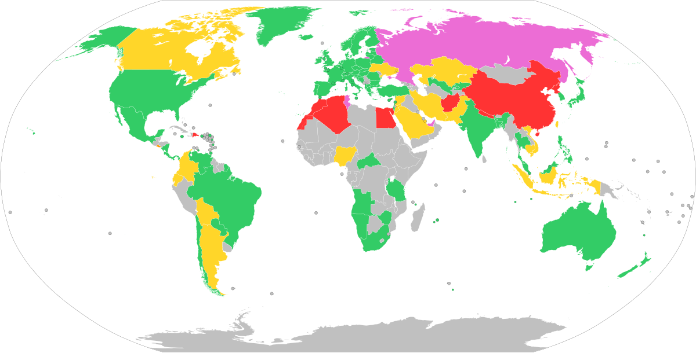

## Table of Contents

## What is Bitcoin and why is its legal status important?

Bitcoin is a type of digital money that people can use to buy things online. It's different from regular money because it's not controlled by a government or a bank. Instead, it uses a technology called blockchain, which is like a big digital record book that keeps track of all the Bitcoin transactions. People can send and receive Bitcoins using special computer programs, and they can also store them in digital wallets.

The legal status of Bitcoin is important because it affects how people can use it and whether they can trust it. In some countries, Bitcoin is treated like regular money and people can use it freely. But in other places, the government might not allow Bitcoin or might have strict rules about how it can be used. This can make it hard for people to know if they're doing something legal when they use Bitcoin. Knowing the legal status helps people decide if they want to use Bitcoin and how they should use it safely.

## How is Bitcoin classified in different countries?

In some countries, Bitcoin is seen as a type of money that people can use to buy things. For example, in Japan, Bitcoin is treated like regular money, and people can use it to pay for things in stores. In the United States, Bitcoin is considered a type of property, which means people have to pay taxes on it when they buy or sell it. This makes it a bit more complicated to use, but it's still legal.

In other countries, the rules about Bitcoin can be very strict or even ban it completely. For instance, in China, the government has made it illegal to use Bitcoin to buy things, but people can still own it and trade it. In some places like Bolivia and Bangladesh, the government has banned Bitcoin completely, and people can get in trouble if they use it. These different rules show how the way Bitcoin is treated can change a lot from one country to another.

## Is Bitcoin legal to use as a currency in the United States?

In the United States, Bitcoin is not considered a regular currency like dollars. Instead, the government sees it as a type of property, similar to stocks or gold. This means that when people buy or sell Bitcoin, they have to pay taxes on it, just like they would with other kinds of property.

Even though Bitcoin is not treated as money, people in the United States can still use it to buy things from businesses that accept it. Many online shops and some stores will take Bitcoin as payment. As long as people follow the tax rules, using Bitcoin is legal in the United States.

## What are the tax implications of using Bitcoin in the European Union?

In the European Union, the tax rules for Bitcoin can be a bit different in each country, but there are some general ideas that apply everywhere. When you buy Bitcoin, you usually don't have to pay any taxes right away. But when you use Bitcoin to buy something or sell it for regular money, you might have to pay taxes on any profit you made. This is because many countries in the EU see Bitcoin as a type of asset, like stocks or gold, so making money from it can be taxed like capital gains.

For example, if you bought Bitcoin for €100 and later sold it for €150, you might have to pay taxes on that €50 profit. Some countries also have special rules, like Value Added Tax (VAT), which can apply when you use Bitcoin to buy things. It's a good idea to check the specific tax laws in your country in the EU to make sure you're following the rules correctly when using Bitcoin.

## Can Bitcoin be used for transactions in Japan, and what regulations apply?

In Japan, Bitcoin is treated as a type of money that people can use to buy things. Since 2017, the Japanese government has said that Bitcoin is a legal way to pay for stuff. Many stores and online shops in Japan accept Bitcoin, so it's easy for people to use it for everyday purchases.

There are some rules that people need to follow when they use Bitcoin in Japan. The government wants to make sure that Bitcoin is used safely and honestly. That's why they have rules for businesses that deal with Bitcoin, like exchanges where people can buy and sell it. These businesses have to follow strict rules to keep customers' money safe and to stop any shady activities. If people follow these rules, they can use Bitcoin without any problems in Japan.

## What is the legal status of Bitcoin in China, and how has it changed over time?

In China, the legal status of Bitcoin has changed a lot over time. At first, people could use Bitcoin freely to buy things and trade it. But in 2013, the Chinese government said that Bitcoin was not real money and that it was risky to use. They told banks and other financial places not to deal with Bitcoin. Even though people could still own and trade Bitcoin, they couldn't use it to buy things easily.

Later, in 2017, the rules got even stricter. The Chinese government banned something called Initial Coin Offerings (ICOs), which is a way for new digital money to raise money. They also stopped people from trading Bitcoin on big exchanges in China. Now, people can still own Bitcoin, but it's hard to use it to buy things because of these strict rules. The government wants to keep an eye on Bitcoin to make sure it's not used for anything bad, like money laundering.

## How does India regulate Bitcoin and other cryptocurrencies?

In India, the rules about Bitcoin and other cryptocurrencies have changed a lot over time. At first, there were no clear rules, and people could use Bitcoin freely. But in 2018, the government said that banks and other financial places should not deal with cryptocurrencies. This made it hard for people to buy and sell Bitcoin easily. The government was worried about things like money laundering and fraud, so they wanted to be careful.

Later, in 2020, the Indian Supreme Court said that the ban on banks dealing with cryptocurrencies was not fair. This made it easier for people to use Bitcoin again. But the government still wants to keep an eye on cryptocurrencies. In 2021, they made a new law that says people have to pay taxes on any money they make from cryptocurrencies. They also have to tell the government about their [cryptocurrency](/wiki/cryptocurrency) transactions. So, while people can use Bitcoin in India, they need to follow these rules carefully.

## What are the restrictions on Bitcoin in South Korea?

In South Korea, Bitcoin and other cryptocurrencies have some rules that people need to follow. The government wants to make sure that people use Bitcoin safely and don't do anything bad with it. That's why they have rules for places where people can buy and sell Bitcoin, like exchanges. These places have to follow strict rules to keep customers' money safe and to stop any shady activities. People also have to tell the government about their cryptocurrency transactions and pay taxes on any money they make from it.

Over time, the rules in South Korea have changed a bit. At first, there were no clear rules, and people could use Bitcoin freely. But then the government got worried about things like money laundering and fraud. So, they made new rules to keep a closer eye on cryptocurrencies. Even though it's still legal to use Bitcoin in South Korea, people need to follow these rules carefully to stay out of trouble.

## How do countries like Australia and Canada treat Bitcoin for legal and tax purposes?

In Australia, Bitcoin is treated as a type of money that people can use to buy things. Since 2017, the government has said that Bitcoin is a legal way to pay for stuff. But when people use Bitcoin to buy something or sell it for regular money, they might have to pay taxes on any profit they made. The government sees Bitcoin as a type of asset, like stocks or gold, so making money from it can be taxed like capital gains. If someone bought Bitcoin for $100 and later sold it for $150, they might have to pay taxes on that $50 profit. As long as people follow the tax rules, using Bitcoin is legal in Australia.

In Canada, Bitcoin is also treated as a type of asset, not as regular money. The government sees it like stocks or gold, so people have to pay taxes on any money they make from buying and selling Bitcoin. If someone buys Bitcoin for $100 and later sells it for $150, they might have to pay taxes on the $50 profit. But using Bitcoin to buy things is okay, as long as people follow the tax rules. The Canadian government wants to make sure that Bitcoin is used safely and honestly, so they keep an eye on it to stop any shady activities.

## What are the international regulatory frameworks affecting Bitcoin's legal status?

Different countries have their own rules about Bitcoin, but there are also some big international groups that try to help make these rules work together. One big group is the Financial Action Task Force (FATF), which is made up of many countries. They want to stop bad things like money laundering and terrorism financing. The FATF says that countries should keep an eye on Bitcoin and other cryptocurrencies to make sure they're not used for these bad things. They have rules that say businesses dealing with cryptocurrencies, like exchanges, should follow strict rules to keep customers' money safe and report any weird activities.

Another group that matters is the International Organization of Securities Commissions (IOSCO). They help countries make rules about financial stuff, including cryptocurrencies. IOSCO wants to make sure that people who invest in cryptocurrencies are treated fairly and that the markets are honest. They suggest that countries should have clear rules about how cryptocurrencies can be bought and sold, and they should keep an eye on them to stop fraud. Even though these groups can't make laws themselves, many countries listen to them and use their ideas to make their own rules about Bitcoin.

## How do anti-money laundering (AML) and know your customer (KYC) laws impact Bitcoin's legality?

Anti-money laundering (AML) and know your customer (KYC) laws are important rules that affect how Bitcoin can be used legally. These laws are made to stop bad people from using Bitcoin to hide money they got from doing bad things, like crimes. Because of these laws, businesses that deal with Bitcoin, like exchanges where people buy and sell it, have to follow strict rules. They need to check who their customers are and make sure they're not doing anything shady. This means that when someone wants to use Bitcoin, they might have to show their ID and give personal information to these businesses.

These AML and KYC laws can make it harder for people to use Bitcoin freely because they have to follow these rules. But they also help make Bitcoin safer to use. If businesses follow these laws, it's less likely that Bitcoin will be used for bad things. This can make governments and regular people feel better about using Bitcoin. So, while these laws add some steps and checks, they play a big role in deciding whether Bitcoin can be used legally in different countries.

## What future legal challenges might Bitcoin face globally?

In the future, Bitcoin might face some new legal challenges around the world. As more people start using Bitcoin, governments might want to make new rules to keep it safe and stop bad things from happening. They might worry about things like money laundering, fraud, and protecting people who use Bitcoin. Some countries might decide to make stricter rules or even ban Bitcoin if they think it's too risky. This could make it harder for people to use Bitcoin freely and might cause problems for businesses that deal with it.

Another challenge could be about taxes. Right now, different countries have different rules about how to tax Bitcoin. In the future, there might be more talk about making these rules the same everywhere. This could help people understand what they need to do when they use Bitcoin, but it might also mean they have to pay more taxes. Also, as Bitcoin gets more popular, there might be more fights about how to treat it legally. Some people might want it to be treated like regular money, while others might want it to stay a special kind of property. These disagreements could lead to new laws and court cases that change how Bitcoin can be used.

## References & Further Reading

[1]: SEC. (n.d.). ["Framework for 'Investment Contract' Analysis of Digital Assets."](https://www.sec.gov/about/divisions-offices/division-corporation-finance/framework-investment-contract-analysis-digital-assets) U.S. Securities and Exchange Commission.

[2]: European Commission. (2020). ["Markets in Crypto-Assets Regulation Proposal."](https://eur-lex.europa.eu/legal-content/EN/TXT/?uri=CELEX:52020PC0593)

[3]: Monetary Authority of Singapore. (2020). ["Guidelines on Licensing for Payment Service Providers."](https://www.mas.gov.sg/regulation/payments)

[4]: Nakamoto, S. (2008). ["Bitcoin: A Peer-to-Peer Electronic Cash System."](https://nakamotoinstitute.org/library/bitcoin/)

[5]: De Filippi, P., & Wright, A. (2018). ["Blockchain and the Law: The Rule of Code."](https://www.jstor.org/stable/j.ctv2867sp) Harvard University Press.

[6]: Vigna, P., & Casey, M. J. (2015). ["The Age of Cryptocurrency: How Bitcoin and Digital Money Are Challenging the Global Economic Order."](https://dl.acm.org/doi/10.5555/2717097) St. Martin's Griffin.

[7]: Antonopoulos, A. M. (2017). ["Mastering Bitcoin: Programming the Open Blockchain."](https://www.amazon.com/Mastering-Bitcoin-Programming-Open-Blockchain/dp/1491954388) O'Reilly Media.

[8]: Gandal, N., & Halaburda, H. (2016). ["Can We Predict the Winner in a Market with Network Effects? Competition in Cryptocurrency Market."](https://papers.ssrn.com/sol3/papers.cfm?abstract_id=2832836) Games.

[9]: Narayanan, A., Bonneau, J., Felten, E. W., Miller, A., & Goldfeder, S. (2016). ["Bitcoin and Cryptocurrency Technologies: A Comprehensive Introduction."](https://press.princeton.edu/books/hardcover/9780691171692/bitcoin-and-cryptocurrency-technologies) Princeton University Press.