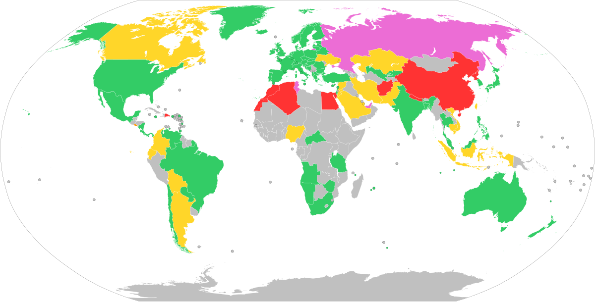

## Table of Contents

## What is Bitcoin?

Bitcoin is a type of digital money that people can use to buy things online. It was created in 2009 by someone using the name Satoshi Nakamoto. Unlike regular money, Bitcoin is not controlled by any government or bank. Instead, it uses a special technology called blockchain to keep track of all transactions. This makes it very secure and hard to fake.

People can get Bitcoin by buying it with regular money, or by earning it through a process called mining. Mining involves using computers to solve complex math problems, which helps keep the Bitcoin network running. Once someone has Bitcoin, they can send it to others quickly and easily, without needing a bank. However, the value of Bitcoin can go up and down a lot, so it can be risky to use or invest in.

## Is Bitcoin considered legal tender in any country?

Bitcoin is not considered legal tender in most countries. Legal tender means money that a government says must be accepted for paying debts. In most places, Bitcoin is treated more like a commodity or an investment, not something you can use to pay for things everywhere.

However, a few countries have started to recognize Bitcoin as legal tender. For example, El Salvador made Bitcoin legal tender in 2021. This means businesses in El Salvador have to accept Bitcoin if someone wants to use it to buy things. Another country, the Central African Republic, also made Bitcoin legal tender in 2022. But even in these countries, not everyone uses Bitcoin all the time because it can be hard to understand and use.

## How is Bitcoin regulated in the United States?

In the United States, Bitcoin and other cryptocurrencies are not considered legal tender, but they are regulated by different government agencies. The main agency that looks after Bitcoin is the Securities and Exchange Commission (SEC). The SEC makes sure that people who invest in Bitcoin are protected and that companies that deal with Bitcoin follow the rules. Another important agency is the Commodity Futures Trading Commission (CFTC), which treats Bitcoin as a commodity, like gold or oil, and regulates trading in Bitcoin futures.

Different states in the U.S. also have their own rules about Bitcoin. Some states require businesses that deal with Bitcoin to get a special license called a "BitLicense." New York is one state that has this rule. These state regulations can make it harder for businesses to work with Bitcoin in some places. Overall, the U.S. government wants to make sure that Bitcoin is used safely and that people are not cheated, but the rules can be complicated and different in each state.

## What are the tax implications of using Bitcoin?

When you use Bitcoin, you need to think about taxes. In many countries, including the United States, Bitcoin is treated like property, not money. This means if you buy something with Bitcoin, it's like selling the Bitcoin for regular money first and then using that money to buy the thing. If the value of your Bitcoin has gone up since you got it, you might have to pay capital gains tax on the profit. If it has gone down, you might be able to claim a loss on your taxes.

In the U.S., if you use Bitcoin to pay for things, you have to keep track of how much the Bitcoin was worth when you got it and when you used it. This can be hard because Bitcoin's value changes a lot. You also need to report any Bitcoin you get as income if you earn it from mining, receiving it as payment, or other ways. Different countries have different rules, so it's important to check what the tax laws are where you live.

## Can Bitcoin be used for illegal activities?

Yes, Bitcoin can be used for illegal activities. Because Bitcoin transactions can be hard to trace, some people use it to buy and sell things that are against the law, like drugs or stolen information. Criminals might also use Bitcoin to hide money they got from illegal activities because it's easier to move Bitcoin without banks noticing.

However, not everyone who uses Bitcoin is doing something illegal. Many people use Bitcoin for regular, legal things like buying things online or investing. Governments and companies are working on ways to make it harder for criminals to use Bitcoin, like better tracking and reporting of transactions. But the problem of illegal use is still something that people worry about with Bitcoin.

## How do different countries classify Bitcoin (as a currency, commodity, or something else)?

Different countries classify Bitcoin in different ways. In some places, like the United States, Bitcoin is seen as a commodity, similar to gold or oil. This means it's treated more like a thing you can own and trade, not like money you use every day. Other countries, like Japan, have recognized Bitcoin as a legal payment method, which means businesses can accept it as payment for goods and services.

In the European Union, Bitcoin is often treated as a digital currency but not as legal tender. This means people can use it to buy things online, but it's not something you have to accept if someone tries to pay you with it. Some countries, like China, have strict rules and don't allow Bitcoin to be used as a currency at all, treating it more as a speculative investment. Overall, the way Bitcoin is classified can change a lot depending on where you are.

## What are the legal risks associated with Bitcoin mining?

Bitcoin mining is when people use special computers to solve math problems and earn Bitcoin. But there are some legal risks that come with it. In some countries, like China, the government has made it illegal to mine Bitcoin. If you mine Bitcoin in these places, you could get in trouble with the law. Also, mining uses a lot of electricity, and some places have rules about how much power you can use. If you use too much, you might have to pay big fines or even stop mining.

In other countries, like the United States, mining is not illegal, but there are still rules you need to follow. For example, if you earn a lot of Bitcoin from mining, you have to report it as income and pay taxes on it. If you don't, you could get in trouble with the tax office. Also, some states have special licenses you need to get if you want to mine Bitcoin. If you don't have the right license, you could face legal problems. So, it's important to know the laws in your area before you start mining Bitcoin.

## How do anti-money laundering (AML) and know your customer (KYC) laws apply to Bitcoin?

Anti-money laundering (AML) and know your customer (KYC) laws are important rules that help stop people from using Bitcoin to hide illegal money. These laws make businesses that deal with Bitcoin, like exchanges where you can buy and sell it, check who their customers are. This is called KYC. They need to know your name, where you live, and other details to make sure you're not doing anything wrong. AML laws help these businesses watch for strange behavior, like if someone is moving a lot of Bitcoin quickly or in a way that doesn't make sense. If they see something suspicious, they have to report it to the government.

Different countries have different rules about AML and KYC for Bitcoin. In places like the United States and Europe, these laws are very strict. Businesses have to follow them carefully or they could get in big trouble. But in some other countries, the rules might not be as strong, which can make it harder to stop illegal activities. Overall, AML and KYC laws are there to make Bitcoin safer and stop people from using it to do bad things.

## What legal protections exist for Bitcoin investors and users?

Legal protections for Bitcoin investors and users depend a lot on where you live. In the United States, the government agencies like the Securities and Exchange Commission (SEC) and the Commodity Futures Trading Commission (CFTC) watch over Bitcoin to make sure people are not cheated. If someone tries to trick you with Bitcoin, you can report it to these agencies. Also, some states have rules that make Bitcoin businesses follow certain rules to protect customers, like keeping their money safe and being honest about what they do with it.

In other countries, the protections can be different. In places like Japan, the government says Bitcoin can be used to buy things, and they have rules to make sure businesses treat customers fairly. But in countries like China, the government has strict rules against using Bitcoin, so there are fewer protections for people who use it. Overall, if you're using Bitcoin, it's good to know the laws in your country so you can understand what protections you have and how to stay safe.

## How have international treaties and agreements influenced the legal status of Bitcoin?

International treaties and agreements have not directly made rules about Bitcoin, but they have affected how countries think about it. For example, the Financial Action Task Force (FATF) is a group of countries that work together to stop money laundering and terrorism financing. They have made suggestions for countries to follow when it comes to cryptocurrencies like Bitcoin. These suggestions help countries decide their own rules and laws about Bitcoin. Because many countries want to follow the FATF's advice, it has a big impact on how Bitcoin is treated around the world.

Another way international agreements affect Bitcoin is through trade deals. Some countries have trade agreements that talk about digital currencies and how they should be treated. These agreements can make it easier for Bitcoin to be used across borders, but they can also make countries more careful about how they regulate it. Overall, while there are no specific treaties just for Bitcoin, the general rules and suggestions from international groups help shape the legal status of Bitcoin in different countries.

## What are the ongoing legal challenges and court cases related to Bitcoin?

There are many ongoing legal challenges and court cases about Bitcoin around the world. One big issue is whether Bitcoin should be treated as a currency, a commodity, or something else. In the United States, for example, there are court cases trying to decide if Bitcoin should be regulated by the SEC as a security, which would mean different rules for people who invest in it. Another problem is how to stop people from using Bitcoin for illegal things like money laundering or buying drugs. Governments and courts are trying to figure out how to make rules that stop these activities but still let people use Bitcoin for legal things.

Another important legal challenge is about taxes. People who use Bitcoin need to know how to pay taxes on it, but the rules can be confusing. In some countries, there are court cases where people are fighting about how much tax they should pay on their Bitcoin. Also, there are cases about whether businesses that deal with Bitcoin need special licenses and what happens if they don't follow the rules. These legal battles are important because they help decide how Bitcoin can be used safely and fairly in the future.

## How might future legislation impact the legal status of Bitcoin globally?

Future laws could change how Bitcoin is treated around the world. Governments might make new rules to stop people from using Bitcoin for bad things like money laundering or buying illegal stuff. They might also want to make sure that people who invest in Bitcoin are protected from being cheated. Some countries might decide to treat Bitcoin more like regular money, which could make it easier to use for buying things. But other countries might make it harder to use Bitcoin, or even ban it completely, if they think it's too risky or hard to control.

These changes could make Bitcoin safer and more popular if the rules are clear and fair. But they could also make it harder for people to use Bitcoin if the rules are too strict or different in every country. It's important for governments to work together so that people can use Bitcoin easily and safely no matter where they live. As more countries make new laws about Bitcoin, it will be interesting to see how it affects the way people use it and what new opportunities or problems come up.

## References & Further Reading

[1]: Nakamoto, S. (2008). ["Bitcoin: A Peer-to-Peer Electronic Cash System."](https://nakamotoinstitute.org/library/bitcoin/)

[2]: Yermack, D. (2015). ["Is Bitcoin a Real Currency? An Economic Appraisal,"](https://www.sciencedirect.com/science/article/pii/B9780128021170000023) National Bureau of Economic Research.

[3]: Bryans, D. (2014). "Bitcoin and Money Laundering: Mining for an Effective Solution," Indiana Law Journal, 89(1), 441-472. [Accessible here](https://papers.ssrn.com/sol3/papers.cfm?abstract_id=2317990).

[4]: Zohar, A. (2015). ["Bitcoin: under the hood,"](https://dl.acm.org/doi/10.1145/2701411) Data Mining and Knowledge Discovery, 31(1), 55-63.

[5]: US Internal Revenue Service (2014). ["IRS Notice 2014-21."](https://www.irs.gov/pub/irs-drop/n-14-21.pdf)

[6]: Chuen, D. L. K. (2015). ["Handbook of Digital Currency: Bitcoin, Innovation, Financial Instruments, and Big Data."](https://www.sciencedirect.com/book/9780128021170/handbook-of-digital-currency) Elsevier.

[7]: Houben, R., & Snyers, A. (2018). ["Cryptocurrencies and blockchain: Legal context and implications for financial crime, money laundering and tax evasion."](https://www.europarl.europa.eu/cmsdata/150761/TAX3%20Study%20on%20cryptocurrencies%20and%20blockchain.pdf)619024) European Parliament.

[8]: Kharpal, A. (2021). ["China's crackdown on crypto mining is showing signs of success, data suggests."](https://en.wikipedia.org/wiki/2020%E2%80%932021_Xi_Jinping_Administration_reform_spree), CNBC.

[9]: Prasad, E. (2021). ["The Future of Money: How the Digital Revolution Is Transforming Currencies and Finance."](https://www.jstor.org/stable/j.ctv33wwv60) Harvard University Press.