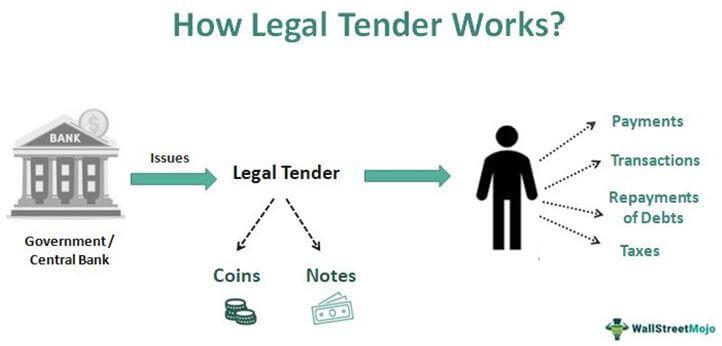

Legal tender is a critical concept in economics and finance, reflecting a form of money that is legally recognized for settling debts within a country. Its underpinning significance ensures that transactions occur smoothly in various economies, fostering stability and trust among market participants. Understanding legal tender's role and impact requires examining the broader functions of currency in economic systems. This article aims to explore these economic functions, specifically focusing on currency's roles as a medium of exchange, a unit of account, a store of value, and a standard of deferred payment.

Currency functions, crucial for facilitating trade and sustaining monetary stability, have evolved significantly. Initially dominated by physical money, such as coins and notes, the spectrum now includes electronic forms like digital payment systems and cryptocurrencies. These currencies have increasingly blurred traditional borders, illustrating the dynamic nature of monetary evolution and its implications for markets.

Integral to this transformation is the rise of algorithmic trading, a frontier in financial markets driven by technology. By using advanced algorithms to execute trades, this approach enables faster, more efficient transactions while minimizing human error. Algorithmic trading underscores a paradigm shift, reshaping how currency markets operate, and profoundly influencing financial landscapes globally. Its impact, reflecting both opportunities for efficiency and challenges in market governance, exemplifies the ongoing technological revolution in finance.

Through this discussion, we will address the evolving nature of currency, the economic enhancements prompted by algorithmic trading, and the interplay between legal tender and market stability. As we navigate this complex financial terrain, comprehending these intersections becomes essential for future economic strategies and policies.

## Table of Contents

## Understanding Legal Tender

Legal tender refers to the forms of currency that must be accepted in the settlement of debts and financial obligations. It is a recognized medium of exchange established by the legal framework of a country, signifying its role as the official means of payment within its jurisdiction. Legal tender laws are imperative as they provide a standardized method for transactions, ensuring economic coherence and stability.

The establishment and enforcement of legal tender laws are typically conducted through legislation passed by a governmental or authoritative body. These laws outline which items are deemed legal tender and must be accepted to settle debts. For instance, in the United States, legal tender status is designated by statute, with the U.S. dollar being the primary legal tender for debts, taxes, and dues.

Legal tender is intrinsic to economic stability and public trust as it creates confidence in the financial system. It assures individuals and businesses that currency will be accepted universally within the economy, facilitating the free flow of trade and commerce. The acceptance of a common currency helps stabilize prices, reduce transaction costs, and prevent disputes over payment methods, thereby bolstering predictability and order in economic transactions.

Despite its established role, legal tender is subject to limitations and criticisms, particularly in today's rapidly evolving financial ecosystem. One criticism is its rigidity in adapting to a dynamically changing market, especially with the advent of digital currencies and payment systems. While legal tender laws require certain forms of currency to be accepted, they often do not accommodate newer, decentralized forms of money such as cryptocurrencies, which operate outside traditional banking systems. Consequently, this can lead to challenges in transactions where such currencies are preferred due to their efficiency, security, or particular market demands.

Additionally, the limitation of legal tender can be observed in the scale of its enforcement. Although a currency is deemed legal tender within its own jurisdiction, its acceptance is not necessarily guaranteed internationally. Thus, when global transactions are involved, businesses and travelers may face limitations regarding the currency's acceptance, requiring currency exchange or alternative payment methods.

The discourse on legal tender is further complicated by emerging financial technologies and digital payment methods, which offer increased transactional flexibility but do not fit neatly within traditional legal tender frameworks. These innovations challenge the conventional understanding and application of legal tender, prompting calls for legal reforms to better integrate and adapt to new monetary technologies. As legal and financial institutions adapt to these changes, the role and perception of legal tender continue to be scrutinized and redefined.

## Economic Functions of Currency

Currency is a crucial component of any economy, fulfilling several critical functions that facilitate economic activities and ensure smooth market operations. The primary economic functions of currency include serving as a medium of exchange, a unit of account, a store of value, and a standard of deferred payment. Understanding these functions is essential for analyzing how currency contributes to economic growth and development.

### Medium of Exchange

Currency allows goods and services to be exchanged efficiently, eliminating the complexities associated with a barter system where a double coincidence of wants is necessary. By acting as a medium of exchange, currency enables buyers and sellers to conduct transactions without the need for direct barter, increasing the ease and speed of trade. This function accelerates market transactions and enhances economic efficiency by reducing transaction costs and time spent in negotiations.

### Unit of Account

Currency provides a consistent measure of value, simplifying the process of pricing goods and services. By serving as a unit of account, currency allows economic [agents](/wiki/agents) to compare the relative value of different products, contributing to a well-functioning price system. This function helps consumers and businesses make informed consumption, production, and investment decisions, which are fundamental to economic planning and allocation of resources.

### Store of Value

Currency can act as a store of value, enabling individuals and entities to defer consumption and save for future needs. A reliable store of value is crucial for maintaining purchasing power over time, which requires that currency retains its value and is reasonably stable. However, inflation can erode the store of value function if the currency does not maintain its purchasing power, making monetary stability an essential objective for central banks.

### Standard of Deferred Payment

This function allows individuals and businesses to make agreements for future payments. Currency as a standard of deferred payment provides the certainty needed to engage in long-term contracts, such as loans, mortgages, and leases. This function relies on the expectation that currency will remain a stable measure of value over time, underscoring the importance of sound monetary policy.

### Currency Efficiency and Economic Growth

The efficiency with which currency performs these functions significantly affects economic growth and development. Efficient currency systems reduce transaction times and costs, promote savings and investments, and ensure fair pricing in the economy, contributing to enhanced productivity and economic expansion.

### Role of Central Banks

Central banks play a pivotal role in managing and regulating currency functions. They are responsible for controlling the money supply, ensuring price stability, and maintaining confidence in the currency. Through monetary policy, central banks influence interest rates and inflation, directly affecting the currency's performance as a store of value and a standard of deferred payment. Moreover, central banks also oversee financial systems to ensure [liquidity](/wiki/liquidity-risk-premium), which is essential for currency's role as a medium of exchange.

### Examples from Different Economies

The practical applications of these functions can be illustrated through examples from various economies. In countries with stable currencies, such as the United States or the Eurozone, the dollar and euro efficiently serve all four functions, supported by robust monetary policies and financial infrastructures. In contrast, economies experiencing hyperinflation, like Zimbabwe in the late 2000s, demonstrate how the inability to perform these currency functions can lead to economic instability and necessitate the adoption of alternative currencies or innovative payment systems.

In conclusion, the economic functions of currency are foundational to the functioning of an economy, with significant implications for economic stability and growth. Central banks' management plays a critical role in ensuring that currency performs these functions effectively, thereby supporting a healthy economic environment.

## Examples of Currency in Action

Currency has played a crucial role throughout history, both in facilitating trade and in serving as a tool for economic policy. While traditional forms of currency such as coins and notes continue to have significant functions, modern technological advancements have introduced digital payment systems and cryptocurrencies, reshaping how economies operate.

### Historical Use of Currency

Historically, currencies began as physical commodities with intrinsic value, such as gold and silver. The shift to coins and banknotes marked a significant transition, allowing for more convenient trade. Cash, in its various forms, has served as the primary medium of exchange, unit of account, store of value, and standard of deferred payment. For example, the U.S. dollar, which became prominent post-Bretton Woods Agreement, established itself as a reliable international standard, influencing global trade and stability. The U.S. dollar remains predominant in international reserves, underscoring its enduring global economic impact.

### Digital Payment Systems

The late 20th and early 21st centuries have witnessed a revolution in payment systems. Digital payments, encompassing credit and debit cards, online banking, and mobile payment apps, have increased transaction speed and reduced reliance on physical cash. Services such as PayPal and mobile wallets like Apple Pay and WeChat Pay demonstrate how technology can modernize traditional banking systems, exemplifying efficiency and convenience. These systems allow for financial inclusion, particularly in emerging economies where traditional banking infrastructure may be limited, thereby boosting local economic activities and facilitating global commerce.

### Cryptocurrencies

Cryptocurrencies, introduced with the advent of Bitcoin in 2009, represent a significant departure from traditional currency models. They operate on decentralized platforms using blockchain technology, which ensures transparency and security without central authority involvement. While not universally recognized as legal tender, cryptocurrencies have gained traction as alternative investment vehicles and mediums of exchange. Ethereum, for example, enables smart contracts, which automate and secure transactions without the need for intermediaries. Cryptocurrencies have introduced novel challenges and opportunities, such as regulatory concerns, monetary policy implications, and potential for financial innovation.

### Impact on Local and Global Economies

Currency systems critically influence both local and global economies. In Zimbabwe, hyperinflation in the late 2000s led to the abandonment of the local dollar in favor of foreign currencies such as the U.S. dollar and South African rand. This adoption stabilized essential services but limited monetary policy independence. Conversely, the adoption of digital payment systems in countries like Sweden, which is moving towards a cashless society, demonstrates the potential for technological infrastructure to enhance economic efficiency and transparency.

### Cultural, Social, and Technological Influences

Cultural, social, and technological factors significantly impact currency adoption and adaptation. In Japan, for example, a cash-based society is entrenched in societal norms valuing physical transactions. Meanwhile, India’s demonetization exercise in 2016 aimed to reduce corruption and increase digital payment adoption, illustrating governmental influence on currency use. Similarly, technological advancements like blockchain technology have paved the way for secure, efficient, and innovative payment methods, transitioning society from traditional currency forms to digital alternatives.

In summary, the examples of cash, digital payment systems, and cryptocurrencies illustrate the evolving role of currency in economic activities. These changes reflect broader technological advancements and sociocultural dynamics, influencing how societies approach trade and financial services. Through historical shifts and technological progress, currency continues to shape local and global economies, offering insights into the future of monetary exchange.

## The Rise of Algorithmic Trading

Algorithmic trading, commonly known as algo trading, represents a transformative advancement in modern financial markets, utilizing algorithms to execute trades based on pre-defined criteria. This approach leverages sophisticated computational techniques to automate trading processes, aiming for optimal execution strategies that capitalize on market opportunities.

### Definition and Key Components

At its core, [algorithmic trading](/wiki/algorithmic-trading) involves the use of algorithms: sets of rules and calculations that determine trading actions based on real-time market data. These algorithms are often designed to identify trends or predict price movements, enabling traders to perform tasks at speeds and frequencies impossible for humans. The three primary components of algo trading include:

1. **Algorithms**: These are the decision-making engines, programmed to conduct market analysis and generate buy or sell signals based on parameters such as timing, price, or volume.

2. **Data Analysis**: Algorithms rely on vast amounts of data to make informed decisions. The ability to analyze multiple data points swiftly allows these systems to respond dynamically to market changes.

3. **Automated Execution**: Once a trading signal is generated, automated systems execute the transaction without human intervention, ensuring rapid response times and minimizing the potential for human error.

### Benefits of Algorithmic Trading

Algo trading offers several advantages that have revolutionized traditional trading practices:

- **Speed and Efficiency**: By automating the execution process, algorithmic trading ensures orders are filled at optimal prices and with reduced latency, crucial in high-frequency trading environments.

- **Reduction of Human Error**: By removing the psychological and emotional elements inherent in trading, algo trading reduces the likelihood of human error, allowing for consistent implementation of strategies.

- **Scalability**: Algorithms can handle large volumes of data and execute numerous orders across multiple markets simultaneously, offering scalability that manual trading cannot match.

### Influence on Market Dynamics and Liquidity

The rise of algo trading has significantly impacted market dynamics and liquidity. By facilitating faster order execution, algorithms contribute to increased market liquidity, narrowing bid-ask spreads, and promoting more efficient price discovery. The presence of algorithmic strategies can also enhance market depth, leading to more stable and continuous price formations.

### Potential Risks and Challenges

Despite its benefits, algo trading poses several risks and challenges:

- **Market Manipulation**: The use of sophisticated algorithms increases the potential for manipulative practices such as spoofing or layering, where deceptive orders are placed to influence market prices.

- **Technical Failures**: The reliance on automated systems makes algo trading vulnerable to technical glitches or system failures. These can result in "flash crashes" or unintended market disruptions, as evidenced by historical incidents.

- **Regulatory and Compliance Issues**: The complexity and speed of algo trading can outpace existing regulatory frameworks, necessitating ongoing adjustments to ensure fair and transparent markets.

In summary, algorithmic trading has redefined financial markets by integrating cutting-edge technology to enhance trading precision and efficiency. However, it also necessitates robust oversight and risk management measures to mitigate potential adverse effects on market stability and integrity.

## Impact of Algo Trading on Currency Markets

Algorithmic trading has significantly transformed currency markets by automating the execution of trades through complex algorithms. These systems enable traders to analyze vast amounts of currency data rapidly, leading to optimized trading strategies. By using algorithms, traders can identify patterns, predict market movements, and make swift decisions that manual trading cannot match. This approach is particularly advantageous in the fast-paced world of currency trading, where timing and precision are crucial.

High-frequency trading ([HFT](/wiki/high-frequency-trading-strategies)), a subset of algorithmic trading, exemplifies the profound impacts these technologies have on currency markets. HFT uses sophisticated algorithms to execute a large number of orders at extremely high speeds, often in fractions of a second. This capability allows traders to exploit minute price discrepancies between currencies, capitalizing on opportunities before they dissipate. However, the rapid execution characteristic of HFT also contributes to increased market [volatility](/wiki/volatility-trading-strategies). Currency prices can experience sharp fluctuations within very short timeframes, posing risks to traditional trading strategies and potentially destabilizing financial markets.

Examining specific cases provides insight into the ways algorithmic trading has reshaped currency markets. For instance, the "flash crash" events, where currency values plummet and recover within minutes, often involve the influence of high-frequency trading. These incidents highlight the dual nature of algorithmic systems: while they bring efficiency and speed to the market, they also introduce vulnerabilities due to automated reactions to market stimuli without human discretion.

The potential for algorithmic trading to alter traditional currency functions is notable. Historically, currency served as a medium of exchange, store of value, and unit of account. However, the rise of algorithmic trading primarily driven by data analysis and rapid execution, shifts the emphasis toward a view of currency as a tradable asset rather than merely a medium for facilitating economic transactions. This shift challenges the traditional functions of currency by prioritizing profits from currency fluctuations over its foundational economic roles.

In conclusion, while algorithmic trading, particularly high-frequency trading, brings significant advantages in terms of speed and efficiency to currency markets, it also poses challenges by increasing market volatility and altering conventional currency functions. As such, careful regulation and continuous adaptation of trading strategies are necessary to harness the benefits of these technologies while mitigating their risks.

## Conclusion

Legal tender and currency functions constitute the bedrock of economic systems, facilitating the dynamics of trade and economic stability. These elements ensure a standardized medium through which goods and services are exchanged, debts are settled, and economic calculations are made, thereby maintaining trust and order in various economic ecosystems. The economic functions of currency—such as serving as a medium of exchange, a unit of account, and a store of value—not only underpin economic activities but also support growth and financial stability across different regions and cultures.

The advent of algorithmic trading has significantly transformed currency markets by automating trading processes and enhancing market efficiency. With the integration of sophisticated algorithms and real-time data analysis, algorithmic trading optimizes trading strategies to capitalize on market conditions, achieving execution speeds and accuracies unattainable by human traders alone. This evolution presents both opportunities and potential pitfalls; the speed and precision offered by algorithmic trading can boost market liquidity and reduce human error, while its complexity and reliance on technology pose risks such as market manipulation and systemic failures.

Navigating this evolving landscape demands a deep understanding of how legal tender regulations interact with these technological advancements. As financial markets continue to evolve, the interplay between traditional elements such as currency functions and modern innovations like algorithmic trading will define the future trajectory of finance. Grasping these intersections is essential for stakeholders, from policymakers to market participants, to harness the benefits of technological advancements while mitigating associated risks.

This article has illuminated the transformational impact of technology on financial markets and traced the progression of currency systems, emphasizing the continuous need to study this dynamic interplay. As economies advance, seeking equilibrium between maintaining traditional structures and embracing technological innovation will be paramount in shaping sustainable and resilient economic systems.

## References & Further Reading

[1]: Mishkin, F. S. (2018). ["The Economics of Money, Banking, and Financial Markets"](https://www.pearsonhighered.com/assets/preface/0/1/3/4/0134855388.pdf). Pearson.

[2]: ["Algorithmic Trading: Winning Strategies and Their Rationale"](https://www.wiley.com/en-us/Algorithmic+Trading%3A+Winning+Strategies+and+Their+Rationale-p-9781118460146) by Ernest P. Chan

[3]: Nakamoto, S. (2008). ["Bitcoin: A Peer-to-Peer Electronic Cash System."](https://nakamotoinstitute.org/library/bitcoin/) 

[4]: Bank for International Settlements (2020). ["Central bank digital currencies: foundational principles and core features."](https://www.bis.org/publ/othp33.htm)

[5]: Malkiel, B. G. (2020). ["A Random Walk Down Wall Street: The Time-Tested Strategy for Successful Investing"](https://yourknowledgedigest.org/wp-content/uploads/2020/04/a-random-walk-down-wall-street.pdf). W. W. Norton & Company.

[6]: Chordia, T., Roll, R., & Subrahmanyam, A. (2000). ["Commonality in Liquidity."](https://www.sciencedirect.com/science/article/pii/S0304405X99000574) Journal of Financial Economics, 56(1), 3-28.

[7]: Lyons, R. K. (2001). ["The Microstructure Approach to Exchange Rates"](https://direct.mit.edu/books/monograph/2004/The-Microstructure-Approach-to-Exchange-Rates). The MIT Press.

[8]: Poon, S.-H. (2005). ["A practical guide to forecast evaluation."](https://papers.ssrn.com/sol3/papers.cfm?abstract_id=331800) Journal of Financial Econometrics, 3(1), 84–108.

[9]: Gomber, P., Arndt, B., Lutat, M., & Uhle, T. (2011). ["High-Frequency Trading."](https://www.semanticscholar.org/paper/High-Frequency-Trading-Gomber-Arndt/3d0ba8179934e0a45e85a184d1ec526616e2e213) Zeitschrift für Betriebswirtschaftliche Forschung, 63(7/8), 637-654.