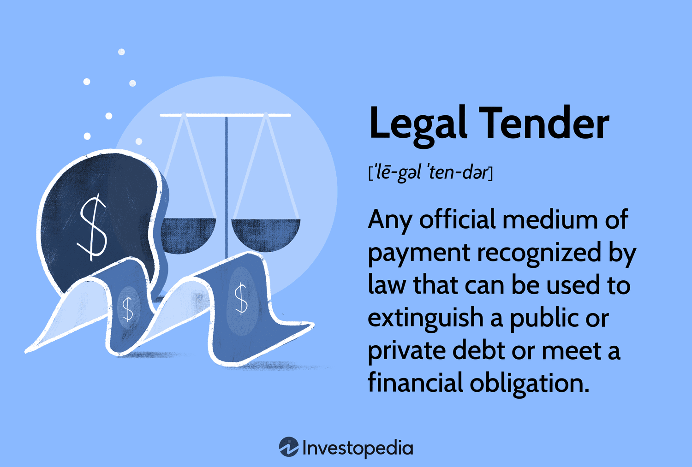

## Table of Contents

## What is legal tender?

Legal tender is money that a government says must be accepted if offered to pay a debt. This means that if you owe someone money, they have to accept the legal tender as payment. For example, in the United States, U.S. dollars are legal tender. This means that if you offer to pay a debt with U.S. dollars, the person you owe the money to must accept it.

However, legal tender laws do not mean that all businesses must accept all forms of legal tender. For instance, a store can choose not to accept cash and only take credit cards. Legal tender laws mainly apply to debts, not to everyday purchases. So, while a government declares what is legal tender, it's up to businesses to decide what forms of payment they will accept for their goods and services.

## How does legal tender differ from other forms of payment?

Legal tender is money that the government says must be accepted to pay off debts. If you owe someone money, they have to take the legal tender you offer. For example, in the United States, U.S. dollars are legal tender. This means if you give someone U.S. dollars to pay back what you owe, they can't say no. But this rule mainly applies to debts, not to buying things every day.

Other forms of payment, like credit cards or digital money, are not legal tender. This means that businesses can choose whether or not to accept them. A store might say they only take credit cards and not cash. Unlike legal tender, these other payment methods are not backed by the government, so people or businesses can decide if they want to use them. Legal tender gives you more certainty when paying debts, while other forms of payment depend on agreements between buyers and sellers.

## What are the economic functions of legal tender?

Legal tender helps keep the economy running smoothly by making sure everyone agrees on what money is. When the government says a certain type of money is legal tender, like U.S. dollars, it means people can use it to buy things and pay off what they owe without worrying if others will accept it. This trust in money makes it easier for people to trade goods and services, which is important for the economy to grow.

Legal tender also helps control how much money is in the economy. The government and central banks can decide how much money to print or create, which affects things like prices and jobs. By managing the supply of legal tender, they can try to keep the economy stable and prevent problems like too much inflation, where prices go up a lot, or deflation, where prices go down too much. This control over legal tender is a big part of how governments manage the economy.

## Can you provide examples of legal tender in different countries?

In the United States, U.S. dollars are the legal tender. This means if you owe someone money, you can pay them with dollars and they have to accept it. U.S. dollars come in different forms like paper bills and coins. People use them every day to buy things and pay bills. The U.S. government makes sure there's enough money in the economy by controlling how many dollars are printed.

In Japan, the yen is the legal tender. If you owe money in Japan, you can pay with yen and the person you owe will have to take it. Yen also comes in paper bills and coins. People in Japan use yen to buy things at stores, pay for services, and settle debts. The Japanese government manages the amount of yen in the economy to keep prices stable and help the economy grow.

In the United Kingdom, the pound sterling is the legal tender. If you owe someone money in the UK, you can pay them with pounds and they have to accept it. Pounds come in paper notes and coins. People in the UK use pounds to buy things, pay bills, and pay off what they owe. The UK government controls the supply of pounds to manage the economy and keep it stable.

## How is legal tender established and regulated by governments?

Governments decide what counts as legal tender by making laws. They say which money people have to accept when paying back what they owe. For example, in the United States, the government says U.S. dollars are legal tender. This means if you owe money, you can pay with dollars and the person you owe can't say no. Governments use these laws to make sure everyone agrees on what money is, so people can buy things and pay debts easily.

Governments also control how much legal tender is in the economy. They do this to keep the economy stable and stop prices from going up too fast or falling too much. For example, the U.S. government and the Federal Reserve decide how many dollars to print. If there are too many dollars, prices might go up a lot, which is called inflation. If there are too few, prices might go down too much, which is called deflation. By managing the amount of legal tender, governments help the economy run smoothly.

## What impact does legal tender have on inflation and economic stability?

Legal tender affects inflation and economic stability by controlling how much money is in the economy. When the government decides to print more money, like U.S. dollars, there's more money for people to spend. If there's too much money, prices can go up because people have more to spend on the same amount of goods. This is called inflation. If the government prints less money, there's less for people to spend, and prices might go down, which is called deflation. By managing the amount of legal tender, the government tries to keep prices stable and the economy running smoothly.

Legal tender also helps keep the economy stable because everyone agrees on what money is. When people trust that the money they use, like U.S. dollars, will be accepted by others, they feel more confident in using it to buy things and pay debts. This trust makes it easier for people to trade goods and services, which is important for the economy to grow. If people start doubting the value of the legal tender, they might stop using it, which can cause big problems for the economy. So, by making sure legal tender is trusted and well-managed, governments help keep the economy stable.

## How do changes in legal tender laws affect the economy?

When a government changes its legal tender laws, it can have a big impact on the economy. If the government decides to change what counts as legal tender, like switching from one type of money to another, it can make people unsure about what money to use. This can cause people to stop spending as much, which can slow down the economy. For example, if a country decides to stop using its old money and start using a new kind, people might not trust the new money right away. This can lead to less buying and selling, which can hurt businesses and jobs.

Changes in legal tender laws can also affect inflation and prices. If the government decides to print more money, there will be more money for people to spend. This can make prices go up because there's more money chasing the same amount of goods. This is called inflation. On the other hand, if the government decides to print less money, there might not be enough money for people to spend, which can make prices go down. This is called deflation. By changing the rules about legal tender, the government can try to control inflation and keep the economy stable, but it has to be careful because big changes can cause big problems.

## What are the historical developments that have shaped the concept of legal tender?

The idea of legal tender has changed a lot over time. A long time ago, people used things like gold and silver coins as money. These coins were valuable because they were made of precious metals. Governments started to say that these coins were the only money people had to accept when paying debts. This was the start of legal tender. As time went on, governments began to use paper money instead of just coins. They said that this paper money was also legal tender, which meant people had to accept it for debts. This made it easier for governments to control the money supply and help the economy.

In more recent times, the concept of legal tender has kept changing. During the 20th century, many countries moved away from using gold and silver as the basis for their money. Instead, they used what's called "fiat money," which is money that has value because the government says it does, not because it's made of something valuable. This change made it easier for governments to manage the economy by controlling how much money was in circulation. Today, with the rise of digital money and cryptocurrencies, the idea of legal tender is still evolving. Some countries are even thinking about making digital currencies legal tender, which could change how we think about money in the future.

## How do cryptocurrencies challenge the traditional notion of legal tender?

Cryptocurrencies like Bitcoin challenge the traditional idea of legal tender because they are not controlled by any government. Legal tender is money that a government says must be accepted to pay debts. But cryptocurrencies are made and managed by computer code and a network of users, not by a government. This means that they don't have the same kind of backing or trust that comes with government-issued money. If people start using cryptocurrencies a lot, it could make it harder for governments to control the economy and keep prices stable.

Some countries are starting to think about making cryptocurrencies legal tender. For example, El Salvador made Bitcoin legal tender in 2021. This means that people in El Salvador have to accept Bitcoin if someone uses it to pay a debt. But most countries still don't see cryptocurrencies as legal tender. They worry that cryptocurrencies could be used for illegal things and that they might not be stable. As more people use cryptocurrencies, governments might need to change their laws about legal tender to keep up with these new kinds of money.

## What are the implications of digital currencies being recognized as legal tender?

If digital currencies like Bitcoin become legal tender, it could change a lot of things. Governments might find it harder to control the economy because digital currencies are not made by them. They are made by computer code and a group of users. This means that if more people start using digital money, the government might not be able to print more money or take it out of circulation to keep prices stable. Also, if digital currencies become legal tender, people might trust them more and use them more often. This could make it easier for people to buy things and pay debts online, but it could also make it easier for people to do things that are against the law, like buying illegal stuff.

On the other hand, recognizing digital currencies as legal tender could help more people use them. This could make it easier for people who don't have bank accounts to join the economy. They could use digital money to buy things and send money to others without needing a bank. But it could also be risky because digital currencies can go up and down in value a lot. If a country says digital money is legal tender, and then the value of that money drops a lot, it could cause big problems for people and businesses. Governments would need to think carefully about these risks before making digital currencies legal tender.

## How do international trade and legal tender interact?

When countries trade with each other, they usually use their own legal tender, like U.S. dollars or euros. But sometimes, they use a different country's money as a way to make trade easier. For example, many countries use U.S. dollars for international trade even if they don't use dollars at home. This can make it easier for everyone to agree on what money to use, but it can also make it harder for countries to control their own economies because they are using money from another country.

If countries use different kinds of legal tender for trade, it can make things more complicated. They might need to change their money into another country's money, which can cost money and time. Sometimes, countries agree to use a common currency, like the euro, to make trade easier. But this can also mean they have less control over their own money and economy. So, the way legal tender works in international trade can affect how easy or hard it is for countries to buy and sell things with each other.

## What are the future trends and potential reforms in the legal tender system?

In the future, we might see more countries using digital currencies as legal tender. Some countries, like El Salvador, have already started using Bitcoin this way. This could make it easier for people to buy things and pay debts online, especially for those who don't have bank accounts. But it could also make it harder for governments to control the economy because digital currencies are not made by them. Governments might need to make new rules to deal with these changes and make sure digital money is safe and stable.

Another trend could be more countries using a common currency for trade, like the euro. This can make it easier for countries to buy and sell things with each other because they don't have to change their money into another country's money. But it can also mean they have less control over their own money and economy. Governments might need to work together to make rules about how to use a common currency and make sure it helps everyone. As the world changes, the way we think about legal tender will keep changing too.

## References & Further Reading

[1]: Mishkin, F. S. (2018). ["The Economics of Money, Banking, and Financial Markets"](https://www.pearsonhighered.com/assets/preface/0/1/3/4/0134855388.pdf). Pearson.

[2]: ["Algorithmic Trading: Winning Strategies and Their Rationale"](https://www.wiley.com/en-us/Algorithmic+Trading%3A+Winning+Strategies+and+Their+Rationale-p-9781118460146) by Ernest P. Chan

[3]: Nakamoto, S. (2008). ["Bitcoin: A Peer-to-Peer Electronic Cash System."](https://nakamotoinstitute.org/library/bitcoin/) 

[4]: Bank for International Settlements (2020). ["Central bank digital currencies: foundational principles and core features."](https://www.bis.org/publ/othp33.htm)

[5]: Malkiel, B. G. (2020). ["A Random Walk Down Wall Street: The Time-Tested Strategy for Successful Investing"](https://yourknowledgedigest.org/wp-content/uploads/2020/04/a-random-walk-down-wall-street.pdf). W. W. Norton & Company.

[6]: Chordia, T., Roll, R., & Subrahmanyam, A. (2000). ["Commonality in Liquidity."](https://www.sciencedirect.com/science/article/pii/S0304405X99000574) Journal of Financial Economics, 56(1), 3-28.

[7]: Lyons, R. K. (2001). ["The Microstructure Approach to Exchange Rates"](https://direct.mit.edu/books/monograph/2004/The-Microstructure-Approach-to-Exchange-Rates). The MIT Press.

[8]: Poon, S.-H. (2005). ["A practical guide to forecast evaluation."](https://papers.ssrn.com/sol3/papers.cfm?abstract_id=331800) Journal of Financial Econometrics, 3(1), 84–108.

[9]: Gomber, P., Arndt, B., Lutat, M., & Uhle, T. (2011). ["High-Frequency Trading."](https://www.semanticscholar.org/paper/High-Frequency-Trading-Gomber-Arndt/3d0ba8179934e0a45e85a184d1ec526616e2e213) Zeitschrift für Betriebswirtschaftliche Forschung, 63(7/8), 637-654.