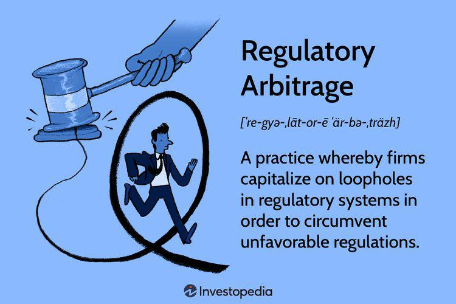

Arbitrage trading and algorithmic trading are two major strategies employed in the financial markets to optimize trading activities. These strategies are pivotal for traders who aim to maximize efficiency and minimize risks in an increasingly complex financial environment. Understanding their legality is essential for investors as it helps in navigating regulatory landscapes effectively and avoiding potential legal pitfalls.

Arbitrage trading involves the simultaneous buying and selling of an asset in different markets to exploit price discrepancies. This practice is generally considered low-risk, as it capitalizes on market inefficiencies rather than speculating on market directions. On the other hand, algorithmic trading, or algo trading, utilizes sophisticated computer programs to execute trades based on predefined criteria, automating the trading process and eliminating human intervention. 

This article analyzes the legality and impact of these trading strategies, emphasizing how they shape market dynamics and influence the trading behavior of market participants. With financial markets continuously evolving, the role of arbitrage trading and algorithmic trading is becoming increasingly prominent, offering traders opportunities to enhance market liquidity and improve price discovery processes. However, these strategies also come with specific legal considerations and implications that every trader must be aware of. Understanding these dimensions not only aids in effective market participation but also ensures compliance with pertinent regulations. 

As global financial markets continue to grow and technological advancements transform trading practices, it is vital for traders to grasp the nuances of these strategies and their regulatory contexts. This understanding not only facilitates better trading outcomes but also contributes to the stability and integrity of financial markets worldwide.

## Table of Contents

## Defining Arbitrage Trading

Arbitrage trading is a financial strategy that capitalizes on price variations of identical or similar financial instruments across different markets. The fundamental principle of arbitrage is to purchase an asset in a market where its price is lower and sell it in another market where the price is higher, thus [earning](/wiki/earning-announcement) a profit from the price discrepancy. This practice is generally considered low-risk due to its reliance on existing market inefficiencies, rather than speculative movements in market directions.

Several types of arbitrage strategies are implemented by traders to exploit various market conditions:

1. **Spatial Arbitrage**: This type of arbitrage involves trading between different geographical locations or markets. For instance, a trader might buy a commodity in one country where it is priced lower and sell it in another where the price is higher. This necessitates the careful analysis of transportation costs and import/export regulations.

2. **Temporal Arbitrage**: Here, traders exploit price differences over time within the same market. For example, this may involve taking advantage of price changes due to periodic events or announcements that affect the market's perception of value.

3. **Statistical Arbitrage**: This strategy leverages statistical models to identify pricing inefficiencies across a basket of securities. By deploying algorithms, traders can swiftly execute buy and sell orders when statistical correlations deviate from historical patterns. It often involves high-frequency trading techniques and complex mathematical models.

4. **Risk Arbitrage**: Often associated with merger and acquisition scenarios, risk arbitrage involves buying and selling the stocks of companies involved in an anticipated or announced merger. The trader typically buys stock in the target company and shorts the acquiring company's stock, profiting from the successful completion of the merger.

Arbitrageurs, the individuals or entities conducting these trades, play a critical role in enhancing market efficiency. By rectifying price discrepancies, they contribute to the equilibrium of asset pricing across markets. This practice demands rigorous monitoring of market conditions, comprehensive analysis, and prompt execution to capitalize on fleeting opportunities.

Understanding these [arbitrage](/wiki/arbitrage) strategies empowers traders to identify viable opportunities within dynamic market environments. It is crucial for traders to remain informed of both market conditions and potential risks associated with their strategies. Successful arbitrage trading not only requires skillful execution but also an appreciation of the intricate mechanisms of different markets to ensure sustained profitability.

## The Legality of Arbitrage Trading

Arbitrage trading is generally considered legal and is often encouraged due to its role in fostering market efficiency by correcting price discrepancies. It plays a crucial function in balancing prices and ensuring the smooth operation of financial markets. However, traders engaging in arbitrage must comply with a series of legal and regulatory requirements to avoid any potential legal issues.

Regulatory compliance stands as a pivotal aspect of arbitrage trading. Traders are obliged to follow the specific market regulations in each jurisdiction where they operate. These regulations are designed to uphold market integrity and protect investors. For instance, traders must be aware of short-selling restrictions that can vary significantly across markets and jurisdictions. Short-selling involves selling an asset that the seller does not own, usually by borrowing, with the intention to buy it back later at a lower price.

Tax implications also play a significant role in the legality of arbitrage trading. Traders must understand how profits from arbitrage activities are taxed, as this differs from country to country. Some jurisdictions may have specific tax rules concerning derivatives or certain types of financial instruments often used in arbitrage, which can affect the profitability and legality of the strategy.

Licensing requirements are another critical consideration. Markets across the globe may require traders or the firms they operate to hold specific licenses that authorize them to engage in trading activities, including arbitrage. These licenses serve to ensure that traders have the necessary knowledge and capabilities to operate in financial markets responsibly.

While arbitrage itself is lawful, associated practices such as market manipulation are illegal and can lead to severe penalties. Market manipulation involves practices that intend to deceive or intentionally mislead market participants by interfering with the natural equilibrium of market forces. Traders must ensure that their arbitrage strategies do not inadvertently stray into activities that could be interpreted as market manipulation, such as creating false or misleading market appearances.

Given the complex and diverse nature of financial markets, it is critical for traders to be aware of the differences in legal requirements across various jurisdictions. They must ensure their trading activities conform to local laws to avoid sanctions or other legal repercussions. Continuous education and staying ahead of regulatory updates are essential practices for traders who wish to engage in arbitrage effectively and legally.

## Understanding Algorithmic Trading

Algorithmic trading, commonly referred to as algo trading, employs computer programs to execute trades based on predefined criteria with high efficiency. The practice leverages technology to facilitate trades with minimal human intervention, harnessing the power of automation to achieve precision and speed far surpassing traditional trading methods.

Key features of [algorithmic trading](/wiki/algorithmic-trading) include:

1. **Automation**: Algo trading systems automate the entire trading process, from market analysis and order placement to risk management and trade monitoring. This reduces the likelihood of human error and allows for continuous operation without fatigue.

2. **Speed**: Automated trading systems can execute trades in milliseconds, taking advantage of even the smallest market movements, which are often missed by human traders due to slower reaction times.

3. **Precision**: Algorithms can be programmed to follow specific trading instructions with high accuracy. This ensures that trades are executed exactly according to the desired strategy, reducing slippage and attaining optimal entry and exit points.

4. **Backtesting**: Algo trading allows for thorough backtesting of strategies on historical data. This involves running a trading strategy against past market conditions to evaluate its performance and refine its parameters. This process increases confidence in the strategy's effectiveness before it is deployed in live markets.

5. **Scalability**: Algorithmic trading systems can handle large-scale operations, executing numerous trades across multiple markets and assets simultaneously. This scalability is a significant advantage over manual trading, where human resources are limited.

Various strategies used in algorithmic trading include:

- **Trend-Following Strategies**: These algorithms identify and capitalize on market trends, placing trades that align with the prevailing market direction. Technical indicators such as moving averages, momentum, and support/resistance levels are often utilized to identify these trends.

- **Statistical Arbitrage**: This strategy exploits price inefficiencies between related instruments by utilizing statistical methods. Algorithms analyze historical correlations and current divergences to identify profitable trading opportunities.

- **High-Frequency Trading (HFT)**: HFT is a subset of algo trading that emphasizes speed and frequency. It involves executing a large number of orders at extremely fast speeds, aiming to capitalize on small price discrepancies. This type of trading typically requires sophisticated technology and access to low-latency data and execution services.

Algorithmic trading systematically removes emotion from the trading equation, enabling consistent strategy application under varying market conditions. By relying on data-driven decision-making, algo trading systems can efficiently manage risks and execute complex strategies that would be challenging for manual traders.

The role of algorithmic trading in modern financial markets is significant, contributing to increased market [liquidity](/wiki/liquidity-risk-premium) and enhanced price discovery mechanisms. As technology advances, the prevalence of algorithmic trading is expected to grow, necessitating a comprehensive understanding of its mechanics for those engaging in the financial markets.

## Regulatory Aspects of Algorithmic Trading

Algorithmic trading, commonly referred to as algo trading, is a significant component of the modern financial landscape. Its legality hinges on adherence to market regulations and anti-fraud provisions. These regulations are crucial for ensuring the integrity and stability of financial markets as technology and market structures evolve.

One of the primary responsibilities of traders engaged in algorithmic trading is to remain informed of regulatory updates. With rapid advancements in technology and frequent shifts in market dynamics, regulatory bodies worldwide continuously update their frameworks to address emerging challenges. Compliance with these evolving regulations is not just a legal obligation but a fundamental ethical responsibility for market participants.

Different jurisdictions enforce specific requirements on entities engaging in high-frequency trading ([HFT](/wiki/high-frequency-trading-strategies)) and broader algo trading activities. For instance, the European Union's Markets in Financial Instruments Directive II (MiFID II) mandates stringent reporting and testing of algorithms to prevent market abuse. In the United States, the Securities and Exchange Commission (SEC) imposes requirements aimed at ensuring fair practices and protecting market integrity. These regulations often include the need for robust risk management systems, adequate capital, and comprehensive record-keeping.

Legal compliance in algorithmic trading also entails maintaining transparency in operations. Traders must design algorithms that align with market rules and avoid manipulative practices, such as layering or spoofing, which can unduly influence market prices. Ensuring fair competition is a core tenet of legal compliance, as regulatory bodies aim to prevent monopolistic behavior and promote a level playing field for all market participants.

Understanding the legal landscape for algorithmic trading is critical for maintaining ethical trading practices and safeguarding one's reputation in the financial markets. Ethical compliance ensures the protection of market participants and enhances the overall credibility of trading practices. By embedding compliance measures into their trading algorithms, traders can align with regulatory requirements and contribute positively to the market ecosystem.

In conclusion, compliance with market regulations and anti-fraud provisions is essential for the legality of algorithmic trading. By staying abreast of regulatory changes and adhering to established legal standards, traders can navigate the complexities of algorithmic trading while promoting trust and integrity in financial markets.

## Impact on Market Dynamics

Arbitrage trading and algorithmic trading are integral to enhancing market dynamics, particularly in terms of liquidity and price discovery. Both strategies serve to ensure that financial markets operate efficiently, with minimal price discrepancies and optimal asset valuation.

Arbitrage trading, by leveraging differences in asset prices across various markets, plays a crucial role in homogenizing prices. This practice is essential for maintaining consistent asset valuation, as it addresses temporary inefficiencies and [volatility](/wiki/volatility-trading-strategies). When arbitrageurs purchase an undervalued asset in one market and sell it in another where it is overvalued, they correct imbalances that might otherwise persist. This activity effectively narrows bid-ask spreads, improves market depth, and fosters a more robust price formation process.

Algorithmic trading, on the other hand, is characterized by its ability to execute trades with remarkable speed and precision. The automation inherent in algorithmic strategies diminishes the latency between decision and execution, thereby increasing market liquidity. Algorithms enable traders to respond almost instantaneously to market changes, facilitating tighter bid-ask spreads and smoother transaction flows. By analyzing vast datasets and executing trades swiftly, algorithmic trading also contributes to more accurate price discovery, reflecting the consensus value of assets at any given moment.

Despite these benefits, the heavy reliance on algorithmic trading introduces potential risks, such as increased market volatility and systemic issues. Instances of "flash crashes" illustrate how automated trading systems can exacerbate market swings. These events occur when algorithms trigger large volumes of trades within milliseconds, causing rapid price declines followed by equally swift recoveries. A notable example is the Flash Crash of May 6, 2010, when the Dow Jones Industrial Average plunged nearly 1,000 points in a matter of minutes before rebounding.

To mitigate such risks, traders must employ risk management strategies and maintain oversight over their automated systems. Additionally, regulatory frameworks that ensure the fairness and stability of algorithmic and arbitrage trading activities are crucial. Balancing these strategies with a deep understanding of their broader economic impacts and the potential for unintended consequences is essential for maintaining healthy market dynamics.

In summary, while arbitrage trading and algorithmic trading are pivotal in promoting efficient market conditions, traders must also be mindful of the risks these strategies pose. By carefully managing their execution and adhering to regulatory guidelines, traders can harness the advantages of these approaches while safeguarding against their potential downsides.

## Conclusion

Both arbitrage trading and algorithmic trading hold significant importance in modern financial markets due to their roles in enhancing market liquidity, price discovery, and efficiency. Legal considerations and regulatory adherence are crucial for traders employing these strategies, as these ensure that market operations remain fair and transparent.

Arbitrage trading contributes to market efficiency by eradicating price discrepancies across different markets, thereby ensuring that assets are consistently valued. Similarly, algorithmic trading offers strategic advantages by executing trades with unmatched speed and precision, minimizing human error, and allowing for the analysis of vast datasets beyond human capacities.

Despite their benefits, traders must remain vigilant and informed about the legal and regulatory frameworks governing these strategies. Regulations evolve in response to technological advancements and market structural changes, requiring traders to be compliant and adaptable. Key legal concerns include maintaining transparency, ensuring ethical conduct, and preventing market manipulation.

In conclusion, as arbitrage and algorithmic trading strategies continue to evolve, a comprehensive understanding of their legal and market implications is essential for their successful application. Traders must focus on staying compliant with regulations while leveraging these strategies to optimize trading outcomes and contribute positively to market functioning.

## References & Further Reading

[1]: Treleaven, P., Galas, M., & Lalchand, V. (2013). ["Algorithmic Trading Review."](https://www.researchgate.net/publication/262239006_Algorithmic_Trading_Review) Communications of the ACM, 56(11), 76-85.

[2]: Hasbrouck, J., & Saar, G. (2013). ["Low-latency trading."](https://www.sciencedirect.com/science/article/abs/pii/S1386418113000165) The Review of Financial Studies, 26(9), 2587-2620.

[3]: Yadav, P. K., & Pope, P. (1994). ["Arbitrage and the Law of One Price."](https://onlinelibrary.wiley.com/doi/abs/10.1111/j.1467-9965.1994.tb00058.x) Journal of Banking & Finance, 18(6), 997-1015.

[4]: Aldridge, I. (2013). ["High-Frequency Trading: A Practical Guide to Algorithmic Strategies and Trading Systems."](https://www.amazon.com/High-Frequency-Trading-Practical-Algorithmic-Strategies/dp/1118343506) Wiley Trading Series.

[5]: Kirilenko, A. A., Kyle, A. S., Samadi, M., & Tuzun, T. (2017). ["The Flash Crash: High-Frequency Trading in an Electronic Market."](https://www.jstor.org/stable/26652722) The Quarterly Journal of Economics, 127(3), 1547-1628.

[6]: Menkveld, A. J. (2013). ["High frequency trading and the new market makers."](https://papers.ssrn.com/sol3/papers.cfm?abstract_id=1722924) Journal of Financial Markets, 16(4), 712-740.

[7]: Hendershott, T., Jones, C. M., & Menkveld, A. J. (2011). ["Does algorithmic trading improve liquidity?"](https://onlinelibrary.wiley.com/doi/full/10.1111/j.1540-6261.2010.01624.x) The Journal of Finance, 66(1), 1-33.