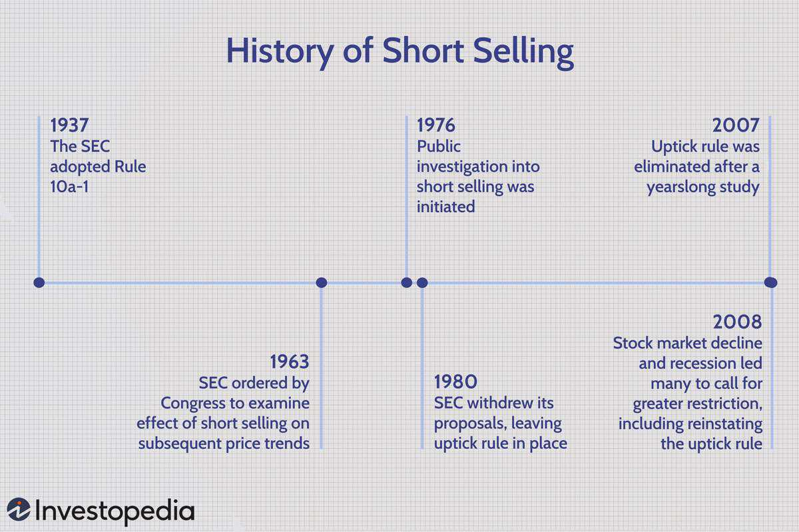

## Table of Contents

## What is short selling?

Short selling is when someone borrows a stock, sells it, and then buys it back later to return it. They do this because they think the stock's price will go down. If the price does go down, they can buy it back cheaper than they sold it, making a profit. But if the price goes up, they lose money because they have to buy it back at a higher price.

It's kind of like betting against a stock. Imagine you borrow your friend's bike and sell it for $100, thinking you can buy it back later for less. If you can buy it back for $80, you make a $20 profit after returning it. But if the bike's price goes up to $120, you lose $20 when you buy it back and return it. That's the risk of short selling.

## Is short selling legal in the United States?

Yes, short selling is legal in the United States. It is a common way for investors to make money if they think a stock's price will go down. The rules for short selling are set by the Securities and Exchange Commission (SEC), which is like a watchdog for the stock market. The SEC makes sure that short selling is done fairly and openly.

However, there are some rules that short sellers need to follow. For example, they must actually borrow the stock before they sell it. They also have to report their short positions to the SEC. This helps keep the market honest and prevents people from cheating. Even though short selling is legal, it can be risky because if the stock price goes up instead of down, the short seller can lose a lot of money.

## What are the regulations on short selling in the European Union?

In the European Union, short selling is also legal, but there are strict rules to make sure it's done fairly. The main rule is that anyone who wants to short sell must first tell the country's financial watchdog about it. This is called a notification. If someone wants to short sell more than 0.5% of a company's shares, they have to report it publicly too. This helps everyone know what's happening in the market.

Another important rule in the EU is about naked short selling, which is when someone sells shares they haven't borrowed yet. This is usually not allowed for shares and some other financial products. The EU also has rules to stop short selling from causing big problems in the market. If things get too risky, countries can put a temporary ban on short selling to calm things down. These rules help keep the market stable and fair for everyone.

## Can individuals engage in short selling in Japan?

Yes, individuals can engage in short selling in Japan. It's legal and works pretty much the same way as in other countries. If you think a stock's price will go down, you can borrow the stock, sell it, and then buy it back later at a lower price to make a profit. But you have to follow some rules set by the Financial Services Agency (FSA), which is like Japan's version of the SEC in the United States.

The main rule in Japan is that you have to actually borrow the stock before you sell it. This is to stop something called naked short selling, which is when you sell shares you haven't borrowed yet. Also, if you want to short sell more than 0.2% of a company's shares, you have to report it to the FSA. These rules help keep the market fair and make sure everyone plays by the same rules.

## What are the restrictions on short selling in China?

In China, short selling is allowed but with tight rules to keep the market stable. The main rule is that you can only short sell stocks that are on a special list made by the China Securities Regulatory Commission (CSRC). This list has stocks that are big and have a lot of shares being traded. You also have to borrow the stock before you can sell it, and you need to tell the exchange about your short sale before you do it.

Another big rule in China is that you can't short sell more than 1% of a company's total shares in one day. This is to stop people from making big bets against a company all at once. The government also watches the market closely and can stop short selling if they think it's causing too much trouble. These rules help keep the market calm and make sure short selling is done fairly.

## How does the UK regulate short selling?

In the UK, short selling is legal but there are rules to make sure it's done fairly. The main rule is that you have to tell the Financial Conduct Authority (FCA) if you want to short sell more than 0.5% of a company's shares. This is called a notification. You also have to report it publicly if you short sell more than 0.1% of a company's shares. This helps everyone know what's happening in the market and keeps things open and honest.

Another important rule in the UK is about naked short selling, which is when you sell shares you haven't borrowed yet. This is usually not allowed for shares and some other financial products. The FCA also has the power to stop short selling if they think it's causing big problems in the market. They can put a temporary ban on it to calm things down. These rules help keep the market stable and fair for everyone.

## Are there any countries where short selling is completely banned?

Yes, there are some countries where short selling is completely banned. One of these countries is South Korea. The government there decided to stop short selling because they thought it was making the stock market too unstable. They want to protect investors and keep the market calm, so they made a rule that says you can't borrow a stock and sell it hoping to buy it back cheaper later.

Another country where short selling is banned is Venezuela. The government there also wants to keep the market steady and stop big price swings. They think short selling can cause too much trouble, so they made it illegal. This means investors in Venezuela can't use this strategy at all, even if they think a stock's price is going to go down.

## What are the reporting requirements for short sellers in Canada?

In Canada, if you want to short sell, you have to follow some rules set by the Canadian Securities Administrators (CSA). The main rule is that you need to tell the exchange about your short sale before you do it. This is called a pre-borrow requirement. It means you have to make sure you can borrow the stock before you sell it. This helps stop something called naked short selling, which is when you sell shares you haven't borrowed yet.

Another important rule in Canada is about reporting. If you short sell more than 0.5% of a company's shares, you have to report it to the CSA. This helps everyone know what's happening in the market and keeps things fair. The CSA watches the market closely and can stop short selling if they think it's causing big problems. These rules help keep the market stable and make sure short selling is done the right way.

## How do short selling laws differ between Australia and New Zealand?

In Australia, short selling is allowed but you have to follow some rules set by the Australian Securities and Investments Commission (ASIC). You need to tell the exchange about your short sale before you do it, which means you have to make sure you can borrow the stock first. This stops people from doing naked short selling, where you sell shares you haven't borrowed yet. If you short sell more than 0.5% of a company's shares, you also have to report it to ASIC. They watch the market closely and can stop short selling if it's causing big problems.

In New Zealand, short selling is also legal, but the rules are a bit different. The Financial Markets Authority (FMA) is in charge of making sure short selling is done fairly. You have to tell the FMA if you want to short sell more than 0.1% of a company's shares. Like in Australia, you also have to make sure you can borrow the stock before you sell it. The FMA can put a stop to short selling if they think it's making the market too unstable. Both countries want to keep the market fair and calm, but they have slightly different ways of doing it.

## What impact do short selling regulations have on market stability in India?

In India, short selling is allowed but there are rules to make sure it doesn't cause too much trouble in the market. The Securities and Exchange Board of India (SEBI) is in charge of these rules. They say you have to borrow the stock before you sell it, and you need to tell the exchange about your short sale before you do it. This helps stop people from doing naked short selling, which can make the market go crazy. SEBI also watches the market closely and can stop short selling if they think it's causing big problems. These rules help keep the market stable and fair for everyone.

The impact of these regulations on market stability in India is pretty good. By making sure people follow the rules, SEBI helps stop big price swings that can happen when too many people are betting against a stock. This makes the market calmer and more predictable. Investors feel safer because they know the market is being watched and that short selling is being done the right way. So, even though short selling can be risky, the rules in India help make sure it doesn't mess up the whole market.

## How do international agreements affect short selling practices across borders?

International agreements can change how short selling works across different countries. These agreements help make sure that short selling rules are similar everywhere, so it's fair for everyone. For example, countries might agree to share information about short selling to stop people from cheating. This can help stop big problems in the market that can happen if short selling is done in a sneaky way. By working together, countries can make sure that short selling doesn't cause too much trouble and that the market stays stable.

These agreements also help investors who want to short sell in different countries. If the rules are similar, it's easier for them to understand what they can and can't do. This can make them feel more confident about short selling across borders. But sometimes, these agreements can be hard to make because each country has its own ideas about how to keep the market fair. Still, when countries can agree on rules, it helps keep the global market calm and makes sure short selling is done the right way everywhere.

## What are the advanced strategies used by hedge funds in countries with lenient short selling laws?

Hedge funds in countries with lenient short selling laws often use a strategy called "short and distort." This means they borrow a stock, sell it, and then spread bad news about the company to make the stock price go down. Once the price drops, they buy the stock back at a lower price and return it, making a profit. This can be risky because if the bad news turns out to be wrong or not as bad as they said, the stock price might go up instead, and they could lose a lot of money.

Another advanced strategy is "pairs trading," where hedge funds short sell one stock while buying another in the same industry. They do this because they think one stock will do better than the other. If they're right, they make money from the difference in how the two stocks perform. This strategy can be less risky than just short selling one stock because it's more about the difference between two stocks than betting on one going down. But it still needs careful watching and good timing to work well.

## References & Further Reading

[1]: Brunnermeier, M. K., & Pedersen, L. H. (2005). ["Predatory Trading."](https://onlinelibrary.wiley.com/doi/abs/10.1111/j.1540-6261.2005.00781.x) The Journal of Finance, 60(4), 1825-1863.

[2]: Jones, C. M. (2002). ["A Century of Stock Market Liquidity and Trading Costs."](https://papers.ssrn.com/sol3/papers.cfm?abstract_id=313681) The Review of Financial Studies, 15(1), 1-32.

[3]: Lopez de Prado, M. (2018). ["Advances in Financial Machine Learning."](https://www.amazon.com/Advances-Financial-Machine-Learning-Marcos/dp/1119482089) Wiley.

[4]: U.S. Securities and Exchange Commission. ["Division of Trading and Markets."](https://www.sec.gov/about/divisions-offices/division-trading-markets)

[5]: Easley, D., Lopez de Prado, M. M., & O'Hara, M. (2012). ["The Volume Clock: Insights into the High-Frequency Paradigm."](https://papers.ssrn.com/sol3/papers.cfm?abstract_id=2034858) The Review of Financial Studies, 25(8), 2267-2306.

[6]: Financial Conduct Authority (UK). ["Overview of the FCA."](https://www.fca.org.uk/)

[7]: Bai, J., Philippon, T., & Savov, A. (2016). ["Have Financial Markets Become More Informative?"](https://www.sciencedirect.com/science/article/pii/S0304405X16301465) The Quarterly Journal of Economics, 131(2), 867-922.

[8]: Securities and Exchange Board of India. ["About SEBI."](https://www.sebi.gov.in/about-sebi.html)

[9]: Kirilenko, A. A., Kyle, A. S., Samadi, M., & Tuzun, T. (2017). ["The Flash Crash: High-Frequency Trading in an Electronic Market."](https://www.jstor.org/stable/26652722) The Journal of Finance, 72(3), 967-998.