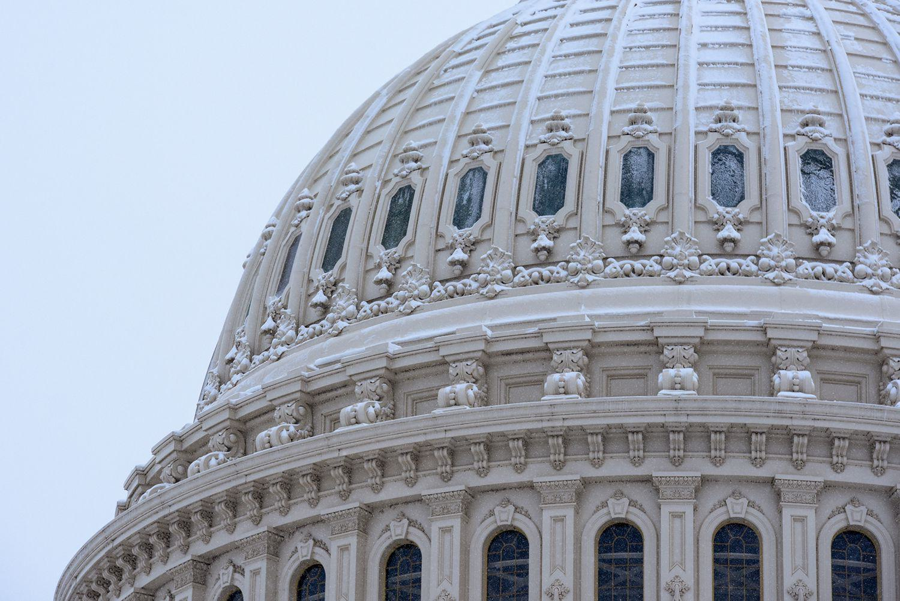

Understanding the intricacies of the legislative process in U.S. politics requires examining the roles of lobbying and algorithmic trading. In contemporary U.S. political and economic systems, both lobbying and algorithmic trading are pivotal forces that significantly influence legislative and financial landscapes. Lobbying, a practice with roots embedded deeply in democratic systems, serves as a conduit for diverse interests to shape public policy. It enables individuals and organizations to advocate for their interests within the framework of representative governance, thus affecting legislative outcomes.

On the other hand, algorithmic trading represents a technological advancement in the financial sector, where computer algorithms are employed to execute trades at extremely high speeds and frequencies. This innovation has reshaped market dynamics, introducing new opportunities and challenges not only for traders but also for policymakers and regulatory bodies. The rise of algorithmic trading has prompted discussions around the adequacy of existing financial regulations and the need for new frameworks that account for the speed and complexity of modern financial markets.

This article explores how these facets intertwine with the legislative process and their broader impacts, providing insights into the mechanisms that drive U.S. governance and financial operations. By investigating the interplay between lobbying efforts and algorithmic trading practices, we can better comprehend their cumulative effect on the formulation and implementation of policies. Additionally, this discourse will include an examination of the legal frameworks that govern lobbying and algorithmic trading in the U.S., such as the Lobbying Disclosure Act of 1995, which aims to promote transparency and accountability within lobbying activities, and regulatory measures overseen by bodies like the Securities and Exchange Commission (SEC) that seek to ensure fair and efficient markets.

Through a comprehensive analysis of these elements, the article aims to illuminate the complexities of the U.S. legislative process and the key roles lobbying and algorithmic trading play in shaping the political and economic landscape. The insights garnered from this exploration will underscore the necessity of ongoing dialogue and transparency to balance diverse interests and foster equitable policy development.

## Table of Contents

## The Legislative Process in U.S. Politics

The U.S. legislative process is a foundational aspect of American governance and involves several key stages to ensure that proposed legislation is thoroughly vetted, debated, and refined before becoming law. The process begins with the introduction of a bill in either the House of Representatives or the Senate. Members of Congress, either individually or in groups, propose bills based on various interests, ranging from addressing social needs to responding to emerging issues.

Once introduced, a bill is referred to one or more committees that specialize in the subject matter of the proposed legislation. These committees play a critical role in the legislative process by conducting hearings, inviting testimonies from experts, and debating the merits and provisions of the bill. This stage is crucial as it allows for detailed examination and modification based on the input from various stakeholders, including lobbyists who represent different sectors and interests.

If a committee approves a bill, it moves to the floor of the respective chamber (either the House or the Senate) for further debate and voting. During this stage, members have the opportunity to discuss the bill publicly, propose amendments, and express their support or opposition. The participatory nature of this process is evident as legislators aim to represent the interests and concerns of their constituents.

For a bill to proceed, it must be passed by a simple majority in both the House of Representatives and the Senate. If there are differences between the versions passed by the two chambers, a conference committee, comprising members from both the House and the Senate, is convened to reconcile these differences and produce a final version.

Once the final version of the bill is agreed upon, it is sent to the President for approval. The President can either sign the bill into law or veto it. A presidential veto can be overridden by a two-thirds majority vote in both chambers, exemplifying the system of checks and balances inherent in U.S. governance.

Throughout this process, lobbyists play a significant role by providing information, expertise, and advocacy to influence legislative outcomes. Their involvement underscores the participatory nature of U.S. governance, where various societal segments have the opportunity to shape legislation. Understanding this process offers insight into how policies are shaped, negotiated, and implemented in the country, reflecting the dynamic interplay of political, social, and economic forces in shaping public policy.

## The Role of Lobbying in the Legislative Process

Lobbying is a fundamental component of the legislative process in the United States, serving as a bridge between the electorate and policymakers. The practice is safeguarded by the First Amendment to the U.S. Constitution, which guarantees the right to petition the government for a redress of grievances. This constitutional protection underscores the role of lobbying as an integral feature of democratic participation, enabling individuals and organizations to voice their interests and influence public policy outcomes.

Lobbyists, who may be individuals or representatives of businesses, non-profit organizations, or special interest groups, actively engage with lawmakers to advocate for specific legislative actions. This interaction can occur through various channels, including direct communication with legislators, testimony before congressional committees, and participation in specialized advisory panels. The objective of these efforts is to inform and persuade policymakers to consider the advocate's position when drafting, amending, or voting on legislation.

The necessity for transparency and accountability in lobbying activities led to the enactment of the Lobbying Disclosure Act (LDA) of 1995. This pivotal legislation established a comprehensive framework for monitoring and reporting lobbying activities. The LDA requires lobbyists to register with the Secretary of the Senate and the Clerk of the House of Representatives, providing details about their clients, issues they are lobbying on, and expenditures related to their lobbying efforts. This system of disclosure aims to shed light on the relationships and finances underpinning legislative advocacy, thereby enhancing public trust in the policymaking process.

By institutionalizing a process for transparency, the LDA ensures that lobbying remains a regulated activity with clear boundaries. This regulation supports ethical standards in lobbying practices and minimizes the risk of undue influence or corruption within the legislative system. Consequently, lobbying serves not only as a mechanism for interest representation but also as a means of promoting informed and balanced policy decisions that reflect the collective will of diverse stakeholder groups. 

In summary, lobbying in the U.S. is a legally protected and structured means by which individuals and organizations can influence government decision-making. Through the mechanisms of disclosure and accountability instituted by the LDA, lobbying operates within a democratic framework, contributing to policy development that considers a wide array of societal interests.

## Algorithmic Trading: A Financial Innovation

Algorithmic trading is a transformative force in the financial industry, leveraging complex computer algorithms to execute trades at speeds and volumes that far surpass the capabilities of human traders. This technology operates by automating the trading process, using pre-set rules and mathematical models to determine the timing, price, and quantity of trades. As a result, [algorithmic trading](/wiki/algorithmic-trading) can adapt to market conditions in real-time, offering significant advantages in terms of efficiency and precision.

The impact of algorithmic trading on market dynamics is profound. It enhances [liquidity](/wiki/liquidity-risk-premium) by facilitating large volumes of transactions, thereby narrowing bid-ask spreads and contributing to more competitive pricing. However, it also introduces challenges such as increased [volatility](/wiki/volatility-trading-strategies) and the potential for systemic risk, as evidenced by events like the "Flash Crash" of 2010 where markets experienced extreme volatility due to algorithmic trading anomalies.

Given its influential role in financial markets, algorithmic trading often becomes a focal point in legislative discussions concerning financial regulation. Lawmakers and regulatory bodies, such as the Securities and Exchange Commission (SEC) and the Commodity Futures Trading Commission (CFTC), face the task of ensuring that the benefits of algorithmic trading are realized while mitigating its risks. This involves crafting regulations that address issues like market manipulation, latency [arbitrage](/wiki/arbitrage), and the ethical considerations surrounding automated trading systems.

A comprehensive understanding of algorithmic trading is essential for stakeholders such as policymakers, financial institutions, and investors to create effective market regulations. Such regulations must strike a balance between fostering innovation and maintaining market integrity. Stakeholders must consider the technological underpinnings of algorithmic trading, such as high-frequency trading ([HFT](/wiki/high-frequency-trading-strategies)) strategies, which rely on low-latency data transmission networks and sophisticated algorithms to capitalize on market inefficiencies at remarkable speeds.

As the financial technology landscape evolves, continuous scrutiny and adaptation of regulatory frameworks are necessary to address the complexities introduced by algorithmic trading. This requires collaborative efforts among industry participants, technologists, and regulators to sustain a fair and resilient financial system.

## Interconnections Between Lobbying and Algorithmic Trading

Lobbyists play a crucial role in the regulatory landscape of algorithmic trading by advocating for policies that promote financial stability and market fairness. Given the rapid execution and complex nature of algorithmic trades, regulations need to protect markets from systemic risks such as flash crashes, which can occur due to overwhelming trade volumes initiated by these algorithms. As a result, lobbyists work on behalf of financial institutions and other stakeholders to influence legislation that addresses these risks while allowing innovation and technological advancement.

Moreover, algorithmic trading firms themselves engage in lobbying to shape regulatory frameworks that support their operational needs and market strategies. These firms seek to ensure that regulations do not unduly hinder the implementation of new technologies or market efficiency. Their lobbying efforts focus on maintaining a competitive edge, highlighting the benefits of this trading method, and ensuring that any regulatory measures consider the technological advancements in financial markets.

The interaction between lobbying and algorithmic trading underscores the complexities of U.S. politics and financial markets. On one hand, lobbying can drive regulations towards protecting public interest and ensuring that algorithmic trading does not compromise market stability. On the other, the lobbying activities of algorithmic trading firms illustrate how industry interests seek to guide policy-making to align with technological progress and market innovation.

The confluence of these activities results in a regulatory environment where competing interests and technological evolution continually influence legislative outcomes. Examining these interactions provides insight into how policy decisions are shaped in a landscape that balances risk management with the encouragement of financial and technological advancements. The involvement of lobbyists in this process emphasizes the vital need for transparency and accountability to ensure that regulatory frameworks support all facets of market integrity and public interest.

## Impact of Lobbying and Algorithmic Trading on Legislation

Lobbying and algorithmic trading significantly influence U.S. legislation, each bringing distinct elements to the policy-making process. Lobbying enables access and advocacy for various interests, serving as a conduit between policymakers and the public or private sectors. It is grounded in democratic principles, allowing individuals and organizations to represent their positions on critical issues. Lobbyists often bring expertise and detailed knowledge to legislative debates, potentially swaying decision-makers through informed arguments. This can lead to policy outcomes that reflect a broader spectrum of interests, promoting inclusivity in governance. However, concerns arise when lobbying efforts disproportionately favor well-funded groups, potentially skewing legislative outcomes in favor of a narrow set of stakeholders [1].

Algorithmic trading, defined by the use of computer algorithms to execute trades at high speed, introduces both challenges and opportunities for legislative frameworks governing financial markets. By executing trades at a scale and speed unmatchable by human traders, algorithmic trading impacts market liquidity and volatility. Legislators must balance encouraging technological advancement with ensuring market stability and fairness. Algorithmic trading can lead to rapid market fluctuations, as seen in events like the 2010 Flash Crash, prompting discussions around necessary regulatory safeguards [2]. Policymakers face the challenge of instituting regulations that allow for innovation while protecting against systemic risks.

Evaluating the impact of lobbying and algorithmic trading on legislation is essential for informed decision-making. Lobbying contributes to the democratic process by integrating diverse perspectives into policy discussions. Nevertheless, the risk of unequal representation requires robust transparency and accountability measures. The Lobbying Disclosure Act of 1995 serves as a legal framework to ensure such transparency, mandating that lobbyists register their activities and report financial data [3].

Simultaneously, legislators must address the complexities introduced by algorithmic trading. Regulatory bodies, such as the Securities and Exchange Commission (SEC) and the Commodity Futures Trading Commission (CFTC), play pivotal roles in overseeing financial market activities. They work to develop regulations aimed at mitigating risks associated with high-frequency trading while fostering a competitive and fair trading environment. This involves a delicate balance, as overly restrictive regulations might stifle innovation, while lax oversight could exacerbate market vulnerabilities.

In conclusion, the interconnected roles of lobbying and algorithmic trading in shaping legislation underscore the need for ongoing dialogue among stakeholders. Striking a balance between advocacy, technological progress, and equitable representation remains central to maintaining the integrity of the legislative process and ensuring that policy decisions reflect the interests of all citizens.

References:
1. Drutman, L. (2015). *The Business of America is Lobbying: How Corporations Became Politicized and Politics Became More Corporate*. Oxford University Press.
2. Kirilenko, A. A., Kyle, A. S., Samadi, M., & Tuzun, T. (2017). *The Flash Crash: The Impact of High-Frequency Trading on an Electronic Market*. The Journal of Finance, 72(3), 967-998.
3. Rybicki, E., & Straus, J. R. (2016). *The Lobbying Disclosure Act at 20: Analysis and Issues for Congress*. Congressional Research Service.

## Conclusion

The legislative process in U.S. politics is deeply influenced by the dual forces of lobbying and algorithmic trading. These phenomena shape the legislative landscape by providing diverse pathways for stakeholder engagement and advocacy, ultimately affecting policy outcomes across various sectors.

Lobbying serves as a conduit through which individuals and organizations articulate their interests to legislators, fostering a participatory democratic framework. By understanding the mechanisms of lobbying—a practice safeguarded by the U.S. Constitution—stakeholders gain the ability to communicate effectively with policymakers and help shape legislation reflective of constituent needs. This dynamic interaction promotes a more inclusive policy-making environment, although it requires vigilant oversight to ensure transparency and accountability, as mandated by the Lobbying Disclosure Act of 1995.

Algorithmic trading, on the other hand, introduces substantial technological innovation and complexity into financial markets. By employing sophisticated computer algorithms to execute trades at lightning speeds, this practice influences market behavior and triggers ongoing legislative discussions about financial regulation and market fairness. Its rapid evolution necessitates continual reevaluation of existing regulations to maintain market integrity and mitigate systemic risks.

Understanding the interaction between lobbying and algorithmic trading illuminates the complexities of modern policy-making. Lobbyists representing algorithmic trading interests often seek to influence regulations in ways that encourage technological growth while safeguarding economic stability. Likewise, policymakers aim to craft balanced regulations that advance innovation without compromising market integrity.

The influence of both lobbying and algorithmic trading underscores the importance of maintaining open communication channels and enhancing transparency in policy development. Effective legislation hinges on informed decision-making that carefully weighs diverse stakeholder perspectives against the broader public interest. By fostering ongoing dialogue among these stakeholders, legislators can craft policies that equitably address disparate needs while upholding democratic principles.

In conclusion, mastering the roles of lobbying and algorithmic trading within the legislative process empowers stakeholders to navigate and influence legislative outcomes more effectively. As the U.S. continues to face new policy challenges, a commitment to transparency and balanced discourse will be crucial in shaping equitable and sustainable future legislation.

## References & Further Reading

[1]: Drutman, L. (2015). *The Business of America is Lobbying: How Corporations Became Politicized and Politics Became More Corporate*. Oxford University Press.

[2]: Kirilenko, A. A., Kyle, A. S., Samadi, M., & Tuzun, T. (2017). *The Flash Crash: The Impact of High-Frequency Trading on an Electronic Market*. The Journal of Finance, 72(3), 967-998.

[3]: Rybicki, E., & Straus, J. R. (2016). *The Lobbying Disclosure Act at 20: Analysis and Issues for Congress*. Congressional Research Service.

[4]: ["Algorithmic Trading and DMA: An Introduction to Direct Access Trading Strategies"](https://www.semanticscholar.org/paper/Algorithmic-trading-%26-DMA-%3A-an-introduction-to-Johnson/aa5de1ab883d5e23b6651faa7c1807586d688e4b) by Barry Johnson

[5]: Securities and Exchange Commission (SEC) website, [Regulation of Algorithmic Trading](https://www.sec.gov/files/Algo_Trading_Report_2020.pdf)