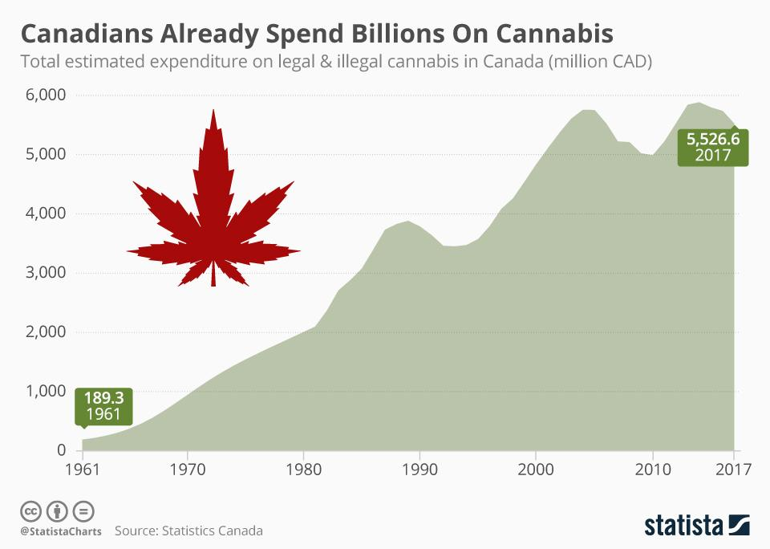

Marijuana legalization in Canada represents a significant shift in national policy, officially taking effect on October 17, 2018. The policy change was driven by the federal Cannabis Act, making Canada the first G7 nation to legalize recreational cannabis nationwide. This historical movement aimed at curbing illegal distribution while ensuring consumer safety through stringent regulations. 

The impact of cannabis legalization on Canadian society and economy has been multifaceted. Socially, legalization has led to a reduction in cannabis-related criminal charges, alleviating the judicial burden and altering law enforcement focus. Economically, the burgeoning cannabis industry has contributed significantly to Canada's GDP, creating new avenues for employment and substantial tax revenues. In the first year of legalization alone, the cannabis sector generated an estimated $2.6 billion in sales, underscoring its importance to the national economy.

Canada's cannabis regulations are comprehensive, addressing production, distribution, retail, and consumption. The Cannabis Act outlines a framework intended to control and regulate production, distribution, and possession across the country. However, variations exist at the provincial and territorial levels, with each jurisdiction having the autonomy to impose additional regulations concerning retail models, age limits, and public consumption policies.

In conjunction with legal developments, algorithmic trading in cannabis stocks has emerged as a noteworthy component of the financial landscape. This form of trading utilizes computer algorithms to analyze market data and execute trades at speeds and frequencies that human traders cannot achieve. In the cannabis sector, algorithmic trading is driven by the volatile nature of cannabis stocks, which can be influenced by regulatory changes, market sentiment, and global trends. 

The intersection of cannabis policy and cutting-edge financial technology presents both opportunities and risks. While algorithmic trading can enhance liquidity and provide efficiencies in the trading of cannabis stocks, it also poses challenges, including potential market manipulation and the necessity for stringent oversight to maintain market integrity. As the Canadian cannabis market continues to evolve, stakeholders remain focused on balancing innovation with regulatory compliance to ensure sustainable growth.

## Table of Contents

## The Journey to Legalization

Canada's journey toward marijuana legalization culminated on October 17, 2018, a milestone in the nation's legal, social, and economic landscape. The path to this significant event was marked by a series of legislative efforts, public consultations, and societal shifts. Understanding this journey is essential to comprehending the broader implications of cannabis policy in Canada and beyond.

### Timeline Leading to Legalization

The movement towards marijuana legalization in Canada formally began with efforts led by political figures and influenced by public sentiment. Key milestones include:

- **2001**: Canada's initial steps towards addressing medical marijuana use were solidified with the Marijuana Medical Access Regulations (MMAR), a pioneering legal framework allowing access under certain conditions.

- **2015**: The federal election saw the Liberal Party, led by Justin Trudeau, commit to the legalization of cannabis for recreational purposes in their campaign. This pledge contributed significantly to their electoral victory.

- **April 2017**: The introduction of Bill C-45, the Cannabis Act, in the House of Commons marked the legislative push towards legalizing cannabis. This bill outlined the regulatory framework for controlling the production, distribution, sale, and possession of cannabis across Canada.

- **June 2018**: Following rigorous debate and amendments, the Cannabis Act received Royal Assent, setting the stage for full legalization in October 2018.

### Comparison with Other Countries

In comparison to other nations, Canada's approach to cannabis legalization is noteworthy for its structured, top-down framework. Uruguay was the first country to federally legalize cannabis in 2013, but its model is characterized by stringent supply controls and state regulation. In contrast, while certain U.S. states have legalized cannabis, it remains illegal at the federal level, creating a complex legal landscape.

Canada's nationwide legalization positioned it as a leader in cannabis policy, offering a cohesive regulatory environment across its provinces and territories. This differs from the patchwork approaches seen in the United States and the restrictive model of Uruguay.

### Initial Expectations and Challenges

The decision to legalize cannabis was driven by several expected outcomes, including reducing black market activity, generating tax revenues, and ensuring product safety through compliance and regulation. There was anticipation for substantial economic benefits, including job creation and the growth of ancillary industries.

However, the challenges were equally significant. Concerns about public health, notably the impact on youth and impaired driving, were prevalent. The government faced the task of establishing a regulatory framework that balanced accessibility with safety. Stigmatization of cannabis use also posed social challenges. Moreover, issues related to the clearing of past cannabis convictions and regulatory harmonization among provinces necessitated careful navigation and policy adaptations.

In summary, Canada's journey to marijuana legalization was a carefully orchestrated process characterized by legislative efforts, comparisons with international models, and expectations tempered by substantial challenges. This paved the way for Canada to be a pioneer in implementing a comprehensive and unified approach to cannabis legality.

## Cannabis Regulations in Canada

The Cannabis Act, enacted on October 17, 2018, is the primary federal legislation that legalized and regulates cannabis in Canada. The act established a comprehensive framework to control the production, distribution, sale, and possession of cannabis across the country. Its primary objectives include minimizing the illegal cannabis market, protecting public health and safety, and ensuring that cannabis is kept away from youth.

Under the Cannabis Act, adults aged 18 or 19 and over, depending on the province or territory, can legally purchase, possess, and use cannabis. The act allows individuals to possess up to 30 grams of legal cannabis, share it with other adults, grow up to four plants per household for personal use, and make cannabis products like edibles at home. The federal government is responsible for overseeing the production and quality standards of cannabis products to ensure consumer safety.

### Provincial and Territorial Variations in Regulation

While the Cannabis Act sets the overarching framework for cannabis legalization, provinces and territories have the authority to tailor regulations within their jurisdictions. This includes control over the sale and distribution methods, determining the minimum legal age for consumption, and imposing restrictions on where cannabis can be consumed publicly. 

For example, while most provinces set the legal age for cannabis use at 19, Alberta and Quebec initially set it at 18. In terms of distribution, some provinces like British Columbia and Alberta have established a mixed retail model, combining both private and government-operated stores. Conversely, provinces such as New Brunswick operate solely through government-run outlets. Regarding public consumption, regulations can range significantly, with some areas allowing consumption in certain public places and others enforcing stricter prohibitions similar to those governing alcohol and tobacco use.

### Permissible Forms of Cannabis and Their Rollout

The rollout of permissible forms of cannabis has been one of the phased approaches of the Cannabis Act implementation. Initially, only dried and fresh cannabis, seeds, plants, and oils were made legally available. This carefully controlled introduction aimed to manage public health risks effectively and limit the initial scope of the market.

On October 17, 2019, the Canadian government expanded this to include additional products such as edibles, extracts, and topicals. These new categories came with strict regulations on packaging, labeling, and marketing, designed to minimize appeal and accessibility to youth and safeguard public health. Edibles, for example, are subject to a THC limit of 10 milligrams per unit to mitigate overconsumption risks.

The progressive rollout of cannabis forms reflects the Canadian approach to cautiously introducing new products whilst closely observing their societal impacts. The continuous monitoring and potential adaptation of these regulations ensure they remain aligned with the evolving landscape of cannabis consumption and public health requirements.

## Economic Impact of Cannabis Legalization

Cannabis legalization in Canada has significantly influenced the national economy, showcasing notable sector growth, increased financial benefits, and profound effects on job creation and GDP contributions. Following the enactment of the Cannabis Act in 2018, Canada's cannabis market has experienced substantial expansion. In its first full year, the cannabis sector contributed approximately CAD 8.26 billion to the national GDP. By 2022, the market's valuation was projected to exceed CAD 12 billion, underscoring its rapid growth trajectory.

The primary driver of this expansion has been the establishment of legal cannabis businesses across the country. These businesses include cultivation facilities, processing plants, retail operations, and delivery services. As the market matured, there was a noticeable increase in variety, with both medical and recreational cannabis products being offered. The industry’s growth has not only diversified product availability but has also fostered innovation in product development, including edibles and cannabis-infused beverages.

From a fiscal perspective, cannabis legalization has led to increased tax revenues. The federal excise duty framework is designed with a "flat rate" tax of CAD 1 per gram, or 10% of the producer’s price, whichever is higher. Additionally, provinces and territories levy their own taxes, further enhancing local and national revenue streams. In the fiscal year 2021-2022, cannabis sales generated over CAD 2 billion in tax revenues for federal and provincial governments combined. This revenue supports public health initiatives, education programs, and enforcements related to cannabis use.

The legalization of cannabis has also stimulated job creation across various segments of the economy. By 2019, the Canadian cannabis sector had created over 9,200 jobs, with roles spanning from agricultural positions in cultivation centers to managerial roles in corporate cannabis entities. As of recent years, the industry supports tens of thousands of jobs, contributing to employment in both urban and rural communities.

Moreover, the cannabis industry's growth has contributed to other sectors, including real estate, as demand for cultivation and retail space increased. This demand has led to real estate growth, particularly in industrial and commercial properties.

While the economic impact of cannabis legalization in Canada has been largely positive, ongoing evaluation is necessary to address challenges such as market saturation, regulatory compliance costs, and international competition. Nonetheless, cannabis legalization has established itself as a formidable component of Canada's economic landscape, with prospects for continued growth and integration into the broader economy.

## Challenges and Controversies

The legalization of cannabis in Canada, while groundbreaking, has not been without its challenges and controversies. One significant hurdle involves addressing past cannabis convictions. Prior to the Cannabis Act of 2018, many Canadians were convicted for minor cannabis-related offenses. The government's response has been to offer pardons for simple possession, yet critics argue that this is insufficient. A pardon does not erase a criminal record; rather, it acknowledges that the individual is forgiven but can still impact employment and travel opportunities. Some advocate for record expungement as a more comprehensive solution, which would completely remove the offense from an individual's record, mitigating long-term consequences.

Public health concerns also arise from cannabis legalization, particularly regarding age restrictions. The legal age for cannabis consumption in Canada is set at 18 or 19, depending on the province or territory, aligning with the legal drinking age. However, there is ongoing debate about whether this is appropriate given research suggesting that cannabis use can impair brain development in people under 25. Public health officials emphasize the need for strict regulations and robust educational campaigns to mitigate potential adverse effects on young people. The government has implemented measures such as plain packaging, warning labels, and advertising restrictions to limit exposure and reduce youth appeal.

Regulatory hurdles remain a persistent challenge in ensuring effective oversight of the cannabis industry. The Cannabis Act sets out the federal framework, but provinces and territories have the authority to tailor certain aspects to local needs. This leads to a patchwork of regulations, creating challenges for businesses operating across provincial borders. For instance, the permissible forms of cannabis and rules surrounding retail distribution can vary significantly. Additionally, provinces are responsible for setting restrictions on personal cultivation and public consumption, further complicating the regulatory landscape.

The government's role in oversight is critical to maintaining the balance between market growth and public welfare. Agencies such as Health Canada and the Canada Revenue Agency play crucial roles in regulating and monitoring the industry, ensuring product safety, and collecting taxes. However, with the rapid expansion of the cannabis market, there is a constant need to adapt and refine regulatory frameworks to address emerging challenges such as illicit market competition and ensuring quality control standards.

In conclusion, while cannabis legalization in Canada marks a significant shift in drug policy, it continues to face legal, public health, and regulatory challenges that require ongoing attention and adaptation. The government's ability to address past injustices, protect public health, and maintain effective market oversight will be essential in navigating these controversies.

## Algorithmic Trading in the Cannabis Sector

Algorithmic trading, also known as algo trading, refers to the use of computer algorithms to automate trading decisions, enabling rapid and efficient market transactions. This method relies on pre-set criteria such as timing, price, and [volume](/wiki/volume-trading-strategy) to execute trades at high speeds, often beyond the capability of human traders. The cannabis sector, particularly in Canada following the legalization of marijuana, has become an intriguing market for [algorithmic trading](/wiki/algorithmic-trading) due to its [volatility](/wiki/volatility-trading-strategies), regulatory developments, and evolving market dynamics.

### Relevance to Cannabis Stocks

Cannabis stocks have experienced substantial fluctuations in their values since legalization, attributed to a combination of regulatory changes, consumer demand shifts, and international market expansion. These dynamic conditions make cannabis stocks suitable candidates for algorithmic trading. Algorithms can capitalize on sudden market shifts, optimizing entry and [exit](/wiki/exit-strategy) points to maximize returns or minimize losses. The large volumes and fast-paced nature of cannabis stock trading are well-suited to algorithms capable of processing and acting on vast amounts of data in milliseconds.

### Technology Driving Investments

Technology is significantly influencing investments within the cannabis sector, with data analytics and [machine learning](/wiki/machine-learning) playing critical roles. Algorithmic trading systems leverage historical data, real-time market feeds, and news analytics to predict stock movements and execute trades. These systems can incorporate sentiment analysis from social media and news outlets, providing insights beyond traditional market indicators.

For instance, machine learning models can detect patterns not visible to human analysts, providing traders with an edge in decision-making. Predictive analytics based on historical price movements and trade volumes allow for the development of sophisticated trading strategies, including [momentum](/wiki/momentum) trading, mean reversion, and [arbitrage](/wiki/arbitrage), all implemented algorithmically.

### Challenges and Risks

Despite the advantages, algorithmic trading in cannabis stocks poses several challenges and risks. The volatility characteristic of cannabis stocks can lead to significant gains but also substantial losses. Algorithms, if not adequately programmed or monitored, might struggle to adapt to unexpected market events or regulatory announcements, leading to unanticipated trading outcomes.

Market [liquidity](/wiki/liquidity-risk-premium) is another concern; while some cannabis stocks are actively traded, others may suffer from low liquidity, resulting in wider bid-ask spreads and potential execution challenges. This scenario requires algorithms to [factor](/wiki/factor-investing) in liquidity risks, adjusting trading strategies dynamically.

Additionally, the regulatory environment around cannabis is complex and continually evolving. Changes in legislation or government policy may impact cannabis stock prices unexpectedly, posing challenges for algorithms that do not account for such variables. Thus, continuous monitoring and adjustment of trading algorithms are crucial to mitigate these risks.

Incorporating these factors, algorithmic traders must remain vigilant, employing robust risk management strategies and diversifying their investments to offset potential losses. As technology advances, the adoption of [artificial intelligence](/wiki/ai-artificial-intelligence) and enhanced data analytics is expected to further refine algorithmic trading strategies, heightening their effectiveness and appeal in the cannabis stock market.

## Future Prospects

The future prospects of Canada's cannabis industry are of considerable interest both domestically and internationally. Since the legalization of cannabis on October 17, 2018, the landscape has evolved significantly, offering a glimpse into potential regulatory updates and broader economic trends emerging from this sector.

### Predictions for the Cannabis Industry in Canada

The Canadian cannabis market is expected to continue its upward trajectory in the coming years, marked by increased consumer demand and expansion into international markets. Analysts forecast that the Canadian cannabis sector could reach a market size of CAD 8-10 billion within the next five years. This growth is attributed to several factors, including expanded product offerings like cannabis-infused beverages and edibles, and an increase in the number of retail outlets across provinces. Additionally, further advancements in cultivation technologies and the application of data analytics are likely to enhance production efficiency and product quality.

### Potential Regulatory Changes and Developments

A significant aspect of future developments in Canada’s cannabis sector revolves around regulatory adjustments. The federal government may review and potentially amend parts of the Cannabis Act to address emerging market dynamics. Such changes could include the easing of advertising restrictions and adjustments in licensing processes to encourage greater participation from smaller producers. There is also potential for revisions in taxation policies to enable more competitive pricing against the illicit market, which remains a challenge. On a provincial level, differences in regulations, especially concerning consumption spaces and retail sales, might see harmonization efforts to standardize practices across the country.

### The Global Influence of Canada's Cannabis Policies

Globally, Canada's cannabis legalization serves as a benchmark for other nations considering similar measures. Canadian companies are actively pursuing international expansion, leveraging their regulated environment as a competitive advantage in markets such as Europe, Australia, and Latin America. As more countries contemplate cannabis legalization, Canada's policies offer a framework for establishing legal and operational guidelines. Furthermore, Canada's leadership in cannabis research and development could lead to international collaborations, fostering a globally integrated cannabis sector. This influence is likely to enhance Canada's role in shaping a nascent but rapidly maturing global cannabis economy.

In summary, the future of the cannabis industry in Canada appears promising, with room for growth, regulatory refinement, and international collaboration. These elements collectively underscore Canada's pivotal position in the global cannabis landscape, offering a model for sustainable and responsible cannabis policy and industry practices.

## Conclusion

Cannabis legalization in Canada has led to significant economic and societal impacts since it became legal on October 17, 2018. Economically, the legal cannabis market has become a formidable contributor to the national economy, creating thousands of jobs and generating substantial tax revenue. Reports indicate that the cannabis industry contributed billions of dollars to Canada's GDP, highlighting its emergence as a vital sector with substantial economic promise. The workforce has benefited through diverse job opportunities in cultivation, retail, and regulatory roles, further bolstering economic growth.

On a societal level, legalization has initiated changes in public perceptions and behaviors regarding cannabis use. Public health approaches have been reshaped, focusing more on education and harm reduction rather than criminalization. The regulation and quality control of cannabis products have improved consumer safety, reducing the risks associated with illicit market products.

Nevertheless, challenges remain. Addressing past cannabis-related convictions has been a legal and ethical issue, impacting societal equity and justice. Public health concerns, particularly around youth access and mental health, continue to require meticulous oversight and responsive policy interventions.

Looking to the future, the cannabis industry's trajectory in Canada appears promising, though not without hurdles. Regulatory frameworks may evolve to accommodate new products and consumption methods, influencing market dynamics and consumer behaviors. Internationally, Canada's pioneering approach may continue to influence global cannabis policies, potentially leading to broader economic and trade opportunities.

In trading, particularly algorithmic trading of cannabis stocks, the integration of advanced technologies promises to offer new avenues for growth and investment. Despite inherent challenges and volatility, such innovations could drive more efficient and strategic investments within the sector.

Overall, cannabis legalization in Canada marks a pivotal shift with widespread implications. The road ahead requires balanced and informed regulatory approaches to maximize benefits and mitigate risks while setting a precedent for global cannabis governance.

## References & Further Reading

[1]: Government of Canada. ["Cannabis Act: The Facts"](https://www.canada.ca/en/health-canada/news/2018/10/backgrounder-the-cannabis-act-the-facts.html) 

[2]: Deloitte. ["A society in transition, an industry ready to bloom: 2018 Cannabis report."](https://www2.deloitte.com/ca/en/pages/consulting/articles/deloitte2018cannabisreport.html)

[3]: Statistics Canada. ["Canadian Cannabis Industry Statistics"](https://www150.statcan.gc.ca/n1/pub/13-610-x/cannabis-eng.htm) 

[4]: Kilmer, B., & Smart, R. (2019). "<a href='https://www.rand.org/pubs/working_papers/WR1274.html'>Comparing Cannabis Legalization: Learning from the American Experience</a>." RAND Corporation.

[5]: Laurentian University. (2019). "Economic Impact of Cannabis Legalization in Canada." [Research Paper](https://onlinelibrary.wiley.com/doi/full/10.1111/add.16274)

[6]: Cook, P. J., & Hathaway, A. D. (2020). ["The Canadian Cannabis Act Legalization’s Impact on Canadian Society."](https://pubmed.ncbi.nlm.nih.gov/29860521/) European Journal on Criminal Policy and Research.

[7]: ["Canadian Cannabis Statistics"](https://www.canada.ca/en/health-canada/services/drugs-medication/cannabis/research-data/canadian-cannabis-survey-2024-summary.html) - Statistics Canada Report.

[8]: ["Cannabis: Our Position for a Canadian Public Health Approach"](https://www.ncbi.nlm.nih.gov/pmc/articles/PMC6973891/) - Canadian Public Health Association Report.

[9]: Lopez de Prado, M. (2018). ["Advances in Financial Machine Learning."](https://www.amazon.com/Advances-Financial-Machine-Learning-Marcos/dp/1119482089) Wiley.

[10]: Vigna, D., (2018). ["Cannabis Market Forecast and Predictions."](https://pubmed.ncbi.nlm.nih.gov/32113149/) The Globe and Mail.