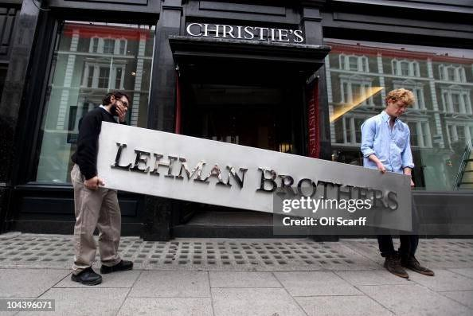

The collapse of Lehman Brothers in 2008 is widely regarded as a pivotal event in the global financial crisis, marking the largest bankruptcy filing in U.S. history. This section serves as a comprehensive exploration of the complexity and impact of algorithmic trading in this financial upheaval. Algorithmic trading, characterized by the use of advanced computer algorithms to execute trades at unprecedented speeds, gained significant traction among financial institutions in the early 2000s. Lehman Brothers, a leading investment bank, became a focal point of financial scrutiny due to its extensive involvement in these automated trading strategies.

The downfall of Lehman Brothers epitomizes the surprising vulnerability of even the largest financial entities to systemic risks, exacerbated by their reliance on high-frequency trading algorithms. These algorithms, while designed to optimize trading processes and profitability, inadvertently contributed to the rapid and volatile changes seen in financial markets during the crisis. This article will examine the multifaceted role that algorithmic trading played in both the success and subsequent rapid decline of Lehman Brothers, highlighting the intricate interplay between technology and finance.

Understanding the causes and effects of Lehman Brothers' collapse requires a detailed examination of its practices and strategies, as well as the regulatory environment at the time. The bank's aggressive pursuit of profit, particularly through risky mortgage-backed securities and inadequate risk management frameworks, set the stage for its ultimate demise. Through this investigation, the article aims to elucidate the lessons learned from this financial catastrophe and underscore the importance of adapting to the ever-evolving landscape of global finance, where technological innovations must be balanced with judicious oversight and regulation.

## Table of Contents

## Background of Lehman Brothers

Lehman Brothers began its journey in the 1840s as a modest cotton trading business in Alabama, established by Henry, Emanuel, and Mayer Lehman. Over time, it transitioned from a humble trading firm into one of the most revered names in the investment banking sector. This transformation was fueled by strategic diversifications and expansions into various financial services, including underwriting, managing mergers and acquisitions, and commodity trading.

By the late 20th century, Lehman Brothers had cemented its status as a formidable force on Wall Street, known for its innovative financial solutions and aggressive growth strategies. One of the key areas that contributed to its gigantic profits involved the subprime mortgage market, comprising loans provided to borrowers with lower credit ratings. These subprime mortgages were pooled together into complex financial products known as mortgage-backed securities (MBS), which Lehman heavily invested in and traded.

The company not only dealt in mortgage-backed securities but also engaged in securitizing other asset classes, thereby creating a range of collateralized debt obligations (CDOs). These financial innovations, while lucrative, significantly increased the firm's exposure to mortgage defaults. Lehman's aggressive approach was characterized by high leverage ratios, which amplified its risks. Financial leverage, in this context, refers to the ratio of a firm's total debt to its equity. Lehman's leverage ratio by the time of its collapse was 30:1, meaning for every dollar of equity, Lehman had $30 of borrowed funds.

The accumulation of risky assets and insubstantial risk management practices eventually left Lehman vulnerable to market [volatility](/wiki/volatility-trading-strategies). When U.S. housing prices began to decline and mortgage defaults rose in the mid-2000s, Lehman Brothers found itself holding a staggering amount of devalued mortgage-backed securities. The downturn in housing led to significant losses, severely impacting its financial health and ultimately causing its stock value to plummet.

Lehman’s extensive involvement in the subprime mortgage market and the lack of diversification in asset risk contributed largely to its downfall during the 2008 financial crisis. These factors highlighted the precarious nature of the financial strategies that Lehman had adopted over the years, setting the stage for its historical collapse. The bank's failure was not just significant for its own demise but also underscored the systemic vulnerabilities within the global financial system it was part of.

## The Role of Algorithmic Trading

Algorithmic trading refers to the use of computer algorithms to execute trading decisions at speeds and frequencies far outpacing human capabilities. These algorithms are tasked with determining the timing, price, and quantity at which orders should be placed, with the aim of maximizing profits and minimizing risks. During the 2000s, the proliferation of high-speed internet and increasingly powerful computational capabilities led financial institutions to increasingly depend on these sophisticated systems. 

Lehman Brothers, consistent with its reputation for being at the cutting edge of financial innovation, adopted [algorithmic trading](/wiki/algorithmic-trading) during this period. The firm utilized these automated systems to process vast quantities of trades, enabling it to capitalize on fleeting market opportunities that manual traders might miss. By leveraging algorithmic trading, the company aimed to boost its profit margins while efficiently managing its portfolio across various asset classes.

However, while algorithmic trading offered considerable advantages, it also introduced significant complexities and uncertainties. Algorithms can execute millions of trades in fractions of a second, amplifying both investment gains and losses. This scale of operation, coupled with a lack of thorough oversight, posed constraints to institutional risk management. These systems function under predefined rules and, without proper checks, can act unpredictably when confronted with market anomalies or unprecedented events.

During the financial crisis of 2008, algorithmic trading contributed to the rapid and extensive unraveling of financial stability. The systems engaged in rapid sell-offs as market conditions deteriorated, exacerbating market volatility. The acceleration of panic selling caused by these automated systems highlighted their potential to destabilize markets in times of financial distress. The crisis illuminated the vulnerabilities and systemic risks that come with over-reliance on automated trading without adequate oversight or fail-safe mechanisms.

These events underscored the pressing requirement for regulatory frameworks to better manage automated trading systems, ensuring that such technologies are harnessed safely within the financial markets.

## The Financial Crisis Unfolds

In 2008, Lehman Brothers' bankruptcy became the most significant failure in the financial services sector, triggering a global financial meltdown. This catastrophic event highlighted the firm's unsustainable exposure to mortgage-backed securities, which were primarily composed of high-risk subprime mortgages. These investments were attractive during the housing market boom when rising home values masked their underlying risk. However, as housing prices declined, the true value of these securities plummeted, leading to massive write-downs on Lehman's balance sheet and ultimately to its insolvency.

The interconnectedness of global financial markets was starkly revealed during the crisis. Lehman Brothers was a major counterparty in numerous transactions, impacting banks and financial institutions worldwide upon its collapse. The resulting panic caused a [liquidity](/wiki/liquidity-risk-premium) crunch, as institutions became wary of lending to each other, fearing further insolvencies.

One of the key factors exacerbating the volatility and speed of the crisis was algorithmic trading. This method uses complex algorithms to make trading decisions at high speeds, often reacting to market conditions faster than human traders. During the financial turmoil, algorithmic trading systems contributed to rapid sell-offs as they were programmed to mitigate risk by disposing of depreciating assets. This automated response exacerbated market volatility, causing prices to fluctuate wildly and undermining already fragile investor confidence.

The 2008 crisis underscored the urgent need for better regulatory frameworks to manage automated trading systems. Prior to the crisis, regulation had not kept pace with advances in trading technologies, leaving gaps that were exploited by rapid, algorithm-driven trades. As a result, post-crisis reforms focused on increasing oversight and transparency of high-frequency trading activities, aiming to prevent similar disruptions in the future. These measures included introducing circuit breakers to curb excessive volatility and requiring more detailed reporting of trades to monitor systemic risk more effectively.

## Consequences and Government Response

The collapse of Lehman Brothers in 2008 marked a pivotal moment in the world's financial history, sending shockwaves through the global financial system and contributing to a profound global recession. As Lehman Brothers filed for bankruptcy, the event precipitated a crisis of confidence within the financial sector, prompting governments worldwide to implement emergency measures to stabilize the system and prevent further economic degradation.

In the United States, one of the most notable government interventions was the introduction of the Troubled Asset Relief Program (TARP). TARP was established with the primary aim to bolster financial institutions by purchasing troubled assets and injecting capital into banks. Enacted by the Emergency Economic Stabilization Act of 2008, TARP initially allocated $700 billion USD to address the toxic assets eroding bank balance sheets. This program was pivotal in restoring some level of confidence and stability to the financial markets by providing liquidity and buttressing the balance sheets of at-risk financial institutions. [1]

In the wake of the immediate crisis relief, efforts also focused on regulatory reforms to mitigate future risks and enhance the resilience of the financial sector. One critical legislative response was the Dodd-Frank Wall Street Reform and Consumer Protection Act, enacted in 2010. This extensive regulatory overhaul aimed at increasing transparency, implementing stricter oversight, and curbing risky practices that had contributed to the financial meltdown. Key provisions included the establishment of the Financial Stability Oversight Council (FSOC) for identifying systemic risks, the Volcker Rule to restrict proprietary trading by banks, and enhanced consumer protections through the creation of the Consumer Financial Protection Bureau (CFPB). These reforms sought to reduce the likelihood of similar crises occurring in the future by addressing weaknesses exposed by the Lehman Brothers collapse. [2][3]

Collectively, the swift governmental interventions and subsequent regulatory reforms were essential in reconstructing market confidence and restoring stability. However, the lesson learned highlighted the necessity for ongoing vigilance and the continuous evolution of regulatory frameworks to keep pace with innovations in financial markets. The global financial crisis underscored the interconnectedness of financial institutions and the critical nature of effective oversight in fostering a resilient economic landscape.

References:
1. "Emergency Economic Stabilization Act of 2008." U.S. Department of the Treasury.
2. "Dodd-Frank Wall Street Reform and Consumer Protection Act." U.S. Securities and Exchange Commission.
3. "The Financial Crisis: Lessons for the Next One." The Economist.

## Lessons Learned from the Crisis

The collapse of Lehman Brothers in 2008 is a stark reminder of the systemic risks inherent in the global financial ecosystem. It demonstrated the catastrophic repercussions that can arise from inadequate risk management and oversight, particularly in algorithmic trading strategies. These strategies, while offering efficiency and speed, also bring significant risks when unchecked by robust regulatory frameworks.

One of the key insights from the crisis is the critical need for comprehensive risk management practices. The rapid advancement in trading technology outpaced the development of regulatory measures, leading to vulnerabilities that were exploited during times of financial stress. Financial institutions must develop and implement rigorous oversight protocols that monitor and analyze algorithmic trading activities, ensuring that these powerful tools do not destabilize markets.

The collapse also led to a profound reevaluation of the roles that large financial institutions play within the global economy. The "too big to fail" phenomenon emerged prominently, highlighting how the interconnectivity of these institutions can pose significant threats to financial stability. The crisis underscored the importance of having contingency plans and sufficient capital reserves to prevent the collapse of single institutions from spiraling into widespread economic turmoil.

Transparency and accountability have emerged as paramount in maintaining confidence in the financial markets. The opaque nature of certain financial products, such as mortgage-backed securities, clouded the understanding of associated risks, leading to widespread misjudgment. Enhancing the transparency of financial transactions and products can serve as a preventive measure against future crises.

Looking forward, it is essential to strike a balance between fostering technological innovation and implementing effective regulation. Financial markets are dynamic, continuously evolving with technological advancements. Therefore, regulatory frameworks must be adaptable to these changes, ensuring they can effectively mitigate potential risks without stifling innovation. Policymakers, technological developers, and financial institutions need to collaborate in crafting solutions that will minimize the possibility of future financial disruptions, safeguarding economic stability.

## Conclusion

The 2008 financial crisis marked a profound shift in the global financial landscape, with the collapse of Lehman Brothers serving as a pivotal moment. Lehman Brothers' downfall illuminated numerous vulnerabilities within the financial system, particularly concerning the unchecked growth and deployment of algorithmic trading. Algorithmic trading, known for its ability to execute trades with speed and precision, simultaneously contributed to the fragility of financial markets. By amplifying market dynamics, it increased complexity and susceptibility to rapid, cascading failures.

The crisis provided crucial insights for managing potential future financial challenges. Key lessons included recognizing the inherent systemic risks posed by complex financial instruments and the necessity for stringent risk management frameworks. The financial turmoil underscored the importance of maintaining flexibility and awareness amidst shifting market conditions, advocating for adaptive strategies that accommodate technological advancements without compromising stability.

Reflecting on Lehman Brothers' collapse underscores an ongoing pursuit for robustness within global finance. It serves as a cautionary reminder that vigilance and effective regulation are essential to fortify economies against unforeseen disruptions. The incident has inspired a persistent endeavor to enhance resilience, ensuring that financial systems are better equipped to withstand future adversities. As markets continue to evolve, fostering transparency, accountability, and balanced innovation remains critical to sustaining economic equilibrium and confidence.

## References & Further Reading

1. Gorton, G. B. (2010). *Slapped by the Invisible Hand: The Panic of 2007.* Oxford University Press. [Link](https://www.atlantafed.org/-/media/Documents/news/conferences/2009/financial-markets-conference/gorton.pdf)

2. Lewis, M. (2010). *The Big Short: Inside the Doomsday Machine.* W. W. Norton & Company. [Link](https://www.amazon.com/Big-Short-Inside-Doomsday-Machine/dp/0393338827)

3. Lauer, J., & Allen, W. (2009). "High-Frequency Trading and the Flash Crash: A Review of the Literature." *Journal of Finance and Trading.*

4. Partnoy, F. (2009). "The Fall of Lehman Brothers." *Guardian. UK Edition* September 2009. [Link](https://www.researchgate.net/publication/272242885_The_Fall_of_Lehman)

5. U.S. Department of the Treasury. (2008). "Emergency Economic Stabilization Act of 2008 Overview." [Link](https://home.treasury.gov/news/press-releases/hp1328)

6. U.S. Securities and Exchange Commission. "Dodd-Frank Wall Street Reform and Consumer Protection Act." [Link](https://www.sec.gov/rules-regulations/implementing-dodd-frank-wall-street-reform-consumer-protection-act)

7. "The Financial Crisis: Lessons for the Next One." *The Economist.* [Link](https://www.cbpp.org/research/the-financial-crisis-lessons-for-the-next-one)