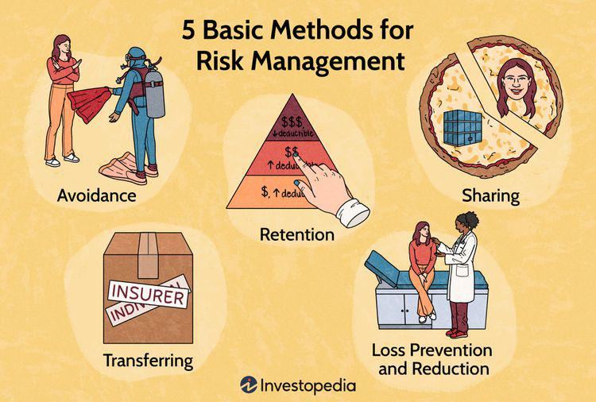

'Lemming behavior' is a concept that has fascinated both biologists and economists, arising from the behaviors observed in the small rodent known as the lemming. These creatures are often mistakenly believed to engage in mass suicides by jumping off cliffs, a myth popularized in part by cultural depictions. In truth, while lemmings do exhibit herd behavior, these events are complex and not purely irrational acts. This behavior in the natural world serves as a compelling metaphor for certain actions within financial markets.

In the context of trading, 'lemming behavior' describes the tendency of investors to follow the crowd instead of making independent decisions based on scrutiny and analysis. Just as lemmings may follow each other in large groups, traders sometimes mimic market trends without assessing the underlying value or potential of the investment. This can lead to bubbles or crashes in financial markets, driven by collective emotion rather than rational evaluation.



Algorithmic trading, which uses computer programs to automatically execute trades, can sometimes mirror this 'lemming' behavior. While designed to optimize trading efficiency and reduce human error, algorithms may exacerbate market movements when they respond simultaneously to the same market signals. This amplifies the effects of herd mentality, potentially leading to significant volatility.

This article intends to explore the similarities between lemming behavior in the natural world and the phenomena observed in financial markets, particularly how algorithmic trading can unintentionally mimic this behavior. It further aims to highlight the risks associated with blindly following market trends and underscore the importance of developing robust strategies to avoid such pitfalls. Understanding the interplay between human behavior, financial decision-making, and algorithmic processes is crucial for navigating the complex landscape of modern markets and achieving successful trading outcomes.

## Table of Contents

## Understanding Lemming Behavior

Lemmings, small rodents predominantly found in Arctic and subarctic regions, have long been intertwined with the myth of self-destructive mass migrations. This perception stems largely from misinterpretations of natural behaviors and has been perpetuated by anecdotal accounts and media portrayals. For instance, the widely circulated belief that lemmings deliberately jump to their deaths during migrations is, in reality, an oversimplification.

The actual behavior of lemmings is driven by natural instincts and environmental factors. As populations surge, primarily due to abundant food supplies and favorable living conditions, these creatures often embark on migratory journeys in search of new habitats to accommodate their growing numbers. These movements can sometimes result in accidental deaths, especially if they encounter obstacles such as rivers or cliffs, leading to a skewed public perception of self-destructive behavior.

Metaphorically, lemming behavior is a reflection of herd behavior observed across various species, including humans. In the context of investment markets, this can be interpreted as 'herd mentality,' where individuals blindly follow market trends without scrutinizing the underlying rationale or potential risks. Such behavior is often fueled by psychological factors like fear of missing out (FOMO), leading to irrational decision-making.

The lemming myth, while largely debunked within scientific circles, serves as a powerful cautionary tale against indiscriminately following the masses. It underscores the importance of conducting thorough due diligence before making decisions, whether in the natural world or the financial sector. Understanding the realities of lemming behavior can help individuals recognize the pitfalls of herd mentality, emphasizing the necessity for critical analysis and independent thought in decision-making processes.

## Herd Mentality in Algorithmic Trading

Algorithmic trading, which leverages computer algorithms to automate trading decisions, is inherently designed to enhance trading efficiency and minimize human error. However, these automated systems are not immune to the pitfalls of herd mentality. The concept of herd mentality refers to the tendency of individuals or systems to follow the majority, often leading to amplified market dynamics. In [algorithmic trading](/wiki/algorithmic-trading), this phenomenon can result from multiple algorithms processing similar data inputs and responding with analogous trades. 

The reliance on technical indicators and data patterns means that many algorithmic trading systems are pre-programmed to react to specific market signals. When these signals are widely recognized across different systems, a cluster of similar trading actions can occur almost simultaneously. This can lead to a self-reinforcing cycle where algorithms push prices in a particular direction, prompting even more algorithms to follow suit due to their reliance on similar indicators. This mimicry in trading behavior resembles the so-called "lemming" approach, where entities follow the actions of others irrespective of underlying market fundamentals.

A practical illustration of this can be observed in high-frequency trading ([HFT](/wiki/high-frequency-trading-strategies)), where algorithms execute trades at speeds far beyond human capability. If a significant number of high-frequency algorithms detect an uptick or downtick signal—often based on technical analysis or [momentum](/wiki/momentum) investing—they may collectively enter or [exit](/wiki/exit-strategy) positions. This rapid and concerted movement can cause dramatic short-term price shifts, sometimes disconnected from an asset’s intrinsic value. For instance, the Flash Crash of 2010 is a notable event partly attributed to the cascading effects of algorithm-driven decisions responding to interconnected market signals.

To mathematically model the amplification effect of herd behavior in algorithmic trading, consider a population of algorithms where each algorithm $A_i$ receives a signal $S$. The decision of each algorithm might simply be expressed as $D_i = f(S)$, where $f$ is a function mapping signals to trading actions. If a critical mass of algorithms receive a similar $S$, their collective trading actions $\Sigma D_i$ can significantly impact market prices, creating a feedback loop.

Strategies to mitigate such herd behavior include diversifying algorithmic strategies and incorporating contrarian indicators that trigger trades counter to prevailing momentum. In addition, advanced [machine learning](/wiki/machine-learning) models can help these systems evolve dynamically by analyzing massive datasets to identify and counteract emerging patterns indicative of herd behavior, thus reducing susceptibility to such collective actions. 

Overall, while algorithmic trading offers impressive precision and speed, the risk of herd mentality mimicking lemming behavior remains a challenge that necessitates vigilant strategy management and technological innovation.

## Behavioral Biases Impacting Trading

Trading decisions are frequently influenced by cognitive and emotional biases, which can lead to irrational behaviors and are often consciously or subconsciously embedded within trading algorithms. Among these biases, overconfidence and loss aversion are particularly prevalent and impactful.

**Overconfidence Bias:** This refers to traders' unwarranted belief in their own skills or the performance of their strategies. Overconfidence often manifests when traders overestimate the precision of their information or the accuracy of their predictions. This bias can lead to excessive trading, which empirical research has shown to erode profitability due to increased transaction costs and the likelihood of making poor choices based on overestimated odds. For instance, a trader may believe their proprietary model is infallible, despite evidence suggesting limitations or errors in the model's assumptions.

**Loss Aversion Bias:** Rooted in Kahneman and Tversky’s Prospect Theory, loss aversion describes the tendency to prefer avoiding losses over acquiring equivalent gains. This bias can result in traders holding onto losing positions longer than is strategically advisable, hoping for a rebound to breakeven instead of cutting losses. Conversely, they might prematurely sell winning positions to "lock in" a sure gain, thereby capping potential profitability. This behavior can be detrimental, as it opposes the basic trading maxim of "cutting losses short and letting profits run."

These biases can be subtly integrated into trading algorithms, often through historical data patterns that unknowingly reflect human behavioral tendencies. Algorithms might over-rely on past success indicators (an overconfidence reflection) or unduly weight avoiding losses (a nod to loss aversion), leading to performance distortions.

To mitigate these biases, traders and developers need to employ data-driven strategies. One such method includes regularly [backtesting](/wiki/backtesting) algorithms against diverse market conditions to recognize and adjust for potential overfitting. Additionally, incorporating robust risk management protocols can help counterbalance overconfidence and loss aversion. For instance, implementing stop-loss mechanisms and position sizing based on statistical metrics helps ensure objective decision-making independent of innate biases.

Furthermore, creating a feedback loop for continuous assessment and recalibration of algorithms can significantly reduce the influence of these biases. Regular updates to the algorithm, informed by recent data and behavioral observations, can enhance alignment with rational trading objectives. Promoting a culture of awareness and education regarding these biases can further empower traders and developers to critically evaluate their systems, ensuring ongoing alignment with financial goals.

In conclusion, recognizing and systematically addressing cognitive and emotional biases in trading practices is crucial for maintaining rational, profitable decision-making processes. With the appropriate strategies in place, both human and algorithmic trading can achieve more consistent and successful outcomes.

## Developing Avoidance Strategies

To avoid 'lemming-like' mistakes in trading, traders should adhere to several well-established strategies that can help mitigate the risk of herd mentality and enhance decision-making efficacy.

Firstly, sticking to a well-defined trading plan is paramount. This plan should clearly outline entry and exit points, risk tolerance, and profit objectives. By having a structured approach, traders can avoid making impulsive decisions driven by market noise or emotional reactions. For instance, a trading plan might use a moving average crossover strategy as a signal for buy or sell decisions, systematically applied across trades to mitigate spontaneous deviations influenced by market [volatility](/wiki/volatility-trading-strategies).

Secondly, aligning strategies with long-term financial goals is crucial. Traders need to ensure that their actions in the market contribute to their overall investment objectives rather than succumbing to short-term market movements that could detract from these goals. For example, if a trader's goal is capital preservation, they may choose to implement a conservative approach with more diversified and low-risk securities, rather than aggressive speculation that could lead to significant losses.

Furthermore, it is essential to avoid the influence of sensationalist news. The rapid spread of market news through media channels can lead to overreactions and herd-like behavior among traders. To counteract this, traders should cultivate a critical assessment of news sources and focus on data-driven analysis rather than headlines. Incorporating tools like sentiment analysis or news filtering algorithms can help in discerning relevant market information from mere noise.

Finally, a disciplined, rules-based trading approach can help counteract the effects of herd mentality. By adhering to predetermined rules and avoiding emotional trading decisions, traders can maintain consistency and objective decision-making. An example of such an approach is algorithmic trading, where trades are executed based on validated strategies and computational models rather than human emotion. Python, for instance, offers various libraries such as NumPy and Pandas that facilitate the development of quantitative models to test and implement trading strategies systematically.

By incorporating these strategies, traders can develop robust frameworks that mitigate the pitfalls of following the crowd, thereby enhancing their trading discipline and potentially improving their market performance.

## The Role of Machine Learning in Mitigating Biases

Machine learning techniques offer significant advantages in detecting and minimizing biases within trading algorithms. As financial markets generate extensive data, machine learning models can analyze these large datasets to uncover patterns that traditionally might elude human detection. By leveraging statistical methods and advanced algorithms, machine learning helps identify anomalies and biases in trading decisions, which can be attributed to cognitive and emotional influences, historical data discrepancies, or systemic inefficiencies in algorithm design.

Machine learning models, particularly those employing supervised and unsupervised learning methods, can model trading dynamics and optimize decision-making processes. Supervised learning, which relies on historical labeled data, can predict future price movements by learning associations between input features and historical outputs. In contrast, unsupervised learning, which works with unlabeled data, facilitates the discovery of hidden patterns without pre-defined categories, helping identify clusters and anomalies that suggest bias.

A practical application of machine learning for bias mitigation involves the use of regression and classification models. For instance, in a trading scenario, a regression model could predict asset prices based on historical features, while a classification model might categorize trades as high-risk or low-risk, thereby introducing a layer of precaution against biased decision-making. Algorithms like Support Vector Machines (SVM), Random Forests, and Neural Networks are commonly employed due to their robustness in handling complex data structures and providing high prediction accuracy.

Another significant aspect is the necessity of continuous model training and evaluation. Financial markets are dynamic environments where conditions change rapidly. To ensure that machine learning models remain effective and unbiased, it is essential to update them regularly with new data. Continuous evaluation and training can be achieved by implementing feedback loops where the output of trading algorithms is regularly assessed, modified if necessary, and fed back into the model. This iterative process helps calibrate models to market changes and reduces the risk of model drift, where predicted outputs deviate over time due to changing market conditions.

Consider the Python implementation of a machine learning model applied to trading:

```python
from sklearn.model_selection import train_test_split
from sklearn.ensemble import RandomForestRegressor
import pandas as pd

# Load market data into a pandas DataFrame
data = pd.read_csv('market_data.csv')
features = data.drop('target', axis=1)
target = data['target']

# Split the dataset into training and testing sets
X_train, X_test, y_train, y_test = train_test_split(features, target, test_size=0.2, random_state=42)

# Initialize and train a Random Forest model
model = RandomForestRegressor(n_estimators=100, random_state=42)
model.fit(X_train, y_train)

# Evaluate the model
predictions = model.predict(X_test)
accuracy = model.score(X_test, y_test)
print(f'Model accuracy: {accuracy * 100:.2f}%')
```

In this example, a Random Forest Regressor is trained on a subset of market data to predict asset prices. The inclusion of numerous decision trees in the model helps capture various market conditions, contributing to reducing biases associated with isolated single-model predictions.

Machine learning provides systematic methodologies to refine trading strategies by minimizing biases, enhancing predictive power, and ultimately improving decision-making outcomes in trading algorithms.

## Conclusion

Avoidance of 'lemming behavior' in trading necessitates both understanding human biases and employing robust algorithmic strategies. This entails recognizing the psychological factors that can lead to herd mentality, such as overconfidence and loss aversion, and strategically counteracting their influence. Algorithmic strategies serve as a tool to enforce discipline and consistency, providing a framework to adhere to a plan and make decisions based on data rather than emotion.

The integration of scientific analysis with technological advancements enhances decision-making capabilities. Traders benefit from algorithms capable of analyzing vast datasets with speed and precision beyond human capability. These algorithms can identify patterns and trends that might otherwise go unnoticed, reducing the likelihood of succumbing to biased or impulsive decisions. The use of machine learning, for example, allows for dynamic adaptation as models are consistently refined based on new data and market conditions. This capacity to iterate and learn is pivotal in minimizing errors related to human bias.

Continuous education and strategic planning remain foundational to successfully navigating the complexities of algorithmic trading. As technology and markets evolve, ongoing learning ensures that traders and their algorithms remain attuned to current developments. Strategic planning is necessary to establish clear goals, risk management protocols, and performance metrics—elements that can guide decision-making processes and protect against reactive decisions inspired by market volatility or crowd behavior.

In summary, mitigating 'lemming behavior' in trading is achievable through the harmonious integration of knowledge, technology, and discipline. This multifaceted approach equips traders to make informed, objective, and strategic decisions, ultimately leading to more successful trading outcomes.

## References & Further Reading

[1]: Bergstra, J., Bardenet, R., Bengio, Y., & Kégl, B. (2011). ["Algorithms for Hyper-Parameter Optimization."](https://dl.acm.org/doi/10.5555/2986459.2986743) Advances in Neural Information Processing Systems 24.

[2]: ["Advances in Financial Machine Learning"](https://www.amazon.com/Advances-Financial-Machine-Learning-Marcos/dp/1119482089) by Marcos Lopez de Prado

[3]: ["Evidence-Based Technical Analysis: Applying the Scientific Method and Statistical Inference to Trading Signals"](https://www.amazon.com/Evidence-Based-Technical-Analysis-Scientific-Statistical/dp/0470008741) by David Aronson

[4]: ["Machine Learning for Algorithmic Trading"](https://github.com/stefan-jansen/machine-learning-for-trading) by Stefan Jansen

[5]: ["Quantitative Trading: How to Build Your Own Algorithmic Trading Business"](https://www.amazon.com/Quantitative-Trading-Build-Algorithmic-Business/dp/1119800064) by Ernest P. Chan