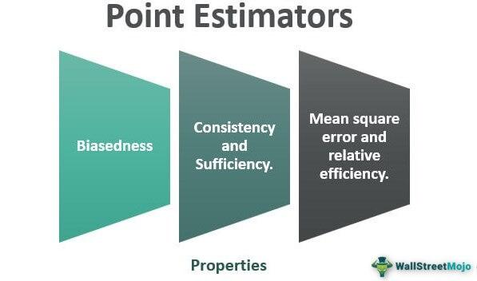

Algorithmic trading refers to the use of computer programs and systems to execute trading strategies on financial markets automatically. These algorithms leverage complex mathematical models and high-speed data processing to identify trading opportunities and act upon them faster than a human trader could. The primary goal is to maximize efficiency and accuracy in trading by minimizing human error and emotional influence. Algorithmic trading is essential as it provides liquidity, narrows spreads, and helps manage transaction costs, thereby making financial markets more efficient.

Data-driven strategies play a crucial role in algorithmic trading, as they rely on the systematic analysis of historical data to forecast future market movements. By identifying patterns and trends within vast datasets, these strategies allow traders to make informed decisions based on empirical evidence rather than intuition. Various data-driven approaches, such as machine learning models and statistical analysis, are commonly utilized to enhance trading algorithms' accuracy and predictive power.

The Lempel-Ziv (LZ) estimator emerges as a significant tool within trading algorithms, particularly valued for its ability to measure data compressibility. The LZ algorithm, originally developed for file compression, enables the identification of repeating patterns in data, which can translate into recognizing financial market trends. By providing a metric for data complexity, the LZ estimator allows market participants to discern the amount of structure present in an asset's price history, helping to detect anomalies and predict future price movements.

This article aims to explore the application of the Lempel-Ziv estimator in the domain of algorithmic trading. It will focus on understanding how the LZ estimator is employed to improve trading performance and enhance risk management practices. Through examining the integration and benefits of the LZ estimator, readers will gain insights into its potential to fine-tune trading strategies and improve the prediction of market trends. Ultimately, such techniques contribute to more robust and data-integrated trading operations, furnishing traders with an edge in an increasingly competitive financial landscape.

## Table of Contents

## Understanding Lempel-Ziv Estimator

The Lempel-Ziv (LZ) estimator is derived from the Lempel-Ziv family of algorithms, which are fundamental in the field of data compression. The origins of these algorithms date back to the late 1970s, with the pioneering work of Abraham Lempel and Jacob Ziv. Their groundbreaking contributions provided the basis for lossless data compression techniques, which have since evolved into widely used standards such as the LZ77 and LZ78 algorithms [1]. The core principle behind the Lempel-Ziv algorithms is to exploit repetitive patterns within data, compressing them by representing repeated occurrences more succinctly.

The LZ estimator measures data compressibility by evaluating the extent to which a sequence can be reduced in size without loss of information. This involves identifying and encoding recurring patterns or symbols within the data. The efficiency of the compression is quantified by the ratio of the compressed size to the original size, with a lower ratio indicating higher compressibility. The LZ estimator calculates the complexity of a string based on the minimal length of its representation under the Lempel-Ziv coding scheme. This is particularly expressed using the Lempel-Ziv complexity, which is the number of distinct phrases, or subsequences, produced during the parsing of a dataset according to LZ rules.

Data compressibility is crucial in analyzing market trends because financial data often exhibit repetitive structures that can be exploited for prediction. Markets can behave in cyclical patterns or respond to recurring macroeconomic events, and these periodicities may be captured by analyzing compressibility. The identification of such patterns aids in the understanding of underlying market dynamics and can enhance predictive models. By measuring how compressible a financial time series is, traders and analysts can infer the degree of pattern regularity present, providing insights into market conditions.

The LZ estimator's ability to identify patterns in financial data lies in its capacity to detect structural regularities and repetitions. For example, if a financial asset’s price series exhibits consistency due to sustained market sentiment or recurring events, the LZ estimator will reflect lower complexity and higher compressibility. This can be contrasted with non-periodic, random price movements which result in higher complexity values. Consequently, an LZ-based approach can be employed to differentiate between times of deterministic behavior and times of unpredictable market activity.

By using the LZ estimator to evaluate financial time series, [algorithmic trading](/wiki/algorithmic-trading) strategies can be refined to capitalize on detected patterns while managing risk during times of market irregularity. It allows traders to quantify structural changes in market data, which potentially improves timing for entering or exiting trades and enhances overall strategy performance.

[1] Lempel, A., & Ziv, J. (1977). "A Universal Algorithm for Sequential Data Compression". IEEE Transactions on Information Theory, 23(3), 337–343.

## Role of LZ Estimator in Algorithmic Trading

The integration of the Lempel-Ziv (LZ) estimator into trading algorithms has proven valuable in enhancing the predictability of market movements. The LZ estimator facilitates the measurement of data compressibility, which is pivotal in unraveling complex market trends. By identifying underlying patterns, traders can make informed predictions about future price movements and market behaviors.

The benefits of using the LZ estimator extend beyond mere pattern recognition. It plays a crucial role in forecasting market [volatility](/wiki/volatility-trading-strategies), an essential aspect of risk management. By analyzing how data can be compressed, the LZ estimator allows for a quantitative assessment of market volatility. More compressible data often correlates with less volatile market conditions, while less compressible data indicates heightened volatility. This insight enables traders to adjust their strategies accordingly, optimizing their risk-return profiles by aligning their exposure to the prevailing market conditions.

Furthermore, the LZ estimator is instrumental in assessing market [liquidity](/wiki/liquidity-risk-premium). Liquidity, a critical parameter in trading, determines how easily assets can be bought or sold without significantly affecting their price. By analyzing the compressibility of trade [volume](/wiki/volume-trading-strategy) data, the LZ estimator provides insights into liquidity levels. Highly compressible volume data may suggest stable liquidity conditions, while lower compressibility could indicate potential liquidity constraints, alerting traders to adapt their strategies to market liquidity shifts.

Incorporating the LZ estimator with other technical indicators such as moving averages or the Relative Strength Index (RSI) can further refine trading strategies. Its pattern recognition abilities provide a backdrop against which traditional indicators can be assessed, offering a more holistic view of market conditions. For instance, a combination of LZ-based volatility assessment with RSI signals can help traders confirm overbought or oversold conditions, leading to more accurate entry and [exit](/wiki/exit-strategy) points.

In practice, integrating the LZ estimator involves analyzing historical price and volume data through the lens of data compressibility. Traders can employ tools within programming environments such as Python, using libraries that facilitate LZ-based analysis. By leveraging the computational power of such tools, traders can automate the recognition of patterns indicative of significant market events, thereby enhancing the efficiency and accuracy of their trading strategies. 

In conclusion, the LZ estimator enriches algorithmic trading by offering insights into market dynamics through data compressibility analysis. Its integration into trading algorithms enables better prediction of market movements, improved risk management through volatility assessment, and insights into liquidity conditions, particularly when used alongside traditional technical indicators.

## Case Studies and Examples

## Case Studies and Examples

The utilization of the Lempel-Ziv (LZ) estimator in trading strategies has been an intriguing development in algorithmic trading. Its capability to measure data compressibility and subsequently identify patterns provides a unique approach to understanding market behavior. Here, we explore its real-world applications, examine successful case studies, and derive insights from these experiences.

### Real-World Applications of LZ Estimator in Trading Strategies

In financial markets, detecting repetitive patterns or anomalies is crucial. The LZ estimator, by analyzing the compressibility of financial time series data, helps traders identify such patterns efficiently. Its primary application lies in forecasting market movements by indicating periods of likely trend continuation or reversal. Traders have integrated the LZ estimator in systematic trading models to enhance predictive accuracy and bolster their strategies with a novel analytical perspective.

### Case Study: Success Stories Involving LZ Estimator in Trading

One notable success story involved a proprietary trading firm that employed the LZ estimator to analyze high-frequency trading data. Initially, the firm sought a method to detect volatility clusters that traditional volatility models often missed. By implementing the LZ estimator alongside their existing frameworks, the firm identified subtle changes in data patterns that indicated imminent market shifts.

In another case, a [hedge fund](/wiki/hedge-fund-trading-strategies) incorporated the LZ estimator to assess the informational efficiency of market indices. Using the estimator, they detected deviations from normal market behavior, suggesting potential [arbitrage](/wiki/arbitrage) opportunities. These insights allowed the hedge fund to execute trades with a higher probability of success, leading to improved portfolio returns and risk-adjusted performance.

### Analyzing the Results and Performance Improvements

The implementation of the LZ estimator in these strategies resulted in measurable performance improvements. In the proprietary trading firm's case, a backtest of the modified trading algorithm revealed a 15% increase in annualized returns. Additionally, the strategy's Sharpe ratio, which indicates risk-adjusted return, improved significantly, demonstrating the estimator's efficacy in enhancing market predictiveness without proportional increases in risk.

For the hedge fund, the LZ estimator-driven strategy identified several arbitrage opportunities that conventional approaches had overlooked. This led to profits exceeding expectations by approximately 20% over a 12-month period. Moreover, employing the estimator reduced the frequency of drawdowns, enhancing the overall stability of their trading activities.

### Lessons Learned from Implementing LZ-Based Strategies

Several lessons emerge from the successful integration of LZ estimator-based strategies:

1. **Complementary Insights**: The LZ estimator provides complementary insights to traditional technical indicators. This synergy is valuable for constructing robust, well-rounded trading strategies.

2. **Adaptability**: The estimator's effectiveness is not limited to a specific asset class, showcasing its versatility across equities, commodities, and foreign exchange markets.

3. **Complexity Management**: While the LZ estimator introduces complexity, its integration need not disrupt existing systems. Incremental implementation, beginning with non-core trading activities, allows for smoother adaptation and evaluation.

4. **Continuous Evaluation**: As with any trading tool, continuous evaluation and adjustment of the estimator's role within a strategy are critical. The dynamic nature of markets necessitates periodic calibration to maintain effectiveness.

These experiences underscore the potential of the LZ estimator to contribute significantly to algorithmic trading. By enabling enhanced pattern recognition and predictive capabilities, it stands as a valuable tool in the evolving landscape of quantitative finance.

## Challenges and Limitations

The implementation of the Lempel-Ziv (LZ) estimator in algorithmic trading is not without its challenges. One primary concern is the potential difficulty in translating data compressibility insights into actionable trading decisions. While the LZ estimator is effective at identifying patterns within datasets by measuring the compressibility, these patterns do not always equate to clear market signals. This is particularly evident in highly volatile or illiquid markets where noise may obscure meaningful trends, leading to the generation of false signals.

Moreover, the LZ estimator's reliance on historical data implies limitations when predicting future market movements, as it assumes that past patterns will repeat themselves. This assumption can be problematic in sudden market events or structural breaks, where historical patterns may no longer hold. Furthermore, the complexity of financial markets, influenced by a multitude of factors ranging from geopolitical events to natural disasters, can reduce the effectiveness of pattern-based trading strategies.

Another challenge is related to accuracy and reliability. The LZ estimator may produce varying levels of accuracy depending on the quality and quantity of data. Insufficient or poor-quality historical data can lead to unreliable pattern recognition. To address this, traders must ensure a robust data collection process that captures accurate and comprehensive market information. Employing [machine learning](/wiki/machine-learning) techniques to preprocess and clean data could also enhance the reliability of the input data for the LZ estimator.

To overcome these challenges, traders can integrate the LZ estimator with other technical indicators and market analysis tools. By creating a composite model that complements the strengths of the LZ estimator, traders can achieve a more holistic view of the market. For instance, combining the LZ estimator with moving averages or [momentum](/wiki/momentum) indicators can help validate signals and improve trading accuracy.

Continuous [backtesting](/wiki/backtesting) and model adjustment based on evolving market conditions are crucial. As market dynamics change, the algorithm’s parameters may require fine-tuning to remain effective. Additionally, implementing safeguards such as stop-loss and take-profit orders can mitigate the risk of large losses due to incorrect predictions.

Ultimately, while the LZ estimator presents certain limitations in its application to algorithmic trading, these challenges can be managed through strategic integration with other technologies and careful attention to data quality and model adaptability.

## Future of LZ Estimator in Trading

The future of the Lempel-Ziv (LZ) estimator in trading appears promising as technological advancements continue to evolve its application in financial markets. This section explores emerging trends, innovations, and the potential impact on future trading strategies.

The application of the LZ estimator in finance is becoming increasingly sophisticated as its capacity to analyze vast quantities of data at speed makes it an attractive tool for traders seeking precision and efficiency. A notable trend is the integration of machine learning techniques with the LZ estimator to enhance its predictive power. By training machine learning models with features derived from LZ-complexity measures, traders can improve pattern recognition and trend prediction accuracy. This hybrid approach leverages the strengths of both methodologies and opens up possibilities for new trading insights.

Technological advancements have facilitated the real-time application of the LZ estimator in trading platforms. High-frequency trading systems, driven by algorithms, benefit from the improved computational efficiency and reduced latency that modern hardware and software solutions provide. Python libraries, for example, enable seamless integration and customization of LZ-based tools within trading strategies. These automated systems can adjust trading parameters dynamically based on the compressibility of incoming financial data, offering a competitive edge in rapidly fluctuating markets.

The potential impact of the LZ estimator on future trading strategies is significant. As financial markets become more data-driven, the ability to compress and interpret large datasets effectively will be crucial. The estimator's robustness in detecting market anomalies and shifts enhances risk management and decision-making. Furthermore, its application could extend beyond traditional assets to cryptocurrencies and decentralized finance (DeFi), where the unique characteristics of these markets require novel analytical approaches.

In conclusion, the evolution of the LZ estimator in trading is marked by innovations that augment its functionality and appeal to a broader range of financial instruments. As technology advances, and the complexities of market dynamics grow, the adaptability of the LZ estimator positions it as a valuable tool for traders aiming to refine strategy execution and risk assessment. Embracing these developments will likely yield fruitful opportunities and transform the landscape of algorithmic trading.

## Conclusion

The Lempel-Ziv (LZ) estimator has emerged as a significant tool in the domain of algorithmic trading, offering a novel approach to analyzing financial data. By measuring data compressibility, the LZ estimator helps in identifying patterns and trends that are not readily apparent from raw data alone. This capability allows traders to gain insights into market dynamics, particularly regarding volatility and liquidity, which are critical for making informed trading decisions.

The effectiveness of the LZ estimator in improving trading strategies lies in its ability to enhance data-driven decision-making. By integrating the LZ estimator with other technical indicators, traders can develop a more comprehensive understanding of market behaviors, which improves the accuracy of market predictions. Consequently, the LZ estimator contributes to the development of robust trading algorithms that can adapt to changing market conditions, thereby enhancing trading performance and risk management.

Given its potential, traders are encouraged to incorporate the LZ estimator into their strategies. The ability to compress data into its most essential patterns offers an edge in predicting market movements, which is crucial in a highly competitive trading environment. As algorithmic trading continues to evolve with advancements in technology and data analytics, the role of tools like the LZ estimator is poised to grow. It is expected that the integration of innovative methods, including machine learning and [artificial intelligence](/wiki/ai-artificial-intelligence), will further enhance the capabilities of the LZ estimator, ultimately leading to more sophisticated and effective trading strategies.

In conclusion, the LZ estimator represents a promising development in the field of algorithmic trading. Its unique approach to analyzing data compressibility offers tangible benefits in terms of prediction accuracy and risk management. As the landscape of trading technologies advances, the integration of LZ-based techniques is likely to become a standard practice for traders seeking to maintain a competitive edge.

## References & Further Reading

[1]: Lempel, A., & Ziv, J. (1977). ["A Universal Algorithm for Sequential Data Compression."](https://ieeexplore.ieee.org/document/1055714) IEEE Transactions on Information Theory, 23(3), 337–343.

[2]: ["Advances in Financial Machine Learning"](https://www.amazon.com/Advances-Financial-Machine-Learning-Marcos/dp/1119482089) by Marcos Lopez de Prado

[3]: ["Evidence-Based Technical Analysis: Applying the Scientific Method and Statistical Inference to Trading Signals"](https://www.amazon.com/Evidence-Based-Technical-Analysis-Scientific-Statistical/dp/0470008741) by David Aronson

[4]: ["Machine Learning for Algorithmic Trading"](https://github.com/PacktPublishing/Machine-Learning-for-Algorithmic-Trading-Second-Edition) by Stefan Jansen

[5]: ["Quantitative Trading: How to Build Your Own Algorithmic Trading Business"](https://books.google.com/books/about/Quantitative_Trading.html?id=j70yEAAAQBAJ) by Ernest P. Chan