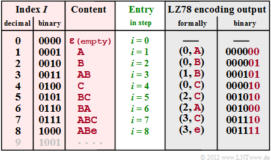

## Table of Contents

## What is the Lempel-Ziv (LZ) estimator?

The Lempel-Ziv (LZ) estimator is a way to measure how much information is in a sequence of data, like text or numbers. It does this by breaking the sequence into smaller parts called phrases. Each new phrase is the shortest part that hasn't been seen before. The more phrases it finds, the more complex the sequence is thought to be. This method is useful because it doesn't need to know anything about the data beforehand, making it good for all kinds of sequences.

The LZ estimator works by looking at the sequence from left to right. It keeps track of what it has seen so far and adds new phrases when it finds something new. For example, if the sequence is "abcabcabc," it would break it down like this: "a", "b", "c", "abc", "abc". Each time it finds a new phrase, it adds to the complexity count. This method is used in data compression and can help understand how predictable or random a sequence is.

## How does the Lempel-Ziv algorithm work?

The Lempel-Ziv algorithm is a way to compress data by finding patterns in it. Imagine you have a long string of letters or numbers. The algorithm goes through this string and looks for parts that repeat. When it finds a repeat, instead of writing out the whole thing again, it can just say "this part is the same as that part we saw before." This saves space because it's shorter to say "copy this" than to write it all out again.

For example, if you have the string "abcabcabc," the algorithm might first see "a," then "b," then "c." When it sees "abc" again, instead of writing "abc," it can say "copy the first three letters." This way, the string can be compressed into something like "a, b, c, copy 1-3, copy 1-3." The more patterns it finds, the more it can compress the data. This method is used in many compression programs because it works well with all kinds of data, not just text.

## What are the main applications of the LZ estimator?

The LZ estimator is mainly used to figure out how complex or random a set of data is. It does this by breaking the data into smaller parts and seeing how many new parts it finds. This can be helpful in fields like biology, where scientists might want to know how complex a DNA sequence is, or in computer science, where it can help understand how unpredictable a set of numbers is.

Another big use of the LZ estimator is in data compression. It helps make files smaller by finding patterns in the data and using those patterns to save space. This is useful for things like storing music, pictures, or any large files on a computer. By making files smaller, it saves space and makes it easier to send files over the internet.

## Can you explain the difference between LZ77 and LZ78 algorithms?

The LZ77 and LZ78 algorithms are both ways to make files smaller, but they do it a bit differently. LZ77 looks at the data and tries to find parts that have already been seen before. When it finds a repeat, it tells the computer to go back and copy that part instead of writing it out again. For example, if you have "abcabc," LZ77 might say "abc, go back 3 and copy 3." This means it's looking at the whole thing it's already seen to find repeats.

On the other hand, LZ78 builds a dictionary as it goes along. It looks at the data and adds new phrases to the dictionary whenever it sees something new. When it sees a repeat, it uses the dictionary to say "use this phrase from the dictionary." So, for "abcabc," it might build a dictionary with "a," "b," "c," "abc" and then say "use abc from the dictionary." This means LZ78 is always adding to its dictionary and using that to compress the data.

## How is the LZ estimator used in data compression?

The LZ estimator helps make files smaller by figuring out how complex the data is. It does this by breaking the data into smaller parts and seeing how many new parts it finds. The more new parts it finds, the more complex the data is. This helps in data compression because if the data is very complex, it might be hard to find patterns to make it smaller. But if the data is less complex, it's easier to find patterns and compress it.

In data compression, the LZ estimator helps by finding these patterns in the data. When it finds a pattern, it can tell the computer to use that pattern instead of writing out the whole thing again. This saves space because it's shorter to say "use this pattern" than to write out all the data again. This method is used in many programs that make files smaller, like when you zip a file on your computer. By understanding how complex the data is, the LZ estimator helps make sure the file gets as small as possible.

## What are the advantages of using the LZ estimator over other compression techniques?

The LZ estimator is good because it doesn't need to know anything about the data before it starts. This means it can work with any kind of data, like text, numbers, or pictures. Other methods might need to know something about the data first, which can make them harder to use. The LZ estimator looks at the data as it goes along, finding patterns and making the file smaller without needing any special information.

Another advantage is that the LZ estimator is good at figuring out how complex the data is. This helps it find the best way to compress the data. If the data is very complex, it might be hard to find patterns, but the LZ estimator can still do a good job. If the data is simpler, it can find lots of patterns and make the file even smaller. This makes the LZ estimator very useful for all kinds of data compression, helping to save space on computers and make files easier to send over the internet.

## What are the limitations or challenges faced when using the LZ estimator?

One challenge with the LZ estimator is that it can take a long time to work on very big files. It has to look at the whole file to find all the patterns, and this can be slow. If you have a huge file, like a big video or a lot of data, it might take a while for the LZ estimator to finish its job. This can be a problem if you need to compress the file quickly.

Another limitation is that the LZ estimator might not always make the file as small as it could be. Sometimes, other methods might find better ways to compress the data. The LZ estimator is good because it works with any kind of data, but it might not be the best for every single file. If you need the smallest file possible, you might have to try different methods to see which one works best.

## How does the LZ estimator perform in terms of time and space complexity?

The LZ estimator can take a long time to work on big files. It has to go through the whole file to find all the patterns, and this can be slow. If you have a huge file, like a big video or a lot of data, it might take a while for the LZ estimator to finish its job. This means that the time it takes can grow a lot as the file gets bigger. In simple terms, the time complexity of the LZ estimator can be high, especially for very large files.

In terms of space, the LZ estimator needs room to keep track of what it has seen so far. As it goes through the file, it builds up a list of all the new parts it finds. This list can get pretty big if the file is complex and has a lot of new parts. So, the space complexity of the LZ estimator can also be high, because it needs more and more space to keep track of everything as it goes along.

## Can you provide a simple example of how the LZ algorithm processes a string?

Let's say we have a simple string "ababcabc". The LZ algorithm will go through this string from left to right, looking for new parts and patterns. It starts with "a", which is new, so it adds "a" to its list. Then it sees "b", which is also new, so it adds "b" to the list. Next, it sees "a" again, but it's already in the list, so it keeps going. It then sees "b" again, which is also in the list, so it keeps going until it sees "c", which is new, so it adds "c" to the list. Now the list is "a", "b", "c".

The algorithm keeps going and sees "a" again, which is in the list, so it keeps going. It sees "b" again, which is in the list, so it keeps going until it sees "c" again, which is in the list. But then it sees "a" again, which is in the list, and "b" again, which is in the list, and "c" again, which is in the list. So, it adds "abc" to the list because "abc" is a new part that hasn't been seen before as a whole. Now the list is "a", "b", "c", "abc". The algorithm keeps going until it reaches the end of the string, and it has broken the string into these parts: "a", "b", "c", "abc", "abc".

## How can the LZ estimator be implemented in a programming language?

To implement the LZ estimator in a programming language, you start by writing a function that goes through a string from left to right. This function keeps track of what it has seen so far. Every time it finds a new part that hasn't been seen before, it adds that part to a list. For example, if the string is "ababcabc", the function would start with "a", then "b", then "c". When it sees "abc" for the first time, it adds "abc" to the list because it's a new part. The function keeps going until it reaches the end of the string, and the list at the end shows how the string was broken down.

In code, you might use a loop to go through the string. Inside the loop, you check if the current part of the string has been seen before. If it hasn't, you add it to your list. You can use a variable to keep track of where you are in the string and another variable to keep track of the list of new parts. At the end, the length of the list gives you an idea of how complex the string is. This way, you can use the LZ estimator to measure the complexity of any string by seeing how many new parts it finds.

## What are some advanced variants or improvements of the LZ algorithm?

There are some advanced versions of the LZ algorithm that try to make it even better. One of these is the LZMA (Lempel-Ziv-Markov chain-Algorithm), which is used in programs like 7-Zip. LZMA is good because it can make files even smaller than the basic LZ algorithm. It does this by using a special way to find patterns in the data and then using those patterns to compress the file. This makes LZMA very useful for big files like videos or software programs, where saving space is important.

Another improvement is the LZ77 with Huffman coding, which is used in the DEFLATE algorithm. This version combines the LZ77 algorithm with another way to make files smaller called Huffman coding. Huffman coding looks at how often different parts of the data show up and then uses shorter codes for the parts that show up a lot. By using LZ77 to find patterns and Huffman coding to make those patterns even smaller, this method can make files very small. It's used in things like ZIP files and is good for all kinds of data, not just text.

## How does the LZ estimator contribute to fields like bioinformatics or network traffic analysis?

In bioinformatics, the LZ estimator helps scientists understand how complex DNA sequences are. It does this by breaking the DNA sequence into smaller parts and counting how many new parts it finds. If a DNA sequence has a lot of new parts, it might be very complex and hard to predict. This can be useful for studying things like how genes work or how different species are related. By using the LZ estimator, scientists can get a better idea of the complexity of the DNA they are studying, which helps them in their research.

In network traffic analysis, the LZ estimator is used to figure out how predictable or random the data flowing through a network is. It looks at the data packets and breaks them into smaller parts, just like it does with DNA sequences. If the data is very complex and has a lot of new parts, it might be harder to compress and could mean there's a lot of different kinds of data being sent. This can help network administrators understand how their network is being used and if there are any unusual patterns that might need to be looked at more closely. By using the LZ estimator, they can get a better picture of the network traffic and make sure everything is working as it should.

## References & Further Reading

[1]: Lempel, A., & Ziv, J. (1977). ["A Universal Algorithm for Sequential Data Compression."](https://ieeexplore.ieee.org/document/1055714) IEEE Transactions on Information Theory, 23(3), 337–343.

[2]: ["Advances in Financial Machine Learning"](https://www.amazon.com/Advances-Financial-Machine-Learning-Marcos/dp/1119482089) by Marcos Lopez de Prado

[3]: ["Evidence-Based Technical Analysis: Applying the Scientific Method and Statistical Inference to Trading Signals"](https://www.amazon.com/Evidence-Based-Technical-Analysis-Scientific-Statistical/dp/0470008741) by David Aronson

[4]: ["Machine Learning for Algorithmic Trading"](https://github.com/PacktPublishing/Machine-Learning-for-Algorithmic-Trading-Second-Edition) by Stefan Jansen

[5]: ["Quantitative Trading: How to Build Your Own Algorithmic Trading Business"](https://books.google.com/books/about/Quantitative_Trading.html?id=j70yEAAAQBAJ) by Ernest P. Chan