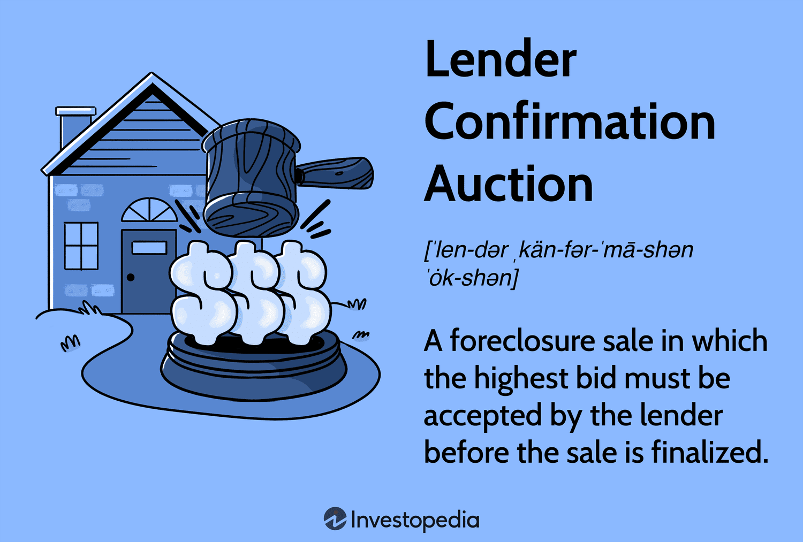

In the rapidly evolving financial landscape, the convergence of auctions, lender financing, and algorithmic trading is reshaping market dynamics and promoting a more robust financial ecosystem. Auctions have long been a crucial mechanism for price discovery and resource allocation in various markets, ranging from art to real estate and commodities. Lender financing, an essential aspect of these auctions, provides the necessary capital for participants to engage, thereby enhancing market liquidity and accessibility. This symbiotic relationship allows buyers to procure assets through optimal financial strategies facilitated by lenders.

Algorithmic trading, on the other hand, introduces a level of automation and precision that augments the efficiency of these financial interactions. By using complex algorithms to execute trades at high speeds, it helps in enhancing liquidity and price discovery while reducing transaction costs and the likelihood of human errors. As such, algorithmic trading has become a cornerstone of modern financial practices, intersecting with auctions and lender financing to form a comprehensive market environment.



This new confluence is reshaping how investors and traders operate, offering them tools to navigate the complexities of the current economic landscape more effectively. By understanding the interplay between these elements—confirmation auctions, lender financing, and algorithmic trading—market participants are better positioned to capitalize on opportunities and mitigate risks. These components are not only transforming traditional market operations but are also vital for staying competitive in a fast-paced financial world, where technology and capital efficiency are paramount.

## Table of Contents

## Understanding Confirmation Auction and Lender Auction

A confirmation auction is a type of foreclosure sale where the property's highest bid must receive the lender's approval before the transaction can be finalized. This mechanism ensures that the selling price aligns with the lender's requirements, providing an additional layer of security for the financial institution involved. The process involves a legal hearing where the lender evaluates the bid to determine its adequacy in covering the outstanding mortgage debt. If the bid is approved by the lender, the sale proceeds; otherwise, the property may return to auction.

Lender auctions differ from absolute auctions primarily due to the involvement of properties under foreclosure. In lender auctions, the bank or lending institution often becomes the sole owner of the property, usually after the borrower defaults on their mortgage payments. This contrasts with absolute auctions, where the highest bid automatically wins without any need for further approval from a lender. In lender auctions, properties are often sold "as-is," which means there are no negotiations on repairs or improvements, potentially making them riskier but often more affordable investment opportunities.

Among the various avenues available for purchasing distressed properties are short sales and real estate-owned (REO) sales. In a short sale, the property is sold for less than the amount owed on the mortgage, with the lender agreeing to accept this reduced amount. This can be advantageous for buyers seeking properties at a lower price point and for sellers looking to avoid foreclosure. However, short sales can be prolonged processes, as they require lender approval before proceeding.

Real Estate Owned (REO) properties, on the other hand, are properties that have been foreclosed upon and are now owned by the bank. Unlike in regular foreclosure auctions, where the property may still need to be sold to the highest bidder, banks will typically attempt to sell REO properties directly. The sale of REO properties often involves a more straightforward transaction process than foreclosure sales, as the bank likes to remove these assets from its [books](/wiki/algo-trading-books) as quickly as possible. Buyers may find more flexibility in negotiating repairs or price reductions compared to lender auction properties.

These differences between lender auctions, short sales, and REOs create diverse opportunities for investors and other buyers in distressed property markets. By understanding the distinct characteristics and benefits of each option, participants can make more informed decisions suited to their investment strategies and risk tolerances.

## The Role of Auction Finance

Auction finance plays a pivotal role in facilitating smoother transactions for participants in auction markets. This process involves organizing financial solutions tailored to the unique needs of buyers and sellers in such markets. One of the primary functions of auction finance is providing access to tailored financial products designed specifically to enhance flexibility and equity for auction participants. These products may encompass a range of financial instruments, including pre-approval loans, bridge financing, and customized mortgage solutions. 

Lenders, in this context, become crucial enablers by offering financial products that accommodate various transaction structures seen in auction environments. For instance, a common financial product in auction settings is the bridge loan. These loans provide short-term financing that helps buyers secure properties quickly, often before they have finalized long-term financing solutions. Bridge loans are especially effective when a buyer intends to purchase a property at an auction and needs swift access to funds. 

Furthermore, auction finance requires an understanding of complex financial mechanisms that differ from traditional property transactions. Auctions often involve time-sensitive transactions with accelerated timelines, necessitating fast and decisive financial backing. Buyers engaged in auctions benefit from establishing a financial strategy early on, which can lead to securing better deals. They must assess their financial standing, understand loan-to-value ratios, and calculate potential returns on investment. Such foresight allows participants to bid confidently, backed up by a robust financial plan.

Moreover, buyers can optimize their strategies by leveraging predictive financial analytics. For example, Python libraries such as NumPy and pandas can be used to analyze historical auction data, enabling bidders to make informed decisions based on trends and patterns. Here is a basic example of how Python can be used to analyze auction price data:

```python
import pandas as pd

# Example auction data
data = {
    'Auction_ID': [1, 2, 3, 4, 5],
    'Initial_Price': [100000, 150000, 200000, 250000, 300000],
    'Final_Bid': [120000, 160000, 210000, 280000, 310000]
}

df = pd.DataFrame(data)

# Calculate the bid increase percentage
df['Bid_Increment_Percentage'] = ((df['Final_Bid'] - df['Initial_Price']) / df['Initial_Price']) * 100

# Display data with the percentage
print(df)
```

This simple code correlates initial auction prices to final bids, offering insight into how much buyers are typically willing to increase from starting bids, which can be crucial information when planning auction financing strategies.

In summation, a thorough grasp of auction finance, including the variety of financial products available and strategic applications of market data, equips participants with the tools needed to navigate auction markets effectively. By crafting insightful financial strategies, buyers and sellers can maximize value and achieve better results in these competitive settings.

## Algorithmic Trading in Auction Markets

Algorithmic trading has become a pivotal force in auction markets, fundamentally reshaping how trades are executed by automating and streamlining processes. This automation is chiefly characterized by the use of sophisticated algorithms that process vast amounts of real-time market data, thereby enhancing the speed and precision of trade executions. The implementation of [algorithmic trading](/wiki/algorithmic-trading) involves the systematic processing of orders using pre-defined instructions, often encompassing variables such as timing, price, and [volume](/wiki/volume-trading-strategy).

One of the core benefits of algorithmic trading in auction markets is the significant improvement in trade execution speed. This is achieved through the reduction of the latency that typically occurs in manual trading operations. Algorithms can react to market conditions in microseconds, far quicker than a human trader. For instance, when a buy order matches a sell order at an optimal price, the algorithm executes the transaction instantaneously, enhancing the potential for profit or efficient cost management.

Furthermore, algorithms are designed to analyze and interpret real-time data with high accuracy, minimizing manual errors that can lead to costly trading mistakes. They achieve this by continuously monitoring market conditions and making decisions based on the programmed criteria. For example, advanced algorithms can track minute-by-minute changes in supply and demand, adjusting bids accordingly to capitalize on favorable conditions or mitigate risks.

Algorithmic trading has not only improved efficiency but also transformed traditional auction concepts. In traditional auctions, transactions are often limited by the speed of processing orders and human decision-making capacity. By contrast, algorithmic trading allows for the dynamic adjustment of strategies as market conditions fluctuate. This adaptability is crucial in volatile markets where prices can shift dramatically within seconds.

An illustrative example of algorithmic trading can be found in execution algorithms, such as the Volume Weighted Average Price (VWAP) algorithm, which aims to execute orders close to the average price of the security throughout the day. The VWAP algorithm can be represented mathematically as:

$$
VWAP = \frac{\sum (Price_i \times Volume_i)}{\sum Volume_i}
$$

where $Price_i$ is the price of the trade and $Volume_i$ is the volume of the trade. This formula ensures that the trades are spread out evenly over the trading period, thus achieving a uniform execution that matches liquidity.

The burgeoning role of [machine learning](/wiki/machine-learning) and [artificial intelligence](/wiki/ai-artificial-intelligence) within algorithmic trading continues to advance its capabilities. Machine learning models are increasingly being used to predict market trends and patterns, thereby enabling algorithms to pre-emptively adjust strategies in response to anticipated market movements.

In summary, the integration of algorithmic trading in auction markets elevates trading efficiency, accuracy, and adaptability, hence reshaping the modern trading landscape and offering substantial advantages over traditional manual methods. As technology evolves, the scope and effectiveness of algorithmic trading in auction markets are expected to continue expanding, bringing further innovation and refinement to the trading processes.

## Advantages and Challenges of Using Automated Trading Systems

Automated trading systems, widely used in auction markets, offer a range of advantages that improve the trading process significantly. These systems provide high precision and efficiency, enabling traders to concentrate on strategic planning rather than being bogged down by the details of trade execution. By leveraging algorithms, these systems can execute trades at optimal prices and speeds, minimizing human error and potentially increasing profitability. This precision extends to the ability to backtest trading strategies against historical data, offering insights into potential market behaviors and outcomes.

Despite these advantages, challenges accompany the integration of automated trading systems. Managing risk effectively remains a pivotal concern. Algorithms can only operate within the parameters set by their developers, and unforeseen market conditions can lead to substantial financial losses if risk mitigation strategies are not robustly implemented. Moreover, the speed and volume of trades executed by automated systems can contribute to market [volatility](/wiki/volatility-trading-strategies), especially if large-scale sell-offs are initiated by algorithmic strategies responding to market cues.

Adapting to regulatory changes presents another significant challenge. With financial markets being heavily regulated, trading systems must be designed with compliance in mind, necessitating continuous updates to adhere to new legislation. Failure to comply with regulatory standards can result in severe penalties and operational disruptions. Additionally, ensuring system reliability is crucial; technical failures can lead to missed trading opportunities or erroneous trades, with potentially dire financial consequences.

To effectively navigate these complexities, traders must adopt adaptive strategies and robust risk management frameworks. One approach is to continually update algorithms to incorporate evolving market data and predictive analytics, powered by advancements in machine learning. Such an approach requires a careful balance of strategy refinement and execution risk assessment, ensuring alignments with both market conditions and regulatory requirements.

Implementing a dynamic risk management strategy is essential. Traders may use stop-loss orders and other protective measures to limit potential losses in the event of market fluctuations. In terms of technical infrastructure, maintaining redundancy in system architecture and rigorous testing protocols can help mitigate risks associated with system failures.

In conclusion, while automated trading systems enhance the efficiency and precision of auction market activities, navigating their challenges requires strategic foresight and meticulous attention to risk and regulatory compliance. By combining these elements, traders can harness the full potential of technological advancements to optimize trading outcomes.

## Case Study: Application of Algorithmic Trading in Energy Market Auctions

The integration of algorithmic trading within energy market auctions fundamentally enhances operational efficiencies by automating intricate trading processes. Energy markets, particularly in Europe, have embraced algorithmic systems to streamline workflow from bid preparation to market result consolidation. A prominent example is eZ-Ops, a platform that automates various auction stages, significantly improving both speed and accuracy.

These algorithmic trading platforms are designed to handle large volumes of data and transactions, reducing the potential for human error and ensuring a more consistent trading environment. They utilize advanced algorithms to analyze and interpret market data in real-time, allowing for swift adjustments to trading strategies based on incoming information. This capability is crucial in energy auctions where market conditions can fluctuate rapidly due to factors such as weather changes, regulatory updates, and shifts in demand and supply.

Moreover, customization is a key feature of these platforms, enabling them to cater to the specific requirements of different market participants. Traders can adapt algorithms to reflect their unique strategies while ensuring compliance with the prevailing regulatory standards governing the energy sector. This adaptability is crucial given the complex regulatory landscape across various European countries. Ensuring compliance while maintaining competitive trading strategies enables market participants to effectively navigate these markets.

For instance, eZ-Ops allows for customization in bid pricing models and risk management protocols, aligning with specific regulatory frameworks such as the European Union’s guidelines on energy trading. By integrating these elements, algorithmic trading platforms ensure that energy market participants not only achieve operational efficiency but also maintain adherence to regulations, thereby fostering a transparent and fair trading environment.

In conclusion, the implementation of algorithmic trading in energy market auctions has revolutionized the way participants engage with the market. By automating processes and offering tailored solutions, these systems contribute to more efficient, accurate, and compliant trading activities, which are essential in today’s dynamic energy markets.

## Future Prospects of Algorithmic Trading in Auction Finance

Machine learning (ML) and artificial intelligence (AI) are poised to significantly advance algorithmic trading within auction finance, primarily by enhancing predictive analytics capabilities. These technologies can analyze vast datasets to uncover patterns and insights, empowering traders with a deeper understanding of market behavior.

One of the critical advancements foreseen in this area is the improvement in data processing speed and accuracy. This is particularly pertinent in auction-based markets where trading opportunities can emerge and dissipate in seconds. Algorithms powered by ML can rapidly process real-time market data, facilitating prompt decision-making that optimizes trade execution.

To illustrate, consider a simple Python example utilizing a machine learning model for predicting auction prices:

```python
from sklearn.model_selection import train_test_split
from sklearn.ensemble import RandomForestRegressor
import numpy as np

# Example data: Auction prices and market indicators
X = np.array([[5, 40], [6, 35], [7, 70], [8, 80]])
y = np.array([181, 191, 185, 200])

# Splitting data into training and testing sets
X_train, X_test, y_train, y_test = train_test_split(X, y, test_size=0.25)

# Training the Machine Learning Model
model = RandomForestRegressor(n_estimators=100)
model.fit(X_train, y_train)

# Making predictions
predictions = model.predict(X_test)
print(predictions)
```

Incorporating ML models like RandomForest can assist in predicting auction outcomes by learning from historical data points and market indicators. Such predictive analytics can be pivotal in developing adaptive trading strategies.

Anticipated future innovations in algorithmic trading include enhanced decision-making processes driven by advancements in AI. These systems aim to simulate human-like reasoning, providing traders with sophisticated decision-support tools that enable agile strategy adaptation in response to market fluctuations.

Additionally, traders must remain vigilant regarding technological and regulatory shifts to maintain competitiveness. Regulatory environments, especially those governing financial markets, are continually evolving. Ensuring compliance with these regulations while harnessing the power of AI and ML will be essential. This involves understanding the impact of regulations on algorithm design and operation, thus safeguarding against market abuse or unintended policy violations.

Moreover, continuous monitoring and updating of algorithms will be crucial as market conditions change, ensuring these systems remain robust and effective. The dynamic interplay between technological progression and regulatory frameworks will shape the future operational landscape for algorithmic trading in auction finance. Maintaining this balance will be key for traders seeking to leverage technological advancements to optimize their trading outcomes.

## Conclusion

The integration of auctions, lender finance, and algorithmic trading signifies a transformative advancement in the financial markets. This confluence enhances market efficiency and expands opportunities for traders and investors to optimize their strategies and returns. By assimilating these modern elements, market participants are positioned to harness cutting-edge technology and data-driven insights, allowing for more informed decision-making.

As technologies continuously evolve, traders and investors must actively adapt to leverage these innovations. Embracing algorithmic trading, for instance, enables the automation of trading strategies, thereby improving execution speed and precision. Algorithmic systems can exploit market inefficiencies through sophisticated computations and execute trades based on predefined criteria, thus offering a competitive edge.

Lender financing within auction markets adds another layer of flexibility and opportunity. By understanding the financial mechanisms at play, participants can secure more advantageous positions, using tailored financial products designed for dynamic market environments. This adaptability is crucial, as it ensures that market participants can respond swiftly to changing market conditions, optimizing their capital allocation through strategic auctions and financing solutions.

The continued integration of machine learning and artificial intelligence into these areas will further enhance predictive analytics capabilities, improving data processing accuracy and speed. This evolution will provide sophisticated tools that facilitate strategic adjustments, ensuring that market participants remain competitive. Future prospects suggest that those who stay informed about technological and regulatory shifts will be best positioned to thrive in auction-based markets.

Ultimately, by comprehending and embracing these elements, traders and investors can strategically navigate a rapidly modernizing financial landscape, ensuring they remain not only participants but leaders in an increasingly complex marketplace.

## References & Further Reading

Bergstra, J., et al. 'Algorithms for Hyper-Parameter Optimization'. This work is instrumental for those involved in developing algorithmic trading strategies. Hyper-parameter optimization is vital for improving machine learning models, which are often employed to forecast market trends and automate trading decisions. The algorithms discussed facilitate the identification of optimal parameter settings, enhancing model performance in financial applications.

Lopez de Prado, M. 'Advances in Financial Machine Learning'. Lopez de Prado's contribution is crucial for practitioners aiming to implement advanced machine learning techniques in trading. This book introduces methodologies such as fractional differencing, which addresses the challenge of non-stationarity in time series data, commonly encountered in financial markets. The application of these techniques can significantly improve the predictive power of trading models.

Aronson, D. 'Evidence-Based Technical Analysis'. Aronson's book challenges traditional technical analysis by advocating for a rigorous, scientifically-driven approach to analyze markets. Emphasizing empirical validation, it provides traders with a framework to test strategies quantitatively, ensuring they are statistically sound before being implemented.

Jansen, S. 'Machine Learning for Algorithmic Trading'. Jansen offers a comprehensive guide on utilizing machine learning to build and optimize trading strategies. Covering data processing, feature engineering, and model evaluation, this resource aids traders in harnessing machine learning to adapt swiftly to market conditions and gain competitive advantages.

Chan, E. P. 'Quantitative Trading: How to Build Your Own Algorithmic Trading Business'. Chan delivers practical insights into establishing a [quantitative trading](/wiki/quantitative-trading) business, from strategy formulation to execution and risk management. By leveraging quantitative analysis and algorithmic techniques, traders can systematically evaluate strategies, ensuring robustness and profitability in volatile markets.

