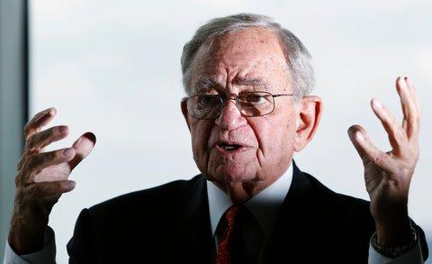

## Table of Contents

## Who is Leo Melamed?

Leo Melamed is a famous person in the world of finance. He was born in Poland in 1932 and moved to the United States when he was young. He became very important in the Chicago Mercantile Exchange, which is a big place where people buy and sell things like money and goods.

Leo helped start something called financial futures. These are agreements to buy or sell something at a future date. This was a big change and helped many people and businesses plan better for the future. Because of his work, he is often called the "Father of Financial Futures."

## What is Leo Melamed's background and early life?

Leo Melamed was born on March 26, 1932, in Poland. His family faced a lot of trouble because of World War II. They had to leave Poland and move to the United States when Leo was just a young boy. They settled in Chicago, where Leo grew up. Life was hard for them at first, but they worked hard to make a new home.

In Chicago, Leo went to school and did well. He studied law at the University of Illinois and became a lawyer. But he was also interested in the world of trading and finance. He started working at the Chicago Mercantile Exchange, which was a place where people traded things like meat and butter. This was the beginning of his long and successful career in finance.

## How did Leo Melamed start his career in finance?

Leo Melamed started his career in finance after he finished law school at the University of Illinois. Instead of working as a lawyer, he got a job at the Chicago Mercantile Exchange. At that time, the Exchange was mostly about trading things like meat and butter. Leo saw that there was more they could do, and he wanted to be part of that.

In the early years, Leo worked hard to learn everything about the Exchange. He became a member and started trading himself. He was good at it and soon became a leader there. This was the start of his journey to becoming a big name in the world of finance.

## What is Leo Melamed's most significant contribution to the financial industry?

Leo Melamed's most significant contribution to the financial industry was the creation of financial futures. Before Leo, the Chicago Mercantile Exchange mainly traded things like meat and butter. Leo saw that there was a need for a way to buy and sell money and other financial things at a future date. So, he helped start trading in financial futures. These are agreements to buy or sell something like money or interest rates at a set price on a future date. This was a big change and helped many people and businesses plan better for the future.

Because of his work on financial futures, Leo Melamed is often called the "Father of Financial Futures." His idea made the Chicago Mercantile Exchange much bigger and more important. It also changed how the whole world of finance works. Now, financial futures are a big part of how people and businesses manage risk and plan for the future. Leo's contribution has had a lasting impact on the financial industry.

## What is the Chicago Mercantile Exchange (CME) and how was Leo Melamed involved?

The Chicago Mercantile Exchange, or CME, is a big place where people buy and sell things like money, interest rates, and other financial stuff. It started a long time ago, trading things like meat and butter. But it grew to become very important in the world of finance. People from all over the world use the CME to make deals and plan for the future.

Leo Melamed was very important at the CME. He started working there after he finished law school and became a leader. Leo had a big idea to start trading something called financial futures. These are agreements to buy or sell money or interest rates at a future date. His idea changed the CME a lot and made it much bigger. Because of Leo, the CME became a key place for financial futures, and he is often called the "Father of Financial Futures."

## What is the significance of the International Monetary Market (IMM) and Leo Melamed's role in its creation?

The International Monetary Market (IMM) is a big part of the Chicago Mercantile Exchange where people trade things like money from different countries. It was started in 1972 and was a big change because it let people buy and sell money at a future date. This helped people and businesses plan better for the future by knowing what money would be worth later on. The IMM made the Chicago Mercantile Exchange much more important in the world of finance.

Leo Melamed was the person who came up with the idea for the IMM. He saw that there was a need for a place where people could trade money from different countries in the future. So, he worked hard to make the IMM happen. Because of his work, the IMM became a success and changed how people trade money. Leo's role in creating the IMM is one of the reasons he is called the "Father of Financial Futures."

## How did Leo Melamed influence the development of financial futures?

Leo Melamed had a big impact on the development of financial futures. He saw that the Chicago Mercantile Exchange, where he worked, could do more than just trade things like meat and butter. Leo thought that people needed a way to buy and sell money and other financial things at a future date. So, he helped start trading in financial futures. These are agreements to buy or sell something like money or interest rates at a set price on a future date. This was a new idea and it helped many people and businesses plan better for the future.

Leo's biggest project was creating the International Monetary Market (IMM) in 1972. This was a place where people could trade money from different countries in the future. The IMM was a big success and it made the Chicago Mercantile Exchange much more important. Because of Leo's work, financial futures became a big part of how the world of finance works. People all over the world use financial futures to manage risk and plan for the future. Leo's contributions have had a lasting impact on the financial industry.

## What innovations did Leo Melamed introduce to the trading industry?

Leo Melamed introduced some big changes to the trading industry. He saw that the Chicago Mercantile Exchange, where he worked, could do more than just trade things like meat and butter. Leo thought that people needed a way to buy and sell money and other financial things at a future date. So, he helped start trading in financial futures. These are agreements to buy or sell something like money or interest rates at a set price on a future date. This was a new idea and it helped many people and businesses plan better for the future.

One of Leo's biggest projects was creating the International Monetary Market (IMM) in 1972. This was a place where people could trade money from different countries in the future. The IMM was a big success and it made the Chicago Mercantile Exchange much more important. Because of Leo's work, financial futures became a big part of how the world of finance works. People all over the world use financial futures to manage risk and plan for the future. Leo's contributions have had a lasting impact on the financial industry.

Leo also helped make trading more modern by supporting electronic trading. Before, trading was done by people shouting and making deals in person. Leo saw that computers could make trading faster and easier. He helped the Chicago Mercantile Exchange start using computers for trading. This change made trading more efficient and opened up the market to more people around the world. Leo's push for electronic trading helped shape the future of the industry.

## What challenges did Leo Melamed face during his career and how did he overcome them?

Leo Melamed faced many challenges during his career. One big challenge was getting people to believe in his new idea of financial futures. At the time, the Chicago Mercantile Exchange was used to trading things like meat and butter. Many people thought Leo's idea was too risky and different. They were scared to try something new. But Leo didn't give up. He worked hard to explain his idea and show how it could help people and businesses. He talked to a lot of people and got them to see the benefits of financial futures.

Another challenge was starting the International Monetary Market (IMM). Leo had to convince the leaders at the Chicago Mercantile Exchange to support his plan. It was hard because it was a big change and it cost a lot of money. But Leo was determined. He spent a lot of time planning and talking to people. He showed them how the IMM could make the Exchange more important and successful. In the end, his hard work paid off. The IMM became a big success and helped the Chicago Mercantile Exchange grow a lot.

Leo also faced challenges when he wanted to bring electronic trading to the Exchange. Many traders liked the old way of shouting and making deals in person. They didn't want to change. But Leo saw that computers could make trading faster and easier. He worked hard to show how electronic trading could help everyone. He explained how it could open up the market to more people around the world. Slowly, people started to see the benefits. Electronic trading became a big part of the Exchange, and it helped shape the future of the industry.

## How has Leo Melamed's work impacted global financial markets?

Leo Melamed's work has changed the way global financial markets work a lot. He helped start trading in financial futures. These are agreements to buy or sell things like money or interest rates at a set price on a future date. This was a new idea and it helped people and businesses plan better for the future. They could now manage risk better by knowing what money would be worth later on. Because of Leo, financial futures became a big part of how the world of finance works. People all over the world use financial futures to make deals and plan for the future.

Leo also helped create the International Monetary Market (IMM). This was a place where people could trade money from different countries in the future. The IMM was a big success and it made the Chicago Mercantile Exchange much more important. It also helped the global financial markets grow because now people could trade money from different countries easily. Leo's work with the IMM changed how money is traded around the world. His ideas have had a lasting impact on global financial markets and helped make them more connected and efficient.

## What awards and recognitions has Leo Melamed received for his contributions to finance?

Leo Melamed has received many awards and recognitions for his work in finance. He was named one of the "100 Most Influential People in Finance" by the magazine Institutional Investor. This shows how important his work was in changing the world of finance. Leo also got the Horatio Alger Award, which is given to people who have overcome challenges and achieved great success. This award shows how hard Leo worked to make his ideas come true.

Another big honor Leo received was being inducted into the Futures Industry Association Hall of Fame. This is a special group of people who have done a lot for the futures industry. Leo's work with financial futures and the International Monetary Market made him a big name in this group. He also got the CME Group's Chairman's Award, which is given to people who have made the Chicago Mercantile Exchange better. All these awards show how much Leo's ideas have helped the world of finance.

## What is Leo Melamed's current involvement in the financial industry and his future outlook?

Leo Melamed is still very active in the financial world, even though he is older now. He helps guide the Chicago Mercantile Exchange by being on their board of directors. He also writes [books](/wiki/algo-trading-books) and articles to share his ideas and experiences. Leo speaks at events and conferences to help people understand how the finance world works and where it might go next. He wants to keep helping the industry grow and improve.

Leo thinks the future of finance will keep changing with new technology. He believes that electronic trading, which he helped start, will become even more important. He also thinks that more countries will join the global financial markets, making them bigger and more connected. Leo wants to see more people around the world using financial futures to plan and manage risk. He hopes his work will keep helping people and businesses for a long time.

## References & Further Reading

[1] Melamed, L. (2009). "For Crying Out Loud: From Open Outcry to the Electronic Screen." Wiley. [Link](https://www.amazon.com/Crying-Out-Loud-Outcry-Electronic/dp/0470229438)

[2] Melamed, L. (1996). "Leo Melamed on The Markets: Twenty Years of Financial History As Seen by a Market Maker." Wiley. [Link](https://jlb.onlinelibrary.wiley.com/doi/am-pdf/10.1002/JLB.MR0718-267R)

[3] Melamed, L., & Tamarkin, B. (2009). "Escape to the Futures." Wiley. [Link](https://books.google.com/books/about/Leo_Melamed.html?id=R3eMEZxHLBEC)

[4] Scouras, S. (2006). ["Leo Melamed: A Trading Visionary."](https://www.leomelamed.com/articles/crains.htm) Modern Currency Trader. 

[5] CME Group. (n.d.). ["History of CME."](https://www.cmegroup.com/company/history/timeline-of-achievements.html)

[6] Aldridge, I. (2010). "High-Frequency Trading: A Practical Guide to Algorithmic Strategies and Trading Systems." Wiley. [Link](https://onlinelibrary.wiley.com/doi/book/10.1002/9781119203803)

[7] Lewis, M. (2015). "Flash Boys: A Wall Street Revolt." W.W. Norton & Company. [Link](https://en.wikipedia.org/wiki/Flash_Boys)

[8] Pirrong, C. (1996). "The Economics, Law, and Public Policy of Market Microstructure." Quorum Books.

[9] Kane, E.J. (1988). "How Market Forces Influence the Structure of Financial Regulation." In "Regulation and the Economic Aspects of the Markets," Federal Reserve Bank of Atlanta.

[10] Chance, D. M., & Brooks, R. (2013). "An Introduction to Derivatives and Risk Management." Cengage Learning. 