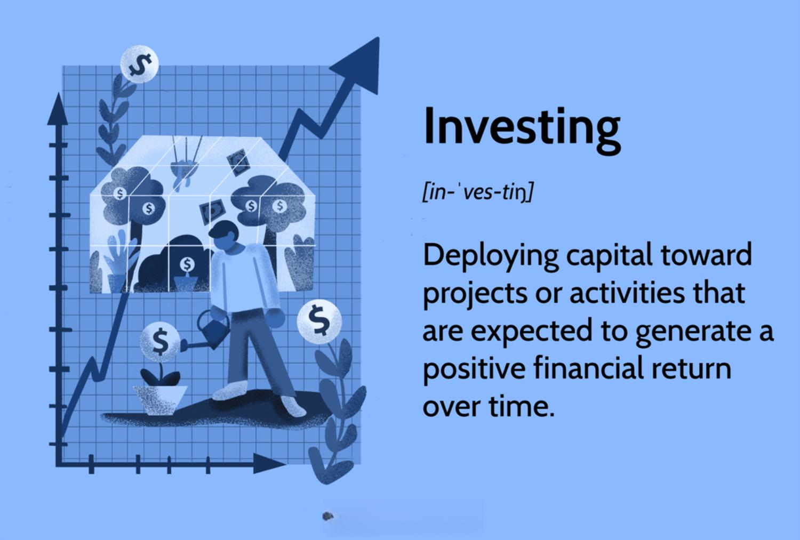

Leo Melamed is a distinguished figure in the financial markets, renowned for his groundbreaking work in the establishment and proliferation of financial futures. Born in Bialystok, Poland, in 1932, Melamed immigrated to the United States, where his career trajectory led him to become a pivotal force within the Chicago Mercantile Exchange (CME). As the Chairman Emeritus of CME Group, he has played a critical role in transforming the global financial trading environment through the introduction of innovative practices and technologies.

Melamed's foresight and leadership have been instrumental in the evolution of the CME Group from a regional player to a global powerhouse in financial trading platforms. His influence is particularly noted in the development of the International Monetary Market (IMM) in 1972, a pioneering move that marked the birth of financial futures trading. This innovation provided a framework for new trading strategies in financial markets, facilitating a paradigm shift in how assets were traded and priced.



In addition to the introduction of financial futures, Melamed spearheaded the adoption of electronic trading technologies at CME. This was exemplified by the launch of the Globex platform in 1992, which revolutionized market accessibility and efficiency by allowing traders worldwide to execute trades electronically. This shift not only enhanced market liquidity but also laid the foundation for subsequent advancements in algorithmic trading.

This article will explore the legacy of Leo Melamed by examining his transformative impact on CME Group and the broader financial trading landscape. It will consider how his pioneering vision and innovations have shaped contemporary financial markets, particularly emphasizing his contributions to the development of algorithmic trading systems that dominate today's global trading arenas.

## Table of Contents

## Leo Melamed: A Visionary in Financial Futures

Leo Melamed's journey is a remarkable account of vision and innovation in financial markets. Born in Bialystok, Poland, in 1932, Melamed and his family escaped the Holocaust by fleeing to the United States. This early experience of upheaval likely influenced his later endeavors in transforming financial systems.

After establishing himself in the United States, Melamed pursued a career in law, obtaining his JD from the University of Chicago. His entry into the world of trading was marked by his association with the Chicago Mercantile Exchange (CME) in the 1960s. As both a lawyer and trader, Melamed quickly recognized the potential for change within the CME, which was then primarily focused on agricultural futures.

Melamed's visionary thinking led to the conceptualization of the International Monetary Market (IMM) in 1972. This initiative represented a pioneering move towards financial futures, introducing currency futures trading. The creation of the IMM marked a significant shift from traditional commodity futures to financial instruments. It provided investors with tools for hedging against currency risk, thus facilitating greater participation in global markets.

The establishment of the IMM was not just a turning point for the CME but also for the entire financial industry. It symbolized a new era where financial transactions were increasingly driven by market-based mechanisms rather than governmental decisions. The introduction of financial futures allowed for more sophisticated risk management strategies, fostering a more efficient allocation of resources globally.

Melamed's contributions during this period laid the groundwork for further innovations within and beyond the CME. His foresight in promoting financial futures expanded the scope and scale of trading activities, opening doors to new possibilities and setting a precedent for future developments in finance. His efforts culminated in a profound transformation, influencing the structure and operation of modern financial markets.

## The Role of CME Group in Financial Markets

Under the leadership of Leo Melamed, the CME Group transformed into a pivotal entity within global financial markets. This evolution was marked by the introduction of novel financial instruments and innovative uses of technology, fundamentally altering market dynamics.

The CME Group's introduction of foreign currency futures in 1972 was a groundbreaking development. This innovation not only provided a mechanism for hedging currency risk but also established a framework for subsequent financial derivatives. Currency futures allowed traders to lock in exchange rates for future transactions, mitigating risks associated with currency [volatility](/wiki/volatility-trading-strategies). This development laid the groundwork for the creation and growth of a diverse range of financial instruments, including [interest rate](/wiki/interest-rate-trading-strategies) futures, equity index futures, and commodity contracts. The availability of such products diversified traders' options for managing financial risk and capitalizing on investment opportunities.

A significant milestone in CME Group's evolution was the launch of the Globex electronic trading platform in 1992. This platform was pioneering in its employment of technology to enhance market accessibility and operational efficiency. Globex enabled market participants to execute trades virtually around the clock, eliminating the constraints imposed by conventional trading hours. This innovation also facilitated real-time access to market data, leveling the playing field for traders regardless of their geographical location.

The introduction of Globex marked a paradigm shift towards electronic trading, setting a standard that profoundly influenced other trading platforms. By enabling automated and electronic trading processes, CME Group not only improved the speed and accuracy of transactions but also enabled the development of complex trading algorithms. The platform's robust infrastructure supported higher trading volumes and [liquidity](/wiki/liquidity-risk-premium), further solidifying CME's position in the global marketplace.

In summary, under Leo Melamed's guidance, CME Group's innovative approach to financial instruments and electronic trading drastically reshaped financial markets. The company's advancements in creating diverse derivative products and utilizing cutting-edge technology significantly contributed to increased market efficiency and accessibility.

## Algorithmic Trading and Its Impact

Algorithmic trading has emerged as a pivotal component of modern financial markets, fundamentally altering the way trades are executed. This trading method involves using automated programs to execute trades based on pre-defined strategies, capitalizing on high-speed data analysis and decision-making processes. The profound influence of [algorithmic trading](/wiki/algorithmic-trading) is evident in its ability to increase market efficiency, enhance liquidity, and reduce transaction costs.

CME Group has played a crucial role in providing the technological infrastructure that supports algorithmic trading. The introduction of the Globex electronic trading platform in 1992 marked a significant milestone in this evolution. Globex was one of the first platforms to offer round-the-clock electronic trading, bringing unprecedented speed and accessibility to the financial markets. This technological advancement set the stage for algorithmic trading by enabling high-frequency traders to operate seamlessly in a digital environment.

Leo Melamed's foresight in championing electronic trading platforms like Globex was instrumental in setting the groundwork for today's algorithmic trading systems. His vision for a more efficient and accessible trading system was a driving force behind the shift from traditional open outcry systems to electronic platforms. This transition allowed for the integration of algorithms that could process large volumes of data at speeds unattainable by human traders, thus optimizing trade execution and strategy implementation.

A typical algorithmic trading strategy might involve the use of statistical models to identify trading opportunities. For instance, a simple moving average crossover strategy can be implemented in Python:

```python
def moving_average(prices, window_size):
    return sum(prices[-window_size:]) / window_size

def trading_signal(prices, short_window, long_window):
    short_mavg = moving_average(prices, short_window)
    long_mavg = moving_average(prices, long_window)
    if short_mavg > long_mavg:
        return 'Buy'
    elif short_mavg < long_mavg:
        return 'Sell'
    else:
        return 'Hold'
```

This code snippet exemplifies how an algorithm can automate decision-making based on predefined criteria, thereby enabling rapid trade execution in response to market changes.

The impact of algorithmic trading extends beyond just speed and efficiency. It has contributed to the democratization of financial markets by allowing a broader range of participants, from institutional investors to individual traders, to operate on a more level playing field. However, algorithmic trading also presents challenges, such as increased market volatility and the risk of algorithmic flaws leading to significant financial losses.

In summary, algorithmic trading has reshaped the landscape of financial markets, with CME Group's technological advancements providing the necessary tools and infrastructure. Leo Melamed's vision for electronic trading has been realized in the widespread adoption of algorithmic systems, highlighting his pivotal role in the evolution of modern trading practices.

## Leo Melamed's Legacy and Influence

Leo Melamed's impact on the financial industry extends well beyond his seminal work at the CME Group. As the founding chairman of the National Futures Association (NFA), Melamed played a pivotal role in establishing regulatory frameworks that have shaped modern futures trading. The NFA, which operates as a self-regulatory organization, ensures that the futures markets operate with transparency and integrity, protecting investors from fraud and abusive trading practices. Melamed's foundational work with the NFA illustrates his commitment to ensuring a robust regulatory environment, which is crucial for maintaining investor confidence and market stability.

Continuing his influence in the financial world, Melamed has been active through various consultancy roles and advisory positions. His expertise is sought by global institutions, highlighting his deep understanding of market dynamics and regulatory challenges. His strategic insights have been instrumental in navigating the ever-evolving landscape of financial markets.

Moreover, Melamed's thought leadership is evident in his numerous published works. These publications not only document his contributions but also serve as a vital resource for understanding financial innovation and regulation. His writings discuss the complexities of financial markets and the vital role of innovation in fostering growth and efficiency, reflecting his forward-thinking approach and profound knowledge.

Through his regulatory work, consultancy, and publications, Melamed has left an indelible mark on the financial industry. His legacy endures as market participants and scholars continue to draw on his insights to navigate and contribute to the evolving landscape of global finance.

## Conclusion

Leo Melamed’s career is a testament to the power of innovation in the financial markets. His pioneering spirit and visionary leadership have profoundly impacted the development and evolution of these markets. Beginning with the inception of financial futures in 1972, Melamed laid the groundwork for a transformation in how markets operate, bringing increased dynamism, liquidity, and risk management capabilities to financial trading. His role in establishing the International Monetary Market was a cornerstone achievement, forever changing the landscape of financial instruments and trading practices.

Further cementing his legacy, Melamed’s foresight in embracing technology helped propel the Chicago Mercantile Exchange (CME) into uncharted territories. The introduction of electronic trading platforms like Globex in 1992 was a significant leap forward, enabling greater accessibility and efficiency in market operations. This advancement set the stage for the rise of algorithmic trading, which leverages computational power and automation to execute trades with precision and speed. The infrastructure and technological innovations championed under his leadership have made CME Group a central hub for global financial trading.

As we continue to witness rapid changes in market dynamics characterized by increased automation and digital transformation, Melamed’s contributions serve as a guiding beacon for future innovations. His work exemplifies how vision and adaptability can lead to substantial progress in complex economic systems. Leo Melamed's legacy not only shapes CME Group but also provides a blueprint for navigating the future of financial markets.

## References & Further Reading

[1] Melamed, L. (2009). "For Crying Out Loud: From Open Outcry to the Electronic Screen." Wiley. [Link](https://www.amazon.com/Crying-Out-Loud-Outcry-Electronic/dp/0470229438)

[2] Melamed, L. (1996). "Leo Melamed on The Markets: Twenty Years of Financial History As Seen by a Market Maker." Wiley. [Link](https://jlb.onlinelibrary.wiley.com/doi/am-pdf/10.1002/JLB.MR0718-267R)

[3] Melamed, L., & Tamarkin, B. (2009). "Escape to the Futures." Wiley. [Link](https://books.google.com/books/about/Leo_Melamed.html?id=R3eMEZxHLBEC)

[4] Scouras, S. (2006). ["Leo Melamed: A Trading Visionary."](https://www.leomelamed.com/articles/crains.htm) Modern Currency Trader. 

[5] CME Group. (n.d.). ["History of CME."](https://www.cmegroup.com/company/history/timeline-of-achievements.html)

[6] Aldridge, I. (2010). "High-Frequency Trading: A Practical Guide to Algorithmic Strategies and Trading Systems." Wiley. [Link](https://onlinelibrary.wiley.com/doi/book/10.1002/9781119203803)

[7] Lewis, M. (2015). "Flash Boys: A Wall Street Revolt." W.W. Norton & Company. [Link](https://en.wikipedia.org/wiki/Flash_Boys)

[8] Pirrong, C. (1996). "The Economics, Law, and Public Policy of Market Microstructure." Quorum Books.

[9] Kane, E.J. (1988). "How Market Forces Influence the Structure of Financial Regulation." In "Regulation and the Economic Aspects of the Markets," Federal Reserve Bank of Atlanta.

[10] Chance, D. M., & Brooks, R. (2013). "An Introduction to Derivatives and Risk Management." Cengage Learning. 