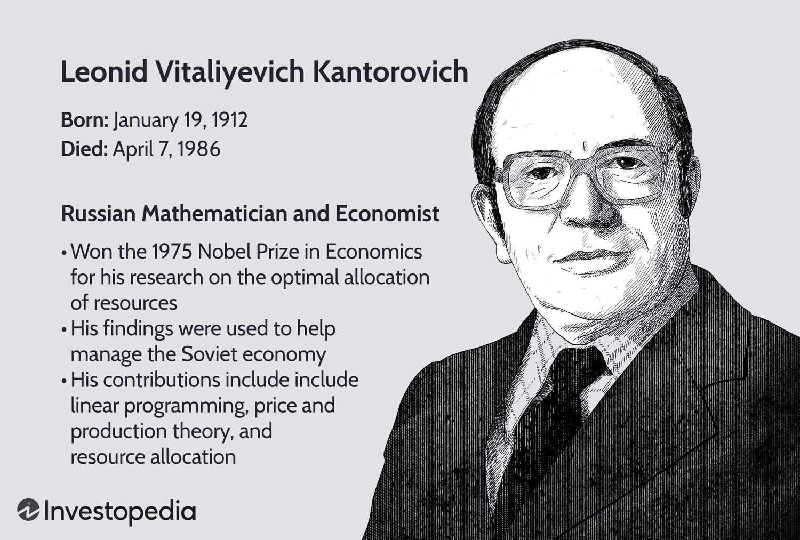

Leonid Kantorovich's contributions hold a pivotal role in shaping modern optimization techniques in both mathematics and economics. His groundbreaking work in the development of linear programming earned him the Nobel Prize in Economics in 1975. This innovative approach has revolutionized resource allocation methods across diverse industries. By examining Kantorovich's achievements, we gain insight into his influence on economic theory and the practical applications that have emerged from his work, particularly in today's algorithmic trading landscape.

Linear programming, as introduced by Kantorovich, offers strategies for optimizing objective functions subject to various constraints, providing a mathematical method to enhance decision-making and performance. Understanding the foundation of linear programming is crucial for appreciating its relevance and adaptability in increasingly complex financial systems, where optimizing resources is paramount. With the expansion of algorithmic trading, Kantorovich's theories continue to inform models designed to maximize operational efficiency and profitability. Thus, his legacy persists as a cornerstone in the evolution of modern economic and financial methodologies.



## Table of Contents

## Leonid Kantorovich: A Pioneer in Optimization

Leonid Kantorovich, a Russian mathematician and economist, was born in 1912 in Saint Petersburg (then Petrograd), Russia. Demonstrating exceptional aptitude for mathematics from a young age, Kantorovich quickly rose through the academic ranks, obtaining his degree from Leningrad State University at the mere age of 18. His early academic endeavors concentrated on functional analysis, a branch of mathematical analysis dealing with function spaces and their transformations. It was within this field that Kantorovich began to explore the optimization of production processes, which eventually led to his development of linear programming, a method for achieving the best outcome in a mathematical model whose requirements are represented by linear relationships.

Kantorovich's pioneering insights into resource allocation were initially applied within the centrally planned Soviet economy, providing a systematic way to optimally utilize limited resources in industries experiencing constraints. His approach fundamentally transformed industrial operations by offering a mathematical solution to efficiently allocate resources among competing needs. This was pivotal during an era when the Soviet economy was undergoing rapid industrialization and was in dire need of methods to enhance productivity and efficiency.

A significant portion of his revolutionary work is encapsulated in his seminal publication, "The Best Use of Economic Resources" (originally published in Russian as "Ekonomichesky Raschyot Nailuchshego Ispolzovaniya Resursov" in 1959). In this text, Kantorovich articulated the principles of optimal resource management, presenting a scientific approach to economic planning and pricing within a command economy. His book delineated the framework for using mathematically rigorous methods to make informed decisions about pricing and resource allocation, challenging traditional views of economic management and demonstrating the power of applying quantitative techniques to economic theory. This work not only laid the foundation for future advancements in optimization theory but also earned Kantorovich international recognition, ultimately leading to his Nobel Prize in Economic Sciences in 1975, which he shared with Tjalling Koopmans.

Kantorovich's contributions have continued to influence modern economic and computational practices, underscoring the enduring relevance of his innovations in optimization.

## The Evolution of Linear Programming

Linear programming, initially conceived as a mathematical construct, has developed into an essential tool for optimizing a linear objective function while adhering to a set of linear constraints. Leonid Kantorovich pioneered this methodological approach during a time when industrial problem-solving was paramount. The essence of linear programming lies in its ability to systematically optimize outputs by evaluating diverse constraints—such as budget limitations, resource availability, or market demands.

Initially, Kantorovich employed linear programming to address various industrial challenges within the Soviet economy, where efficient resource utilization was critical. The fundamental idea is to maximize or minimize a linear function, typically called the objective function, which can be expressed in the form:

$$

Z = c_1x_1 + c_2x_2 + \cdots + c_nx_n 
$$

subject to a set of linear constraints:

$$

a_{11}x_1 + a_{12}x_2 + \cdots + a_{1n}x_n \leq b_1 
$$
$$

a_{21}x_1 + a_{22}x_2 + \cdots + a_{2n}x_n \leq b_2 
$$
$$

\vdots 
$$
$$

a_{m1}x_1 + a_{m2}x_2 + \cdots + a_{mn}x_n \leq b_m 
$$
$$

x_i \geq 0 \text{ for all } i
$$

These functions and constraints effectively model many practical problems, helping allocate limited resources to achieve the desired objective optimum.

The transformation of linear programming into a globally recognized method came with its application in economics, managed through its capacity to optimize resource allocation—even in situations entailing scarcity. The method's versatility enabled it to transcend its initial industrial context and adapt to various applications, including scheduling, production management, and transportation logistics.

George Dantzig further advanced the field of linear programming by developing the simplex algorithm. This algorithm provides a computationally efficient method for finding the optimal solution to linear programming problems, solidifying linear programming's relevance across multiple industries. The innovation introduced by Dantzig's algorithm allowed for complex industrial models to be solvable at a computational expense feasible for practical, large-scale applications.

Linear programming has since become a cornerstone of optimization. Its principles are evident in logistics, where it helps design efficient supply chains, and in finance, where it supports portfolio optimization. Using its systematic approach, industries can solve intricate optimization problems, ensuring decisions are both resourceful and cost-effective. Through these advancements, linear programming continues to exert considerable influence on modern computational optimization problems.

## Nobel Prize Acknowledgement and Impact

In 1975, Leonid Kantorovich was awarded the Nobel Prize in Economics, an honor he shared with Tjalling Koopmans. This award recognized their seminal contributions to the field of optimal resource allocation, emphasizing the crucial role of linear programming and related methodologies in economic planning. Kantorovich's work was foundational, particularly in illustrating the effectiveness of non-market resource allocation mechanisms, which held significant implications for centrally planned economies.

Kantorovich's achievements demonstrated how mathematical analysis could be applied to address complex economic problems, especially in systems where market signals were either distorted or absent, such as in the Soviet Union. His approach provided a structured method to enhance efficiency and productivity within such economies. The Nobel Prize thus underscored not just Kantorovich's individual contributions but also the broader impact of his theories on economic thought and practice.

The recognition of Kantorovich's work highlighted the potential of mathematical optimization to solve real-world economic issues, transcending theoretical boundaries to offer practical solutions. The methodologies he developed laid the groundwork for future advancements in economic planning and optimization, influencing a wide range of applications beyond their initial scope.

His accolade was a testament to the enduring relevance of his contributions, illustrating how the integration of mathematical rigor could lead to significant advancements in understanding and improving complex economic systems.

## Linear Programming in Algorithmic Trading

In the era of big data and automated trading, linear programming offers a comprehensive framework for optimizing algorithmic strategies. This mathematical technique facilitates the systematic evaluation and resolution of constraint-based problems, which are omnipresent in the financial markets. As [algorithmic trading](/wiki/algorithmic-trading) becomes increasingly prevalent, the ability to optimize trading strategies and resource allocation is paramount.

Traders and financial analysts employ linear programming to construct algorithms that enhance decision-making processes. These algorithms aim to maximize returns while adhering to constraints like risk limits, regulatory requirements, and capital allocation parameters. By efficiently solving linear objective functions subject to constraints, traders can identify optimal positions—whether in securities, commodities, or derivatives—thus navigating the complexities of modern financial environments with precision.

To illustrate, consider the use of linear programming in portfolio optimization. The goal is to maximize the expected return of a portfolio while minimizing risk, which can be represented by the variance of the portfolio's return. The linear programming model enables the construction of an efficient frontier, which represents the set of optimal portfolios offering the highest expected return for a defined level of risk.

In Python, the use of libraries such as `scipy.optimize` can aid in solving these linear optimization problems. For example:

```python
from scipy.optimize import linprog

# Coefficients of the linear objective function
c = [-1, -2]  # Example returns for two assets

# Coefficients of the inequality constraints
A = [[1, 1], [-1, 2]]
b = [1, 1]

# Solve the linear programming problem
result = linprog(c, A_ub=A, b_ub=b, bounds=(0, None))
print("Optimal value:", -result.fun)
```

In this scenario, the objective function `c` represents the returns of the assets, while `A` and `b` define the constraints. The `linprog` function provides the solution that maximizes returns under the given constraints.

Kantorovich's methodologies continue to underpin the development of trading models that necessitate precise and efficient allocation of capital, coupled with minimal risk exposure. His work laid the foundation for quantitative approaches that are integral to financial engineering and risk management today, demonstrating linear programming's enduring significance in algorithmic trading. As financial systems grow more complex, linear programming remains an indispensable tool for optimizing outcomes in an uncertain world.

## Conclusion

Leonid Kantorovich’s contributions to mathematics and economics have crucially shaped the evolution of optimization techniques. His development of linear programming established a foundation that has spurred continuous advancement in economic theory and the applications necessary for practical operations. Linear programming, with its systematic approach to optimizing linear objective functions subject to constraints, has found relevance far beyond its initial use in resource allocation. Its principles have transcended the boundaries of traditional economic systems to become integral tools in modern algorithmic trading.

The rise of computational power and big data analytics has only amplified the applicability of Kantorovich’s methods. In algorithmic trading, linear programming provides a strong framework for developing and refining strategies that require the allocation of resources with perfected efficiency and minimal risk. Traders and analysts employ these methodologies to navigate the complexities of financial markets, leveraging algorithms to analyze vast datasets and optimize decision-making processes.

As financial markets evolve, incorporating sophisticated technologies and increasingly intricate trading behaviors, Kantorovich’s legacy remains undeniable. His pioneering work not only introduced mathematical rigor into economic planning but also provided a conceptual backbone for innovative solutions to contemporary economic challenges. The enduring impact of his theories continues to inspire new research and applications, ensuring their relevance in the ongoing pursuit of economic optimization and efficiency. Thus, Kantorovich’s advancements are more than historical milestones—they are enduring contributions that continue to inform modern strategies in economics and finance.

## References & Further Reading

[1]: Kantorovich, L. V. (1965). ["The Best Use of Economic Resources."](https://archive.org/details/bestuseofeconomi0000kant) Pergamon Press.

[2]: Dantzig, G. B. (1963). ["Linear Programming and Extensions."](https://press.princeton.edu/books/paperback/9780691059136/linear-programming-and-extensions) Princeton University Press.

[3]: Koopmans, T. C. (1951). ["Activity Analysis of Production and Allocation."](https://www.jstor.org/stable/2226909) Cowles Commission for Research in Economics.

[4]: Murty, K. G. (1983). ["Linear Programming."](https://archive.org/details/linearprogrammin0000murt) Wiley.

[5]: Arrow, K. J., & Intriligator, M. D. (Eds.). (1981). ["Handbook of Mathematical Economics, Volume I."](https://archive.org/details/handbookofmathem0001unse) North-Holland.